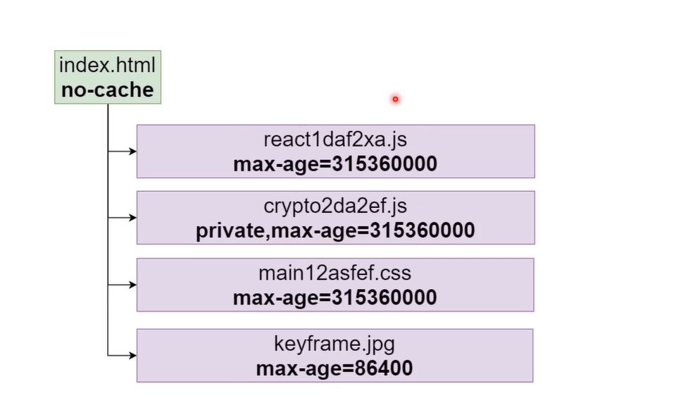

> 储存将被用到的数据，让数据访问更快。

## FIFO 缓存策略

> fifo的缓存策略是一种先进先出的缓存方式。核心原则：如果一个数据最先进入缓存中，则应该最早淘汰掉。

```javascript
function memory(f, maxSize = 10) {
  const cache = []

  return (...args) => {
    const hash = args.join(',')

    const item = cache.find(x => x.hash === hash)
    if(item) {
      return item.value
    }

    const result = f(...args)
    cache.push({
      hash,
      value: result
    })

    if(cache.length > maxSize) {
      cache.shift()
    }
    return result
  }
}

function fib(n) {
  if(n === 1 || n === 2) {
    return 1
  }
  return mfib(n-1) + mfib(n-2)
}

const mfib = memory(fib, 10)

console.log(fib(60))
```

在不使用缓存函数时，如果你执行 `fib(45)` 你会明显感觉到等待的时间。但是如果你使用缓存函数 `memory` 那么等待时间基本无感知。

## LRU 缓存策略

> LRU 表示以时间作为参考，淘汰最长时间未被使用的数据。其核心思想是：如果数据最近被访问过，那么将来被访问的几率也更高。

```javascript
function memory(f, maxSize = 10) {
  let cache = []

  return (...args) => {
    const hash = args.join(',')

    const item = cache.find(x => x.hash === hash)
    if(item) {
      item.time = new Date().getTime()
      return item.value
    }

    const result = f(...args)
    cache.push({
      hash,
      value: result,
      time: new Date().getTime()
    })

    if(cache.length > maxSize) {
      let min = Infinity
      let minItem = null
      for(let item of cache) {
        if(item.time <min) {
          min = item.time
          minItem = item
        }
      }
      cache = cache.filter(x => x !== minItem)
    }
    return result
  }

}

function fib(n) {
  if(n === 1 || n === 2) {
    return 1
  }
  return mfib(n-1) + mfib(n-2)
}
const mfib = memory(fib, 10)

console.log(fib(60))
```

## HTTP 缓存

> `Cache-Control`定义了所有缓存都要遵守的行为。

- 可缓存性：
  - `public`: 允许所有方缓存；
  - `private`: 值允许浏览器缓存；‘
  - `no-cache`: 每次必须先询问服务器资源是否已经更新；
  - `no-store`: 不使用缓存；
- 缓存期限：
  - `max-age`: 秒(存储周期)；
  - `s-maxage`: 秒(共享缓存如代理等，存储周期)；

常见用法：在下面这张图中，首页 `index.html` 不缓存，但是首页中加载的资源则需要配置缓存，`react` 可以设置长缓存，`crypto2` 可以设置仅浏览器缓存，中间商不缓存，其它经常更新的资源则可以设置较短时间的缓存。



### 强缓存

> 强制使用缓存，不去服务器对比；(缓存生效不再发送请求)；缺点：服务器资源更新也获取不到最新的资源。

- `Cache-Control`: `max-age=600`;
- `Expries`: <最后期限>

两者二选一即可，推荐使用 `Cache-Control`。

示例代码：

```javascript
const express = require('express');
const app = express();

app.get('/x', (req, res) => {
  res.setHeader('Cache-Control', 'max-age=600');
  res.send("x6");
});

app.listen(3000)；
```

> 启动该服务，然后访问 `http:localhost:3000/x` 可以看到第一次请求的状态码是 `200` ，但是第二次是 `304（Not Modified）`却不是 `200 OK (from disk cache)`。具体原因尚未搞清楚。可以在控制台发起请求以查看http状态。

::: info

强制缓存的优先级高于协商缓存。

:::

### 协商缓存一

> 每次需要向服务器请求对比，缓存生效不传回body。

请求：`If-Modified-Since`: <昨天>

返回：`Last-Modified`: <昨天>

当 `If-Modified-Since` 小于 `Last-Modified` 时就会重新获取资源。

示例代码：

```javascript
const express = require('express');
const app = express();

app.set('etag', false);
app.get('/x', (req, res) => {
  res.setHeader('Last-Modified', 'Sat Oct 15 2022 15:45:14 GMT+0800');
  res.send("x6");
});

app.listen(3000);
```

> 在第一次请求成功后，后面的请求浏览器就会带上 `If-Modified-Since`。

### 协商缓存二

请求：`If-None-Match`: `W/"2-6O5BPWxo2MyCyXszD2Gvajv3gP0"`

响应：`ETag`: `W/"2-6O5BPWxo2MyCyXszD2Gvajv3gP0"`

第一次请求不会有 `If-None-Match` 之后的请求会携带返回的 `ETag`送给服务器。