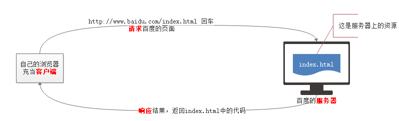
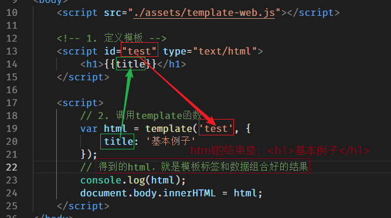

## 专业术语;

> 1. 客户端;
>
>    - 在上网的过程中，浏览器还有另外一个名字，叫做客户端。
>
> 2. 服务器;
>
>    - 存储百度网页的那台计算机，叫做服务器，或者叫做Web服务器。
>
> 3. 请求;
>
>    - 请求，或者叫做发送请求，指的是客户端向服务器“索要”页面的过程;
>
> 4. 响应;
>
>    - 即回应，当客户端向服务器发送请求之后，服务器会根据客户端的请求，将客户端请求文件的源代码返回给浏览器，这一过程称之为响应。
>
> 5. 资源
>    - 服务器上存储的东西都可以叫做资源，比如html文件、css文件、图片文件、js文件、音频视频文件、字体文件等等。
> 

## 服务器;

> 1. Web资源（html文件、css文件、js文件、json文件等等...）都是存储在Web服务器上的。
> 2. Web服务器会对客户端的请求进行处理并提供响应，
> 3. Web服务器的作用：
>    - 存储Web资源：比如服务器上的html文件、css文件、js文件、图片文件等等。
>    - 提供Web服务：能够接收并处理客户端的请求，并做出回应;
> 4. Web服务器和普通计算机的区别
>    - 除了硬件设施的区别之外，`Web服务器 === 普通计算机 + 服务器软件;
> 5. 服务器软件
>    - 服务器和个人计算机的**本质区别**是，服务器上安装了服务软件，比如：
>      - Apache
>      - Nginx
>      - IIS
>    - 凡是叫做服务器的，肯定都安装了服务软件。
> 6. 计算机开启服务器后，必须用访问服务器的方式去访问，即必须使用IP地址或域名访问，不能以文件方式打开;

## Ajax介绍;

> 1. 通过浏览器输入 IP或域名，按下回车的方式，可以向服务器发送请求，并能接收到服务器响应的结果，浏览器的这项可以发送请求并接收结果的功能，可以认为是浏览器本能的行为。
> 2. 
> 3. Ajax是一种技术，可以实现客户端和服务器的请求响应过程。
> 4. 使用Ajax技术，只需要让浏览器执行一段JS代码就可以实现请求响应过程了，在此期间页面不会刷新;

## 数据接口;

> 1. 通过Ajax向服务器发送请求的时候，不但可以请求服务器上的文件资源，也可以请求接口，url也可以这样写：
>
> ```js
> <script src="./assets/jquery.js"></script>
> <script>
> $.ajax({
> url: '/common/abc', // 这里这样写
> success: function (result) {
>    console.log(result);
> }
> });
> </script>
> ```
>
>
> 2. 非文件的地址：我们把它叫做接口或接口地址。
>
>    - 接口，是后端提供的。
>    - 接口，也是一个**网址**，通过客户端向这个网址发送请求，可以获取到接口返回的结果。
> 3. 根据提供的接口文档来确定是否需要设置请求参数；
> 4. 我们把接口看做一个带有返回值的函数，通过客户端访问接口，就相当于调用该函数，并可以得到它的返回值。有些函数调用需要参数，接口也是如此。
> 5. **实际开发中，接口支持哪种请求方式，还得以文档为准。**

## 接口文档；

> 1. 接口文档中记载了接口的详细信息，大致包括，接口地址、作用、请求方式、请求参数、响应结果等等。
>
> 2. 向接口发送请求只需要会套 `$.ajax()` 这个方法即可。
>
> 3. 接口参数可以按下面两种方式来填写：
>
>    -  方式一：`参数=值&参数=值...
>    - 方式二：`{参数: 值, 参数: 值, ...}
>
> 4. **请求参数是客户端额外发送到服务器的数据，告知服务器此次请求的具体信息；**
>
>    - 无论使用哪种写法编写请求参数，实际发送到服务器的总是方式一那样的字符串；
>
>    
>

------

## $.ajax() ;

> 1. **语法：**
>
> ```js
> $.ajax({
>     type: '请求方式',
>     data: '请求参数',
>     url: '接口地址',
>     dataType: '响应数据类型',
>     success: function (res) {
>     // res 就是响应结果
>     }
> });
> ```
>
> 2. **type;**
>
>     - 表示请求的方式;
>       - 最常见的两种请求方式;
>         - GET;
>         - POST;
>       - GET和POST的异同;
>         - 不同点：
>           - get  ：主要用于获取；向服务器请求资源（图片，文件，数据....）。它是最常见的请求方式。**只是请求，而不会改变服务器上的资源。**
>           - post：派送，投递。用于向服务器上提交数据，**可能会修改服务器上的资源。**
>         - 相同点;
>           - 都可以在发请求时附带一些数据。
>           - 都能够从服务器上获取返回的数据。
>
> 3. **data;**
>       - 向接口发送请求的时候，携带的数据，**也就是接口文档中的请求参数;**
>       - 写法:
>         - 对象形式，形如： `{name: 'xxx', content: 'xxx'}`
>         - 字符串形式，形如： `name=xxx&content=xxx`
>         - 无论写法如何，实际上发送给服务器的数据都是 字符串形式。多个请求参数之间，使用 & 符号隔开。GET请求的时候，这个字符串和接口之间使用 ? 隔开；
>
> 4. **dataType；**
>
>       - 服务器响应数据的格式。
>       - 指定该项，jQuery会自动将服务器响应的数据处理成JS数据（数组、对象、字符串、布尔等等）
>       - 可选的值
>         - `json`，它是==最最常见==的数据传输格式。能够以简单的语法表示复杂的数据
>         - `text`，表示服务器返回的是文本类型的数据
>         - `xml`，表示服务器返回的是xml格式的数据，目前项目中很少使用它了，这里作为了解
>         - `jsonp`、`script`、`html`等其他值；
>       - 当我们已经知道了服务器返回数据的格式，则最好指定 `dataType；
>
> 5. **beforeSend；**
>
>       - 需要加载  nprogress.css  ，nprogress.js  两个文件；
>
>       - 在发送Ajax请求之前，允许我们做一些事情；
>
>         ```js
>            //语法
>             $.ajax({
>                 beforeSend: function () {
>                 // 发送请求之前，你需要做什么？可以写到这里
>                   NProgress.start();//进度条；
>                 }
>             });
>         ```
>
> 6. **complete**;
>
>    - 在Ajax请求结束之后，允许我们做一些事情;
>
>      ```js
>        //语法
>        $.ajax({
>            // 发送请求之后，你需要做什么？可以写到这里
>            complete: function() {
>            NProgress.done();//进度条
>            },
>        });
>      ```
>
> 8. **案例；**
>
>    ```js
>    <script src="../assets/nprogress.js"></script>
>    <link rel="stylesheet" href="../assets/nprogress.css">
>    
>    <input type="text" id="username">
>    <span></span>
>        <script>
>        //获取文本框并注册change事件；
>        $('#username').change(function() {
>            //获取用户输入的内容；
>            var text = $(this).val();
>            //发送AJAX请求来验证用户名；
>            $.ajax({
>                //请求之前做什么；
>                beforeSend: function() {
>                    NProgress.start();
>                },
>                //请求之后做什么；
>                complete: function() {
>                    NProgress.done();
>                },
>                //设置请求方式；
>                type: 'get',
>                //设置请求地址；
>                url: '/common/checkUser',
>                //设置请求参数；
>                data: {
>                    username: text
>                },
>                //设置响应数据类型；
>                dataType: 'json',
>                //接收响应结果；
>                success: function(r) {
>                    //判断用户名是否可用；
>                    $('span').text(r.msg);
>                    //清空文本域；
>                    $('#username').val('');
>                }
>            })
>        })
>    </script>
>    ```
>
>    
>

------

## 原生Ajax;

> 1. 原生的Ajax实现，是基于浏览器内置对象 `XMLHttpRequest` 提供的API实现的。
>
> 2. **基本语法;**
>
>    1. GET方式写法；
>
>       - 一般是获取服务器上的资源；不会改变服务器上的资源；
>
>    
>      ```js
>       // 1. 实例化 XMLHttpRequest对象
>       var xhr = new XMLHttpRequest();
>       // 2.设置请求方式和url
>       xhr.open('GET', '/common/time');
>       /2.如果有请求参数
>       xhr.open('GET', '接口地址?参数=值&参数=值....');
>        // 3. 发送请求。 ---> 此步骤，表示开始发送请求
>         xhr.send();
>       
>      ```
>
>   // 4. 请求响应过程结束后，会触发该事件；在事件处理函数中，接收服务器响应的结果
>       xhr.onload = function () {
>       // 使用 xhr.response; 来接收结果
>   console.log(xhr.response);
>      }
>     ```
>     
>     
>
>
>  3. **POST方式写法;**
>
>    - 一般提交数据给服务器，这种方式有可能改变服务器上的资源；
>
>   - 和GET请求相比，多了一行代码，并且请求参数的位置变化了。
>
> ​```js
> var xhr = new XMLHttpRequest();
> 
> xhr.open('POST', '/message/addMsg');
> 
> // 相比GET方式，POST方式多下面一行代码
> xhr.setRequestHeader('Content-Type', 'application/x-www-form-urlencoded');
> 
> //参数写在send方法里面；
> xhr.send('name=李白&content=举杯邀明月');
> 
> //onload为H5新增事件，响应过程结束触发该事件；
> xhr.onload = function () {
> //response属性用于获取响应结果；
> console.log(xhr.response);
> }
>     ```
>
> 4. **原生ajax中get 和 post 区别;**
>
>    1. get
>       - 参数需要和url拼接在一起（`url?name=1&age=30`）
>      - **由于浏览器对url长度的支持（各个浏览器均不同）是有限，所以，它只能附加少量的数据。**
>    2. post
>      - 需要设置请求头: `xhr.setRequestHeader('content-type','application/x-www-form-urlencoded')；`
>         - 固定写法；
>       - 参数需要写在send()方法中:`send('name=1&age=30')`；
>       - **相对于get 来说，没有传参大小的限制。**
>
> 5. **验证用户名案例；**
>
> ```javascript
> <script>
> //注册文本框change事件；
> document.querySelector('input').onchange = function() {
> //获取文本内容；
> var text = this.value;
> //创建ajax对象；
> var xhr = new XMLHttpRequest();
> //设置请求方式并设置请求参数；
> xhr.open('GET', '/common/checkUser?username=' + text);
> //发送请求；
> xhr.send();
> 
> //第一种方式；
> //注册事件；
> // xhr.onload = function() {
> //     //获取响应结果；
> //     console.log(this.response);
> //     //转为对象；
> //     var obj = JSON.parse(this.response);
> //     //获取span元素对象；
> //     document.querySelector('span').innerText = obj.msg
> // }
> 
> //第二种方式；
> //状态发生变化的时候， 就会触发这个事件;
> xhr.onreadystatechange = function() {
> //判断状态为4则响应接受完成；
> if (this.readyState == 4) {
> console.log(this.response);
> //转为对象；
> var obj = JSON.parse(this.response);
> //获取span元素对象；
> document.querySelector('span').innerText = obj.msg
> }
> }
> }
> </script>
> ```
>
>    6. 扩展;
>
>       1. onreadystatechange; 
>
>         - 在H5之前，都是使用onreadystatechange。
>          - 当Ajax状态发生变化的时候，就会触发这个事件;
>
>       2. readyState;
>
>       - xhr 对象提供了一个属性 readyState ，用它来表示 Ajax请求到哪个阶段了。
>
>      - 输出 xhr.readyState 会得到 0、1、2、3、4几个数字，他们分别表示 Ajax请求响应的各个阶段;
>
> | readyState | 状态描述         | 说明                                                         |
> | ---------- | ---------------- | ------------------------------------------------------------ |
> | 0          | UNSENT           | 代理（XHR）被创建，但尚未调用 `open()` 方法。                |
> | 1          | OPENED           | open()方法已经被调用，建立了连接。                           |
> | 2          | HEADERS_RECEIVED | send()方法已经被调用，并且已经可以获取状态行和响应头;        |
> | 3          | LOADING          | 响应体（服务器返回的数据）下载中,responseText` 属性可能已经包含部分数据。 |
> | 4          | DONE             | 响应体（服务器返回的数据）下载完成，可以直接使用 `responseText`或response 获取完整的结果。 |
>
>      - 如果服务器返回的数据量非常大，xhr对象是分块接收数据的，一次性接收一部分（大小不确定），直至接收完毕为止。
>        
>      - 注意的是，当xhr对象接收的数据发生变化的时候，这里readyState的值不会发生变化，一直为3，但接收到的数据变化了，也表示ajax的状态变化了，此时也会触发onreadystatechange事件。
>
>  3. responseType；
>
>          - 表示预期服务器返回的数据的类型，当设置了该属性后，通过 `response` 接收数据的时候，会根据该属性的值来自动处理结果为JS能够识别的数据。
>       - 它相当于 $.ajax() 方法中的 dataType； `responseType='json'` 
>      - responseType的可选值为下面几个：
>         - “”  -- 空，表示文本，和text一样。空为默认值
>        - text -- 文本
>         - json -- JSON格式数据
>        - document -- 文档对象。当服务器返回的结果是XML类型的时候，需要指定为document
>
>    7. IE中的缓存问题；
>
>   1. 只有IE浏览器会有缓存问题；
>
>  2. **缓存问题指的是**：两次或多次 AJAX GET 请求**同一个** URL ，IE浏览器在第二次请求的时候，并不会从新向服务器发请求，而是直接使用上次请求的结果。
>
>   3. 解决方案；
>
>      - 让每次请求的URL都不同；
>
>      - 不同的查询字符串(请求参数)会被浏览器认为是不同的地址，浏览器会忽略客户端缓存。
>
> ```js
> <body>
> <input type="button" id="btn" value="请求">
> <script>
> // 点击按钮的时候，发送ajax请求
> document.getElementById('btn').onclick = function () {
> // 1. 创建 XHR 对象
> var xhr = new XMLHttpRequest();
> // 2. 调用open方法，设置请求方式和url（接口）
> // xhr.open('GET', '/time?abc=' + Math.random());
> xhr.open('GET', '/time?abc=' + Date.now());
> // 3. 调用send方法，发送请求
> xhr.send(null);
> // 4. 当请求响应过程结束，才接受服务器响应的结果
> xhr.onload = function () {
> // console.log(xhr.response);
> console.log(this.response);
> }
> }
> </script>
> </body>
> ```
>
>    8. 创建XHR对象的兼容方案；
>
>       1. XMLHttpRequest 在老版本浏览器（IE5/6）中有兼容问题，可以通过另外一种方式代替。
>
> ```js
> var xhr = window.XMLHttpRequest ? new XMLHttpRequest() : new ActiveXObject('Microsoft.XMLHTTP')
> // xhr 的成员相同，即后续的open、send方法一样使用、onreadystatechange
> ```
>
> 

------

## 同步和异步;

> 1. **异步操作;**
>
>    - 异步指的是一段耗时的JS代码在执行时不会阻塞后续代码的执行。
>
>    - 异步操作的**本质**是同一个时间点，有多个操作同时执行了。
>
>    
>   ```js
>    /例：定时器为耗时代码，但是后面的代码也会一起执行；
>    // 执行一个输出
>    console.log(111);
>    // 一个耗时的定时器
>   setTimeout(function () {
>    console.log(333);
>    }, 2000);
>    // 再执行一个输出
>    console.log(222);
>    //先输出111、然后输出222、最后输出333。
>    ```
>    
>    
>   - Ajax其实也是一个耗时操作，因为从发送请求开始（调用send方法），直到**完全**接收到服务器响应的结果，这一过程肯定需要一定的时间。
>
> ```js
> // 执行一个输出
> console.log(111);
> // 中间是一个耗时的ajax请求
> var xhr = new XMLHttpRequest();
> xhr.open('GET', '/common/time');
> xhr.send();
> xhr.onload = function () {
> console.log(333);
> }
> // 再执行一个输出
> console.log(222);
> ```
>
> 1.  **同步操作;**
>    - 同步操作指的就是在同一个时间点只能执行一个操作;
>      - Ajax请求，不但可以写成异步请求，也可以写成同步请求;
>
> ```js
> 
>   // 执行一个输出
>   console.log(111);
>   // 中间是一个耗时的ajax请求
>   var xhr = new XMLHttpRequest();
>   xhr.open('GET', '/common/time', false);
>   //onload事件放到了send之前了，否则onload事件也会被send阻塞
>   xhr.onload = function () {
>   console.log(333);
>   }
>   xhr.send();
>   // 再执行一个输出
>   console.log(222);
>   //多了第三个参数`false`。 执行的结果是，先输出111、然后输出333、最后输出222.
> ```
> 

------

## 封装ajax函数；

> 1. 为了简化ajax的使用，自己封装一个函数。
>
> ```js
> //封装一个函数;
>            1. 能够发送GET和POST方式的请求
>            2. 发送请求的时候，可以给服务器传递参数
>            3. 能够给不同的url发送请求
>            4. 服务器返回的结果，应该由调用函数的人自行处理;
>  //封装；
>     function ajax(type, url, data, cb) {
>         //创建ajax对象；
>         var xhr = new XMLHttpRequest();
>         //判断请求类型；
>         if (type == 'GET') {
>             url = url + '?' + data;
>         }
>         //设置请求地址和请求参数；
>         xhr.open(type, url);
>         //定义空字符串；
>         var text = '';
>         //判断请求类型；
>         if (type == 'POST') {
>             xhr.setRequestHeader('content-type', 'application/x-www-form-urlencoded');
>             text += data;
>         }
>         //发送请求；
>         xhr.send(text);
>         //注册事件；
>         xhr.onload = function() {
>             cb(this.response)
>         }
>     }
>     // ajax('GET', '/common/checkUser', 'username=早上好', function(callback) {
>     //         console.log(callback)
>     //     })
>     ajax('POST', '/message/addMsg', 'name=下午好&content=早上好', function(callback) {
>         console.log(callback)
>     })
> 
> ```
>
> 

------

## FormData对象;

> 1. FormData是h5中新增的一个内置对象。
>
>    - FormData对象用以将数据编译成键值对，以便用`XMLHttpRequest`来发送数据。其主要用于发送表单数据，但亦可用于发送带键数据(keyed data)，而独立于表单使用。
>
> 2. 以前 AJAX 操作只能提交字符串，现在可以提交 **二进制** 的数据;
>
>    1. 使用方法一（有form表单）;
>
>       - 使用FormData的时候，form表单中的各项必须有name属性。没有name属性是收集不到数据的;
>
>    ```js
>    <form id="fm">
>        <input type="text" name="user"><br>
>        <input type="password" name="pwd"><br>
>        <input type="radio" name="sex" value="男" checked>男
>    </form>
>    <script>
>        // 当点击提交按钮的时候，需要把表单各项的值，提交给fd接口。
>            document.getElementById('btn').onclick = function () {
>               
>                // FormData 专门用于收集表单各项值
>                // 1. 有表单，找到表单
>                var form = document.getElementById('fm');
>            
>                // 2. 实例化FormData，将表单的DOM对象传入即可
>                var fd = new FormData(form); // fd对象中包含了表单所有的值
>    
>                // 将各项值发送给fd接口
>                var xhr = new XMLHttpRequest();
>                xhr.open('POST', '/fd');
>                // xhr.setRequestHeader('Content-Type', 'application/x-www-form-urlencoded');
>                xhr.responseType = 'json';
>                xhr.send(fd);
>                xhr.onload = function () {
>                    console.log(this.response);
>                }
>            }
>    </script>
>    ```
>
>    2. 使用方法二（没有form表单）;
>
>    ```js
>    <input type="text" id="user"><br>
>    <input type="password" id="pwd"><br>
>    <input type="file" id="pic"><br/>
>    <input type="button" id="btn" value="提交">
>    <script>
>        // 点击提交按钮的时候，把数据发送给fd接口
>            document.getElementById('btn').onclick = function () {
>        			//如果是提交按钮则需要阻止默认行为；
>        			//e.preventDefault()
>                // 收集表单数据
>                // 1. 先实例化FormData
>                var fd = new FormData();
>                // 2. 调用FormData内置的方法append，向fd对象中，添加值
>                // fd.append(key, value);
>                fd.append('username', document.getElementById('user').value);
>                fd.append('pwd', document.getElementById('pwd').value);
>                // 如果是文件的话，必须使用文件对象
>                var file = document.getElementById('pic');
>                // console.dir(file);
>                var fileObj = file.files[0];
>                // fd.append('myfile', 文件对象);
>                fd.append('myfile', fileObj);
>    
>                var xhr = new XMLHttpRequest();
>                xhr.open('POST', '/fd');
>                xhr.responseType = 'json';
>                xhr.send(fd);
>                xhr.onload = function () {
>                    console.log(this.response);
>                }
>            }
> </script>
>    ```
>
>    3. jQuery中使用FormData：
>    
>    ```js
>    	<form id="fm">
>            <input type="text" name="user"><br>
>            <input type="password" name="pwd"><br>
>            <input type="radio" name="sex" value="男" checked>男
>            <input type="radio" name="sex" value="女">女<br>
>            <input type="file" name="pic"><br />
>            <input type="button" id="btn" value="提交">
>        </form>
>    
>        <script src="/jquery.js"></script>
>        <script>
>    
>            $('#btn').click(function () {
>                var fm = $('#fm');
>                var fd = new FormData(fm[0]); // 这里fm必须是DOM对象
>                console.log(fd);
>    
>                $.ajax({
>                    type: 'post',
>                    url: '/fd',
>    
>                    // 如果data使用的是对象，ajax方法会把对象转成字符串，
>                    // 即把{name: 'zs', age: 18}转成name=zs&age=18
>                    // data: {name: 'zs', age: 18}, 
>                    data: fd,
>                    // processData: false, 表示不让jQuery把fd对象转成字符串，而是直接发送fd对象
>                    processData: false,
>                    // contentType：false，表示不让jQuery去设置content-type，让FormData去处理
>                    contentType: false,
>                    success: function (res) {
>                        console.log(res);
>                    }
>                });
>            });
>    
>            // xhr.send('name=zs&age=18');
>     </script>
>    ```
>
>    4. 参考链接：
>
>       - https://developer.mozilla.org/zh-CN/docs/Web/API/FormData/Using_FormData_Objects
>    
>      

------

## 模板引擎;

> 1. 模板引擎: artTemplate：https://aui.github.io/art-template/;
>
> 2. 模板引擎实际上就是一个 API，模板引擎有很多种，使用方式大同小异。
>
> 3. 目的为了可以更容易更高效的将数据渲染到HTML字符串中。==通俗的说，模板引擎的目的就是将服务器返回的数据显示到HTML页面中==。
>
> 4. **使用模板引擎步骤**；
>
>    1. 准备一个存放数据的盒子；（不是必须的，使用body也可以）
>
>    2. 引入template-web.js文件；
>
>    3. 定义模板，一定要指定script的id和type属性；
>
>    4. 调用template函数，为模板分配数据，template函数有两个参数一个返回值；
>
>       - 参数1：模板的id。
>       - 参数2：分配的数据，必须是一个JS对象的形式。
>       - 一个返回值：是数据和模板标签组合好的结果。
>
>    5. 将 “拼接” 好的结果放到准备好的盒子中（不是必须的，console出来也可以看结果）；
>     
>    
>
>   ```js
>    <!-- 使用模板引擎-1.加载js文件 -->
>    <script src="./assets/template-web.js"></script>
>    <!-- 使用模板引擎-2.设置模板 -->
>    <script id="test" type="text/html">
>            <h1>{{title}}</h1>
>    </script>
>    
>    <script>
>        // 使用模板引擎-3.调用template函数
>        // var 模板和数据组合好的结果 = template(模板id, 模板中使用的数据必须是js对象类型);
>        var data = {
>            title: '这是模板引擎的例子'
>        };
>        // “拼接”
>        // 调用插件提供的方法template。将数据和模板组合起来。
>        var html = template('test', data);
>        console.log(html);
>        /*
>            <h1>这是模板引擎的例子</h1>
>            */
>        document.body.innerHTML = html;
>    
>    </script>
>    tempalte函数语法：var html = template(模板id,  Object);
>    ```
>    
>    >注：定义模板时的script标签一定好指定id和type；


### 模板语法

- 输出普通数据（字符串、数值等）

    ```
    // 模板写法
    {{var}}
    
    // template函数写法
    var html = template('id', {
        var: 'hello world'
    });
    ```

- 条件

    ```js
    // 模板写法
    {{if age > 18}}
    	大于18
    {{else}}
    	小于18
    {{/if}}
    
    // template函数写法
    var html = template('id', {
        age: 20
    });
    ```

- 循环

    ```js
    // 模板写法
    {{each arr}}
    	{{$index}} -- 数组的下标
    	{{$value}} -- 数组的值
    {{/each}}
    
    // template函数写法
    var html = template('id', {
        arr: ['apple', 'banana', 'orange']
    });
    ```

完整的代码：

```html
<script src="./assets/template-web.js"></script>

    <!-- 1. 定义模板 -->
    <script id="abc" type="text/html">
        <h1>{{name}}</h1>
        <p>我是{{nickname}}，我有一辆{{car}}，我今年{{age}}岁了</p>
        {{if age >= 18}}
            <p>欢迎来玩~</p>
        {{else}}
            <p>未成年人禁止进入</p>
        {{/if}}
        <p>我有好几个女朋友，分别是：</p>
        <ul>
            {{each girls}}
            <li>{{$index}} -- {{$value}}</li>
            {{/each}}
        </ul>
    </script>


    <script>
        // 2. 调用template函数
        var str = template('abc', {
            name: '狗哥',
            nickname: '北狗最光阴',
            car: '宝马',
            age: 31,
            girls: ['王婆', '金莲', '西门大官人', '李师师', '赛金花']
        });

        console.log(str);
        document.body.innerHTML = str;
    </script>
```


### 案例中使用模板引擎处理响应数据

```html
<!-- 引入template-web.js -->
<script src="./assets/template-web.js"></script>

<!-- 定义模板 -->
<script id="moban" type="text/html">
    {{each girls}}
    <li class="media">
      
      <div class="media-body">
        <h4>{{$value.name}}</h4>
        <p>{{$value.content}}</p>
    </div>
    </li>
    {{/each}}
</script>
```

```js
xhr.onload = function () {
    // console.log(this.response);
    var data = JSON.parse(this.response);
    console.log(data);
    // 拼接字符串
    var str = template('moban', {
        girls: data
    });
    // 把变量后，拼接好的str放到 id为 messages 的ul中
    document.getElementById('messages').innerHTML = str;
}
```


