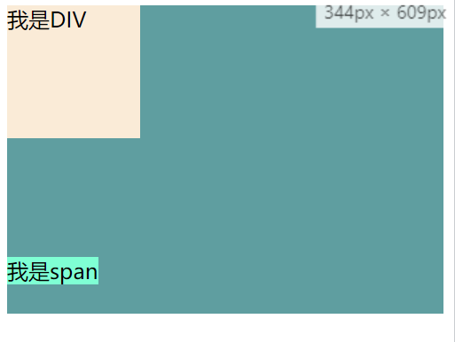

> rem单位的意思是“根元素的字体大小`1rem = HTML 字体大小px`”，属于相对于根元素的字体大小的单位，HTML的字体大小发生改变，使用了rem作为单位的盒子就会发生等比变化；

::: tip
1rem等于html元素的字体大小（对于大多数浏览器而言，其默认值为16px）16px。
:::

```html
<!DOCTYPE html>
<html lang="en">
<head>
    <style>
        html {
            /*等于浏览器的默认字体大小16px*/
            font-size: 100%;
        }
        .box {
            width: 10rem;
            height: 10rem;
            background-color: antiquewhite;
        }
    </style>
</head>
<body>
<div>
    <div class="box"></div>
</div>
</body>
</html>
```
> 上面这个例子浏览器打开后box盒子的大小为160px

## 设计稿
> 通过上面的介绍你很容易的明白rem和html根元素之间的关系，这里我以常见的750设计稿再做个例子。

如果你的UI给你的是750px的设计稿，那么按照正常情况以10为单位进行划分没问题其结果是`1rem = 75px`；
```html
<!DOCTYPE html>
<html lang="en">
<head>
    <style>
        html {
            font-size: 75px;
        }
        .box {
            width: 10rem;
            height: 10rem;
            background-color: antiquewhite;
        }
    </style>
</head>
<body>
<div>
    <div class="box"></div>
</div>
</body>
</html>
```
> 此时box盒子的宽高是750px；

如果开发UI给的是750px的设计稿那么没问题(不考虑屏幕适配)。但是事与愿违，有时UI给你的交互稿可能不是 750px 可能是 850px的。如果你是以上面的例子一样75px是写死的，那么850px的设计稿就没法适配了，因为850的设计稿html根元素的字体大小应该为85px，所以这个值应该是动态变化的。这里介绍下以js的方式，来动态改变html根元素的字体大小。下载 [Flexible](https://github.com/amfe/lib-flexible) 并引用

```html
<head>
    <script src="./flexible.js"></script>
</head>
```
> 此时你会发现html标签上添加了行内样式`style="font-size: 60.3px;"`，并且这个字体的大小会随着你的浏览器的窗口大小变化，同时box盒子的大小也会发生改变。

## flexible源码
> 分析源码了解js实现响应式的机制；

### 分析
通过前面的介绍，你应该了解了，页面盒子的变化是相对于根元素的字体大小来变化的，而根元素的字体大小需要和设计稿来确定，而设计稿就是我们用户将来看到的实际页面内容，但是实际浏览器的宽度不一定和设计稿相等，所以我们需要根据设计稿的尺寸来做等比例的变化以改变rem单位的值，从而确定根元素字体大小。

### 动态rem
我们根据浏览器的视口宽度，然后按一定的等分比进行划分，这里以10等分；

```javascript
var docEl = document.documentElement
// 设置rem的单位值 1rem = viewWidth / 10
function setRemUnit () {
  var rem = docEl.clientWidth / 10
  docEl.style.fontSize = rem + 'px'
}

setRemUnit()
// 页面大小发生变化重新设置rem的单位值
window.addEventListener('resize', setRemUnit)
```
> 当设计稿是750px时`1rem = 75px`，当视口(设计稿)是850px时rem会重新计算`1rem = 85px`

### 设置body的字体大小
> 在用rem的时候需要特别注意设置body的`font-size: 12px`；

```javascript
// 调整正文字体大小
var dpr = window.devicePixelRatio || 1
function setBodyFontSize () {
  if (document.body) {
    // 设置12*设备像素比例为字体大小，这样字体就可以自适应大小，主要是适应阅读。
    document.body.style.fontSize = (12 * dpr) + 'px'
  }
  else {
      // 初始的 HTML 文档被完全加载和解析完成之后触发，无需等待样式表、图像和子框架的完全加载。
    document.addEventListener('DOMContentLoaded', setBodyFontSize)
  }
}
setBodyFontSize();
```
之所以要设置Body的字体大小是因为盒子会继承父元素的字体大小，其内的行内元素又是和[基线](https://www.jianshu.com/p/59f31a1704de)对齐的会因为字体大小太大而撑开盒子。所以此时如果你没有设置body的字体大小，那么即使你盒子中的元素都设置了字体大小，也不能解决由于盒子继承html的字体大小和行内元素与基线对其所导致的撑开盒子的问题。例如下面的代码：
```html
<!DOCTYPE html>
<html lang="en">
<head>
    <style>
        html {
            font-size: 100px;
        }
        .box {
            width: 100px;
            height: 100px;
            font-size: 16px;
            background-color: antiquewhite;
        }
        span {
          font-size: 16px;
          background-color: aquamarine;
        }
    </style>
</head>
<body>
<div style="background-color: cadetblue">
    <div class="box">我是DIV</div>
    <span>我是span</span>
</div>
</body>
</html>
```


> 通过上面的这张图我们可以看出最外层的DIV的高度不等于box和span之和，这是因为最外层的div继承html的字体大小而span元素又是与字体基线对齐，所以就产生了这个结果。所以在使用rem的时候我们一般会设置body的字体大小为浏览器的默认字体。当然单独解决此例的问题可以直接给最外层设置一个字体大小就可以了。

### 设备像素比
> 在移动端浏览器中以及某些桌面浏览器中，window对象有一个devicePixelRatio属性，通过它我们可以得到设备像素比。设备像素比是设备物理像素和设备独立像素的比例，也就是 devicePixelRatio = 物理像素 / 独立像素。css中的px就可以看做是设备的独立像素，所以通过devicePixelRatio，我们可以知道该设备上一个css像素代表多少个物理像素。

- 物理像素:
  物理像素又被称为设备像素，通俗的讲设备屏幕有多少个可以闪烁的点 是一个具体的概念 比如iphone6横向就有750个可以改变颜色的点 类似与电视机如果家里有10年前买的大头电视，你趴在屏幕前仔细看能看到一个个RGB的点 这就是设备的物理像素。
- 设备独立像素(简称DIP或DP）
  设备独立像素是一个虚拟的概念也称为密度无关像素，可以认为是计算机坐标系统中的一个点，这个点代表一个可以由程序使用的虚拟像素(比如说CSS像素)，然后由相关系统转换为物理像素。
- CSS像素
  CSS像素是一个抽像的单位，主要使用在浏览器上，用来精确度量Web页面上的内容。一般情况之下，CSS像素称为与设备无关的像素(device-independent pixel)，简称DIPs。
- 设备像素比(device pixel ratio)简称dpr
  设备像素比简称为dpr，其定义了物理像素和设备独立像素的对应关系。`设备像素比 ＝ 物理像素 / 设备独立像素`

在pc浏览器中1css=1物理像素，但是由于移动设备的品牌不同所以导致屏幕密度也不尽相同，此时1个css像素可能不再对应一个物理像素。例如：iPhone6的设备宽度和高度为375pt * 667pt(可以理解为设备的独立像素)；而其dpr为2，我们可以很轻松得知其物理像素为750pt * 1334pt。

## 视窗(viewport)
> viewport是严格等于浏览器的窗口。在桌面浏览器中，viewport就是浏览器窗口的宽度高度。但在移动端设备上就有点复杂。更深的了解，可以阅读[PPK写](https://www.w3cplus.com/css/viewports.html)的相关教程。

开发移动设备的网站时，最常见的的一个动作就是把下面这个东西复制到我们的head标签中：
```html
<meta name="viewport" content="width=device-width, initial-scale=1, maximum-scale=1, minimum-scale=1, user-scalable=no">
```
> 该meta标签的作用是让当前viewport的宽度等于设备的宽度(设备的屏幕宽度)，同时不允许用户手动缩放。

::: tip
在默认情况下，一般来讲，移动设备上的viewport都是要大于浏览器可视区域的，这是因为考虑到移动设备的分辨率相对于桌面电脑来说都比较小，所以为了能在移动设备上正常显示那些传统的为桌面浏览器设计的网站，移动设备上的浏览器都会把自己默认的viewport设为980px或1024px（也可能是其它值，这个是由设备自己决定的），但带来的后果就是浏览器会出现横向滚动条，因为浏览器可视区域的宽度是比这个默认的viewport的宽度要小的。下图列出了一些设备上浏览器的默认viewport的宽度。


## 完整代码
```javascript
(function flexible (window, document) {
    var docEl = document.documentElement
    var dpr = window.devicePixelRatio || 1
  
    // 调整正文字体大小
    function setBodyFontSize () {
      if (document.body) {
        document.body.style.fontSize = (12 * dpr) + 'px'
      }
      else {
        document.addEventListener('DOMContentLoaded', setBodyFontSize)
      }
    }
    setBodyFontSize();
  
    // 设置rem的单位值 1rem = viewWidth / 10
    function setRemUnit () {
      var rem = docEl.clientWidth / 10
      docEl.style.fontSize = rem + 'px'
    }
  
    setRemUnit()
  
    // 页面大小发生变化重新设置rem的单位值
    window.addEventListener('resize', setRemUnit)
    window.addEventListener('pageshow', function (e) {
      if (e.persisted) {
        setRemUnit()
      }
    })
  
    // 处理border是用来检测浏览器是否支持0.5px，因为有些浏览器是能直接处理0.5px边框
    if (dpr >= 2) {
      var fakeBody = document.createElement('body')
      var testElement = document.createElement('div')
      testElement.style.border = '.5px solid transparent'
      fakeBody.appendChild(testElement)
      docEl.appendChild(fakeBody)
      if (testElement.offsetHeight === 1) {
        docEl.classList.add('hairlines')
      }
      docEl.removeChild(fakeBody)
    }
  }(window, document))
```

:::
## 参考博文
- [动态rem解决移动前端适配](https://www.cnblogs.com/slman86/p/5581865.html)
- [移动前端开发之viewport,devicePixelRatio的深入理解](https://www.jianshu.com/p/413a25b2c503)
- [flexible.js 布局详解](http://caibaojian.com/flexible-js.html)
- [使用Flexible实现手淘H5页面的终端适配](https://github.com/amfe/article/issues/17)
- [既然已经设置为理想视口，setBodyFontSize里为什么还要根据dpr设置字体大小](https://github.com/amfe/lib-flexible/issues/201)


