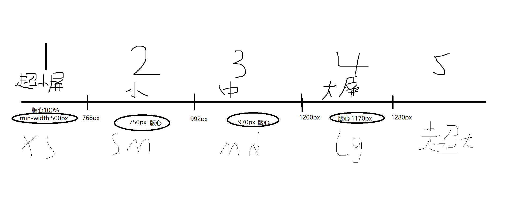

> 媒体查询(Media Queries)能在不同的条件下使用不同的样式，使页面在不同的终端设备下达到不同的渲染效果。

```css
 @media screen and (max-width: 300px) {
  body {
    background-color: lightblue;
  }
}
```

## 语法
```text
@media mediatype and | not | only (media feature) {
    CSS-Code;
}
```
参数说明：
- mediatype：
  | 值     | 描述                                 |
  | :----- | :----------------------------------- |
  | all    | 用于所有设备                         |
  | print  | 用于打印机和打印预览                 |
  | screen | 用于电脑屏幕，平板电脑，智能手机等。 |
  | speech | 应用于屏幕阅读器等发声设备           |
- media feature：
  - 内容较多详情请查看 [媒体查询](https://www.runoob.com/cssref/css3-pr-mediaquery.html)

## 应用
> 由于媒体查询的特性主要应用在响应式布局和移动端rem上；

由于开发需求的不同，有时同一个网站需要在不同大小的设备上显示相同的内容，这个时候就需要调整布局，比如屏幕宽大于1200px为大屏，和屏幕小于768的超小屏。
屏幕宽与版心的对应关系：    
;
> 所有的子元素都是归于版心下，不同的版心宽度，意味着子元素要以不同的布局排版满足**用户浏览友好**的需求；
```css
/* 1. 超小屏幕下 xs  小于 768  布局容器的宽度为 100% */
@media screen and (max-width: 767px) {
    .container {
        /*此时的版心是100%*/
        width: 100%;
    }
}

/* 2. 小屏幕下 sm  大于等于768  布局容器改为 750px */
@media screen and (min-width: 768px) {
    .container {
        width: 750px;
    }
}

/* 3. 中等屏幕下 md 大于等于 992px   布局容器修改为 970px */
@media screen and (min-width: 992px) {
    .container {
        width: 970px;
    }
}

/* 4. 大屏幕下 lg 大于等于1200 布局容器修改为 1170 */
@media screen and (min-width: 1200px) {
    .container {
        width: 1170px;
    }
}
/* 5. 根据公司需求添加其他的挡位*/

```
