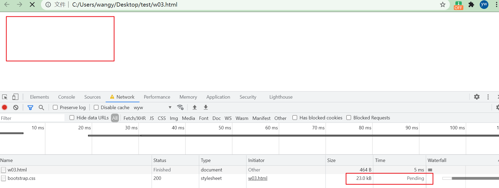
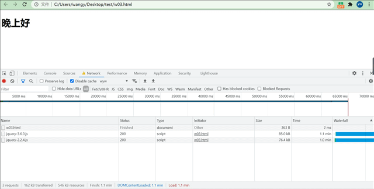
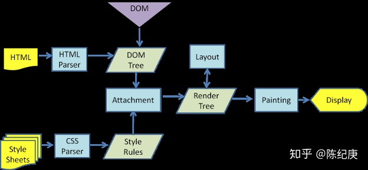

> 说实在的很惭愧，做前端这么久了，没考虑过这个问题，但是看到网上有相关的面试题，所以这里就简单的聊下。

讨论两个问题：

- link标签是否会阻塞DOM的渲染和解析。
- script标签是否会阻塞DOM的渲染和解析。

## link标签

> 标签定义文档与外部资源的关系，最常见的用途是链接样式表。

::: tip

-  link 元素是空元素，它仅包含属性。
- link 标签可以书写在 html 中的任意位置并可出现任何次数。

:::

**我们设置浏览器的下载速度为`20kbit/s`**

```html
<!DOCTYPE html>
<html lang="en">
<head>
  <meta charset="UTF-8">
  <link rel="stylesheet" href="https://cdn.bootcss.com/bootstrap/4.0.0-alpha.6/css/bootstrap.css">
  <style>
    h1 {
      color: red;
    }
  </style>
</head>
<body>
<h1 class="box">晚上好</h1>
</body>
<script>
  console.log(document.querySelector('h1'))
</script>
</html>
```

### 浏览器的实际加载情况



> 通过上图可知，在css没有加载完成之前，页面处于空白状态，同时控制台不打印。所以可得结论：
>
> - link堵塞DOM的渲染和script标签的执行。
> - link不堵塞DOM的解析(link写在script后面，脚本会先执行，css还未加载完但此时可以获取dom元素)。

::: tip

浏览器加载 HTML 文件时，从上往下进行渲染，如果 link 标签写在 body 内部的结构后面，会导致前面的元素没有样式，不利于用户体验，另外浏览器渲染到 link 时，页面样式发生了改变会重新渲染前面的 HTML 元素，导致页面加载时间变长。

:::

### 解释

浏览器的一种优化机制：加载css的时候，可能会修改DOM节点的样式，如果css加载不阻塞DOM树渲染的话，那么当css加载完之后，DOM树可能又得重新重绘或者回流了，这就造成了一些没有必要的损耗。所以干脆就先把DOM树的结构先解析完，把可以做的工作做完，然后等你css加载完之后，在根据最终的样式来渲染DOM树。

### 优化

1. 使用CDN(因为CDN会根据你的网络状况，替你挑选最近的一个具有缓存内容的节点为你提供资源，因此可以减少加载时间)。
2. 对css进行压缩(可以用很多打包工具，比如webpack等，也可以通过开启gzip压缩)。
3. 合理的使用缓存(设置cache-control,expires,以及E-tag都是不错的，不过要注意一个问题，就是文件更新后，你要避免缓存而带来的影响。其中一个解决防范是在文件名字后面加一个版本号)。
4. 减少http请求数，将多个css文件合并，或者是干脆直接写成内联样式(内联样式的一个缺点就是不能缓存)。

### link支持异步？

在HTML5规范中定义， [section of the HTML5 spec](http://www.whatwg.org/specs/web-apps/current-work/multipage/semantics.html#concept-link-obtain)

- link的加载机制是由浏览器实现的，规范中并没有指明是同步还是异步。
- 但是能够保证的是 如果link没有加载完成，document.onload不会被触发。

## script标签

> 标签用于定义客户端脚本，比如 JavaScript。既可包含脚本语句，也可以通过 "src" 属性指向外部脚本文件。

直接使用`script`脚本的话，`html`会按照顺序来加载并执行脚本，在脚本加载&执行的过程中，会阻塞后续的`DOM`的解析和渲染。现在大家习惯于在页面中引用各种的第三方脚本，如果第三方服务商出现了一些小问题，比如延迟之类的，就会使得页面白屏。好在`script`提供了两种方式来解决上述问题，`async`和`defer`，这两个属性使得`script`都不会阻塞`DOM`的渲染。

::: tip

- 如果 async="async"：脚本相对于页面的其余部分异步地执行（当页面继续进行解析时，脚本将被执行）【仅适用于外部脚本】。
- 如果不使用 async 且 defer="defer"：脚本将在页面完成解析时执行【仅适用于外部脚本】。
- 如果既不使用 async 也不使用 defer：在浏览器继续解析页面之前，立即读取并执行脚本。
- 在 HTML 4 中，"type" 属性是必需的，但在 HTML5 中是可选的。
- "async" 属性是 HTML5 中的新属性。

:::

```html
<!DOCTYPE html>
<html lang="en">
<head>
  <meta charset="UTF-8">
  <title>Document</title>
  <script src="https://code.jquery.com/jquery-3.6.0.js"></script>
  <script src="https://code.jquery.com/jquery-2.2.4.js"></script>
</head>
<body>
<h1 class="box">晚上好</h1>
</body>
<script>
  console.log(document.querySelector('h1'))
</script>
</html>
```

### 浏览器的实际加载情况



> 由上图可知，多个script标签链接的资源会同时下载，但是在下载完成和执行完前(按照书写顺序依次执行)，会堵塞DOM的解析和渲染；

### 解释

当浏览器遇到一个 < script>标签时，浏览器会停下来，运行JavaScript代码，然后再继续解析、翻译页面。同样的事情发生在使用 src 属性加载 JavaScript 的过程中。浏览器必须首先下载外部文件的代码，需要占用一些时间，然后解析并运行此JavaScript代码。此过程中，页面解析和用户交互是被完全阻塞的。

## 原理解析

> 不用浏览器使用的内核不同，所以他们的渲染过程也是不一样的。目前主要有两个：

**webkit渲染过程**



## 参考博文

https://www.cnblogs.com/eret9616/p/13154861.html

https://zhuanlan.zhihu.com/p/43282197

https://www.cnblogs.com/jiasm/p/7683930.html

