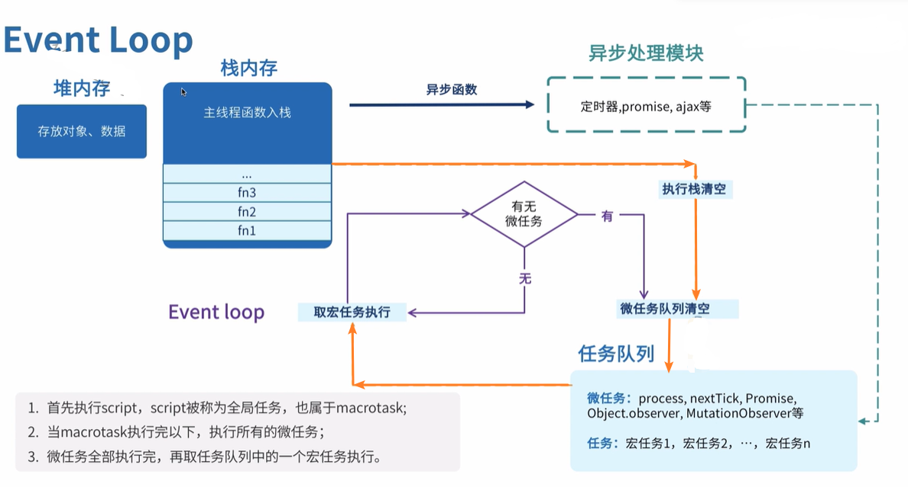
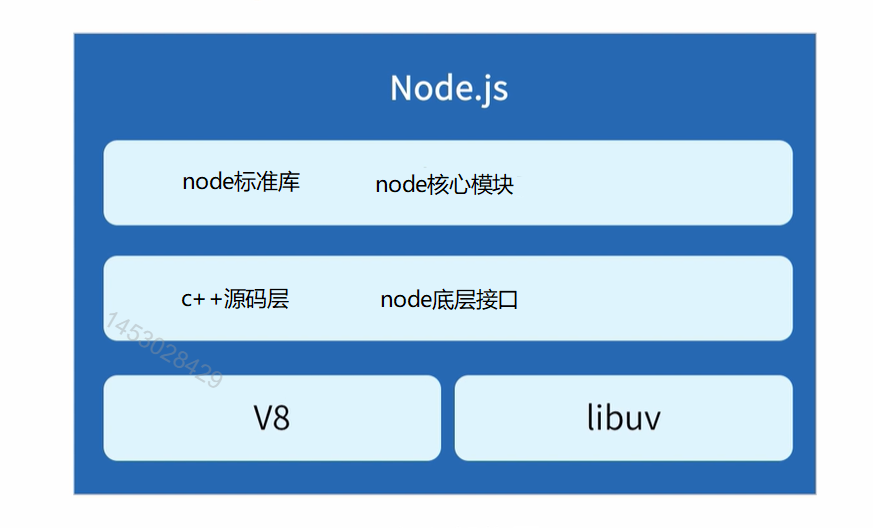
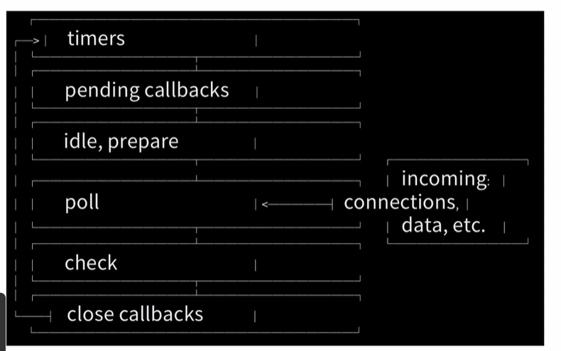
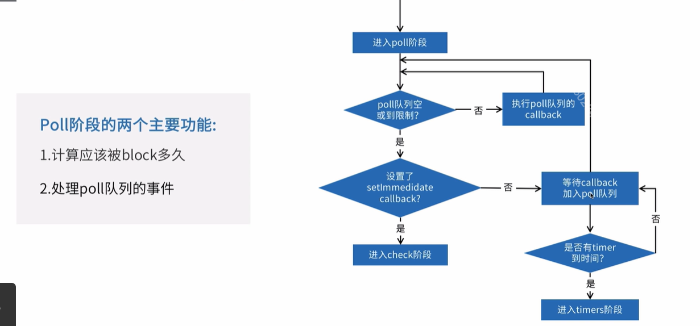

> 我们知道，javascript从诞生之日起就是一门单线程的非阻塞的脚本语言。这是由其最初的用途来决定的：与浏览器交互。单线程意味着，javascript代码在执行的任何时候，都只有一个主线程来处理所有的任务。而非阻塞则是当代码需要进行一项异步任务（无法立刻返回结果，需要花一定时间才能返回的任务，如I/O事件）的时候，主线程会挂起（pending）这个任务，然后在异步任务返回结果的时候再根据一定规则去执行相应的回调。

**你可能会有所疑问，既然js是一门 单线程的非阻塞的脚本语言那么它是如何实现的异步呢？**

答案是：Event Loop即事件循环是实现异步的一种机制;

## 浏览器的`Event Loop`;

**1.执行栈与事件队列**

当javascript代码执行的时候会将不同的变量存于内存中的不同位置：堆（heap）和栈（stack）中来加以区分。其中，堆里存放着一些对象。而栈中则存放着一些基础类型变量以及对象的指针。 **但是我们这里说的执行栈和上面这个栈的意义却有些不同。**

我们知道，当我们调用一个方法的时候，js会生成一个与这个方法对应的执行环境（context），**又叫执行上下文**。这个执行环境中存在着这个方法的私有作用域，上层作用域的指向，方法的参数，这个作用域中定义的变量以及这个作用域的this对象。 而当一系列方法被依次调用的时候，因为js是单线程的，同一时间只能执行一个方法，于是这些方法被排队在一个单独的地方。这个地方被称为执行栈。

当一个脚本第一次执行的时候，js引擎会解析这段代码，并将其中的同步代码按照执行顺序加入执行栈中，然后从头开始执行。如果当前执行的是一个方法，那么js会向执行栈中添加这个方法的执行环境，然后进入这个执行环境继续执行其中的代码。当这个执行环境中的代码 执行完毕并返回结果后，js会退出这个执行环境并把这个执行环境销毁，回到上一个方法的执行环境。。这个过程反复进行，直到执行栈中的代码全部执行完毕。**当然这说的是同步代码的执行；**

```javascript
function bar() {
  console.log(3);
}
function foo() {
  console.log(2);
  bar(3);
}
console.log(1);
foo()
console.log(4)

// 1
// 2
// 3
// 4
```


当js引擎遇到一个异步事件后并不会一直等待其返回结果，而是会将这个事件挂起，继续执行执行栈中的其他任务。当一个异步事件返回结果后，js会将这个事件加入与当前执行栈不同的另一个队列，我们称之为**事件队列**。被放入事件队列不会立刻执行其回调，而是等待当前执行栈中的所有任务都执行完毕， 主线程处于闲置状态时，主线程会去查找事件队列是否有任务。如果有，那么主线程会从中取出排在第一位的事件，并把这个事件对应的回调放入执行栈中，然后执行其中的同步代码...，如此反复，这样就形成了一个无限的循环。这就是这个过程被称为“事件循环（Event Loop）”的原因。

**2、宏任务和微任务；**

宏任务：

1. 全局script的执行；
2. 定时器(`setTimeout  setInterval`);
3. `setImmedidte`(nodejs拥有的);
4. I/O;
5. UI rendering;

微任务：

1. Promise;
2. Object.observe;
3. MutationObserver;
4. postMessage;

> 在一个事件循环中，异步事件返回结果后会被放到一个任务队列中。然而，根据这个异步事件的类型，这个事件实际上会被放到对应的宏任务队列或者微任务队列中去。**并且在当前执行栈为空的时候，主线程会 查看微任务队列是否有事件存在。如果不存在，那么再去宏任务队列中取出一个事件并把对应的回到加入当前执行栈；如果存在，则会依次执行队列中事件对应的回调，直到微任务队列为空，然后去宏任务队列中取出最前面的一个事件，把对应的回调加入当前执行栈...如此反复，进入循环。**

```javascript
setTimeout(function () {
  console.log(1);
});

new Promise(function(resolve,reject){
  console.log(2)
  resolve(3)
}).then(function(val){
  console.log(val);
})

// 2
// 3
// 1

console.log('1');
setTimeout(function() {
  console.log('2');
})
Promise.resolve().then(function() {
  console.log('3');
})
console.log('4')

// 1
// 4
// 3
// 2
```

::: tip

当前执行栈执行完毕时会立刻先处理所有微任务队列中的事件，然后再去宏任务队列中取出一个事件。同一次事件循环中，微任务永远在宏任务之前执行。

:::



## nodejs的`Event Loop`

> Node.js也是单线程的Event Loop，但是它的运行机制不同于浏览器环境。



> libuv是一个跨平台的异步I/O库，该库会根据系统自动选择合适的方案，其功能可以用于TCP/DNS等文件的异步操作;
>
> V8是一个js引擎，js代码是跑在v8引擎上面的，首先v8会将js源代码变成本地代码并执行；维护调用栈，保证js的执行顺序；为所有对象分配内存；垃圾回收；实现js的标准库。
>
>  **v8执行js是单线程，但是本身是多线程；v8自带有eventloop，但是nodejs基于libuv自己做了一个**

**Node.js的运行机制**

1. V8引擎解析JavaScript脚本。
2. 解析后的代码，调用Node API。
3. [libuv库](https://github.com/joyent/libuv)负责Node API的执行。它将不同的任务分配给不同的线程，形成一个Event Loop（事件循环），以异步的方式将任务的执行结果返回给V8引擎。
4. V8引擎再将结果返回给用户。
5. 见下图：其中每个方框都是 event loop 中的一个阶段。



**event loop运行阶段**

1. timers：定时器阶段，执行定时器的回调；
2. pending callbacks：系统操作的回调；(暂且不关心)
3. idle,pepare：内部使用；(暂且不关心)
4. poll：等待新I/O事件；
5. check：执行setImmediate回调；
6. close callbacks：内部使用；(暂且不关心)

> 每一个阶段都有一个callbacks的先进先出的队列需要执行，当event loop运行到一个指定阶段时，该阶段的先进先出队列将会被执行，当队列callbacks执行完或着执行的callbacks数量超过该阶段的上限时，event loop转入下一个阶段。

::: tip

上面这些操作都有可能添加计时器；另一方面，操作系统会向 poll 队列中添加新的事件，当 poll 队列中的事件被处理时可能会有新的 poll 事件进入 poll 队列。结果，耗时较长的回调函数可以让 event loop 在 poll 阶段停留很久，久到错过了计时器的触发时机。
[原文链接](https://juejin.cn/post/6844903582538399752)

:::

**poll阶段执行**



```javascript
const fs = require('fs');
fs.readFile(__filename, _ => {
	setTimeout(_ => {
		console.log('setTimeout')
	}, 0);
	setImmediate(_ => {
		console.log('setImmediate')
	})
})

// setImmediate
// setTimeout
```

> setImmediate方法则是在当前"**任务队列**"的尾部添加事件，也就是说，它指定的任务总是在下一次**Event Loop时**执行，

### process.nextTick()

> process.nextTick方法可以在当前"**执行栈**"的尾部也就是下一次**Event Loop（主线程读取"任务队列"）之前**触发回调函数。它指定的任务总是发生在所有异步任务之前。是一个异步的node API 但是不属于event loop的阶段；

```javascript
const fs = require('fs');
fs.readFile(__filename, _ => {
	setTimeout(_ => {
		console.log('setTimeout')
	}, 0);
	setImmediate(_ => {
		console.log('setImmediate');
		process.nextTick(_ => {
			console.log('nextTick2')
		})
	})
	process.nextTick(_ => {
		console.log('nextTick1')
	})
})

// nextTick1
// setImmediate
// nextTick2
// setTimeout

// 例 2
process.nextTick(function A() {
  console.log(1);
  process.nextTick(function B(){console.log(2);});
});

setTimeout(function timeout() {
  console.log('TIMEOUT FIRED');
}, 0)

// 1 
// 2
// TIMEOUT FIRED
```

> 例 2 中：由于process.nextTick方法指定的回调函数，总是在当前"执行栈"的尾部触发，所以不仅函数A比setTimeout指定的回调函数timeout先执行，而且函数B也比timeout先执行。这说明，如果有多个process.nextTick语句（不管它们是否嵌套），将全部在当前"执行栈"执行。