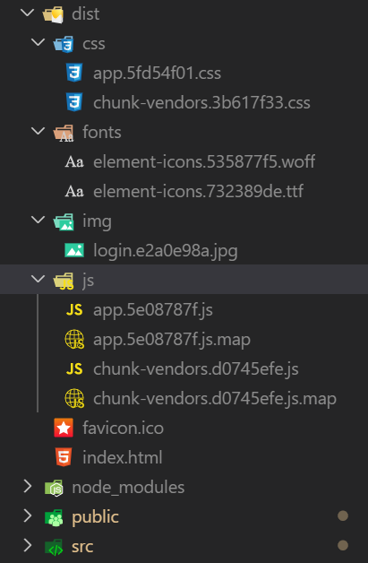

## 构建打包

在发布上线之前，我们需要执行构建打包，将 `.less`、`.vue`、`.js` 等相关资源进行编译打包，转换成浏览器可以直接识别运行的普通 `css`、`js`、`html`。

```bash
// 打包
# yarn run build 或者 yarn build
npm run build

每次 `npm run build` 都会先把原来的 dist 删除，然后生成新的结果。
```

`VueCLI `会把打包结果生成存储到项目的 `dist` 目录中。



## 打包禁用hash值；

> 在vue.config.js中   设置`filenameHashing`选项；

```js
module.exports = {
  // webpack配置: 关闭哈希值
  filenameHashing: false
}
```

## 预览打包结果

> **注意**：不能直接双击打开 index.html 运行。

将 dist 放到一个 Web 服务器中运行测试，常见的 Web 服务器：

- Ngxin
- Apache
- tomcat
- IIS
- Node.js

推荐使用`Vue `官方推荐的一个命令行`http`服务工具：[serve](https://github.com/zeit/serve)。

 `dist` 目录需要启动一个 HTTP 服务器来访问，所以 `file://` 协议直接打开 `dist/index.html` 是不会工作的。在本地预览生产环境构建最简单的方式就是使用一个 Node.js 静态文件服务器，例如 [serve](https://github.com/zeit/serve)： 

**安装：**

```bash
# yarn global add serve
# 安装全局包，在任何目录执行都可以
npm install -g serve
或
npm install serve
```

然后在你的项目目录下执行：

```bash
# dist 是运行 Web 服务根目录
serve -s dist
或 注意 两者有区别
serve dist
```

如果启动成功，你将看到如下提示：

```
   ┌────────────────────────────────────────────────────┐
   │                                                    │
   │   Serving!                                         │
   │                                                    │
   │   - Local:            http://localhost:5000        │
   │   - On Your Network:  http://192.168.156.90:5000   │
   │                                                    │
   │   Copied local address to clipboard!               │
   │                                                    │
   └────────────────────────────────────────────────────┘
```

> serve 默认占用 5000 端口并启动一个服务

## 部署

- 公司有专门的 devops，就是运维
  - 有些公司没有专门的运维人员，那就后端负责

```bash
# --force 强制推送，简写 -f
git push -u origin master -f
```


