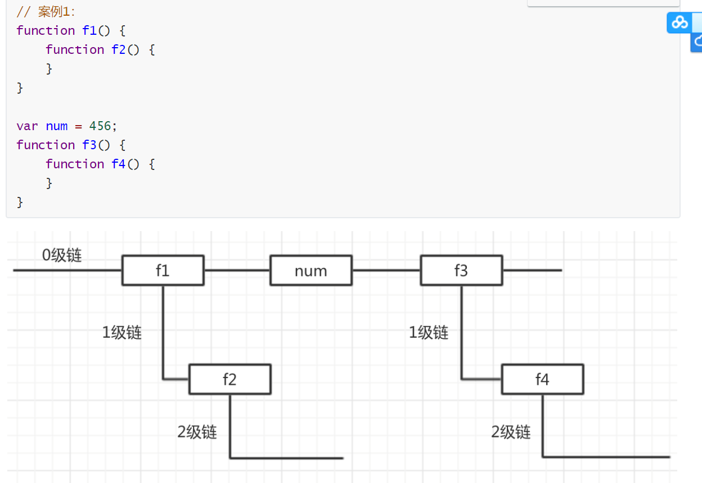
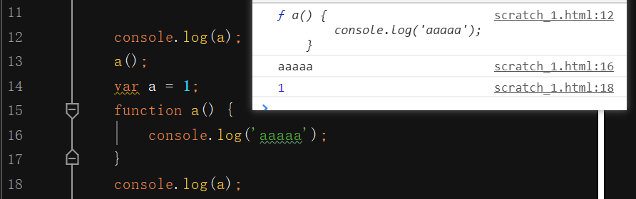

### 输入和输出：

- prompt("请输入您的银行卡密码：");  引导信息；
- alert('你真好看');  弹出框；
- console.log("控制台输出的信息");
- document.write("<h1>页面中输出123</h1>");  可以识别html标签；

### 变量的命名规范：

- 变量以字母、数字、下划线、$符号组成；
- 变量名字不能用数字作为开头、不能使用关键字或保留字；
- 变量名字是区分大小写的；

### 数据类型：

- 简单数类型：numder(NaN)数字类型、string(字符串类型)、Boolean(布尔类型)、undefined、Null、
- 复杂数据类型：Object(对象)
- NaN：即非数值（Not a Numder) 是一种特殊的number类型值；任何和NaN运算的结果都为NaN;和自己也不相等；

### 数据类型的相互转换：

#### 其他类型转数字类型：

- typeof 用来检测数据类型；

- Number();    较为严格；
  -  一定可以转出数字类型；
  - 字符串转数字：字符串中有一个不是数字字符则为NaN；
  -  Boolean(布尔类型)：NaN；
  - undefined: NaN；
  - Null：0；
- parseInt();  转整数：
  - 字符串转整数:只要在字符串中，数字前面没有非数字字符，那么都可以将非数字前面的所有数转出整数，
     否则为NaN；
  -  Boolean(布尔类型)：NaN；
  - undefined: NaN；
  - NaN:  NaN;
  - Null：NaN；
- parseFloat();  转浮点数；

### 操作符：

分支语句：

- 判断的是布尔类型（隐式转换）；

```js
if (/* 条件表达式 */) {
  // 执行语句
}

if (/* 条件表达式 */){
  // 成立执行语句
} else {
  // 否则执行语句
}

if (/* 条件1 */){
  // 成立执行语句
} else if (/* 条件2 */){
  // 成立执行语句
} else if (/* 条件3 */){
  // 成立执行语句
} else {
  // 最后默认执行语句
}
```

### 三元表达式：

- 三元表达的可以说是if.....else语法的一种简化写法；

- ```html
  <!DOCTYPE html>
  <html lang="en">
  <head>
      <meta charset="UTF-8">
      <title>Document</title>
  </head>
  <body>
      <script>
          var a = 10;
          var b = 20;
          //三元表达式：
          var c = a = b ? a : b;
          console.log(c); //10
      </script>
  </body>
  </html>
  ```

### switch语句：

- 判断结果和常量1进行比较，若成立则执行里面的代码；所不成立则继续和常量2比较，若成立则执行里面的代码....
- switch语句的判断是**严格模式（全等比较）**；
- break可以省略，若是省略则代码会继续向下执行；

```js
switch (expression) {
  case 常量1:
    语句;
    break;
  case 常量2:
    语句;
    break;
  case 常量3:
    语句;
    break;
  …
  case 常量n:
    语句;
    break;
  default:
    语句;
    break;
}
```

​      

### 清空数组：

- 重点： arr.length = 0;可以用于清空数组；

```html
<!doctype html>
<html lang="en">
<head>
    <meta charset="UTF-8">
    <meta http-equiv="X-UA-Compatible" content="ie=edge">
    <title>Document</title>
</head>
<body>
    <script>
        var arr = [1, 1, 1, 1];
        console.log(arr.length);
         // 清空数组
        arr.length = 0;
        console.log(arr);
        
        // 字面量的方式创建数组有一个情况：只有一个数据
      	var arr_1 = [90];
      	console.log(arr_1);
		//构造函数的方式创建数组，如果只有一个数据，则表示长度为90的空数组；
      	var arr_2 = new Array(90); // 长度为90的空数组；
      	console.log(arr_2);
    </script>
</body>
</html>
```

### 求数组中的最大值：
- 定义一个变量（假设为最大值）用于做比较；
```html
<!DOCTYPE html>
<html lang="en">
<head>
    <meta charset="UTF-8">
    <meta name="viewport" content="width=device-width, initial-scale=1.0">
    <meta http-equiv="X-UA-Compatible" content="ie=edge">
    <title>Document</title>
</head>
<body>
    <script>
        var arr = [1, 28, 3, 4, 10, 6, 7, 8, 9];
        // 声明一个变量假设第一个为最大值；
        var max = arr[0];
        for (var i = 1; i <= arr.length - 1; i++) {
            // 每次循环都让max做比较；
            // 如果假设的最大值（max）小于某个数，则把它从新赋值给max；
            // 如果判断不成立则继续下一次循环直到和所有的数字比较完毕；
            
            // 不能写成arr[0]<arr[i];因为会被替换掉；要把arr[0]赋值给变量；
            
            // 变量max只是改变了指向，arr[0]的值没有被替换；
            if (max < arr[i]) {
                max = arr[i]
            }
        }
        console.log(max);
    </script>
</body>
</html>
```
### 求数组中的最小值：
```html
<!DOCTYPE html>
<html lang="en">
<head>
    <meta charset="UTF-8">
    <meta name="viewport" content="width=device-width, initial-scale=1.0">
    <meta http-equiv="X-UA-Compatible" content="ie=edge">
    <title>Document</title>
</head>
<body>
    <script>
        var arr = [12, 18, 14, 4, 5, 6, 7, 8, 9, 1];
        var min = arr[0];
        var a;
        for (var i = 0; i <= arr.length-1; i++) {
            if (min > arr[i]) {
                min = arr[i];
            }
        }
        console.log(min);
    </script>
</body>
</html>
```

### 求数组的平均值：

-  注意：此时的sum不能只声明不赋值；
-  平均值的结果不能放在循环里面，因为每次都会除一次。

```html
<!DOCTYPE html>
<html lang="en">
<head>
    <meta charset="UTF-8">
    <meta name="viewport" content="width=device-width, initial-scale=1.0">
    <meta http-equiv="X-UA-Compatible" content="ie=edge">
    <title>Document</title>
</head>
<body>
    <script>
        var arr = [1, 1, 1];
        //注意此时的sum不能只声明不赋值；
        var sum = 0;
        for (var i = 0; i < arr.length; i++) {
            sum += arr[i];
            //jun = sum / arr.length;===不正确！！！
        }
        // 平均值的结果不能放在循环里面，因为每次都会除一次。！！！
        // 之所以打印的结果是正确的，是因为最后一次是用和相除得到的结果；
        // 所以要放在循环外面，
        //定义一个变量用于接收平均值；
        var jun = sum / arr.length;
        console.log(jun);
    </script>
</body>
</html>
```

### 求数组中相同元素的次数：

```js
<script>
    var arr = ["c", "a", "z", "a", 'c',"x", "a"];
    //定义：一个空对象用于存放键和值；
    var obj = {};
    //循环遍历数组；
    for (var i = 0; i < arr.length; i++) {
        // 把当前循环的元素赋值给变量用于判断；
        var item = arr[i];
        /*判断对象中是否有当前元素（键）；
        * 若没有则存到对象中并赋值为1，
        * 若有则在原来的基础上（值）上加1；
        * */
        if (obj[item]) {
            obj[item] = obj[item] + 1;
        } else {
            obj[item] = 1;
        }
    }
    console.log(obj);
</script>
```


### 求数组最大值的下标：

```html
<!DOCTYPE html>
<html lang="en">
<head>
    <meta charset="UTF-8">
    <meta name="viewport" content="width=device-width, initial-scale=1.0">
    <meta http-equiv="X-UA-Compatible" content="ie=edge">
    <title>Document</title>
</head>
<body>
    <script>
        var arr = [12, 18, 14, 0, 5, 6, 7, 8, 9, 1];
        // 声明一个变量用于存放下标；
        var a;
        //假设Max是最大值，则对应的i便是最大值的下标；
        var max = arr[0];
        for (var i = 0; i < arr.length; i++) {
            if (max < arr[i]) {
                max = arr[i];
                /* 只要进入这个判断就说明当前
                   的这个i是这个max的下标；
                   那就把i赋值给a；
                */
                a = i;
            }
        }
        console.log(max, a);
    </script>
</body>
</html>
```

### 根据用户的输入，求一组数中的和：

- 重点：字符串的分割；数字类型的转换；
- 需注意：分割后得到的是数组；但此时还是字符串；需要转换；

```html
<!DOCTYPE html>
<html lang="en">
<head>
    <meta charset="UTF-8">
    <meta name="viewport" content="width=device-width, initial-scale=1.0">
    <meta http-equiv="X-UA-Compatible" content="ie=edge">
    <title>Document</title>
</head>
<body>
    <script>
        // 定义变量获取用户的输入；
        var asus = prompt('请输入一组数字例：1，2，3');
        // 分割：因为我们得到的是字符串；
        // 分割后得到的是数组；但此时还是字符串；需要转换
        var arr = asus.split('，')
        // 遍历数组；
        // 定义变量用于求和；初始和为0；
        var sum = 0;
        for (var i = 0; i < arr.length; i++) {
            // 获取每个字符串，并转换
            var nam = parseFloat(arr[i]);
            sum += nam;
        }
        alert('和为：' + sum);
    </script>
</body>
</html>
```

### 冒泡排序：

- 第一步：找规律：
- 第二部：理解每个数字的比较的过程；
- 第三步：要熟练运用第三方变量的交换理念；

```html
<!DOCTYPE html>
<html lang="en">
<head>
    <meta charset="UTF-8">
    <meta name="viewport" content="width=device-width, initial-scale=1.0">
    <meta http-equiv="X-UA-Compatible" content="ie=edge">
    <title>Document</title>
</head>
<body>
    <script>
        // 需求: 一组数据实现从小到大或从大到少排列；
        var arr = [2, 4, 16, 6, 21, 8, 9, 0];
        //分析：
        /* 因为每个数字都要进行一次的比较；
           而比较过的数字在下一轮不需要进行比较了；
           所以一共比较arr.length - 1轮次；
           而每个数字则比较arr.length-i次；
         */
        //  外循环控制比较的轮次；
        for (var i = 0; i < arr.length - 1; i++) {
            // 内循环控制每个数字比较的次数；
            for (var j = 0; j < arr.length - 1 - i; j++) {
                // 如果成立则进入判断；若不成立则进入下一次循环；
                if (arr[j] > arr[j + 1]) {
                    // 第三方变量用于存放待交换的数据；
                    // 原理就是arr[j+1]的数据暂时赋值给a，
                    // 然后arr[j]的数据赋值给arr[j+1]，
                    // 此时的结果是arr[j+1]和arr[j]的结果相同，
                    // 然后把暂时存在a里面的数据从新赋值给arr[j]；
                    // 此时便实现了交换；
                    var a = arr[j + 1];
                    arr[j + 1] = arr[j];
                    arr[j] = a;
                }
            }
        }
        console.log(arr);
    </script>
</body>
</html>
```

### 知识点小节：

- 函数的调用若要拿到值则要有返回值；
- 返回值可以修改；若后面有值，则返回，若没有值；默认是undefined；
- 函数的调用或方法的调用若不给返回值则打印undefined;
- return中止函数的执行；在函数的执行过程中若遇到return则立即跳出函数体；

### 形参和实参：

* <b>若函数定义了形参并且参与了运算，那么函数的调用就要传入实参；否则打印NaN;</b>

* 形参没有赋值和变量一样为undefined;

  ```html
  <!DOCTYPE html>
  <html lang="en">
  
  <head>
      <meta charset="UTF-8">
      <title>Document</title>
  </head>
  
  <body>
  <script>
  //第一种情况    
      function f1(a) {
          var b=8+a;
          console.log(b)
      }
      f1();//NaN
      
      //第二种情况：
       function f1(a) {
          // var b=8+a;
          console.log(a);
      }
      f1();//undefined
  </script>
  </body>
  </html>
  ```

### arguments伪数组：

- arguments伪数组:可以获取所有实参的对象，<b>函数内部的变量（不是我们声明的，也不需要我们声明）</b>;
- 有下标，有长度，可遍历；
- 应用场景：当我们不知道我们的参数个数的时候；

```html
<!DOCTYPE html>
<html lang="en">
<head>
    <meta charset="UTF-8">
    <meta name="viewport" content="width=device-width, initial-scale=1.0">
    <meta http-equiv="X-UA-Compatible" content="ie=edge">
    <title>Document</title>
</head>
<body>
    <script>
        function f1() {
            console.log(arguments.length);
            var sum = 0;
            for (var i = 0; i < arguments.length; i++) {
                // var sum = 0; 不能写在这里，因为每次循环都会被重新赋值给覆盖掉；
                sum += arguments[i];
            }
            console.log(sum);
            return sum;
        }
        f1(1, 2, 3, 4, 5, 6, 7, 8, 9)
    </script>
</body>
</html>
```

### 匿名函数：

- 匿名函数：没有名字的函数，但是在js的语法中，是不允许匿名函数单独存在的，要配合其它语法使用；

- 匿名函数的自调用，加载页面后，自动执行一个函数；

- 也可以称为：**沙箱**；

  - 防止全局变量被污染；
  - 沙箱不能主动去影响外部的世界；为保证沙箱的封闭；
    - 需要传入实参：window;
    - 定义形参接收window;
    - 形参可以该名字，全局变量window不能改名字；
  
```js
  // 定义之后，立刻调用，输出10
  (function(){  
    console.log(10);  
  })();
```

  

### 回调函数：

- 函数也是数据类型，也可以作为别的函数的参数；

  ```html
  <!DOCTYPE html>
  <html lang="en">
  <head>
      <meta charset="UTF-8">
      <meta name="viewport" content="width=device-width, initial-scale=1.0">
      <meta http-equiv="X-UA-Compatible" content="ie=edge">
      <title>Document</title>
  </head>
  <body>
      <script>
          // fn 只不过在函数内部是一个形参，内部变量；
          function f1(a, fn) {
              console.log(a); //10；
              // 函数的调用，在函数名的后面加括号；
              // 这样，把函数作为实参传入，传入的函数对外面函数的调用叫回调函数；
              fn();
          }
  
          function f2() {
              console.log('f2函数执行了'); //f2函数执行了
          }
          f1(10, f2); // 输出 10 和 'f2函数执行了' f2是f1的回调函数；
      </script>
  </body>
  </html>
  ```

### 作用域：

- 全局变量：在全局作用域下用var声明的变量是全局变量；全局变量任何地方都可以访问的；

- 隐式全局变量：不使用var声明的变量；
  - 全局变量不能删除；
  - 隐式全局变量可以删除；

- 局部变量：在局部作用域下声明的变量是局部变量；

- 全局作用域：全局变量的生效范围区域；

- 局部作用域：局部变量的生效范围区域；

  ```
  局部变量退出作用域之后会销毁，全局变量关闭网页或浏览器才会销毁；
  在es5之前没有块级作用域的的概念,只有函数作用域**，
  ```


### 作用域链：

- ```
  只有函数可以制造作用域结构， 那么只要是代码，就至少有一个作用域, 即全局作用域。凡是代码中有函数，那么这个函数就构成另一个作用域。如果函数中还有函数，那么在这个作用域中就又可以诞生一个作用域。
  
  将这样的所有的作用域列出来，可以有一个结构: 函数内指向函数外的链式结构。就称作作用域链。
  ```




### 预解析：

- 在代码执行的过程中，js引擎会进行预解析；

  - 预解析时，变量声明在前，函数声明在后；

    - <b>在函数名和var变量名冲突的时候，预解析会舍弃var声明的变量；</b>
    - 原因：后来者居上；
    - <b>在函数的名字和变量的名字相同的时候，若a函数的调用顺序在变量下面则会报错；</b>

    

    

  - <b>只能预解析用var声明的变量，没有用var声明的变量（隐式全局变量）不会被解析；</b>

  - 预解析会把用var声明的变量，提到当前作用域的最顶端（只是声明提前）；

  - 预解析会把函数声明，提到当前作用域的最顶端（只是声明提前）；

    ```js
       // 观察下面的代码，说出执行结果
        var num = 10;
        fun();
        console.log(num);
    
        function fun() {
            console.log(num);
            var num = 20;
        }
    
    //结果：  undefined   10
    
    	function fun() {
            console.log(num);
        }
        var num = 10;
        fun();
        console.log(num);
    //结果：  10   10
    
    	 var num = 10;
        fun();
        console.log(num);
    
        function fun() {
            console.log(num);
            num = 20;
        }
    //结果：  10   20
    
    
     function f1() {
            console.log(num)
        }
        // var num=20;//20
        f1();
        var num=20;//undefined
        /*
        *分析：
        *第一步预解析；
        * 函数调用的时候，var 虽然是全局变量，
        * 但是f1执行的时候，num=20还未执行，
        * 所以为undefined;
        * */
    ```

### 创建对象及添加属性的方式：

- 字面量的方式创建对象；

  ```js
  //注意：属性与属性之间或属性与方法之间又 , 隔开；
  // 字面量的方式创建对象的同时添加属性和方法；
          var obj = {
              name: '小明',
              say: function() {
                  console.log('我叫' + obj.name); //我叫小明
                  //若没有返回值则打印undefined;
                  return '我叫' + obj.name;
              }
          };
          console.log(obj.say()); //我叫小明
  
  
  // 字面量的方式创建对象,并以 . 的方式添加属性和方法；
  //注意：属性与属性之间或属性与方法之间又 ; 隔开；
          var obj = {};
          obj.name = '小明';
          obj.say = function() {
              console.log('我叫' + obj.name); //我叫小明
              return '我叫' + obj.name;
          }
          console.log(obj.say()); //我叫小明
  ```

  

- 通过内置的构造函数创建对象；

  ```JS
  // 通过内置的构造函数创建对象,并以 . 的方式添加属性和方法；
  // 注意：Object的首字母要大写；属性值要加引号！！
          var obj = new Object();
          obj.name = '小明';
          obj.say = function() {
              console.log('我叫' + obj.name); //我叫小明
              return '我叫' + obj.name;
          }
          console.log(obj.say()); //我叫小明
  
  
  // 通过内置的构造函数创建对象,并以键值对的方式添加属性和方法；
          var obj = new Object();
          obj['name'] = '小明';
          obj['say'] = function() {
              console.log('我叫' + obj.name); //我叫小明
              return '我叫' + obj.name;
          };
          console.log(obj.say()); //我叫小明
  ```

  

### 遍历对象：

- 对象是一些属性和方法的集合；

- **可以遍历任意形式的对象；**

- 对象的遍历是以键值对的方式进行的；

- **此种方法不仅可以遍历对象，还可以遍历数组，此时key代表下标（从0开始）；**

  ```js
   var obj = {};
          // 以键值对的方式添加属性和方法；
          // 语法： 对象['名字'] = "值";
          // 属性和属性之间以, 隔开；
          obj.key = '小红',
              obj['name'] = "小明",
              obj['say'] = function() {
                  console.log(23);
              }
              // key代表键（name  say）是字符串类型，可以自定义字母，
          for (var key in obj) {
              console.log(key, typeof key, obj[key]); //say string 小红；
              // 若没有  obj.key = '小红',则打印 say string undefined；
              console.log(key, typeof key, obj.key); //say string 小红；
          }
  
  //遍历数组；
   var arr=[1,2,3,4,'a','ss','d','f']
      for (var key in arr) {
          console.log(key,arr[key]);
      }；
  ```

### 往内置对象Math上添加范围随机数:

```js
<script>
        // 需求：获取n-m之间的随机数、n<m；
        // 封装函数；传入形参；设置返回值；
        function f1(n, m) {
            // 定义变量，通过Math方法来获取随机数；
            // Math方法获取随机数；
            // var random_num = Math.random();
            // 先获取0~(m - n + 1)之间范围的数；
            // random_num = Math.random() * (m - n + 1);
            // 因为得到是小数所以要下取整（包含零、包含n）之所以能取到n是因为+1；
            // random_num = Math.floor(Math.random() * (m - n + 1));
            // +n 获取m-n之间的数；
            // var scope = random_num + n;
            // 简写；scope==范围
            var scope = Math.floor(Math.random() * (m - n + 1)) + n;
            // 设置返回值；
            return scope;
        }
        // 往内置对象Math上添加方法；
        Math.f1 = function(n, m) {
                var scope = Math.floor(Math.random() * (m - n + 1)) + n;
                // 设置返回值；
             	// 传入的实参之所以可以随意调换位置，是因为后面加了一个很大的数n,加为正值了；
                return scope;
            }
            // 调用方法并传入实参；
        console.log(Math.f1(80, 50));
    </script>
```


### 内置对象：

#### Math：数学对象；

- 方法；

```html
<!DOCTYPE html>
<html lang="en">
<head>
    <meta charset="UTF-8">
    <title>Document</title>
</head>
<body>
    <script>
      //方法直接调用即可；  
        Math.random();//随机数、范围[0-1);
        Math.ceil();//上取整；
        Math.floor();//下取整；
        Math.abs(x);//返回值是x的绝对值；
        Math.round(x);//把x四舍五入取整;
        Math.max(x,y...);//求多个数字中的最大值;
        Math.min(x,y...);//求多个数字中的最小值;
    </script>
</body>
</html>
```

#### Date：日期/时间对象；

```js
// 创建一个日期对象；
var date = new Date(); //直接输出：当前标准时间；
	date.getFullYear()；//年份
    date.getMonth()；//月份 从0开始的；0-11
    date.getDate()；//日
    date.getHours()；//小时； 0-23；
    date.getMinutes()；//分钟；0-59；
    date.getSeconds()；//秒数；0-59；
    date.getMilliseconds()；//毫秒0-999；
// 给一个日期格式字符串；
var date = new Date('2019-01-01');
// 分别传入年月日时分秒。注意传入的月份是从0开始算的
var date = new Date(2019,0,1,12,33,12);

//例：特点获得唯一的数字；
// 获取毫秒数 时间戳
  var date = new Date();
  // 从1970 1 1 到现在的毫秒数
//获取毫秒数的四种方法；
  console.log(date.valueOf());
  console.log(date.getTime());
  console.log(1 * date);
  console.log(Date.now());
  // 要求：绝对的是唯一的数值；
  Math.random() * date.valueOf();
````
