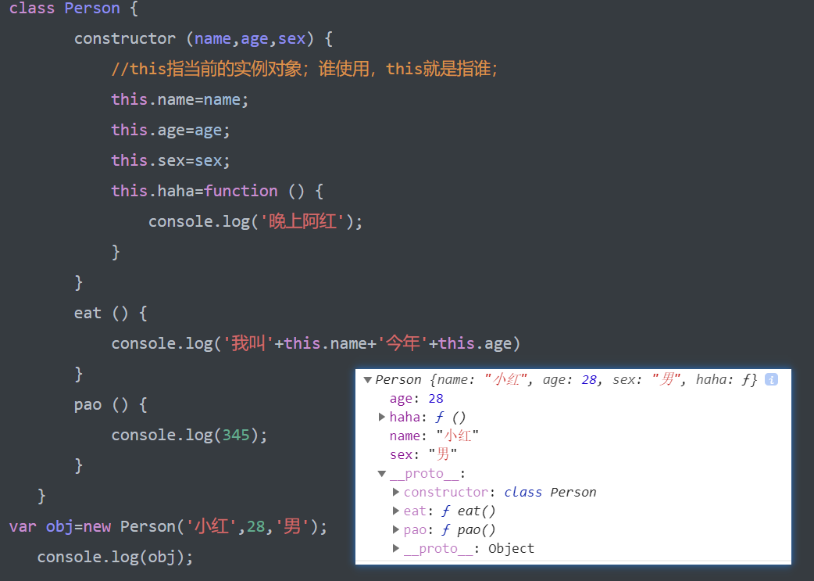
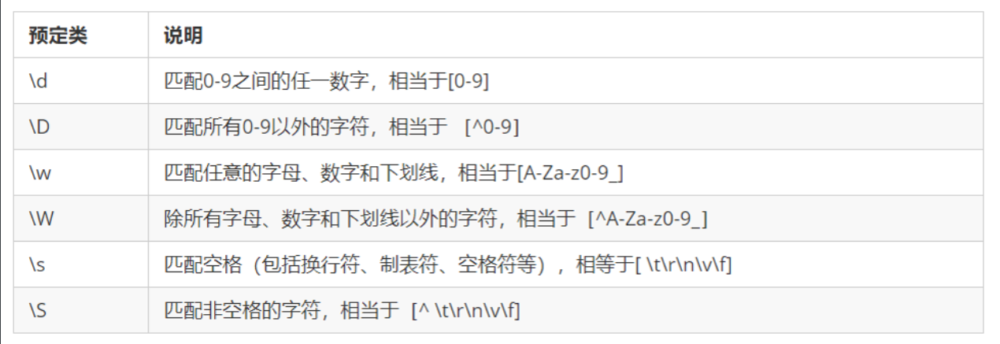

## JavaScript 的组成

| 组成部分       | 说明                |
| ---------- | ----------------- |
| Ecmascript | 描述了该语言的语法和基本对象    |
| DOM        | 描述了处理网页内容的方法和接口   |
| BOM        | 描述了与浏览器进行交互的方法和接口 |

## 复杂类型（引用类型）

- Object
- Array
- Date
- RegExp
- Function
- 基本包装类型
  + Boolean
  + Number
  + String
- 单体内置对象
  + Global
  + Math

#### 类型检测

- `typeof`
- `instanceof`
- `Object.prototype.toString.call()`

### JavaScript 执行过程

JavaScript 运行分为两个阶段： 

- 预解析
  + <b style="color: red">全局预解析（所有变量和函数声明都会提前；同名的函数和变量函数的优先级高）</b>
  + 函数内部预解析（所有的变量、函数和形参都会参与预解析）
    * 函数
    * 形参
    * 普通变量
- 执行；
  - 先预解析全局作用域，然后执行全局作用域中的代码，在执行全局代码的过程中遇到函数调用就会先进行函数预解析，然后再执行函数内代码。

## 两大编程思想：

1. 面向过程；
2. 面向对象
   - 面向对象编程 ；简称 OOP ，是一种编程开发思想。
   - 对象是单个事物的抽象。
   - 对象是一个容器，封装了属性（property）和方法（method）。
   - 所以，面向对象的设计思想是：
     - 抽象出 Class（类）；
     - 根据 Class 创建实例；
     - 指挥实例 得结果；
     - 面向对象的抽象程度又比函数要高，因为一个 Class 既包含数据，又包含操作数据的方法。

## 面向对象和过程优缺点；

> 简单程序面向过程，复杂程序用面向对象

- **面向过程：**

  - 优点：性能比面向对象高，步骤练习紧密；
  - 缺点：不好维护，不易多次使用及扩展；

  **面向对象：**

  ​		优点：易维护，可复用，可扩展，灵活性高	

  ​		缺点性能没有面向过程高

  ​		缺点性能没有面向过程高

## 面向对象三大特性；

1. 封装性；
2. 继承性；
3. 多态性；

## ES6中的类和对象

ES5：没有类，ES6：类

ES：ECMAscript

类是在ES6中新加进入的;

**类：**

​	1、抽取，把对象的属性和行为封装成一个类

​	2、对类进行实例化, 获取类的对象

**对象：**

​	对象：类中的具体的某个实例【属性和方法的集合体】

​	在JavaScript 中，对象是一组**无序**的相关属性和方法的集合，所有的事物都是对象，例如字符串、数值、数组、函数等。

**对象是由属性和方法组成的**；

**面向对象的思维特点:**

​	 1.抽取（抽象）对象共用的属性和方法组织(封装)成一个类(模板)

​	 2.对类进行实例化, 获取类的对象；

## 类class

> 可以使用class关键字声明一个类，之后以这个类来实例化对象。【构造函数实例化对象】;

- 类抽象了对象的公共部分，它泛指某一大类（class）

## 创建类

- 类里面的方法不带function，直接写既可；
- 类里面要有属性方法，属性方法要是想放到类里面，我们用constructor构造器；
- constructor 构造函数里面主要放一些公共的属性；

```javascript
//语法：class 类名 {属性和方法}；【构造函数语法糖】
//注意类名首字母大写；
//类要抽取公共属性方法，定义一个类；
 class Person {
     //公共属性写在constructor构造函数中；
        constructor (name,age,sex) {
            //this指当前new出来的实例对象；谁使用，this就是指谁；
            this.name=name;
            this.age=age;
            this.sex=sex;
            this.haha=function () {
                console.log('晚上阿红');
            }
        }
     //方法与方法之间不能加 ; 或 ,
        eat () {
            //普通函数中的this是谁调用就是谁；
            console.log('我叫'+this.name+'今年'+this.age)
        }
        pao () {
            console.log(345);
        }
    }
//用类实例化一个对象；
var obj=new Person('小明',22,'男');
//类就是构造函数的语法糖；
```

> constructor() 方法是类的构造函数(默认方法)，用于传递参数,返回实例对象，通过new命令生成对象实例时，自动调用该方法。
>
> 注意：每个类里面**一定**有构造函数，如果没有显示定义, 类内部会自动给我们创建一个constructor() ，
>
> 注意：this代表当前实例化对象，谁new就代表谁；

```javascript
class 类名 { constructor(){}   方法名(){} }

//注意：类中定义属性，调用方法都得用this
```

**总结：类有对象的公共属性和方法，用class创建，class里面包含constructor和方法，我们把公共属性放到constructor里面，把公共方法直接往后写既可，但是注意不要加逗号**

## 类的继承；

1. extends

   ```
   //语法：
   ​	class Father {};
   //在类中的构造函数的下面添加的方法，实例化对象后，并打印该对象，此时添加的方法是在实例对象的原型对象中；
   //在类中的构造函数中添加的属性和方法在实例化对象后，该属性和方法便存在于该实例对象中；
   ​	class Son extends Father{}
   // 子类里面不写东西  extends 可以继承父类的全部属性和方法；
   
   //注意：是子类继承父类
   ```



2. super

   > super关键字用于访问和调用对象父类上的函数。可以调用父类的构造函数，也可以调用父类的普通函数；
   >
   > 当子类没有constructor的时候可以随意用父类的，但是如果子类也含有的话，constructor会返回实例，this的指向不同，不可以再直接使用父类的东西；

**调用父类构造函数**；

```js
class F { 
    constructor(name, age){}
}
//如果子类里面不写东西，那么直接继承父类的全部属性和方法；
class S extends F { 
    constructor (name, age) { 
        //通过super关键字可以添加属于 S 自己的属性；在关键字的下面添加；
        //注意要传入形参和父类相对应；
        super(name,age); //super关键字 改变this指向；实现既能访问父类的属性又能添加自己的属性；
    } 
}

//注意: 子类在构造函数中使用super, 必须放到this 前面(必须先调用父类的构造方法,在使用子类构造方法）；
```

**调用父类普通函数**；

```js
class F { 
    constructor(name, age){} 
    say () {}
}
//如果子类里面不写东西，那么直接继承父类的全部属性和方法；
class S extends F { 
    constructor (name, age) { 
        super(name,age); 
    } 
    say () { 
        super.say() //改变指向；  实现既能调用父类的方法又能调用子类的方法；
    } 
}

//注意：如果子类没有 super 关键字，同时子类也有与父类相同的方法，则优先指向子类，就近原则；

```

**总结：super调用父类的属性和方法，那么查找属性和方法的原则就近原则**

```js
<script>
    //定义一个人的类 ，类的首字母一般要大写，属于规范；
    class Person {
        constructor (name,age,sex) {
            this.name=name;
            this.age=age;
            this.sex=sex;
        }
        //添加方法；
        eat () {
            console.log('我叫'+this.name+'今年'+this.age)
        }
        pao () {
            console.log('整它一个亿');
        }
    }
    class Son extends Person{
        constructor (name,age,sex,taio) {
            super(name, age,sex);
            this.tiao=taio;
        }
        //如果子类没有pao方法则直接继承父类的；
        //若子类也有和父类相同的方法；则采取就近原则；执行子类中的方法；
        //若既调用子类也想调用父类的方法则需要用 super 关键字；用super去调用；
        pao () {
            super.pao();
            console.log('赚他两毛钱');
        }
    }
    //使用类实例化一个对象；并传入实参；
    var obj1=new Son('小红',28,'男');
    // 访问人的属性；
    obj1.eat();
    obj1.pao(); //可以同时调用父类和子类的；
    console.log(obj1);
</script>
```

## 三个注意点

- 在ES6中类没有变量提升，所以必须先定义类，才能通过类实例化对象；
- 类里面的共有属性和方法一定要加this使用.【this<==>对象 调用属性和方法】;
- 类里面的this指向问题.；
- **constructor 里面的this指向实例对象, 方法里面的this 指向这个方法的调用者**；

```javascript
class Button {
	constructor () {
		var btn = document.querySelector('input');
		btn.onclick = this.cli;
	}
	cli () {
		console.log('点击了');
	}
}
var anniu = new Button();
```

## 类里面的this指向

- 构造函数的this指向实例对象;

- 普通函数的this是调用者，谁调用this是谁;

## 构造函数和原型

```javascript
//在典型的OOP 的语言中（如Java），都存在类的概念，类就是对象的模板，对象就是类的实例，但在ES6之前，JS 中并没用引入类的概念。

//ES6，全称ECMAScript6.0 ，2015.06 发版。但是目前浏览器的JavaScript 是ES5 版本，大多数高版本的浏览器也支持ES6，不过只实现了ES6 的部分特性和功能。

//在ES6之前，对象不是基于类创建的，而是用一种称为构建函数的特殊函数来定义对象和它们的特征。

/构造函数是一种特殊的函数，主要用来初始化对象，即为对象成员变量赋初始值，它总与new一起使用。我们可以把对象中一些公共的属性和方法抽取出来，然后封装到这个函数里面。
function Fn () {}
```

**在JS 中，使用构造函数时要注意以下两点：**

1.构造函数用于创建某一类对象，其首字母要大写

2.构造函数要和new 一起使用才有意义；

## 创建对象可以通过以下四种方式；

- 字面量；

  ```js
  var person = {
    name: 'Jack',
    age: 18,
    sayName: function () {
      console.log(this.name)
    }
  }
  ```

- new Object()； 系统内置构造函数创建对象；

  ```js
  var person = new Object()
  person.name = 'Jack'
  person.age = 18
  
  person.sayName = function () {
    console.log(this.name)
  }
  ```

- 自定义构造函数；

  - 首字母小写；

- 工厂模式创建对象；

  ```js
  //不用！
  function createPerson (name, age) {
    return {
      name: name,
      age: age,
      sayName: function () {
        console.log(this.name)
      }
    }
  }
  //然后生成实例对象；
  var p1 = createPerson('Jack', 18)
  var p2 = createPerson('Mike', 18)
  
  
  //一种更好的工厂模式创建对象的方式；常用！
  //缺点：会造成内存空间浪费；所以共用的方法会放在原型对象中，利用继承获取；
  function Person (name, age) {
    this.name = name
    this.age = age
    this.sayName = function () {
      console.log(this.name)
    }
  }
  
  var p1 = new Person('Jack', 18)
  p1.sayName() // => Jack
  
  var p2 = new Person('Mike', 23)
  p2.sayName() // => Mike
  //而要创建 `Person` 实例，则必须使用 `new` 操作符。
  //以这种方式调用构造函数会经历以下 4 个步骤：
  1. 在内存中创建一个新的空对象。
  2. 让this指向这个新的对象。
  3. 执行构造函数里面的代码，给这个新对象添加属性和方法。
  4. 返回这个新对象（所以构造函数里面不需要return）。
  ```

## 静态成员和实例成员

```js
JavaScript 的构造函数中可以添加一些成员，可以在构造函数本身上添加，也可以在构造函数内部的this 上添加。通过这两种方式添加的成员，就分别称为静态成员和实例成员。
```

- 静态成员：在构造函数本上添加的成员称为静态成员，只能由构造函数本身来访问
- 实例成员：在构造函数内部创建的对象成员称为实例成员，只能由实例化的对象来访问

```javascript
function Person (uname, age) {
			this.uname = uname;
			this.age = age; // 实例属性

		this.say = function () {
			console.log(123);
		}

}

	var obj = new Person('张三丰',22);	
	console.log(obj.uname);

	// console.log( Person.uname );
	Person.leibie = '人'; // 静态属性

	console.log(Person.leibie);
	console.log(obj.leibie);

```

**构造函数小问题：**

```js
//当实例化对象的时候，因为方法是函数，函数是复杂数据类型，而每创建一个对象，都会有一个函数，每个函数都得开辟一个内存空间，此时浪费内存了，那么如何节省内存呢，我们需要用到原型方法放到构造函数里面，以此来节省内存空间浪费；
```

## 构造函数原型prototype

- 是一个属性，是构造函数的属性，这个属性是一个对象，我们也称呼，prototype 为原型对象。


- 作用：是为了共享方法，从而达到节省内存


- **注意：每一个构造函数都有prototype属性**

> JavaScript 规定，每一个构造函数都有一个prototype 属性，指向构造函数的原型对象。

```javascript
function Star (uname, age) {

​		this.uname = uname;
​		this.age = age;
​		// this.sing = function () {
​		// 	console.log(this.name + '在唱歌');
​		// }
​	}
//把方法添加在原型对象上，既能节省空间又能实现方法共享；
​	Star.prototype.sing = function () {
​		console.log(this.uname + '在唱歌');
​	}
​	var zxc = new Star('周星驰', 22);
​	var ldh = new Star('刘德华', 22);
​	ldh.sing();
​	zxc.sing();
```

**总结：所有的公共属性写到构造函数里面，所有的公共方法写到原型对象里面**

## 对象原型：____proto____

**主要作用：指向prototype原型对象**；

构造函数和原型对象都会有一个属性, 指向构造函数的prototype 原型对象，之所以我们对象可以使用构造函数prototype 原型对象的属性和方法，就是因为对象有__proto__ 原型的存在。

> ```javascript
> 注意：____proto____是一个非标准属性，不可以拿来赋值或者设置【只读属性】
> ```

- ```
  1.____proto____对象原型和原型对象prototype 是等价的
  
  2.____proto____对象原型的意义就在于为对象的查找机制提供一个方向，或者说一条路线，但是它是一个非标准属性，因此实际开发中，不可以使用这个属性，它只是内部指向原型对象prototype
  ```

**总结：每一个对象都有一个原型，作用是指向原型对象prototype**

**统一称呼：____proto____原型，prototype成为原型对象**

## constructor  构造函数

> 记录是哪个构造函数创建出来的 **指回构造函数本身；**

原型（__proto__）和构造函数（prototype）原型对象里面都有一个属性constructor属性，constructor 我们称为构造函数，因为它指回构造函数本身。constructor 主要用于记录该对象引用于哪个构造函数，它可以让原型对象重新指向原来的构造函数。一般情况下，对象的方法都在构造函数的原型对象中设置。如果有多个对象的方法，我们可以给原型对象采取对象形式赋值，但是这样就会覆盖构造函数原型对象原来的内容，这样修改后的原型对象constructor  就不再指向当前构造函数了。此时，我们可以在修改后的原型对象中，添加一个constructor 指向原来的构造函数。

**总结：constructor  主要作用可以指回原来的构造函数**

原型对象：prototype，方法

对象原型：____proto____，指向原型对象

构造函数：constructor：指回构造函数

## 构造函数、实例、原型对象三者之间的关系


## 原型链

> 作用：提供一个成员的查找机制，或者查找规则

```
当访问一个对象的属性（包括方法）时，首先查找这个对象自身有没有该属性。

如果没有就查找它的原型（也就是__proto__指向的prototype 原型对象）。

如果还没有就查找原型对象的原型（Object的原型对象）。

依此类推一直找到Object 为止（null）。

__proto__对象原型的意义就在于为对象成员查找机制提供一个方向，或者说一条路线。

// console.log(Star.prototype.__proto__.__proto__);
// console.log(Object.prototype);

```

## 扩展内置对象

```
可以通过原型对象，对原来的内置对象进行扩展自定义的方法。比如给数组增加自定义求偶数和的功能。

```

```js
console.log( Array.prototype );
	// 添加求和方法
	Array.prototype.sum = function () {
		var sum = 0;
		for (var i = 0; i < this.length; i++) {
			sum += this[i];
		}
		return sum;
	}

	var arr = [1,2,3];
	console.log( arr.sum() );

	var newArr = [6,7,8,9];
	console.log( newArr.sum() );

```

## 继承；

```js
//ES6之前并没有给我们提供extends 继承。我们可以通过构造函数+原型对象模拟实现继承，被称为组合继承。
```

```js
call();

//调用这个函数, 并且修改函数运行时的this 指向

//fun.call(thisArg, arg1, arg2, ...);call把父类的this指向子类

//thisArg ：当前调用函数this 的指向对象

//arg1，arg2：传递的其他参数；

```

## **属性的继承**

```js
function Father (uname,age) {
			// this指向父类的实例对象
			this.uname = uname;
			this.age = age;
			// 要想让子类访问父类的属性，只需要把父类的this指向子类的this既可
		}
		function Son (uname, age,score) {
			// this指向子类构造函数
			Father.call(this,uname,age);//把父类的this指向给子类的this，子类的this为Son的实例对象；
			this.score = score;//添加自己的属性；
		}
		Son.prototype.sing = function () {
			console.log(this.uname + '唱歌')
		}
		var obj = new Son('刘德华',22,99);
		console.log(obj.uname);
		console.log(obj.score);
		obj.sing();

```

## **方法的继承：**

**实现方法把父类的实例对象保存给子类的原型对象**

```
一般情况下，对象的方法都在构造函数的原型对象中设置，通过构造函数无法继承父类方法。核心原理：

①将子类所共享的方法提取出来，让子类的prototype 原型对象= new 父类()  

②本质：子类原型对象等于是实例化父类，因为父类实例化之后另外开辟空间，就不会影响原来父类原型对象

③将子类的constructor 

把父类的实例对象赋值给子类的原型

```

```js
		function Father () {

		}
		Father.prototype.chang = function () {
			console.log('唱歌');
		}

		function Son () {

		}
		// Son.prototype = Father.prototype;此种方式不可用；
		//因为1、子项无法添加自己的方法；2、若添加的子项的方法名与父项相同则父项被覆盖；
		Son.prototype = new Father();//是我们想要的结果；但是要在方法添加之前改变指向；
		//指向改变之后要指回原构造函数；
		Son.prototype.constructor=Son;
		var obj = new Son();
		obj.chang();

		Son.prototype.score = function () {
			console.log('考试');
		}

		// obj.score();
		// console.log(Son.prototype);
		console.log(Father.prototype);

```

**注意：一定要让Son指回构造函数**

```js
实现继承后，让Son指回原构造函数

Son.prototype = new Father();

Son.prototype.constructor = Son;

```

**总结：用构造函数实现属性继承，用原型对象实现方法继承**

## 拷贝继承;
常见的做法是用一个包含方法的对象字面量来重写整个原型对象：

```js
function Person (name, age) {
  this.name = name
  this.age = age
}
//这样做的好处就是为 `Person.prototype` 添加成员简单了，但是也会带来一个问题，那就是原型对象丢失了 `constructor` 成员。
Person.prototype = {
  constructor: Person, // => 手动将 constructor 指向正确的构造函数
  sayHello: function () {
    console.log('我叫' + this.name + '，我今年' + this.age + '岁了')
  },
   say:function () {
            console.log(908);
        },
}
```

### 构造函数的原型方法继承：拷贝继承（for-in）

```javascript
function Person (name, age) {
  this.type = 'human'
  this.name = name
  this.age = age
}

Person.prototype.sayName = function () {
  console.log('hello ' + this.name)
}

function Student (name, age) {
  Person.call(this, name, age)
}

// 原型对象拷贝继承原型对象成员
for(var key in Person.prototype) {
  Student.prototype[key] = Person.prototype[key]
}

var s1 =new Student('张三', 18)

s1.sayName() // => hello 张三
```


## 类的本质

```js
class本质还是function

类的所有方法都定义在类的prototype属性上

类创建的实例,里面也有__proto__ 指向类的prototype原型对象

所以ES6的类它的绝大部分功能，ES5都可以做到，新的class写法只是让对象原型的写法更加清晰、更像面向对象编程的语法而已。

所以ES6的类其实就是语法糖.

语法糖:语法糖就是一种便捷写法.   简单理解, 有两种方法可以实现同样的功能, 但是一种写法更加清晰、方便,那么这个方法就是语法糖

```

```js
	class Star {}
	console.log( typeof Star );
	var obj = new Star();
	console.log(obj.__proto__);
	console.log(Star.prototype);

```

## ES5 中的新增方法

```js
//ES5 中给我们新增了一些方法，可以很方便的操作数组或者字符串，这些方法主要包括：

//1、数组方法：forEach()、map()、filter()、some()、every()；这些方法都是遍历数组的;
//2、字符串方法: trim()  主要作用：删除字符串两侧的空白符
```

**some()**

```js
/array.some(function(currentValue, index, arr)) 【注意：找到或者满足条件立刻停止】

// currentValue: 数组当前项的值; index：数组当前项的索引

//some() 方法用于检测数组中的元素是否满足指定条件. 通俗点查找数组中是否有满足条件的元素

//arr：数组对象本身
var arr = [100,200,300,400];
var re = arr.some(function (item,index,arr) {
		// console.log(item,index,arr);
		console.log(index);
   		//如果找到第一个满足条件的元素,则终止循环. 不在继续查找.
    	//注意:它返回值是布尔值, 如果查找到这个元素, 就返回true , 如果查找不到就返回false.
		return item >= 200;
	});
console.log(re);
```

**trim()；**

- 作用：清除两侧空白符；

- 返回值：清除后的新字符串；不改变原字符串；

```js
 var str='    下午好    ';
    console.log(str);
    //应用场景：发布信息是不能为空；
    //  var str="    ";<=====>也是字符串；
    var b=str.trim();
    console.log(b);
    console.log(str);
```

## 函数进阶；

### 函数的定义方式

- 函数的定义要有function 关键字；

- 匿名函数：

- 命名函数(函数表达式);

- `new Function`

  - ```
    new Function()   var fn = new Function('参数1','参数2'..., '函数体')
    
    var fn = new Function('a','b','console.log(a,b);');
      
    fn(123,456);
    ```

  - Function 里面参数都必须是字符串格式

  - 第三种方式执行效率低，也不方便书写，因此较少使用

  - 所有函数都是Function 的实例(对象) 

  - 函数也属于对象

#### 函数声明与函数表达式的区别

- 函数声明必须有名字
- 函数声明会函数提升，在预解析阶段就已创建，声明前后都可以调用
- 函数表达式类似于变量赋值
- **函数表达式可以没有名字，例如匿名函数**
- 函数表达式没有变量提升，在执行阶段创建，必须在表达式执行之后才可以调用

下面是一个根据条件定义函数的例子：

```javascript
if (true) {
  function f () {
    console.log(1)
  }
} else {
  function f () {
    console.log(2)
  }
}
```

以上代码执行结果在不同浏览器中结果不一致。

不过我们可以使用函数表达式解决上面的问题：

```javascript
var f

if (true) {
  f = function () {
    console.log(1)
  }
} else {
  f = function () {
    console.log(2)
  }
}
```

### 函数的调用方式;

- 函数的调用：好多种；

```js
1. 普通函数【fn()】
2. 对象的方法【对象.方法()】
3. 构造函数【new Fn()】
4. 绑定事件函数【obj.onclick = function () {}】
5. 定时器函数【window.setInterval(function () {},1000)】
6. 立即执行函数【(function () {})()】
```

### 函数内 `this` 指向的不同场景

- this指向当前调用者，始终成立；
- this的指向，是当我们调用函数的时候确定的；
- 函数的调用方式决定了 `this` 指向的不同：

| 调用方式     | 非严格模式     | 备注                         |
| ------------ | -------------- | ---------------------------- |
| 普通函数调用 | window         | 严格模式下是 undefined       |
| 构造函数调用 | 实例对象       | 原型方法中 this 也是实例对象 |
| 对象方法调用 | 该方法所属对象 | 紧挨着的对象                 |
| 事件绑定方法 | 绑定事件对象   |                              |
| 定时器函数   | window         |                              |
| 立即执行函数 | window         |                              |

### 改变函数内部this 指向：

> JavaScript 为我们专门提供了一些函数方法用来帮我们更优雅的处理函数内部 this 指向问题。
>
> 常用的有bind()、call()、apply() 三种方法。

#### **call();**

> - 语法：fun.call(obj,参数1，参数2);   obj 在 fun 函数运行时指定的 this 值；
>
> ​	   如果指定了 null 或者 undefined 则函数内部 this 指向 window；
>
> - call() 方法：调用一个对象，并改变调用对象(fun)的this指向；
>
> - 注意点：1、call 方法改变this指向，函数会被调用；
>
> ​	       2、该方法的作用和 `apply()` 方法类似，只有一个区别，就是 `call()` 方法接受的是若干个参数的列表，而 `apply()` 方法接受的是一个包含多个参数的数组。

```js
function fn(a,b) {
        console.log(this);
    	console.log(a+b);
    }
    var obj = {
        name: '小明',
        eat: function () {
            console.log(this)
        }
    }
    // 只要是函数就有this；
    //改变this指向；
    fn.call(obj,1,2);
```

#### **apply();**

> 语法：fun.apply(obj,[参数1，参数2]);
>
> 注意点：1、传递的值，必须包含在数组里面;
>
> ​	       2、返回值就是函数的返回值，因为它就是调用函数；
>
> ​		3、apply()` 与 `call()` 非常相似，不同之处在于提供参数的方式。
>
> ​		      就是 `call()` 方法接受的是若干个参数的列表；
>
> ​		      而 `apply()` 方法接受的是一个包含多个参数的数组。
>
> 扩展：配合Math.max()使用可以求数组的最大值；

```javascript
 function fn(a,b) {
        console.log(this);
        console.log(a+b);
    }
    var obj = {
        name: '小明',
        eat: function () {
            console.log(this)
        }
    }
    //改变this指向；
    fn.apply(obj,[1,2]);
/例：
    /*
    * 需求：求数组中的最大值；
    * max() 最大的方法为 Math.max() 所共有的；
    * 那么可以利用apply改变this指向的方法来使用  max() 的方法；*/
    var arr=[1,2,3,4,5,6,7,8,9];
    var Max=Math.max.apply(arr,arr);
    console.log(Max);
```

#### **bind();**

> ```js
> //用法为：fun.bind(obj,参数1，参数2);
> 1、bind() 函数会创建一个新函数（称为绑定函数），新函数与被调函数（绑定函数的目标函数）具有相同的函	数体（在 ECMAScript 5 规范中内置的call属性）。
> 2、当目标函数被调用时 this 值绑定到 bind() 的第一个参数，该参数不能被重写。绑定函数被调用时，	      bind() 也接受预设的参数提供给原函数。
> 3、一个绑定函数也能使用new操作符创建对象：这种行为就像把原函数当成构造器。提供的 this 值被忽略，同    时调用时的参数被提供给模拟函数。
> //返回值：返回由指定的this值和初始化参数改造的原函数拷贝。
> //因此当我们只是想改变this 指向，并且不想调用这个函数的时候，可以使用bind；
> ```

示例1：

```javascript
  function fn(a,b) {
        console.log(this);
        console.log(a+b);

    }
    function so() {
        this.name='小明';
        this.eat=function () {
            console.log(this.name);
        }
    }
    
    //改变this指向；
    fn.bind(so,1,3);
    //会创建一个新函数，和旧函数拥有相同的函数体；但是不共用一个；
    var obj_1=fn.bind(so);
    var obj= new obj_1;
    obj.name='小明';
    console.log(obj);

    var obj_2=new fn();
    obj_2.name='小红';
```

示例2：

```javascript
function LateBloomer() {
  this.petalCount = Math.ceil(Math.random() * 12) + 1;
}

// Declare bloom after a delay of 1 second
LateBloomer.prototype.bloom = function() {
  window.setTimeout(this.declare.bind(this), 1000);
};

LateBloomer.prototype.declare = function() {
  console.log('I am a beautiful flower with ' +
    this.petalCount + ' petals!');
};

var flower = new LateBloomer();
flower.bloom();  // 一秒钟后, 调用'declare'方法
```

#### 小结

- call 和 apply 特性一样
  + 都是用来调用函数，而且是立即调用
  + 但是可以在调用函数的同时，通过第一个参数指定函数内部 `this` 的指向
  + 传递的参数不一样, call 传递参数aru1, aru2..形式；apply 必须数组的形式[arg]；
  + apply 调用的时候，参数必须是一个数组，然后在执行的时候，会将数组内部的元素一个一个拿出来，与形参一一对应进行传递
  + 如果第一个参数指定了 `null` 或者 `undefined` 则内部 this 指向 window
- bind
  + 可以用来指定内部 this 的指向，然后生成一个改变了 this 指向的新的函数
  + 它和 call、apply 最大的区别是：bind 不会调用
  + bind 支持传递参数，它的传参方式比较特殊，一共有两个位置可以传递
    * 1. 在 bind 的同时，以参数列表的形式进行传递
    * 2. 在调用的时候，以参数列表的形式进行传递
    * 那到底以谁 bind 的时候传递的参数为准呢还是以调用的时候传递的参数为准
    * 两者合并：bind 的时候传递的参数和调用的时候传递的参数会合并到一起，传递到函数内部
- 使用场景：
  - 1.call 经常做继承. 
    2.apply 经常跟数组有关系.比如借助于数学对象实现数组最大值最小值
    3.bind  不调用函数,但是还想改变this指向. 比如改变定时器内部的this指向

### 函数的其它成员

- arguments
  + 实参集合
- caller
  + 函数的调用者
- length
  + 形参的个数
- name
  + 函数的名称

```javascript
function fn(x, y, z) {
  console.log(fn.length) // => 形参的个数
  console.log(arguments) // 伪数组实参参数集合
  console.log(arguments.callee === fn) // 函数本身
  console.log(fn.caller) // 函数的调用者
  console.log(fn.name) // => 函数的名字
}

function f() {
  fn(10, 20, 30)
}

f()
```

### 严格模式；

JS：两种模式[类似于HTML版本]；

> 1、严格模式；
>
> 2、正常模式；
>
> ```js
> 什么是严格模式
> 
> ES5 的严格模式是采用具有限制性JavaScript 变体的一种方式，即在严格的条件下运行JS 代码。
> 严格模式在IE10 以上版本的浏览器中才会被支持，旧版本浏览器中会被忽略。
> 严格模式对正常的JavaScript 语义做了一些更改：
> 
> 1.消除了Javascript语法的一些不合理、不严谨之处，减少了一些怪异行为。【例如变量，不声明就报错】
> 2.消除代码运行的一些不安全之处，保证代码运行的安全。
> 3.提高编译器效率，增加运行速度。
> 4.禁用了在ECMAScript的未来版本中可能会定义的一些语法，为未来新版本的Javascript做好铺垫。比如一些保留字如：class, enum, export, extends, import, super 不能做变量名
> ```

##### **开启严格模式；**

> ```js
> 开启严格模式："use strict"
> 为整个脚本文件开启严格模式，需要在所有语句之前放一个特定语句“use strict”;（或‘use strict’;）。
> 因为"use strict"加了引号，所以老版本的浏览器会把它当作一行普通字符串而忽略。
> <script>
> 	"use strict";
> 	console.log("这是严格模式。");
> </script>
> 
> 
> //将"use strict"放在函数体的第一行，则整个函数以"严格模式"运行。
> <script>
>  function fn () {"use strict"}
> </script> 
> ```

##### 严格模式中的变化；

> 1. 变量规定：
>    - 变量申明必须加var，而且不准删除变量。
>    - 严禁删除已经声明变量。例如，delete x; 语法是错误的。
> 2. 严格模式下this 指向问题；
>    - 严格模式下，普通函数this是undefined。
>    - 严格模式下,如果构造函数不加new调用, this 指向的是undefined 如果给他赋值则会报错。
> 3. 函数变化；
>    - 函数不能有重名的参数。
>    - 函数必须声明在顶层.新版本的JavaScript 会引入“块级作用域”（ES6 中已引入）。为了与新版本接轨，不允许在非函数的代码块内声明函数。【if，for等里面定义函数也不可以，但是现在不可以】
>    - 错误写法:
>        function fn (a,a) {console.log(a+a);}
>        fn(1,2);

### 高阶函数

> 1. 高阶函数是对其他函数进行操作的函数，它接收函数作为参数或将函数作为返回值输出。
> 2. 函数也是一种数据类型，同样可以作为参数，传递给另外一个参数使用。最典型的就是作为回调函数。
> 3. 同理函数也可以作为返回值传递回来。
>
> 作为参数：
>
> ```js
> function eat (callback) {
>   setTimeout(function () {
>     console.log('吃完了')
>     callback()
>   }, 1000)
> }
> 
> eat(function () {
>   console.log('去唱歌')
> })
> ```
>
> 作为返回值；
>
> ```js
> function genFun (type) {
>   return function (obj) {
>     return Object.prototype.toString.call(obj) === type
>   }
> }
> 
> var isArray = genFun('[object Array]')
> var isObject = genFun('[object Object]')
> 
> console.log(isArray([])) // => true
> console.log(isArray({})) // => true
> ```

### 函数闭包；

> 1. 闭包的概念：一个作用域可以访问另外一个函数内部的局部变量。
>
> 2. 闭包的作用：延伸变量的作用范围。
>
> 3. 在本质上，闭包就是将函数内部和函数外部连接起来的一座桥梁。
>
> 4. 如果函数内部有使用此变量，那么此变量便不会被销毁，否则会被销毁；
>
> 5. 闭包的用途：
>
>    - 可以在函数外部读取函数内部成员
>    - 让函数内成员始终存活在内存中
>
>    ```js
>    <script>
>    	function fn1(){
>    		// fn1 就是闭包函数
>    		var num = 10;
>    		function fn2(){
>    			console.log(num); // 10
>    		}
>    		fn2()
>    	}
>    	fn1();
>    </script>
>    //示例1：
>    var arr = [10, 20, 30]
>    for(var i = 0; i < arr.length; i++) {
>      arr[i] = function () {
>        console.log(i)
>      }
>    }
>    //示例2；
>    console.log(111)
>                         
>    for(var i = 0; i < 3; i++) {
>      setTimeout(function () {
>        console.log(i)
>      }, 0)
>    }
>    console.log(222)
>    ```

#### 闭包的思考题；

> 思考题1；
>
> ```js
> var name = "The Window";
> var object = {
>   name: "My Object",
>   getNameFunc: function () {
>     return function () {
>       return this.name;
>     };
>   }
> };
> 
> console.log(object.getNameFunc()())
> ```
>
> 思考题2：
>
> ```js
> var name = "The Window";　　
> var object = {　　　　
>   name: "My Object",
>   getNameFunc: function () {
>     var that = this;
>     return function () {
>       return that.name;
>     };
>   }
> };
> console.log(object.getNameFunc()())
> ```

#### 变量作用域；

> 1. 全局作用域.
>
> 2. 局部作用域(函数作用域);
>
> 3. es5中 没有块级作用域的概念;
>
> 4. 内层作用域可以访问外层作用域反之不行；
>
> 5. **当函数执行完毕，本作用域内的局部变量会销毁。**
>
>    ```js
>    {
>      var foo = 'bar'
>    }
>                         
>    console.log(foo)
>                         
>    if (true) {
>      var a = 123
>    }
>    console.log(a)
>    ```

### 函数递归；

> **递归：**如果一个函数在内部可以调用其本身，那么这个函数就是递归函数。
>
> **递归：**函数调用函数其本身;
>
> **注意：**递归函数的作用和循环效果一样，由于递归很容易发生“栈溢出”错误（stack overflow），所以必须要加退出条件return。

#### 计算阶乘;

```javascript
function factorial (num) {
  if (num <= 1) {
    return 1
  } else {
    return num * factorial(num - 1)
  }
}
console.log(factorial(num));
```

#### 递归求斐波那契数列;

```js
// 利用递归函数求斐波那契数列(兔子序列)  1、1、2、3、5、8、13、21...
// 用户输入一个数字 n 就可以求出 这个数字对应的兔子序列值
// 我们只需要知道用户输入的n 的前面两项(n-1 n-2)就可以计算出n 对应的序列值
function fb(n) {
  if (n === 1 || n === 2) {
        return 1;
  }
  return fb(n - 1) + fb(n - 2);
}
console.log(fb(3));
```

#### 递归应用场景

- 深拷贝
- 菜单树
- 遍历 DOM 树

---

#### 浅拷贝；

> 拷贝不能直接赋值，对象赋值的是地址;
>
> ```js
> //不可取；
> var obj = {
> 		name : '张三丰',
> 		age : 22
> 	};
> var newObj = obj;
> console.log(newObj);
> 
> //浅拷贝；只能拷贝到最外面一层；
> var obj = {
> 			name : '张三丰',
> 			age : 22
> 		};
> 
> 		var newObj = {};
> 		for (key in obj) {
> 			newObj[key] = obj[key];
> 		}
> 
> 		console.log(newObj);
> 		
> //es6：新方法
> Object.assign(target, sources);//用于浅拷贝；深拷贝不可取；
> 
> console.log(newObj);
> ```

#### 深拷贝；

> ```js
> var obj = {
> 			name : '1张三丰',
> 			age : 22,
> 			messige : {
> 				sex : '男',
> 				score : 16
> 			},
> 			color : ['red','purple','qing']
> 
> 		}
> 		var newObj = {};
> 		function kaobei (newObj,obj) {
> 
> 			for (key in obj) {
> 
> 				if (obj[key] instanceof Array) {
> 					newObj[key] = [];
> 					kaobei(newObj[key],obj[key]);
> 				} else if (obj[key] instanceof Object) {
> 					newObj[key] = {};
> 					kaobei(newObj[key],obj[key])
> 				} else {
> 					newObj[key] = obj[key];
> 				}
> 			}
> 		}
> 		obj.messige.sex = 99;
> 		kaobei(newObj,obj);
> 		console.log(newObj);
> ```

## 正则表达式

#### 什么是正则表达式；

> ```js
> //正则表达式（ Regular Expression ）是用于匹配字符串中字符组合的模式。
> //在JavaScript中，正则表达式也是对象。
> 
> 作用：检索关键字，过滤敏感字符，表单验证;强大的字符串替换能力(替换)
> 
> 正则表通常被用来检索、替换那些符合某个模式（规则）的文本;
> 例如验证表单：用户名表单只能输入英文字母、数字或者下划线， 昵称输入框中可以输入中文(匹配)。
> 此外，正则表达式还常用于过滤掉页面内容中的一些敏感词(替换)，或从字符串中获取我们想要的特定部分(提取)等 。
> 
> 其他语言也会使用正则表达式;
> ```

#### 正则表达式的特点;

> 1. 灵活性、逻辑性和功能性非常的强。
> 2. 可以迅速地用极简单的方式达到字符串的复杂控制。
> 3. 实际开发,一般都是直接复制写好的正则表达式. 但是要求会使用正则表达式并且根据实际情况修改正则表达式.   比如用户名:   /^[a-z0-9_-]{3,16}$/

### 正则表达式的测试

> 1、test() 正则对象的方法：用于检测字符串是否符合该规则，该对象会返回 true 或 false，其参数是待测试字符串；
>
> 2、jQuery 手册：正则表达式部分；正则测试工具 ： http://tool.oschina.net/regex；
>
> 3、正则表达式在线测试 ： https://c.runoob.com；
>
> 注意：正则里面没有引号；
> regexObj.test(str);
> regexObj：正则表达式
> str：用户输入字符串
>
> var rg = /123/;
> console.log(rg.test(123));//匹配字符中是否出现123  出现结果为true
> console.log(rg.test('abc'));//匹配字符中是否出现123 未出现结果为false

### 正则表达式的组成

> ```js
> 正则表达式可以由简单的字符构成，比如 /abc/，也可以是简单和特殊字符的组合，比如 /ab*c/ 。其中特殊字符也被称为元字符，在正则表达式中是具有特殊意义的专用符号，如 ^ 、$ 、+ 等。
> 
> 正则表达式的组成：简单字符 和 特殊字符(元字符)；
> 
> //特殊字符非常多，可以参考： 
> 
> MDN：https://developer.mozilla.org/zh-CN/docs/Web/JavaScript/Guide/Regular_Expressions
> 
> ```

### 元字符串；

#### 常用元字符；



| 边界符 | 说明                                                         |
| ------ | ------------------------------------------------------------ |
| .      | 匹配除换行符以外的任意单个字符                               |
| ^      | 表示匹配行首的文本(以谁开始) ；和&一起使用可以达到精确匹配； |
| $      | 表示匹配行尾的文本(以谁结束)                                 |

#### 量词符

> 量词符可以用来设定某个模式出现的次数。

| 量词符 | 说明             |
| ------ | ---------------- |
| *      | 重复零次或更多次 |
| +      | 重复一次或更多次 |
| ?      | 重复零次或一次   |
| {n}    | 重复n次          |
| {n,}   | 重复n次或更多次  |
| {n,m}  | 重复n到m次       |

#### 其它；

```
[] 字符串用中括号括起来，表示匹配其中的任一字符， 多选一   相当于或的意思 ； 
[^]  取反；匹配除了中括号以内的所有内容；
\ 转义符
| 或者，选择两者中的一个。注意|将左右两边分为两部分，而不管左右两边有多长多乱
() 从两个直接量中选择一个，分组
   eg：gr(a|e)y匹配gray和grey
[\u4e00-\u9fa5]  匹配汉字
```

### 用户表单验证案例；

- 如果用户名输入合法, 则后面提示信息为:  用户名合法,并且颜色为绿色；
- 如果用户名输入不合法, 则后面提示信息为:  用户名不符合规范, 并且颜色为红色；

> ```javascript
> var input = document.querySelector('input');
> 		var span = document.querySelector('span');
> 
> 		var reg = /^[a-zA-Z0-9_-]{6,16}$/;
> 
> 		input.onblur = function () {
> 
> 			if (reg.test(this.value)) {
> 				span.innerHTML = '输入正确';
> 				span.className = 'right';
> 			}else {
> 				span.innerHTML = '错误内容';
> 				span.className = 'error';
> 			}
> }
> ```

## JavaScript 中使用正则表达式

### 创建正则对象

方式1：

```javascript
var reg = new Regex('\d', 'i');
var reg = new Regex('\d', 'gi');
```

方式2：

```javascript
var reg = /\d/i;
var reg = /\d/gi;
```

#### 参数

| 标志   | 说明         |
| ---- | ---------- |
| i    | 忽略大小写      |
| g    | 全局匹配       |
| gi   | 全局匹配+忽略大小写 |

### 正则匹配

```javascript
// 匹配日期
var dateStr = '2015-10-10';
var reg = /^\d{4}-\d{1,2}-\d{1,2}$/
console.log(reg.test(dateStr));
```
#### 匹配正则表达式

```js
// console.log(/./.test("除了回车换行以外的任意字符"));//true
// console.log(/.*/.test("0个到多个"));//true
// console.log(/.+/.test("1个到多个"));//true
// console.log(/.?/.test("哈哈"));//true
// console.log(/[0-9]/.test("9527"));//true
// console.log(/[a-z]/.test("what"));//true
// console.log(/[A-Z]/.test("Are"));//true
// console.log(/[a-zA-Z]/.test("干啥子"));//false
// console.log(/[0-9a-zA-Z]/.test("9ebg"));//true
// console.log(/b|(ara)/.test("abra"));//true
// console.log(/[a-z]{2,3}/.test("arfsf"));//true
    console.log(/\d/.test("998"));//true
    console.log(/\d*/.test("998"));//true
    console.log(/\d+/.test("998"));//true
    console.log(/\d{0,}/.test("998"));//true
    console.log(/\d{2,3}/.test("998"));//true
    console.log(/\D/.test("eat"));//true
    console.log(/\s/.test("  "));//true
    console.log(/\S/.test("嘎嘎"));//true
    console.log(/\w/.test("_"));//true
    console.log(/\W/.test("_"));//true
```

### 正则提取

```javascript
// 1. 提取工资
var str = "张三：1000，李四：5000，王五：8000。";
var array = str.match(/\d+/g);
console.log(array);

// 2. 提取email地址
var str = "123123@xx.com,fangfang@valuedopinions.cn 286669312@qq.com 2、emailenglish@emailenglish.englishtown.com 286669312@qq.com...";
var array = str.match(/\w+@\w+\.\w+(\.\w+)?/g);
console.log(array);

// 3. 分组提取  
// 3. 提取日期中的年部分  2015-5-10
var dateStr = '2016-1-5';
// 正则表达式中的()作为分组来使用，获取分组匹配到的结果用Regex.$1 $2 $3....来获取
var reg = /(\d{4})-\d{1,2}-\d{1,2}/;
if (reg.test(dateStr)) {
  console.log(RegExp.$1);
}

// 4. 提取邮件中的每一部分
var reg = /(\w+)@(\w+)\.(\w+)(\.\w+)?/;
var str = "123123@xx.com";
if (reg.test(str)) {
  console.log(RegExp.$1);
  console.log(RegExp.$2);
  console.log(RegExp.$3);
}
```

### 正则替换

```javascript
// 1. 替换所有空白
var str = "   123AD  asadf   asadfasf  adf ";
str = str.replace(/\s/g,"xx");
console.log(str);

// 2. 替换所有,|，
var str = "abc,efg,123，abc,123，a";
str = str.replace(/,|，/g, ".");
console.log(str);
```

### 案例：表单验证

```html
QQ号：<input type="text" id="txtQQ"><span></span><br>
邮箱：<input type="text" id="txtEMail"><span></span><br>
手机：<input type="text" id="txtPhone"><span></span><br>
生日：<input type="text" id="txtBirthday"><span></span><br>
姓名：<input type="text" id="txtName"><span></span><br>
```

```javascript
//获取文本框
var txtQQ = document.getElementById("txtQQ");
var txtEMail = document.getElementById("txtEMail");
var txtPhone = document.getElementById("txtPhone");
var txtBirthday = document.getElementById("txtBirthday");
var txtName = document.getElementById("txtName");

//
txtQQ.onblur = function () {
  //获取当前文本框对应的span
  var span = this.nextElementSibling;
  var reg = /^\d{5,12}$/;
  //判断验证是否成功
  if(!reg.test(this.value) ){
    //验证不成功
    span.innerText = "请输入正确的QQ号";
    span.style.color = "red";
  }else{
    //验证成功
    span.innerText = "";
    span.style.color = "";
  }
};

//txtEMail
txtEMail.onblur = function () {
  //获取当前文本框对应的span
  var span = this.nextElementSibling;
  var reg = /^\w+@\w+\.\w+(\.\w+)?$/;
  //判断验证是否成功
  if(!reg.test(this.value) ){
    //验证不成功
    span.innerText = "请输入正确的EMail地址";
    span.style.color = "red";
  }else{
    //验证成功
    span.innerText = "";
    span.style.color = "";
  }
};
```

表单验证部分，封装成函数：

```javascript
var regBirthday = /^\d{4}-\d{1,2}-\d{1,2}$/;
addCheck(txtBirthday, regBirthday, "请输入正确的出生日期");
//给文本框添加验证
function addCheck(element, reg, tip) {
  element.onblur = function () {
    //获取当前文本框对应的span
    var span = this.nextElementSibling;
    //判断验证是否成功
    if(!reg.test(this.value) ){
      //验证不成功
      span.innerText = tip;
      span.style.color = "red";
    }else{
      //验证成功
      span.innerText = "";
      span.style.color = "";
    }
  };
}
```

通过给元素增加自定义验证属性对表单进行验证：

```html
<form id="frm">
  QQ号：<input type="text" name="txtQQ" data-rule="qq"><span></span><br>
  邮箱：<input type="text" name="txtEMail" data-rule="email"><span></span><br>
  手机：<input type="text" name="txtPhone" data-rule="phone"><span></span><br>
  生日：<input type="text" name="txtBirthday" data-rule="date"><span></span><br>
  姓名：<input type="text" name="txtName" data-rule="cn"><span></span><br>
</form>
```

```javascript
// 所有的验证规则
var rules = [
  {
    name: 'qq',
    reg: /^\d{5,12}$/,
    tip: "请输入正确的QQ"
  },
  {
    name: 'email',
    reg: /^\w+@\w+\.\w+(\.\w+)?$/,
    tip: "请输入正确的邮箱地址"
  },
  {
    name: 'phone',
    reg: /^\d{11}$/,
    tip: "请输入正确的手机号码"
  },
  {
    name: 'date',
    reg: /^\d{4}-\d{1,2}-\d{1,2}$/,
    tip: "请输入正确的出生日期"
  },
  {
    name: 'cn',
    reg: /^[\u4e00-\u9fa5]{2,4}$/,
    tip: "请输入正确的姓名"
  }];

addCheck('frm');


//给文本框添加验证
function addCheck(formId) {
  var i = 0,
      len = 0,
      frm =document.getElementById(formId);
  len = frm.children.length;
  for (; i < len; i++) {
    var element = frm.children[i];
    // 表单元素中有name属性的元素添加验证
    if (element.name) {
      element.onblur = function () {
        // 使用dataset获取data-自定义属性的值
        var ruleName = this.dataset.rule;
        var rule =getRuleByRuleName(rules, ruleName);

        var span = this.nextElementSibling;
        //判断验证是否成功
        if(!rule.reg.test(this.value) ){
          //验证不成功
          span.innerText = rule.tip;
          span.style.color = "red";
        }else{
          //验证成功
          span.innerText = "";
          span.style.color = "";
        }
      }
    }
  }
}

// 根据规则的名称获取规则对象
function getRuleByRuleName(rules, ruleName) {
  var i = 0,
      len = rules.length;
  var rule = null;
  for (; i < len; i++) {
    if (rules[i].name == ruleName) {
      rule = rules[i];
      break;
    }
  }
  return rule;
}
```

## 补充；

### 伪数组和数组

在JavaScript中，除了5种原始数据类型之外，其他所有的都是对象，包括函数（Function）。

#### 对象与数组的关系

在说区别之前，需要先提到另外一个知识，就是 JavaScript 的原型继承。
所有 JavaScript 的内置构造函数都是继承自 `Object.prototype` 。
在这个前提下，可以理解为使用 `new Array()` 或 `[]` 创建出来的数组对象，都会拥有 `Object.prototype` 的属性值。

```javascript
var obj = {};// 拥有 Object.prototype 的属性值
var arr = [];
//使用数组直接量创建的数组，由于 Array.prototype 的属性继承自 Object.prototype，
//那么，它将同时拥有 Array.prototype 和 Object.prototype 的属性值
```

可以得到对象和数组的第一个区别：对象没有数组 Array.prototype 的属性值。

#### 什么是数组

数组具有一个最基本特征：索引，这是对象所没有的，下面来看一段代码：

```javascript
var obj = {};
var arr = [];
 
obj[2] = 'a';
arr[2] = 'a';
 
console.log(obj[2]); // => a
console.log(arr[2]); // => a
console.log(obj.length); // => undefined
console.log(arr.length); // => 3
```

- obj[2]输出'a'，是因为对象就是普通的键值对存取数据
- 而arr[2]输出'a' 则不同，数组是通过索引来存取数据，arr[2]之所以输出'a'，是因为数组arr索引2的位置已经存储了数据
- obj.length并不具有数组的特性，并且obj没有保存属性length，那么自然就会输出undefined
- 而对于数组来说，length是数组的一个内置属性，数组会根据索引长度来更改length的值
- 为什么arr.length输出3，而不是1
  + 在给数组添加元素时，并没有按照连续的索引添加，所以导致数组的索引不连续，那么就导致索引长度大于元素个数

#### 什么是伪数组

1. 拥有 length 属性，其它属性（索引）为非负整数(对象中的索引会被当做字符串来处理，这里你可以当做是个非负整数串来理解)
2. 不具有数组所具有的方法

伪数组，就是像数组一样有 `length` 属性，也有 `0、1、2、3` 等属性的对象，看起来就像数组一样，但不是数组，比如:

```javascript
var fakeArray = {
  "0": "first",
  "1": "second",
  "2": "third",
  length: 3
};
 
for (var i = 0; i < fakeArray.length; i++) {
  console.log(fakeArray[i]);
}
 
Array.prototype.join.call(fakeArray,'+');
```

常见的伪数组有：

- 函数内部的 `arguments`
- DOM 对象列表（比如通过 `document.getElementsByTags` 得到的列表）
- jQuery 对象（比如 `$("div")` ）

伪数组是一个 Object，而真实的数组是一个 Array。

伪数组存在的意义，是可以让普通的对象也能正常使用数组的很多方法，比如：

```javascript
var arr = Array.prototype.slice.call(arguments);
 
Array.prototype.forEach.call(arguments, function(v) {
  // 循环arguments对象
});

// push
// some
// every
// filter
// map
// ...
```

以上在借用数组的原型方法的时候都可以通过数组直接量来简化使用：

```javascript
var obj = {
  0: 'a',
  1: 'b',
  2: 'c',
  length: 3
}

;[].push.call(obj, 'd')

console.log([].slice.call(obj))

;[].forEach.call(obj, function (num, index) {
  console.log(num)
})
```

#### 小结

- 对象没有数组 Array.prototype 的属性值，类型是 Object ，而数组类型是 Array
- 数组是基于索引的实现， length 会自动更新，而对象是键值对
- 使用对象可以创建伪数组，伪数组可以正常使用数组的大部分方法

### JavaScript 垃圾回收机制

### JavaScript 运行机制：Event Loop

### Object

#### 静态成员

- Object.assign()
- Object.create()
- Object.keys()
- Object.defineProperty()

#### 实例成员

- constructor
- hasOwnProperty()
- isPrototypeOf
- propertyIsEnumerable()
- toString()
- valueOf()

---

## 附录

#### 校验工具

- [JSLint](https://github.com/douglascrockford/JSLint)
- [JSHint](https://github.com/jshint/jshint)
- [ESLint](https://github.com/eslint/eslint)

###  文档相关工具

- 电子文档制作工具: [docute](https://github.com/egoist/docute)
- 流程图工具：[DiagramDesigner](http://logicnet.dk/DiagramDesigner/)
