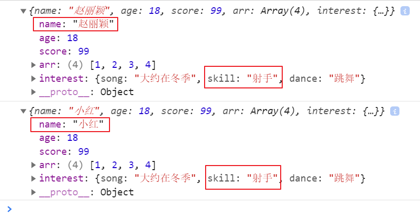
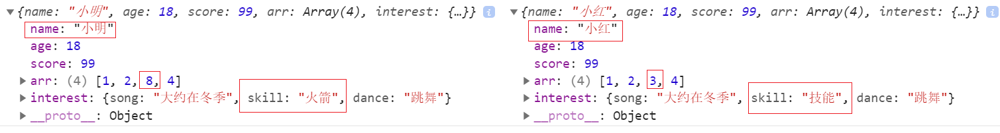
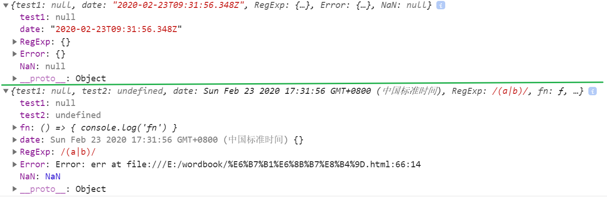

## 浅拷贝；

>  拷贝就是拷贝指向对象的[指针](https://baike.baidu.com/item/指针/2878304)，意思就是说：拷贝出来的目标对象的指针和源对象的指针指向的内存空间是同一块空间，浅拷贝只是一种简单的拷贝，让几个对象公用一个内存。

```js
// 人的对象；
    var Proson = {
      name: '小红',
      age: 18,
      score: 99,
      arr: [1, 2, 3, 4],
      interest: {
        song: '大约在冬季',
        skill: '技能',
        dance: '跳舞'
      }
    }

    // 学生的对象；
    var Student = {}
```

### 1、方法一；

```js
    // 利用for in 进行拷贝；
    for (const key in Proson) {
      Student[key] = Proson[key]
    }
```

**修改原对象的属性值；**

```js
	// 修改原对象的属性值；
    Proson.name = '赵丽颖'
    Proson.interest.skill = '射手'
 	console.log(Proson)
    console.log(Student)
	// 打印的结果如下；
```



> 通过打印结果我们可以看到：
>
> 1、属性值是简单数据类型的那么原数据的修改不会影响拷贝对象，
>
> 2、但是属性值是引用类型的那么原数据的修改会影响拷贝对象；
>
> 3、这是因为对于简单数据类型来说拷贝的是值，而对于复杂数据来说拷贝的只是引用的地址，指向的内存还是同一个；
>
> **缺点**：只能拷贝第一层，第二层拷贝的是地址；

### 2、方法二；

> `es6`提供的新方法实现浅拷贝；

```js
Object.assign(Student, Proson)

    Proson.name = '赵丽颖'
    Proson.interest.skill = '射手'
    console.log(Proson)
    console.log(Student)
```

> 打印结果与上图一样；

## 深拷贝；

> 概述：会完全的克隆出一份对象，新对象与原对象数据相同，但是引用地址不同，一个对象的修改不会影响另一个对象的数据；

```js
 // 人的对象；
    var Proson = {
      name: '小红',
      age: 18,
      score: 99,
      arr: [1, 2, 3, 4],
      interest: {
        song: '大约在冬季',
        skill: '技能',
        dance: '跳舞'
      }
    }

 // 学生的对象；
    var student = {}
```

### 1、方法一；

> 利用原生的`js`方法 `JSON.stringify()`和`JSON.parse()`实现深拷贝；

```js
var student = JSON.parse(JSON.stringify(Proson))
```

### 2、方法二；

> 利用**递归**进行深拷贝；

```js
    /**
     * 参数1：待拷贝对象；
     * 参数2：原对象
     */
    function deepCopy(copyObject, sourceObject) {
      for (const key in sourceObject) {
        // 判断值是否为引用类型，若是则进行深遍历，若不是则直接赋值；
        if (sourceObject[key] instanceof Array) {
          // 定义空对象；
          copyObject[key] = []
          deepCopy(copyObject[key], sourceObject[key])
        } else if (sourceObject[key] instanceof Object) {
          // 定义空数组
          copyObject[key] = {}
          deepCopy(copyObject[key], sourceObject[key])
        } else {
          copyObject[key] = sourceObject[key]
        }
      }
    }

    // 调用深拷贝的方法
    deepCopy(student, Proson)
```

> 注意：在做判断时，要先判断数组类型，在判断对象类型，因为`instanceof`会把**数组**(引用类型)判断为`object`;

**修改学生的数据**

```js
 student.name = '小明'
 student.arr[2] = 8
 student.interest.skill = '火箭'
// 打印结果如下；
 console.log(student, Proson)
```



> 通过打印结果我们得知：学生的数据的修改，不会影响人的对象的数据；

## 问题；

> 进行深拷贝时，我们如果用 `JSON.stringify()`和`JSON.parse()`实现深拷贝；则会遇到一下问题；

```js
let Obj = {
      test1: null,
      test2: undefined,
      fn: () => {
        console.log('fn')
      },
      date: new Date(),
      RegExp: /(a|b)/,
      Error: new Error('err'),
      NaN: Number('NaN')
    }

    let newObj = JSON.parse(JSON.stringify(Obj))
    console.log(newObj, Obj)
```



> 通过打印结果我们得出新对象：
>
> 1、 丢失 function、undefined 
>
> 2、 Error、`RegExp`为空对象 
>
> 3、 `NaN `变为 null
>
> 4、 date 对象变为 string 