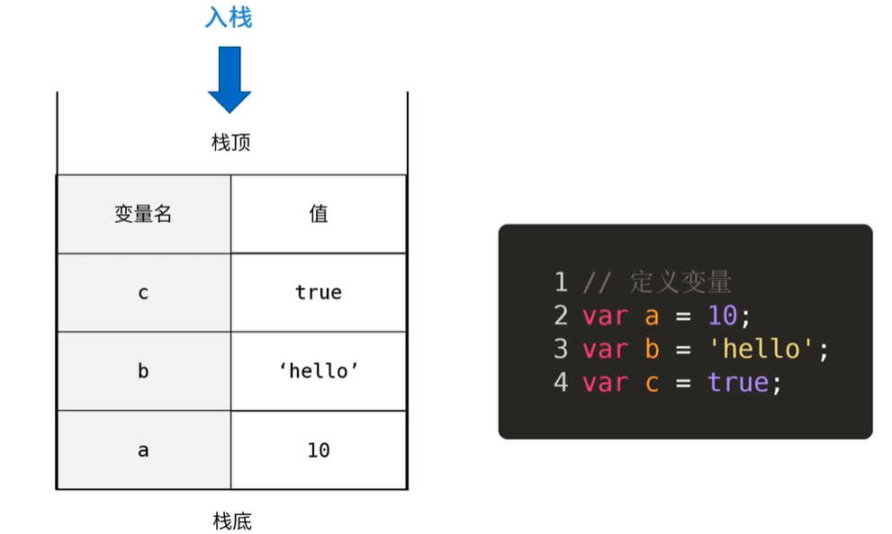
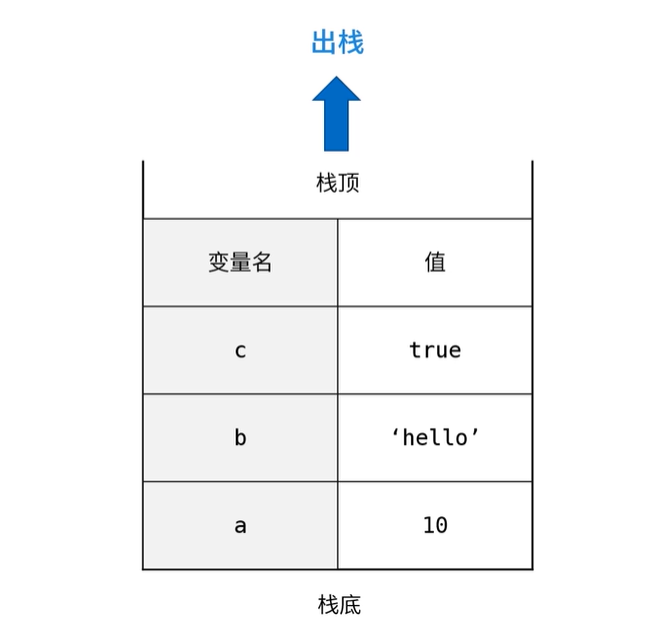
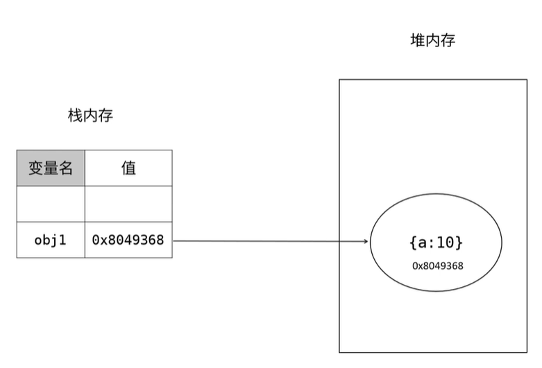
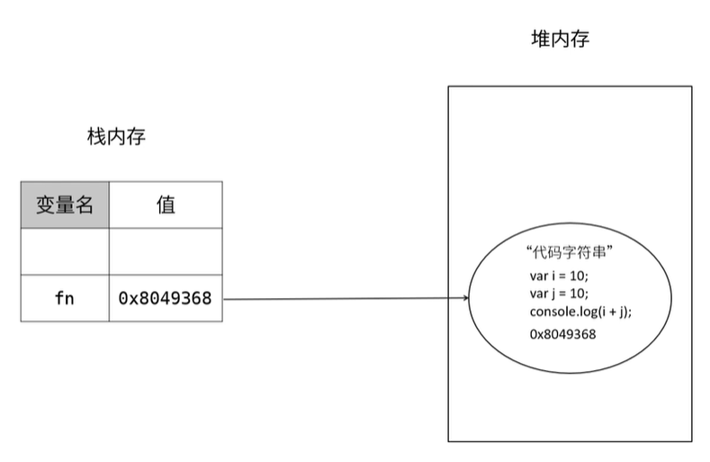
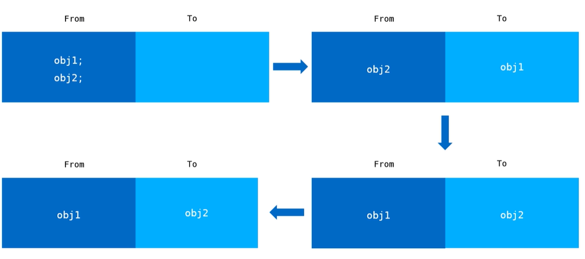
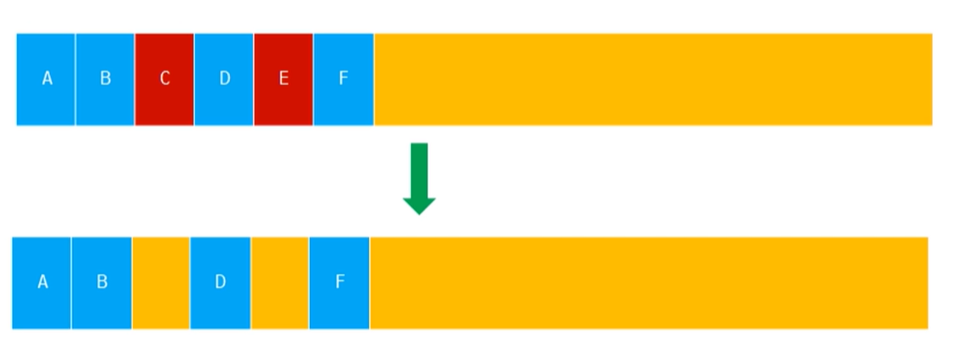
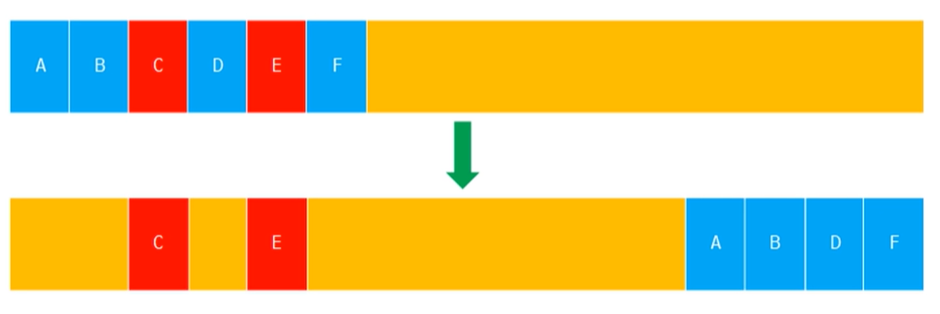

> 内存管理可以简单理解为内存空间，内存空间可以分为：栈内存、堆内存

## 为什么要关注内存

> 作为一位前端开发人员，我们知道程序的运行要分配内存空间，对于一个页面来说，如果我们不在使用的内存没有得到及时释放，我们称这种现象为内存泄漏。虽然一次的内存泄漏不会造成太大影响，但是当泄漏的内存增多的时候，便会造成内存溢出错误。轻则造成页面卡顿，重则造成浏览器崩溃，甚至无响应。所以我们平时在开发的时候要关注内存，并且要合理的释放那些不在使用的内存。

1. 防止页面占用内存过大，引起客户端卡顿，甚至无响应；
2. nodejs使用V8引擎，内存对于后端服务的性能至关重要，因为后端服务的持久性，后端更容易造成内存溢出；

## 栈内存；

> 原始数据类型(简单数据类型)都是存在放在栈内存中的，例：字符串(String)、数字(Number)、布尔(Boolean)、Null、Undefined、Symbol(es6)；原始数据类型的值是固定的，由系统自动分配内存，存储在栈内存中；



> 如上图所示，我们先后定义了变量a、b、c，三个变量都只能从箭头所指的方向入栈，向栈插入新元素又称“进栈、入栈或压栈”，我定义的三个变量，最先放入的是变量a、随后是变量b、c。而我们的变量c就是我们的栈顶元素。 

**定义变量的过程**

- 在内存中申请一块空间，并保存 10 这个值；
- 在内存中创建一个名为 a 的变量，注意此时还没有进行赋值，a 的值为 undefined；
- 赋值：把创建的变量 a 的指针 指向 10 这个值；



> 从栈顶删除一个元素，又称出栈或者退栈。如上图所示，从箭头所指的方向为出栈，它是把栈顶元素删除掉，使其相邻的栈顶元素称为新的栈顶元素。出栈的顺序是先进后出，也就是说，最先删除的是最后入栈的变量c、然后是b、a；

## 堆内存；

> 我们知道复杂数据类型的大小是不固定的，例如：对象(object)、数组(array)；相对于简单数据类型在栈内存中存储，复杂数据类型(引用数据类型)都是存在放在堆内存中的；js是不允许直接访问堆内存的，因此我们也无法直接操作对象的堆内存空间，我们在操作对象时，实际上是在操作对象的引用，而不是实际的对象，引用类型的值都是按引用访问的，这里的引用我们可以简单的理解为保存在栈内存中的一个地址，该地址与对象的实际值相关联。所以引用数据类型的值是保存在堆内存中的对象。



> 由上图所示，当我们需要存储一个对象的时候，首先在堆内存中开辟一块新的空间，然后以键值对的形式存储在堆内存中，这个堆内存会有一个16进制的内存地址，我们假设是 `0x8049368`,之后我们在栈内存中声明一个变量 `obj1` 它的值就是我们的堆内存的地址.这样我们就可以通过`obj1`访问我们的对象了；

## 存储函数；

> 我们知道函数也是引用类型，当我们定义一个函数的时候，它到底是如何工作的呢？



> 当我们定义一个函数的时候，首先在堆内存中开辟一块新的空间，然后把我们的函数体以**代码字符串**的形式存在堆内存中，同时这个空间也会有一个内存地址，假设为：`0x8049368`，同时把这个内存地址赋值给函数名，所以我们也可以把函数理解为变量。

## 垃圾回收；

> 在javascript中垃圾回收是指：javascript引擎找出那些不再使用的变量，然后释放其所占用的内存，垃圾回收器会按照固定的时间间隔周期性地执行这一操作；【javascrit会自动的帮我们进行垃圾回收，但是这不代表我们不需要关注内存】

javascript垃圾回收优缺点；

- 优势：可以大幅简化程序的内存管理代码，降低程序员的负担，减少因长时间运转而带来的内存泄漏问题；
- 不足：意味这程序员将无法掌控内存。javascript没有暴露任何关于内存的api。我们无法强迫其进行垃圾回收，更无法干预内存管理。

### 引用计数

> 跟踪记录每个值被引用的次数，如果一个值的引用次数是0，就表示这个值不再用到了，因此可以将这些内存释放；

原理：每次引用加一，被释放时减一，当这个值的引用次数变为0时，就可以将其内存空间回收。

```javascript
// 例：
var obj1 = { a: 10 }; // { a: 10 }的引用次数加1
var obj2 = { a: 10 }; // { a: 10 }的引用次数加1
obj1 = {}; // obj1对{ a: 10 }的引用次数减1
obj1 = null; // obj1对{ a: 10 }的引用次数为0
obj2 = null; // obj2对{ a: 10 }的引用次数为0
```

- 声明了一个变量并将一个引用类型的值赋值给这个变量，这个引用类型的值的引用次数是1；
- 同一个值又被赋值给另一个变量，这个引用类型值的引用次数加1；
- 当包含这个引用类型值的变量又被赋值成另一个值了，那么这个引用类型值的引用次数减1；
- 当引用次数为0时，说明没办法访问这个值了；
- 当垃机回收器下一次运行时，它就会释放引用次数是0的值所占用的内存空间；

#### 存在的问题；

::: warning

引用计数看起来挺完美的，但是它有一个很严重的bug--循环引用；循环引用就是相互引用，引发的问题就是会造成js的垃圾回收机制无法回收内存，占用内存空间，导致内存泄漏；

:::

```javascript
// 例
function fn() {
  var obj1 = { a: 10 };
  var obj2 = { b: 10 };
  obj1.a = obj2; // obj1的a属性指向obj2
  obj2.b = obj1; // obj2的b属性指向obj1
  obj1 = null; // 取消对 { a: 10 }的引用；
  obj2 = null; // 取消对 { a: 10 }的引用；
}
fn();
```

> 在这个示例中，当我们调用fn这个函数，首先obj1有一个对{ a: 10 }的引用，则引用次数加1，然后obj2.b有一个对obj1的引用，则引用次数加1，同理{ b: 10 }的引用次数也是2。但是当我们把obj1和obj2都赋值为null的时候，{ b: 10 }和{ a: 10 }的引用次数都减1，但是此时obj1和obj2都已经没有什么用途了，而在函数外也无法访问到。但是这个时候由于obj1.a和obj2.b存在循环引用，导致此时的计数都是1，js垃圾回收机制无法进行回收，如果多次调用则会产生更多内存无法及时释放，导致内存泄漏；

### 标记清除；

> 标记清除指的是变量进入环境时，这个变量标记为“进入环境”；而当变量离开环境时，则将其标记为“离开环境”，最后，垃圾回收器完成内存清除工作，销毁并回收那些被标记为“离开环境”的值所占用的内存空间；

1. 执行环境：	执行环境定义了变量或函数有权访问的其它数据，决定了它们各自的行为。每个执行环境都有一个与之关联的变量对象，环境中定义的所有变量和函数都保存在这个对象中；
2. 全局执行环境：全局执行环境时最外围的一个执行环境。根据ECMAScript实现所在的宿主环境不同，表示执行环境的变量对象也不一样。例如：在WEB浏览器中，与全局执行环境关联的变量对象是wndows对象，而在Node中，全局执行环境是Global对象；
3. 局部环境：每个函数都有自己的执行环境。当执行流进入一个函数时，函数的环境就会被推入一个环境栈中。而在函数执行之后，栈将其环境弹出，把控制权返回给之前的执行环境。ECMAScript程序中的执行流正是由这个方便的机制控制着；

```javascript
// 例；
function foo () {
  var a = 10; // 被标记进入环境
  var b = 'hello'; // 被标记进入环境
}
foo(); // 执行完毕，a，和b被标记离开环境，内存被回收；
```

## V8内存管理机制；

限制内存的原因

1. V8最初为浏览器而设计，不太可能遇到大量内存的使用场景；
2. 防止因为垃圾回收所导致的线程暂停执行的时间过长；

V8的回收策略：

- V8采用了一种分代回收的策略，将内存分为两个生代：新生代和老生代。
- V8分别对新生代和老生代使用不同的垃圾回收算法提升垃圾回收效率。

新生代垃圾回收：

> 如下图所示：当我们分配对象时先在From空间进行分配，在垃圾回收运行时，会检查from中对象，当obj2需要被回收时，将其留到from空间，而obj1移动到to空间，然后进行反转，将from空间和to空间进行互换，进行垃圾回收时，会将to空间的内容进行释放，也就是说，当进行垃圾回收时，会检查from空间的存活对象，将其赋值到to空间中，而非存活对象占用的空间会被释放； 完成赋值后，from空间和to空间的角色完成对换；



新生代对象的晋升：

- 在新生代垃圾回收的过程中，当一个对象经过多次复制后依然存活，他将会被认为是生命周期较长的对象，随后会被移动到老生代中，采用新的算法进行管理；
- 在From空间和To空间进行反转的过程中，如果To空间中的使用量已经超过了25%，那么就将From中的对象直接晋升到老生代内存中；

老生代垃圾回收：

> 老生代垃圾回收有两种方式：标记清除和标记合并；

- 老生代内存结构是一个连续的结构；

  

- 标记清除：是将需要被回收的对象进行标记，在垃圾回收运行时直接释放相应的地址空间；

  - 红色的区域是需要进行垃圾回收的区域；

  

  > 使用标记清除进行垃圾回收会出现内存不连续的情况，为了解决这个问题，会采用标记合并；

- 标记合并；是将存活的对象移动到一边，将需要被回收的对象移动到另一边，然后对需要被回收的对象区域进行整体的垃圾回收；

  
