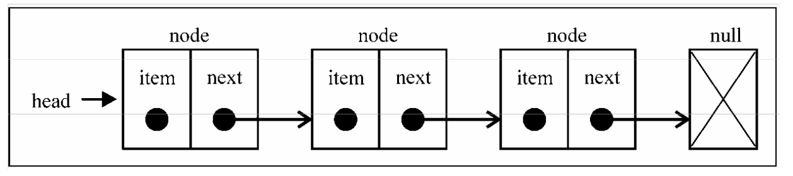
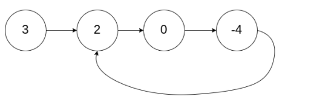

> 链表存储有序的元素集合，但不同于数组，链表中的元素在内存中并不是连续放置的。每个 元素由一个存储元素本身的节点和一个指向下一个元素的引用(也称指针或链接)组成。下图展示了链表的结构: 



> 相对于传统的数组，链表的一个好处在于，**添加或移除元素的时候不需要移动其他元素**。然而，链表需要使用指针，因此实现链表时需要额外注意。 数组的另一个细节是可以直接访问任何位置的任何元素，而要想访问链表中间的一个元素，需要从起点(表头)开始迭代列表直到找到所需的元素

## 普通链表

```javaScript
// 链表节点
class Node {
  constructor(element) {
    this.element = element;
    this.next = null;
  }
}

// 链表类
class LinkedList {
  constructor() {
    this.head = null;
    // 用来表示节点的长度；
    this.length = 0;
  }

  // 追加元素
  append(element) {
    let node = new Node(element);

    // 存储下一个数据的引用；
    let current = null;
    if (!this.head) {
      this.head = node;
    } else {
      current = this.head;
      while (current.next) {
        current = current.next;
      }
      // 追加到最后一个链表的next上；
      current.next = node;
    }
    this.length++;
  }

  // 任意位置插入元素
  insert (position, element) {
    if (position >= 0 && position <= this.length) {
      let node = new Node(element);
      let current = this.head;
      let previous = null;
      let index = 0;
      if (position === 0) {
        node.next = current;
        this.head = node;
      } else {
        while (index++ < position) {
          previous = current;
          current = current.next;
        }
        node.next = current;
        previous.next = node;
      }
      this.length++;
      return true
    }
    return false
  }

  // 移除指定位置元素
  removeAt(position) {
    if (position > -1 && position < this.length) {
      let current = this.head;
      let previous = null;
      let index = 0;
      if (position === 0) {
        this.head = current.next;
      } else {
        while(index++ < position) {
          previous = current;
          current = current.next;
        }
        previous.next = current.next;
      }
      this.length--;
      return current.element;
    }
    return null
  }

  // 寻找元素下标
  findIndex(element) {
    let current = this.head;
    let index = 0;
    while (current) {
      if (element === current.element) {
        return index;
      }
      index++;
      current = current.next;
    }
    return -1;
  }

  // 删除指定文档
  remove(element) {
    let index = this.findIndex(element);
    return this.removeAt(index);
  }

  isEmpty() {
    return !this.length;
  }

  size() {
    return this.length;
  }

  // 返回所有链表的值
  toString() {
    let current = this.head;
    let arr = [];
    while (current) {
      arr.push(current.element);
      current = current.next;
    }
    return arr;
  }
}

const ll = new LinkedList();

ll.append(2);
ll.append(4);
ll.append(6);
ll.append(8);
ll.append(10);
ll.removeAt(0);
console.log(ll.remove(10)) // 10
console.log(ll.findIndex(6)) // 1
console.log(ll.toString()); // [ 4, 6, 8 ]
```

[阅读原文](https://www.cnblogs.com/cc-freiheit/p/10591992.html)

遍历链表：

```javascript
function traversal(linkedList, callback) {
  let current = linkedList.head || {};
  callback(current.element)
  while (current.next) {
    current = current.next;
    callback(current.element)
  }
}
let sum = 0
traversal(ll, (value) => sum += value)
console.log(sum) // 18
```

## 环行链表

> 给定一个链表，判断链表中是否有环。如果链表中有某个节点，可以通过连续跟踪 next 指针再次到达，则链表中存在环。 如果链表中存在环，则返回 true 。 否则，返回 false 。
>
> 来源：力扣（LeetCode）
> 链接：https://leetcode-cn.com/problems/linked-list-cycle




```javaScript
const head = {
	value: 1,
	next: null
}

var hasCycle = function(head) {
  // 快慢指针 
    let fast = head
    let slow = head
    while(fast && fast.next){
        fast = fast.next.next
        slow = slow.next
        if(fast === slow){
            return true
        }
    }
    return false
};
```

> 解题思路：让xxx.next.next和xxx.next一直比较是否相等，如果相等则存在环；

