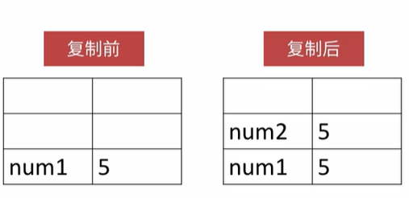
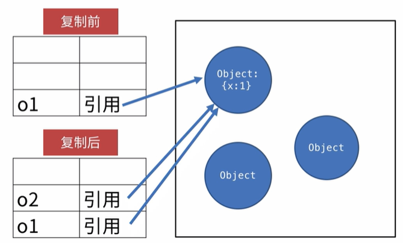

> 想复制某个变量的值，只要将它赋值给另外一个变量(或者是某个对象的属性)。复制原始类型和对象类型有所不同；

## 复制原始类型的值

> 复制原始类型的变量的值时，会将值拷贝一份，和原来的值是互相独立的；

1. 复制原始类型的值；

   ```javascript
   var num1 = 5;
   var num2 = num1;
   console.log(num2);// 5
   ```



## 复制对象类型的值

> 复制对象类型的变量的值时，会将储存在变量中的值拷贝一份，也就是它所指向对象在内存中的地址。复制操作结束后，它们俩指向了同一个对象；

```javaScript
var o1 = {x: 1};
var o2 = o1;
console.log(o1 === o2);// true
```



> 如果想复制对象的副本，则必须显示地复制对象的每个属性(如果对象是数组，就复制数组的每个元素)

```javascript
var o = { a: 1, b:2 };
var clone = {};
for (let p in o) {
  clone[p] = o[p]
}
console.log(clone);
```

::: tip

实际的情况较为复杂，因为属性的值可能为：数组，对象，正则，函数，需要根据实际情况做处理；

:::

