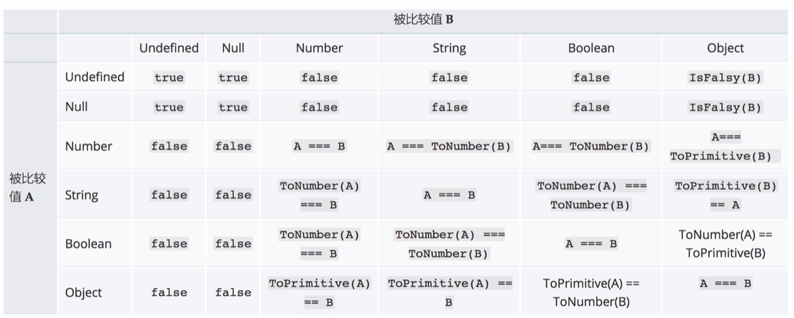
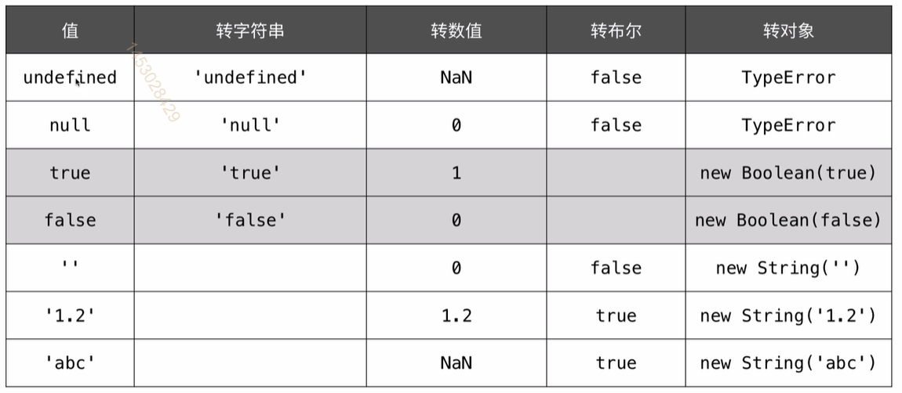
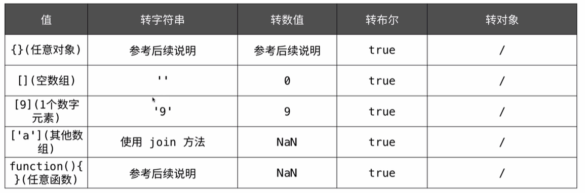

## 转字符串

> 转字符串经常出现在 + 运算中，并且其中有一个操作数不是数值类型；

```javascript
let s = 4 + 'px' + 5;
console.log(s); // 4px5
s = 123e-2 + 'a';
console.log(s); // 1.23a
```

## 转数值

> 经常出现在数学运算中，表示连接字符串的 + 运算符除外；

```javascript
let s = 'abc';
console.log(+s, -s); // NaN NaN
s = ' 123 ';
console.log(+s, -s); // 123 -123
```

## 转布尔

> 经常出现在if语句、逻辑运算中

```javaScript
let s = 'abc';
if (s) {
    console.log(s); // abc
}
console.log(!!s); // true
```

## 相等性(==)

> `==`运算符会有类型转换， `===`运算符不会进行类型转换;

```javaScript
alert(null == undefined); // 相等
alert('0' == 0); // 在比较之前，字符串转换成数值；
alert(0 == false); // 在比较之前，布尔转换成数值；
alert('0' == false); // 在比较之前，字符串和布尔都转换成数值；
```

**MDN摘录；**



**js权威指南摘录**





## 显示类型转换

> 显示类型转换，可以使代码变得清晰易读，推荐在实际编码使用。最简单的方法就是使用Boolean()、Number()、String()、Object()函数；

```javascript
Number('123'); // 123
String(123); // '123'
Boolean([]); // true
Object(3) // 等价 new Number(3)
```

### 转字符串；

> 还可以使用toString()方法，它的执行结果通常和String()方法一致、Number类型的toStrnig()方法还支持第二个参数指定要转换的进制；

```javascript
(null).toString(); // Error
(undefined).toString(); // Error
(123).toStrig(); // '123'
(false).toString(); // 'false'

let n = 20;
alert(n.toString(2));// 转成二进制 ‘10100’
alert(n.toString(8)); // 转成八进制 ‘24’
alert(n.toString(16)); // 转成十六进制 ‘14’

```

::: tip

Number类型转换为字符串还有3个方法：toFixed()、toExponential()和toPrecision()。

:::

### 转数值

> 字符串类型转换为数值还有两个全局方法：parseInt()和parseFloat()。

