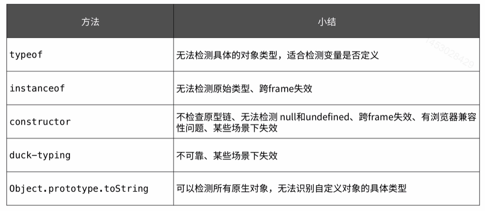

## `typeof`操作符

> typeof:操作符可以检测变量的数据类型

```javascript
let a1;
console.log(typeof a1); // undefined
let a2 = true;
console.log(typeof a2); // Boolean
let a3 = 123;
console.log(typeof a3); // number
let a4 = 'abc';
console.log(typeof a4); // string
let a5 = function() {};
console.log(typeof a5); // function
let a6 = {} | [] | null;
console.log(typeof a6); // object
let a7 = Symbol();
console.log(typeof a7); // symbol
```

### typeof判断对象类型时的局限性

```javaScript
let d = new Date();
let a = [];
let n = null;
let r = /\d+/;
console.log(typeof d); // object
console.log(typeof a); // object
console.log(typeof n); // object
console.log(typeof r); // object
```

## `instanceof`操作符

> 判断变量是否是给定类的实例。

```javascript
let d = new Date();
let a = [];
let n = null;
let r = /\d+/;
console.log(d instanceof Date); // true
console.log(a instanceof Array); // true
console.log(n instanceof Object); // false
console.log(r instanceof RegExp); // true

function Foo() {};
function Bar() {};
Bar.prototype = new Foo();
console.log(new Bar() instanceof Bar); // true
console.log(new Bar() instanceof Foo); // true

let a = [];
console.log(a instanceof Array); // true
console.log(a instanceof Object); // true

console.log('123' instanceof String); // false
console.log(123 instanceof Number); // false
```

## `constructor`

> 可以检测变量的构造函数

```javascript
console.log(({ x: 1 }).constructor.name); // Object
console.log(([]).constructor.name); // Array
console.log((new Date()).constructor.name); // Date
console.log(('').constructor.name); // String
console.log((true).constructor.name); // Boolean
console.log((12).constructor.name); // Number
console.log((null).constructor.name); // TypeError
console.log((undefined).constructor.name); // TypeError
```

### 失效情况；

1. 有原型时失效

   ```javascript
   function Foo() {};
   Foo.prototype = {
     	methhod1: function() {}
   };
   console.log(new Foo().constructor.name); // Object
   ```

2. 多重继承时失效

   ```javascript
   function a() {};
   function b() {};
   b.prototype = new a();
   let f = new b();
   console.log(f.constructor === b);// false
   console.log(f.constructor === a); // true
   ```

## `instanceof`和`constructor`不可跨frame

> 需要在同个frame中才有效。

```javascript
let iframe = document.createElement('iframe');
document.body.apppendChild(iframe);
xArray = window.frames[window.frames.length - 1].Array;
let arr = new xArray(1, 2, 3);
console.log(arr instanceof Array); // false
console.log(arr.constructor === Array); // false
```

## 动态类型检测

> 只检测特定的属性，如果存在，则认为是该类型；

```javascript
function isArray (object) {
  return object != null && type object === 'object' && 'splice' in object && 'join' in object;
}
function isArray (arr) {
  return !!arr && arr.constructor == Array;
}
```


## `Object.prototype.toString.call(obj)`

> 可以检测对象的内部属性[[Class]]

```javascript
function getType(o) {
  return Object.prototype.toString.call(o);
}
let d = new Date();
let a = [];
let r = /\d+/;
console.log(getType(d)); // [object Date]
console.log(getType(a)); // [object Array]
console.log(getType(c)); // [object RegExp]

// 获取 [object Date] 后面的值 Date
function getType(o) {
  return Object.prototype.toString.call(o).slice(8, -1);
}

function Foo() {};
console.log(getType(new Foo())); // Object
```

## 总结

