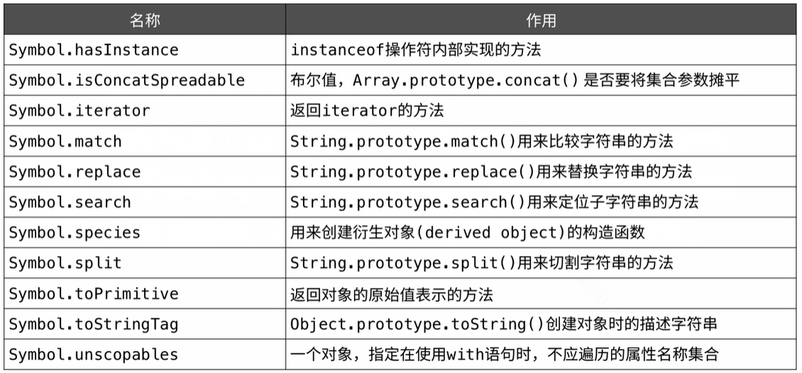

> 想给他人创建的对象添加属性，不管该属性取什么名字，理论上都存在冲突的可能性。而使用Symbol作为对象的属性名就没有这个顾虑。因为它的值是唯一的。这也意味着给对象添加私有属性称为了可能。

**例1：**

```javascript
let name = Symbol();
let person = {};
person[name] = 'john';
console.log(person[name]); // 'john'
console.log(name); // Symbol()

let name = Symbol('my name');
let person = {};
person[name] = 'john';
console.log(person[name]);// 'john';
console.log(name); // Symbol(my name)
```

## 共享Symbol

1. 有时需要在不同的地方使用同一个symbol，用来当作不同对象的唯一标识符，可以使用Symbol.for()方法完成这个功能；

   ```javascript
   let uid = Symbol.for('uid');
   let object = {
     [uid]: "12345"
   };
   console.log(object[uid]);// "12345"
   console.log(uid); // Symbol(uid);
   let uid2 = Symbol.for('uid');
   console.log(uid === uid2);  true
   console.log(object[uid2]); // "12345"
   console.log(uid2); // Symbol(uid);
   ```

2. 可以使用Symbol.keyFor()方法查找和某个Symbol关联的key值；

   ```javascript
   let uid = Symbol.for("uid");
   console.log(Symbol.keyFor(uid)); // "uid"
   
   let uid2 = Symbol.for("uid");
   console.log(Symbol.keyFor(uid2)); // "uid"
   
   let uid3 = Symbol("uid");
   console.log(Symbol.keyFor(uid3)); // undefined
   ```

3. symbol不能转换成字符串或者数值，转换成布尔时是true；

   ```javascript
   let uid = Symbol.for("uid");
   // 调用 String(uid),该方法会调用uid.toString()方法
   console.log(uid); // Symbol(uid)
   // TypeError: Cannot convert a Symbol value to a string
   console.log(uid + '');
   // TypeError: Cannot convert a Symbol value to a number
   console.log(uid / 1);
   // 可以转换成布尔；
   console.log(!!uid);
   ```

## 查找对象的Symbol属性

> 可以使用Object.getOwnPropertySymbols()方法查找对象的symbol属性；

```javascript
let id = Symbol.for('id');
let object = {
  [id]: "123"
};
let symbols = object.getOwnPropertySymbols(object);
console.log(symbols.length); // 1
console.log(symbols[0]); // Symbol(id)
consloe.log(object[symbols[0]]); // "123"
```

## es6的内置symbol

> es6内置了11个symbol。叫well-known-symbol,它们都是Symbol函数的属性，指向语言内部使用的方法或属性。通过它们可以更改语言的原生行为；



1. Symbol.hasInstance

   > 每个函数都有Symbol.hasInstance方法，用来判断给定的对象是否是该函数的实例，它是函数原型上面的方法。

   ```javascript
   // instanceof 不能判段简单数据类型
   let a = 12; 
   console.log(a instanceof Number); // false
   console.log(Number[Symbol.hasIntance](a)); // false
   
   // 添加一个属性就可以了
   Object.defineProperty(Number, Symbol.hasInstance, {
     value: function(n) {
       return typeof n === 'number';
     }
   })
   console.log(a instanceof Number);// true
   ```

2. Symbol.isConcatSpereadble;

   > concat()方法用于合并两个或多个数组，默认数组元素是展开的，他的值是undefined。如果不想展开，则将它的值设置为false。

   ```javascript
   let a = ['a', 'b'];
   let n = [1, 2];
   console.log(a.concat(n, 3)); // ['a', 'b', 1, 2, 3]
   console.log(a[Symbol.inConcatSpreadble]); // undefined
   n[Symbol.isConcatSpreadabel] = false;
   console.log(a.concat(n, 3)); // ['a', 'b', [1, 2], 3]
   ```

