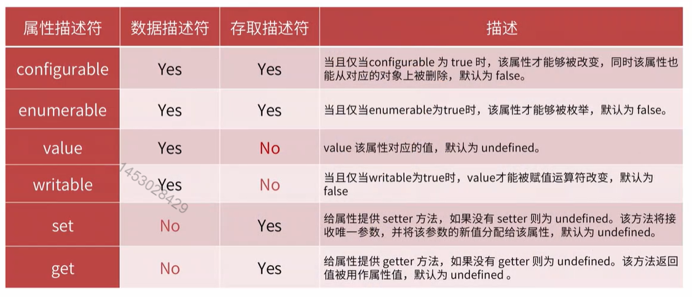

> 

## 原型和原型链

### 原型`prototype`

#### 获取对象的原型属性`Object.getPrototypeOf(someObj)`

#### 对象的原型属性`__proto__`

#### 设置对象的原型属性`Object.setPrototypeOf(obj, prototype)`

#### 检测是否为某个对象的原型`someObj.isPrototypeOf(anotherObj)`

> 对象中的super关键字指向该对象的原型

### 原型链

## 原型对操作对象属性的影响

## 注意事项

1. 查询属性会遍历原型链，有一定的性能问题。要注意代码中的原型链的长度，并在必要时将其分解，以避免潜在的性能问题；
2. 原型上的属性被所有实例共享，如果属性值是对象类型，则某个实例更改后会影响其他实例，这往往不是实际所期望的效果；
3. 不要想着去扩展Object.prototype或其他内置原型，影响面太大，出错的可能性非常高；