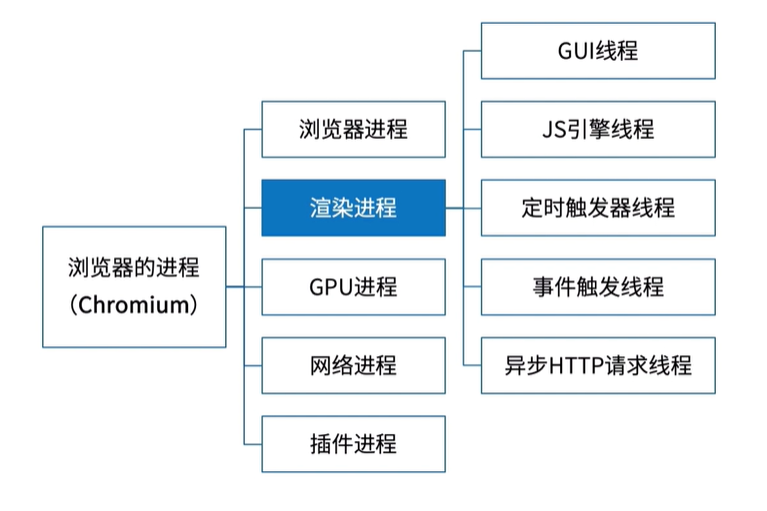

> 如果你使用过js做开发的话，那么你也一定知道，js是一门单线程语言。

**浏览器是多进程和多线程的，这里简单说下渲染进程**

1. GUI线程：主要负责渲染页面。解析css 、js、构建DOM树和渲染树。
2. js引擎线程：主要负责解析和执行js程序，比较著名的js引擎是v8。v8引擎就是单线程的。
   - 与GUI线程互斥。
   - js加载时间过长会影响GUI的渲染。
3. 定时器触发线程：`setTimeout和setInterval`，定时任务结束后会通知事件触发线程，往任务队列里面添加事件；
4. 事件触发线程：将满足触发条件的事件放入任务队列；
5. 异步HTTP请求线程：XHR所在线程；

## **为什么是单线程**：

> 其实，JavaScript的单线程，与它的用途是有很大关系，我们都知道，JavaScript作为浏览器的脚本语言，主要用来实现与用户的交互，利用JavaScript，我们可以实现对DOM的各种各样的操作，如果JavaScript是多线程的话，一个线程在一个DOM节点中增加内容，另一个线程要删除这个DOM节点，那么这个DOM节点究竟是要增加内容还是删除呢？这会带来很复杂的同步问题，因此，JavaScript是单线程的；为了利用多核CPU的计算能力，HTML5提出Web Worker标准，允许JavaScript脚本创建多个线程，但是子线程完全受主线程控制，且不得操作DOM。所以，这个新标准并没有改变JavaScript单线程的本质。

## 异步场景；

1. 定时器；
2. 网络请求；
3. 事件绑定；
4. ES6 promise