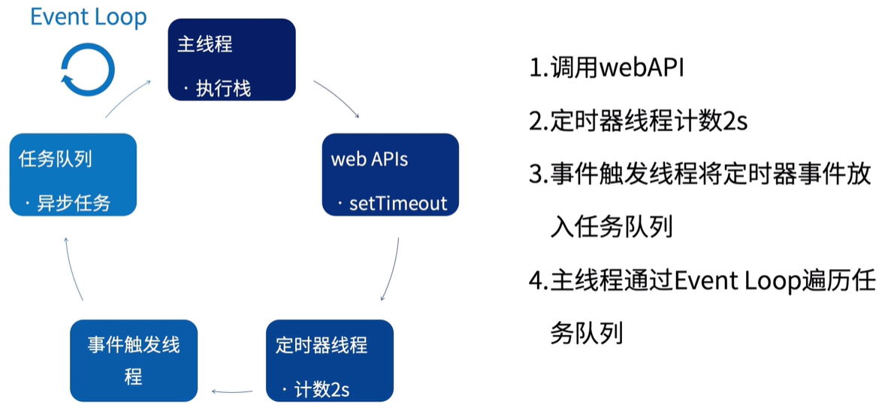
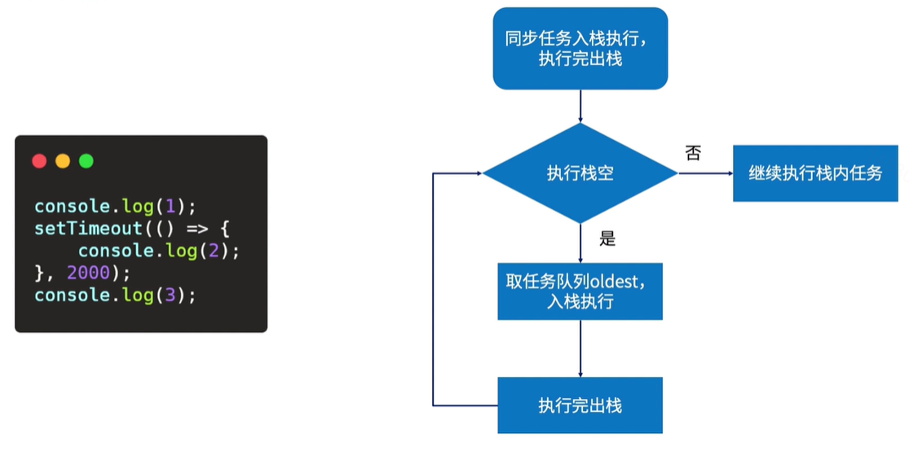

## 执行过程





## 存在的问题；

1. 定时任务可能不会按时执行；

   ```javascript
   const test = () => {
     let t = +new Date();
     white (true) {
       if (+new Date() - t >= 5000) {
         break;
       }
     }
   }
   setTimeout(() => {
     console.log(2);
   })
   test();
   
   // 5秒后才会打印 2
   ```

   > 以上代码可以看出，如果同步任务耗时很久的话，定时器并不会按我们的预期来执行；

2. 定时器嵌套5次之后最小间隔不能低于4ms；

## 应用场景；

1. 防抖；
2. 节流；
3. 倒计时；
4. 动画；

