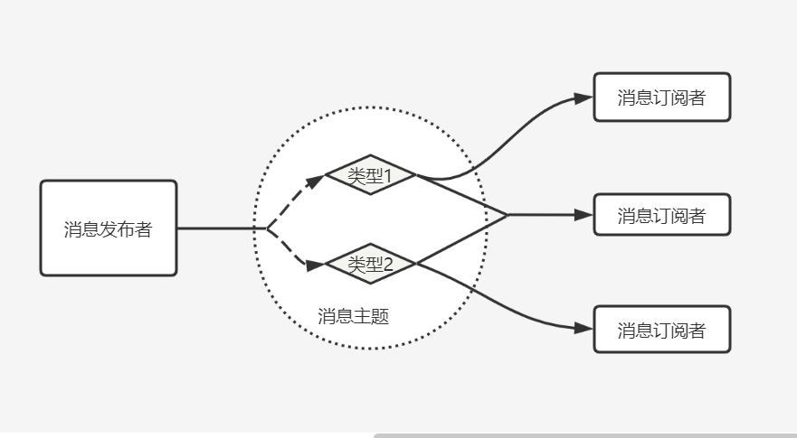

> 在[软件架构](https://baike.baidu.com/item/软件架构)中，**发布订阅**是一种[消息](https://baike.baidu.com/item/消息)[范式](https://baike.baidu.com/item/范式)，消息的发送者（称为发布者）不会将消息直接发送给特定的接收者（称为订阅者）。而是**将发布的消息分为不同的类别**，无需了解哪些订阅者（如果有的话）可能存在。同样的，**订阅者可以表达对一个或多个类别的兴趣，只接收感兴趣的消息**，无需了解哪些发布者（如果有的话）存在。



优点：

- 低耦合；
- 灵活；

缺点：

- 无法确保消息被触发或者触发几次；

## 实现

> 首先我们定义一个 发布订阅的 类；

```javascript
class PubSub {
  constructor() {
    this.events = {};
  }

  // 订阅者
  $on(eventNames, callback) {
    if (eventNames instanceof Array) {
      for (let i = 0; i < eventNames.length; i++) {
        if (eventNames[i] in this.events) {
          this.events[eventNames[i]].push(callback);
        } else {
          this.events[eventNames[i]] = [callback];
        }
      }
    } else {
      if (eventNames in this.events) {
        this.events[eventNames].push(callback);
      } else {
        this.events[eventNames] = [callback];
      }
    }
  }

  // 发布者
  $emit(eventNames, data) {
    if (eventNames instanceof Array) {
      for (let i = 0; i < eventNames.length; i++) {
        if (eventNames[i] in this.events) {
          this.events[eventNames[i]].forEach(item => {
            item.call(this, data)
          })
        } else {
          console.log('事件未注册：%o', eventNames[i])
        }
      }
    } else {
      if (eventNames in this.events) {
        this.events[eventNames].forEach(item => {
          item.apply(this,data)
        })
      } else {
        console.log('事件未注册：%o', eventNames)
      }
    }
  }

  // 取消订阅
  $unSub(names, callback) {
    if (names instanceof Array) {
      for (let i = 0; i < names.length; i++) {
        if (names[i] in this.events) {
          const callbacks = this.events[names[i]].filters(item => item !== callback);
          if (callbacks.length) {
            this.events[names[i]] = callbacks;
          } else {
            delete this.events[names[i]]
          }
        }
      }
    } else {
      if (names in this.events) {
        const callbacks = this.events[names].filter(item => item !== callback);
        if (callbacks.length) {
          this.events[names] = callbacks;
        } else {
          delete this.events[names]
          console.log('事件已删除：%o', names)
        }
      }
    }
  }
}

module.exports = PubSub;
```

### **订阅单个消息**

```javascript
// 订阅单个消息；
const PubSub = require('./PubSub.js');
const pubSub = new PubSub();
function event_1(res) {
  console.log('我执行了：%o', res)
}

pubSub.$on('event_1', event_1);

pubSub.$emit('event_1', '今天是周末');

pubSub.$unSub('event_1', event_1);

pubSub.$emit('event_1', '今天周末');

// 我执行了：'今天是周末'
// 事件已删除：'event_1'
// 事件未注册：'event_1'
```

### **订阅多个消息**

```javascript
const PubSub = require('./PubSub.js');
const pubSub = new PubSub();
function event_1(res) {
  console.log('event_1 我执行了：%o', res)
}

function event_2(res) {
  console.log('event_2 我执行了：%o', res)
}

pubSub.$on(['event_1', 'event_2'], event_1);
pubSub.$on('event_2' , event_2);
pubSub.$emit(['event_1', 'event_2'], '今天是周一');
console.log('----------')
pubSub.$unSub('event_1', event_1);
console.log('----------')
pubSub.$emit(['event_2'], '今天是周一');
pubSub.$unSub('event_2', event_2);
console.log('----------')
pubSub.$emit(['event_2'], '今天是周一');

// event_1 我执行了：'今天是周一'
// event_1 我执行了：'今天是周一'
// event_2 我执行了：'今天是周一'
// ----------
// 事件已删除：'event_1'
// ----------
// event_1 我执行了：'今天是周一'
// event_2 我执行了：'今天是周一'
// ----------
// event_1 我执行了：'今天是周一'
```

::: tip

上面的`PubSup`类中，是多对多的关系；发布者可以同时发布多条消息，同时订阅者，也可以根据自己的"兴趣"订阅多个类别；

:::

