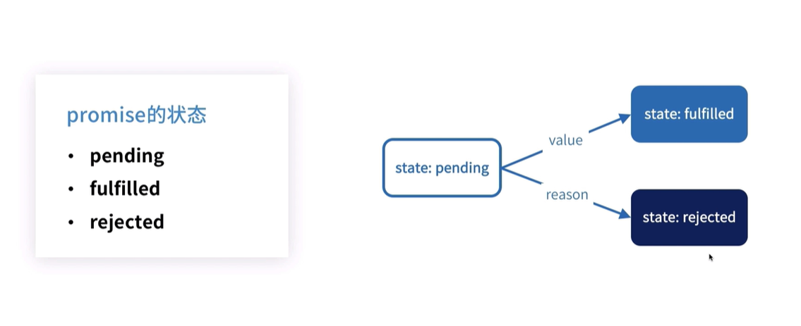
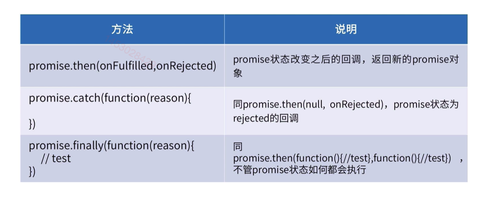
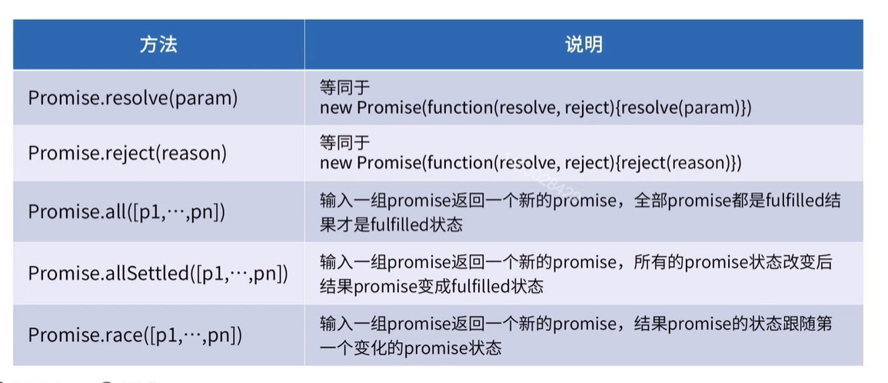

> **Promise** 对象用于表示一个异步操作的最终完成 (或失败)及其结果值

## promise是什么

- 主要用于异步操作；
- 可以将异步操作队列化，按照期望的顺序执行，返回符合预期的结果；
- 可以在对象之间传递和操作promise，帮助我们处理队列；
- Promise代表了未来将要发生的事件，用来传递异步操作的消息。

## 特点

1. 对象的状态不受外界影响。Promise 对象代表一个异步操作，
2. 只有异步操作的结果，可以决定当前是哪一种状态，任何其他操作都无法改变这个状态。
3. 一旦状态改变，就不会再变，任何时候都可以得到这个结果。
4. Promise 对象的状态改变，只有两种可能：从 Pending 变为 Resolved 和从 Pending 变为 Rejected。
5. 只要这两种情况发生，状态就凝固了，不会再变了，会一直保持这个结果。
6. 一个 `Promise` 必然处于以下几种状态之一：
   - *待定（pending）*: 初始状态，既没有被兑现，也没有被拒绝。
   - *已兑现（fulfilled）*: 意味着操作成功完成。
   - *已拒绝（rejected）*: 意味着操作失败。



## 优点；

- 有了 Promise 对象，就可以将异步操作以同步操作的流程表达出来，避免了层层嵌套的回调函数。
- Promise 对象提供统一的接口，使得控制异步操作更加容易。
- `Promise.prototype.then` 和 `Promise.prototype.catch` 方法返回的是 promise， 所以它们可以被链式调用。

## 缺点

- 无法取消 Promise，一旦新建它就会立即执行，无法中途取消。
- ;如果不设置回调函数，Promise 内部抛出的错误，不会反应到外部。
- 当处于 Pending 状态时，无法得知目前进展到哪一个阶段（刚刚开始还是即将完成）。

## 创建`Promise `

> 创建一个 promise 对象、可以使用 new 调用 Promise 的构造器来进行实例化。

```javascript
const promise = new Promise(function(resolve, reject) {
  if (/* 异步操作成功 */){
    resolve(value);
  } else {
    reject(error);
  }
});

promise.then(function(value) {
  // 异步操作成功时的回调
  }, function(error) {
  // 异步操作失败时的回调
  });

```

**参数说明；**

1. `Promise`构造函数接受一个**函数**作为参数，该函数的两个**参数**分别是`resolve`和`reject`。它们是两个函数；
   - resolve：在异步操作成功时调用；
   - reject：在异步操作失败时调用，并将异步操作报出的错误，作为参数传递出去

::: tip 

new Promise时是同步的执行的，表示你要进行异步操作，then方法和catch方法是异步的；

:::

**then方法**

- promise1.then(onFulfilled, onRejected);
- 参数；
  - onFulfilled在promise完成后(resolve)被调用，
  - onRejected在promise被拒绝执行后(reject)调用；
- 返回值是promise;

**实例方法**



**静态方法**



::: warning 

1. then、catch返回的promise是最新的promise，不是原来的promise；
2. Promise对象的错误会冒泡，直到被捕获为止，错误会被下一个catch语句捕获；
3. 不要忘记catch捕获错误；
4. then方法中使用return;
5. **不要把promise写成嵌套**；因为promise就是解决回调地狱的；

:::

## demo

> 需求：2秒之后亮一次灯，再过2秒亮一次灯，在过1秒亮一次黄灯，用promise实现多次交替亮灯的效果；

分析

- 多少秒后亮某个颜色的灯；
- 顺序亮一批灯；
- 循环顺序亮一批灯；

```html
<!DOCTYPE html>
<html lang="en">
<head>
  <meta charset="UTF-8">
  <meta name="viewport" content="width=device-width, initial-scale=1.0">
  <meta http-equiv="X-UA-Compatible" content="ie=edge">
  <title>Title</title>
  <style>
    .light {
        width: 100px;
        height: 100px;
        margin: 0 auto;
    }
  </style>
</head>
<body>
<div class="light"></div>
</body>
<script>
  const el = document.getElementsByClassName('light');
  const list = [
    { color: 'red', second: 3 },
    { color: 'green', second: 2 },
    { color: 'yellow', second: 1 },
  ];
  function light(color, second) {
    return new Promise(((resolve, reject) => {
      setTimeout(() => {
        console.log(color)
        el[0].style.background = color;
        resolve();
      }, second * 1000)
    }))
  }

  function orderLights(list) {
    // 关键位置；
    let promise = Promise.resolve();
    list.forEach((item) => {
      promise = promise.then(() => {
        return light(item.color, item.second);
      })
    })
    promise.then(() => {
      orderLights(list);
    })
  }
  orderLights(list)
</script>
</html>
```

