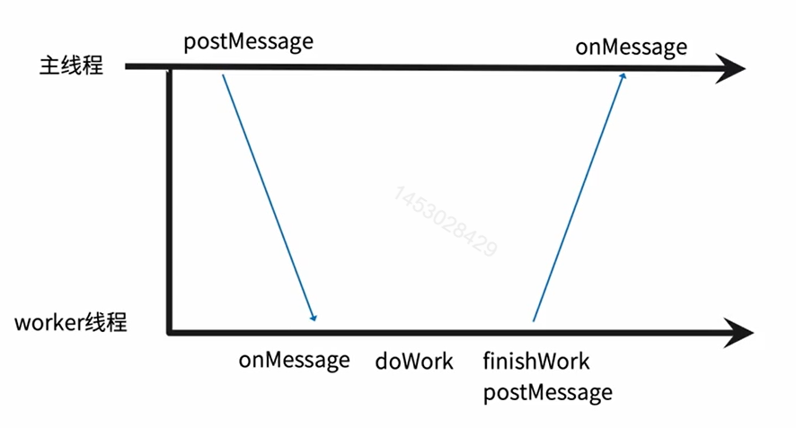

> web worker 是运行在后台的 JavaScript，独立于其他脚本，不会影响页面的性能。当在 HTML 页面中执行脚本时，页面的状态是不可响应的，直到脚本已完成。您可以继续做任何愿意做的事情：点击、选取内容等等，而此时 web worker 在后台运行。

## web worker是什么

> web worker 是运行在后台的 JavaScript。

- 一个Web API 提供了一个js可以运行的环境。
- web应用程序可以在独立于主线程的后台线程中，运行一个脚本操作。

## 解决的痛点是什么

js执行复杂运算时候阻塞了页面渲染；

## web worker限制

- 与主线程脚本同源；
- 与主线程的上下文不同；
  - 无法操作DOM；
  - 不能执行alert；
- 不能读取本地文件；

## 执行过程



> 如上图所示：主线程有一个`postMessage`方法用于发送消息，worker线程有`onMessage`方法用于监听消息，同时worker线程有一个`postMessage`方法，用于向主线程说明消息已经收到，然后主线程接收到结果就可以做自己的逻辑了。

## 外部引用web worker文件

**创建 web worker 文件:**

```javascript
// worker.js`:
// 检测浏览器是否支持Worker：
if (typeof(Worker) !== 'undefined') {
    function fibonacci(n) {
        if (n === 1 || n === 2) {
            return 1;
        }
        return fibonacci(n-2) + fibonacci(n-1);
    }
    // 发送消息
    postMessage(fibonacci(40));
    
    // 监听worker线程传过来的消息
    onmessage = function(e) {
        console.log(e, 'worker');
    }
}
```

**创建 Web Worker 对象:** 检测是否存在 worker，如果不存在，创建一个新的 web worker 对象，然后运行`worker.js` 中的代码

```javascript
let worker;
if (typeof(worker) === 'undefined') {
    // 创建worker
    worker = new Worker('./worker.js');

    // // 监听主线程传过来的消息
    worker.onmessage = function (e) {
        console.log('worker通知的message', e);
        worker.postMessage('message收到了');
    }
}
```

**运行：**

```html
<!DOCTYPE html>
<html lang="en">
<head>
  <meta charset="UTF-8">
  <meta name="viewport" content="width=device-width, initial-scale=1.0">
  <meta http-equiv="X-UA-Compatible" content="ie=edge">
  <title>Document</title>
</head>
<body></body>
<script src="./webworker.js"></script>
</html>
```

> fibonacci(40)运行的结果在 **onmessage**事件对象的 data 中；

::: warning 

由于 web worker 位于外部文件中，它们无法访问下列 JavaScript 对象：

- window 对象
- document 对象
- parent 对象

:::

## 嵌入式worker

```html
<!DOCTYPE html>
<html lang="en">

<head>
  <meta charset="UTF-8">
  <meta name="viewport" content="width=device-width, initial-scale=1.0">
  <meta http-equiv="X-UA-Compatible" content="ie=edge">
  <title>Document</title>
</head>

<script id="worker" type="javascript/worker">
  function fibonacci(n) {
      if (n === 1 || n === 2) {
          return 1;
      }
      return fibonacci(n-2) + fibonacci(n-1);
  }
  postMessage(fibonacci(40));
</script>

<script>
  // 读取script标签中的代码字符串；
  const workerScript = document.querySelector('#worker').textContent;
  // 转化为blob
  const blob = new Blob([workerScript], { type: "text/javascript" });
  // 创建worker对象；
  const worker = new Worker(window.URL.createObjectURL(blob));
  // 监听消息通知
  worker.onmessage = function(e) {
    console.log('worker通知message', e);
  }
</script>
</html>
```

> script标签的type应该是：`javascript/worker`

## 使用场景

- 复杂运算；
- 渲染优化；
- 流媒体数据处理；
- 性能考虑，web workers主要用于更耗费 CPU 资源的任务。

