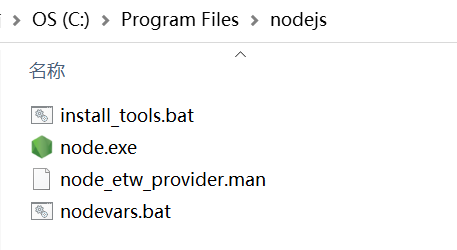

> npm是Nodejs的官方包管理工具，可以安装、更新、卸载npm包。新版本的nodejs内置了Npm所以不需要我们在另外安装。这里主要说一下，单独安装npm的情况。

::: tip

注意Npm的使用需要nodejs支持，所以请确定你已经安装了nodejs。

:::

## 演示1

> 这里需要注意一下，因为Nodejs和npm的版本有对应关系，如果版本不对应或差异太大，则会安装不成功；

1. Nodejs版本：`nodejs@0.12.18`

2. git克隆的npm版本为：`npm@2.1.2`

3. 进入cli目录，执行以下命令；

   ```shell
   C:\Users\wangy\Desktop\34\cli>node -v
   v0.12.18
   
   C:\Users\wangy\Desktop\34\cli>node cli.js install npm@2.1.2 -g
   C:\Program Files (x86)\nodejs\npm -> C:\Program Files (x86)\nodejs\node_modules\npm\bin\npm-cli.js
   npm@2.1.2 C:\Program Files (x86)\nodejs\node_modules\npm
   
   C:\Users\wangy\Desktop\34\cli>
   ```

   > 此时你已经安装成功，你可以在`C:\Program Files (x86)\nodejs`文件中查看；当然你也可以不全局安装。


```sh
# 此时你便可以全局使用
PS C:\Users\wangy\Desktop> node -v
v0.12.18
PS C:\Users\wangy\Desktop> npm -v
2.1.2
```

::: tip

注意：nodejs@0.12.18版本本身内置Npm，所以你不需要下载，以上演示是在删除了`C:\Program Files (x86)\nodejs\node_modules`下的**npm**和`C:\Program Files (x86)\nodejs`文件中的**npm.xx**后，做的操作。

:::


## 演示2

> 这里下载的Nodejs是14.17.3版本，实际上是附带Npm的，但是在安装过程中时可以选择是个否安装Npm，这里我为了演示就取消了npm的安装。

1. Nodejs版本：`nodejs@v14.17.3`

   

   ```sh
   # 查看node和npm版本
   PS C:\Users\wangy\Desktop\34\cli> node -v
   v14.17.3
   PS C:\Users\wangy\Desktop\34\cli> npm -v
   npm : 无法将“npm”项识别为 cmdlet、函数、脚本文件或可运行程序的名称。请检查名称的拼写，如果包括路径，请确保路径正确，然后再试一次。
   所在位置 行:1 字符: 1
   + npm -v
   + ~~~
       + CategoryInfo          : ObjectNotFound: (npm:String) [], CommandNotFoundException
       + FullyQualifiedErrorId : CommandNotFoundException
   ```

2. git克隆的npm版本为：`npm@7.19.1`

3. 进入cli目录，执行以下命令；

   ```sh
   # node .\lib\npm.js install npm -g 和 node .\cli install npm -g 等价
   PS C:\Users\wangy\Desktop\34\cli> node .\lib\npm.js install npm -g
   C:\Program Files\nodejs\npx -> C:\Program Files\nodejs\node_modules\npm\bin\npx-cli.js
   C:\Program Files\nodejs\npm -> C:\Program Files\nodejs\node_modules\npm\bin\npm-cli.js
   + npm@7.19.1
   added 256 packages from 146 contributors in 11.689s
   PS C:\Users\wangy\Desktop\34\cli> npm -v
   7.19.1
   ```


## 注意

1. 在演示1中：cli根目录中有cli.js，但是在演示2中没有这个文件。我们可以通过查看`package.json`文件中的`main`字段来确定我们需要执行的文件`"main": "./lib/npm.js",`;
2. 通过这种方式安装的nodejs，全局安装的npm包会存在两个地方：
   - 在nodejs的安装目录中的`node_modules`文件夹中。
   - 不在nodejs的安装目录中，nodejs的安装目录中只有全局安装的npm包，不含有其他包。其他包在`C:\Users\wangy\AppData\Roaming\npm`中。同时npm缓存文件也在../Roaming/文件下。

## Nodejs与npm的版本对应关系

https://nodejs.org/zh-cn/download/releases/

