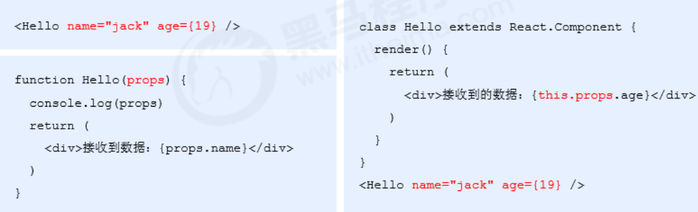
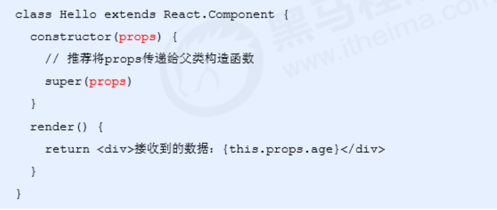
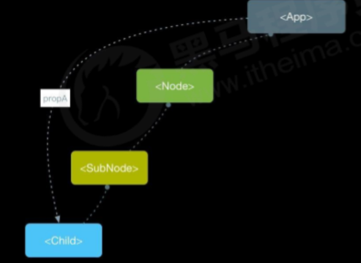

## `React`的特点；

### 1、声明式；

- 可以声明式的在`js`中写`html`结构；

> 注意: `react`是用很像 `js` 的语言写标签;

```jsx
const jsx = <div className="app"><h1>Hello React! 动态变化数据：{count}</h1> </div>
```

### 2、基于组件；

- 组件是`React`最重要的部分；
- 组合、复用多个组件，可以实现完整的页面功能;

### 3、学习一次，随处可用；

- 使用`React`可以开发 Web 应用、移动端原生应用（react-native）、 VR（虚拟现实）应用（react 360）

## `React`的基本使用；

### 1、安装；

```
1、安装命令： $ npm i react react-dom
2、react 包是核心，提供创建元素、组件等功能 ；
3、react-dom 包提供 DOM 相关功能等；
```

### 2、使用；

1. 引入`react `和`react-dom`两个 js 文件;

```html
<script src="./node_modules/react/umd/react.development.js"></script> 
<script src="./node_modules/react-dom/umd/react-dom.development.js"></script> 
```

2.	创建`React`元素；
3.	渲染React元素到页面中;

```Js
// 指定要渲染的范围；
<div id="root"></div>

<script> 
    // React.createElement()方法用于创建react元素；
    // - 返回值：React元素
    // - 第一个参数：要创建的React元素名称
    // - 第二个参数：该React元素的属性
    // - 第三个及其以后的参数：该React元素的子节点，节点也可以是标签
    
    const h1 = React.createElement('h1', null, '晚上好哈哈哈哈')
    const span = React.createElement('span', null, '李逵')
    const p = React.createElement('p', { className: 'so' }, '李白', span)
    const div = React.createElement('div', null, '我是div', p, h1)

    // ReactDOM.render() 说明
    // - 返回值:React元素
    // - 第一个参数：要渲染的React元素
    // - 第二个参数：DOM对象，用于指定渲染到页面中的位置
    ReactDOM.render(div,document.getElementById('root'))
</script> 

```

## `React`事件处理；

### 1、事件绑定；

1. 语法：on + 事件名称 = { 事件处理程序 }，比如：`onClick={() => {}} `
2. 注意：React 事件采用小驼峰命名法，比如：`onMouseEnter`、`onFocus`

```jsx
// 类组件事件绑定；
import React from 'react'

class Index extends React.Component{
  OnLick (event) {
    // 阻止默认行为
    event.preventDefault()
    // 阻止事件冒泡
    event.stopPropagation()
    alert(1)
  }
  render() {
    return (
      <div>
        <button onClick={ this.OnLick }>按钮</button>
        <button onClick={ () => { alert(3) } }>按钮</button>
        <Fn></Fn>
      </div>
    )
  }
}

// 函数组件事件绑定；
function Fn() {
  var OnLick = function (e) {
      
    alert(8)
    console.log(e) // 事件对象
  }
  return (
    <div>
      <button onClick={ OnLick }>函数组件</button>
    </div>
  )
}

export default Index
```

### 2、事件对象；

1. 可以通过事件处理程序的默认参数获取到事件对象。

2. React 中的事件对象叫做：合成事件（对象）。

3. 合成事件：兼容所有浏览器，无需担心跨浏览器兼容性问题。

   ```jsx
   function handleClick(e) { 
     e.preventDefault() 
     console.log('事件对象', e) 
   } 
   <a href="http://www.baidu.com" onClick={handleClick}>点我，不会跳转页面</a> 
   ```

### 3、`this`指向问题；

1. 利用`bind`修改`this`指向组件实例。

   ```jsx
   // 类组件事件绑定；
   import React from 'react'
   
   class Index extends React.Component{
       
     constructor() {
       super();
       // 使用bind方法绑定this
       this.OnLick = this.OnLick.bind(this);
     }
     // 不改变this指向，不能以 this.num 的方式拿到 num 的值；
     num = 10;
   
     OnLick (event) {
       console.log(this.num)
     }
     render() {
       return (
         <div>
           <button onClick={ this.OnLick }>按钮</button>
         </div>
       )
     }
   }
   export default Index
   ```

2. 利用箭头函数方法**(推荐)**;

   > 注意：该语法是实验性语法，但是，由于babel的存在可以直接使用 

   ```jsx
   class Index extends React.Component{
     // 使用es6 箭头函数绑定this
     OnLick = (event) => {
       console.log(this.num)
     }
     render() {
       return (
         <div>
           <button onClick={ this.OnLick }>按钮</button>
         </div>
       )
     }
   }
   export default Index
   ```

### 4、状态组件；

#### 4.1 有状态组件；

> 类组件class->有状态`（state）`组件;

```jsx
/**
 * 定义类组件状态
 * 语法：state
 * 1. constructor()中
 * 2. 类属性形式定义
 */
class Index extends Component {
    
  //constructor() {
  //  super();
  //  初始化 state 
  //  this.state = {
  //    num: 123
  //  }
  //}
    
  // 初始化 state
  state = {
    name: '李晨',
  }
    
  render() {
    return (
      <div>
     // <p>{this.state.num}</p>
        <p>{this.state.name}</p>
      </div>
    )
  }
}

export default Index;
```

#### 4.2 无状态组件；

- 函数组件->无状态组件

#### 4.1 两者的区别；

- 函数组件又叫做无状态组件，类组件又叫做有状态组件 
- 状态（state）即数据，某个时刻的值  
- 类组件有自己的状态，负责更新 UI，让页面“动” 起来 
- 函数组件没有自己的状态，只负责数据展示（静）
- 比如计数器案例中，点击按钮让数值加 1 。0 和 1 就是不同时刻的状态，而由 0 变为 1 就表示状态发生了变 化。状态变化后，UI 也要相应的更新。React 中想要实现该功能，就要使用有状态组件来完成。

## 表单处理；

### 1、受控组件；

> 概述：其值受到 `state`状态控制的组件；

```jsx
- HTML 中的表单元素是可输入的，也就是有自己的可变状态 。
- 而React 中可变状态通常保存在 state 中，并且只能通过 setState() 方法来修改 。
- React将 state 与表单元素值value绑定到一起，由 state 的值来控制表单元素的值 。
- 受控组件：其值受到 React 控制的表单元素 。
```

```jsx
import React from 'react'

class Index extends React.Component {
  // 数据初始化
  state = {
    val: '345'
  }
  setInputVal = (event) => {
    // 通过 setState 修改 状态数据的值；
    // 注意：只能通过这种方式修改；
    this.setState({
      val: event.target.value
    })
  }
  render() {
    return (
      <div>
        // 将 value 值绑定到 状态值上面；
        <input type="text" value={ this.state.val } onChange={ this.setInputVal }/>
      </div>
    )
  }
}
export default Index

```

### 2、非受控组件；

- 说明：借助于 ref，使用原生 DOM 方式来获取表单元素值 。

- ref 的作用：获取 DOM 或组件实例 。

  ```jsx
  import React from 'react'
  
  class Index extends React.Component{
    // 创建React 对象；如果要获取多个Dom元素则要创建多个对象；
    texRef = React.createRef()
    txRef = React.createRef()
    setInputVal = () => {
      // 获取文本数据；
      console.log(this.texRef)
      console.log(this.txRef.current.value)
    }
  
    render() {
      return (
        <div>
          <input ref={ this.texRef } value="134" onChange={ this.setInputVal }/>
          <textarea ref={ this.txRef } onChange={ this.setInputVal }/>
           {/* // 函数组件不能绑定ref对象
          <Fnc ref={this.fnRef} /> */}
        </div>
      )
    }
  }
  export default Index
  
  ```

  > 注意：不能在函数**组件上**使用 ref，因为它没有实例。不要过度使用Refs。

## 组件通讯；
> 组件是独立且封闭的单元，默认情况下，只能使用组件自己的数据。在组件化过程中，我们将一个完整的功能 拆分成多个组件，以更好的完成整个应用的功能。而在这个过程中，多个组件之间不可避免的要共享某些数据 。为了实现这些功能，就需要打破组件的独立封闭性，让其与外界沟通。这个过程就是组件通讯。

### 1、`props`的介绍;

- 组件是封闭的，要接收外部数据应该通过 props 来实现。
- props的作用：接收传递给组件的数据 。
- 传递数据的方式：给组件标签添加属性  。
- 接收数据：函数组件通过参数`props`接收数据，类组件通过`this.props`接收数据 。



### 2、`props`特点；

1. 可以给组件传递**任意**类型的数据 。

2. props 是**只读**的对象，只能读取属性的值，**无法修改**对象 。

3. `children `属性：当组件标签有子节点时，props 就会有该属性；

   - 值可以是任意值（文本、React元素、组件，甚至是函数）。

      ```jsx
       <Son name={this.state.lastname}>传递数据给子组件</Son>
       
       class Son extends React.Component{
        render() {
          console.log(this.props) // {name: "我是父组件", children: "传递数据给子组件"}
          return (
            <div>
              <h2>类组件接收到数据了：{ this.props.name }</h2>
            </div>
          )
        }
      }
      ```

      

   > 注意：使用类组件时，如果写了构造函数，应该将 props 传递给 super()，否则，无法在构造函数中获取到 props！



### 3、`props`效验；

> **说明**：对于子组件来说，props 是接收外来数据的，无法确定父组件在使用子组件时传入什么格式的数据如果传入的数据格式不对，可能会导致组件内部报错 ；
>
> **关键问题**：组件的使用者（子）不知道明确的错误原因 ；

1. props 校验：允许在创建组件的时候，就指定 props 的类型、格式等 。
2. 作用：用于捕获，在使用组件时因为props的类型而导致的错误，用于给出明确的错误提示。

#### 3.1、步骤；

1. 安装包 prop-types （yarn add prop-types / npm i props-types）

2. 导入 prop-types 包 。

3. 使用组件名.propTypes = {} 来给组件的props添加校验类型。

4. 校验类型通过 PropTypes 对象来指定 。

   ```jsx
   import React, { Component } from 'react';
   import PropTypes from 'prop-types';
   
   //子组件
   class Child extends Component {
     render() {
       const { name } = this.props;
       return (
         <div>
           <h2>子组件</h2>
           <p>{name}</p>
         </div>
       );
     }
   }
   
   // 校验
   Child.propTypes = {
     name: PropTypes.string,
     obj: PropTypes.shape(
       {
         a: PropTypes.number,
         b: PropTypes.bool
       }
     )
   }
   
   // 设置默认值
   Child.defaultProps = {
     name: '李晨'
   }
   
   // 父组件 
   class Index extends Component {
   
     state = {
       obj: { a: 1, b: true }
     }
     render() {
       return (
         <div>
           <h1>Props深入</h1>
           <hr />
           <Child name={'范冰冰'} obj={this.state.obj} />
         </div>
       );
     }
   }
   
   export default Index;
   ```

5. 注意：

   1. 常见类型：array、bool、func、number、object、string 

   2. React元素类型：element 

   3. 必填项：isRequired 

   4. 特定结构的对象：shape({  })  

      ```
      Child.propTypes = { 
        obj: PropTypes.shape(
          {
            a: PropTypes.number,
            b: PropTypes.bool
          }
        )
      }
      ```

      

### 4、父传子；

1. 父组件提供要传递的state数据 。
2. 给子组件标签添加属性，值为 state 中的数据 。
3. 子组件中通过 props 接收父组件中传递的数据 。
4. `props`接收的数据是只读的，不能修改。

```jsx
import React from 'react'

/**
 * 父组件
 */
class Father extends React.Component {
  state = {
    lastname: '我是父组件'
  }

  render() {
    return (
      <div>
        <h1>我是h1</h1>
        {/* 给子组件标签添加属性，值为 state 中的数据  */}
        <Son name={this.state.lastname}>传递数据给子组件</Son>
      </div>
    )
  }
}

/**
 * 子组件：函数组件；
 * 默认形参接收父组件传过来的参数
 */
// function Son(props) {
//   console.log(props)
//   return (
//     <div>
//       <h2>子组件接收到数据了：{ props.name }</h2>
//     </div>
//   )
// }

/**
 * 子组件：类组件
 * 类组件通过 this.props接收
 */
class Son extends React.Component{
  render() {
    const { name } = this.props
    console.log(this)
    return (
      <div>
        <h2>类组件接收到数据了：{ name }</h2>
        <h2>类组件接收到数据了：{ this.props.name }</h2>
      </div>
    )
  }
}
export default Father

```

### 4、子传父；

1. 父组件提供一个回调函数（用于接收数据）。
2. 将该函数作为属性的值，传递给子组件 。
3. 子组件通过 props 调用回调函数 。
4. 将子组件的数据作为参数传递给回调函数 。

```jsx
import React, { Component } from 'react';

/**
 * 子组件
 * 一般情况下，函数组件只用来接收数据使用，
 * 里面的数据都是静态的，不可修改
 */
const Fnc = (props) => {
  // 接收父组件传过来的值；
  const { fn } = props;
  let abc = 100;

  // 改变abc
  function setAbc() {
    // 值修改了。但是视图没有更新；
      abc = 1000000;
      console.log(abc); // 1000000
    }
  return (
    <div>
      <h2>子组件</h2>
      <p>{abc}</p>
      {/* 调用函数，并传递参数 */}
      <button onClick={() => fn(abc)}>子传父</button>
      <button onClick={ setAbc }>改变abc的值</button>
    </div>
  )
}

// 父组件：
class Parent extends Component {
  state = {
    a: 1
  }

  // 静态属性；
  a = 17770;

  getChildData = (data) => {
    console.log('接收子组件传递的数据：', data);
    // 静态属性的值修改了。但是视图没有更新；
    this.a = 56
    console.log(this.a) // 56
  }

  render() {
    return (
      <div>
        <h1>子传父</h1>
        <hr />
        <h5>{ this.a }</h5>
        <h5>{ this.state.a }</h5>
        {/* 传递给子组件 */}
        <Fnc fn={this.getChildData} />
      </div>
    );
  }
}

export default Parent;

```

### 5、兄弟传值；

> 思想：**状态提升**  :  把 A 和 B 共同的`state`放到父组件中维护。

1. 将共享状态提升到最近的公共父组件中，由公共父组件管理这个状态 。
2. 公共父组件职责：1. 提供共享状态 2. 提供操作共享状态的方法 。
3. 要通讯的子组件只需通过 props 接收状态或操作状态的方法 。

```jsx
import React, {Component} from 'react';

/**
 * 兄弟组件通信思想：
 * 共享-状态-提升
 */
// 两个兄弟组件
class BroA extends Component {
  render() {
    let {fn} = this.props;
    return (
      <div style={{marginRight: '20px'}}>
        <h2>BroA</h2>
        <button onClick={fn}>改变共享数据</button>
      </div>
    );
  }
}

class BroB extends Component {
  render() {
    let {own} = this.props;
    return (
      <div>
        <h2>BroB</h2>
        <p>兄弟组件B：{own}</p>
      </div>
    );
  }
}


// 最近的共同父组件
class Index extends Component {
  // 状态提升的共享数据
  state = {
    own: 10
  }
  // 修改状态提升数据的方法
  changeOwn = () => {
    this.setState({
      own: this.state.own + 10
    })
  }

  render() {
    return (
      <div>
        <h1>父组件</h1>
        <p>父组件own:{this.state.own}</p>
        <hr/>
        <div style={{display: 'flex'}}>
          <BroA fn={this.changeOwn}/>
          <BroB own={this.state.own}/>
        </div>
      </div>
    );
  }
}

export default Index;

```

## `Context `

> 作用：Context 提供了一个无需为每层组件手动添加 `props`，就能在组件树间进行数据传递的方法。 【跨组件通讯】
>
> 使用场景：如果两个组件嵌套多层可以使用`Context`实现组件通讯 。



### 1、使用步骤；

1. 调用`React.createContext()`方法创建对象，该对象中包含`Provider`（提供数据） 和`Consumer`（消费数据） 两个组件。 

   ```jsx
    const { Provider, Consumer } = React.createContext() 
   ```

2. 使用`Provider`组件包裹根节点；

   ```jsx
    render() {
       return (
         <Provider>
           <h1>根组件</h1>
           <Child1 />
         </Provider>
       );
     }
   ```

3. 在`Provider`设置`value`属性，表示要传递的数据；

   ```jsx
         <Provider value={this.state.name}>
   ```

4. 在需要接收数据的地方放置`Consumer`来接收数据；

   ```jsx
    // 接收根组件传递的数据并显示
     // msg 为传递过来的数据
     getAppData = (msg) => {
       return (
         <h3>{msg}</h3>
       )
     }
   
     render() {
       return (
         <div>
           <h2>Child3</h2>
           <div>
             <Consumer>{this.getAppData}</Consumer>
           </div>
         </div>
       );
     }
   ```


## `React`路由;

> 使用`React`路由简单来说，就是配置路径和组件（配对） 
>
> 安装：`$ npm i react-router-dom `

### 1、路由的三种基本组件：

1. 路由组件（router components）
2. 路由匹配组件（route matching components）
3. 导航组件（navigation components）

#### 1、路由组件；

> `react-router-dom` 提供了`<BrowserRouter>`(**推荐**)和`<HashRouter>`两种路由组件。

```jsx
import { BrowserRouter } from "react-router-dom";
ReactDOM.render(
  // 作为根组件将其包裹起来；
  <BrowserRouter>
    <App />
  </BrowserRouter>,
	document.getElementById('root')
);
```

#### 2、路由匹配组件；

> 有两个路由匹配组件： `<Route>` 和 `<Switch>`。

1. 通过`<Route>`组件的`path`属性匹配当前地址，当匹配成功时就渲染`component`属性指定的组件。

   ```jsx
   import { Route, Switch } from "react-router-dom";
   ...
   // 当前路径是'/about'
   <Route path='/about' component={About}/> // 匹配成功时渲染
   <Route path='/contact' component={Contact}/> // 不渲染
   <Route component={Always}/> // 始终渲染
   ```
   
2. 可选组件`<Switch>`会遍历其所有的子 `<Route>` 元素，并仅渲染与当前地址匹配的**第一个**元素，例如可以实现没有匹配到路由显示一个404的组件。

   ```jsx
   import { Route, Switch } from "react-router-dom";
   
   // 当前路径是'/about'
   <Switch>
       {/* 由于react路由的匹配模式为模糊匹配，所以当没有 exact 时 Home 组件会始终渲染 */}
     <Route exact path="/" component={Home} />
     <Route path="/about" component={About} />
     <Route path="/contact" component={Contact} />
     {/* 当什么都没匹配到时，<NoMatch> 组件将会渲染 */}
     <Route component={NoMatch} />
   </Switch>
   ```

#### 3、导航组件；

> 两个主要的导航组件：`<Link>` 和`<NavLink>` 。

1. `React Router`提供了一个 `<Link>` 组件来在你的应用程序中创建链接，渲染后为`html`的`<a>`标签。	

   ```jsx
   <Link to="/">Home</Link>
   ```

2. 其中`<NavLink>` 是一种特殊类型的`<Link>`， 当它的 `to` 属性与当前地址匹配时，可以自动为其添加`active`的状态。

   ```jsx
   // 当路径是 '/react '时
   <NavLink to="/react" activeClassName="active">
     React
   </NavLink>
   ```


```jsx
import React, { Component } from 'react';

import { BrowserRouter as Router, Route, Link, Switch } from 'react-router-dom';
// 1. 安装：npm i react-router-dom
// 2. 导入路由的三个核心组件：Router / Route / Link
// 3. 使用 Router 组件包裹整个应用（重要）
// 4. 使用 Link 组件作为导航菜单（路由入口）
// 5. 使用 Route 组件配置路由规则和要展示的组件（路由出口）

// 其它视图的组件
const About = () => (
  <div>
    <h2>关于我们</h2>
  </div>
)

const Contact = () => (
  <div>
    <h3>联系我</h3>
  </div>
)

// 根组件
class App extends Component {
  render() {
    return (
      <Router>
          {/* 路由导航 */}
          <Link to="/about">关于我们</Link>
          <Link to="/contact">联系我</Link>
        {/* 配置路由 */}
          <Route path="/about" component={About} />
          <Route path="/contact" component={Contact} />
      </Router>
    );
  }
}

export default App;

```

> 注意事项：
>
> - `Router `组件：包裹整个应用，一个 React 应用只需要**使用一次** 。
>
>
> * Route、Link组件：**必须**在Router 组件**内部**。

### 2、动态路由和404页面；

1. 动态路由配置；

   ```jsx
   {/* 动态组件配置 */}
   <Route path="/about/:id" component={About} />
   ```

2. 404页面配置；

   1. 结合`Switch`组件；

   ```jsx
   <Router>
           <nav className="menu">
             <Link to="/about">关于我们</Link>
             <Link to="/contact">联系我</Link>
           </nav>
           {/* 配置路由 */}
           <div className="app">
             <Switch>
               <Route path="/about" component={About} />
               <Route path="/contact" component={Contact} />
               {/* 当什么都没有匹配到时 显示 FourComponent 组件 */}
               <Route component={FourComponent} />
             </Switch>
           </div>
         </Router>
   ```

### 3、默认路由；

> 默认路由：表示进入页面时就会匹配的路由 ;

```jsx
<Route path="/" exact component={Home} /> 
```

> 注意：需配合`exact`属性开启路由的精确匹配模式;

### 4、编程式导航；

> 编程式导航：通过`JS `代码来实现页面跳转。

1. 通过组件的`props`的`history`属性获取：

   - 只有通过`Route`组件配置后才有`history`属性；

   - push(path)：跳转到某个页面，参数 path 表示要跳转的路径 。

   - go(n)： 前进或后退到某个页面，参数 n 表示前进或后退页面数量（比如：-1 表示后退到上一页，为 0 或不传则为当前页） 。

     ```jsx
     class Login extends Component { 
       handleLogin = () => { 
         // ... 
         this.props.history.push('/home') // 要跳转的组件；
       } 
       render() {...省略其他代码} 
     } 
     ```

2. 动态路由的参数获取：

   - 通过组件的`props`的`match`属性获取：

     - `match.params`：获取动态路由的参数值。

       ```jsx
       this.props.match.params // 包含着动态路由的参数值的集合；
       ```

### 5、匹配模式；

> 默认情况下，`React `路由是模糊匹配模式 。
>
> 给 Route 组件添加 exact 属性，让其变为精确匹配模式 。

```jsx
// 此时，该组件只能匹配 “/” 这一种情况 
<Route exact path="/" component=... /> 
```

### 6、二级路由的配置；

- 在匹配到的一级路由组件中继续使用`Link`和`Route`。

  ```jsx
  // 联系我
  //二级路由组件
  const FnTwo = () => (<p>我是二级路由</p>);
  const Contact = () => {
    return (
      <div>
        <h3>联系我</h3>
        {/* 配置联系我的二级路由 */}
        <Link to='/contact/two'>联系我的下级</Link>
        <Route path='/contact/two' component={FnTwo} />
      </div>
    )
  }
  
  // 根组件
  class App extends Component {
    render() {
      return (
        <Router>
            {/* 一级路由导航和组件 */}
            <link to="/contact"> 跟组件 </link>    
            <Route path="/contact" component={Contact} />
        </Router>
      );
    }
  }
  ```

### 7、路由重定向；

> 使用场景：页面一打开或手动修改路径都会默认跳转到同一个页面；

```js
// 引入组件；
import { Redirect } from 'react-router-dom';
// 使用组件；并配合 exact 进行精确定位；
<Redirect exact from="/" to="/home" />
```

### 8、自定义`route`;

- 系统鉴权应用场景；

  ```jsx
  const Auth = ({ path, component: Component, history }) => {
    let token = sessionStorage.getItem('auth')
    return (
      <Route path={path} render={(props) => {
        if (token) {
          return <Component {...props} />
        } else {
          alert('请登录！')
          return <Redirect to="/login" />
        }
      }} />
    )
  }
  
  // 路由配置；
  {/* <Route path="/" exact component={Home} /> */}
  {/* 需要鉴权访问 */}
  <Redirect exact from="/" to="/home" />
  <Auth path='/home' component={Home} />
  ```

### 9、`withRouter`高阶组件;

> 让一个组件的`props`增加了一些路由属性和方法：history、match、location。

```js
import { withRouter } from 'react-router-dom'
const 新组件 = withRouter(旧组件)
```

## 组件性能优化；

### 1、轻量化`state`;

1. 轻量 state：只存储跟组件渲染相关的数据（比如：count / 列表数据 / loading 等） 。

2. 注意：不用做渲染的数据不要放在 state 中，比如定时器 id等 。

3. 对于这种需要在多个方法中用到的数据，应该放在 this 中 。

   ```jsx
   class Hello extends Component {   
     componentDidMount() {     
       // timerId存储到this中，而不是state中     
       this.timerId = setInterval(() => {}, 2000)   
     }  
     componentWillUnmount() { 
       clearInterval(this.timerId) 
     }   
     render() { … } 
   } 
   ```

### 2、减少不必要的重新渲染；

1. 组件更新机制：父组件更新会引起子组件也被更新。

2. 问题：子组件没有任何变化时也会重新渲染 。

3. 如何避免不必要的重新渲染呢？ 

4. 解决方式：使用钩子函数 **shouldComponentUpdate(nextProps, nextState)** 

5. 作用：通过返回值决定该组件是否重新渲染，返回 true 表示重新渲染，false 表示不重新渲染 

6. 触发时机：更新阶段的钩子函数，组件重新渲染前执行 （shouldComponentUpdate -> render） 

   ```jsx
   class Hello extends Component { 
     // 根据条件，决定是否重新渲染组件
     shouldComponentUpdate(nextProps, nextState) {       
    		return true
       ...
       return false
     } 
     render() {…} 
   } 
   ```

### 3、纯组件；

1. 纯组件：PureComponent  与 React.Component 功能相似 

2. 区别：PureComponent 内部自动实现了 shouldComponentUpdate 钩子，不需要手动比较 。

3. 原理：纯组件内部通过分别 对比 前后两次 props 和 state 的值，来决定是否重新渲染组件 。

   ```jsx
   class Hello extends React.PureComponent {   
     render() { 
       return ( 
         <div>纯组件</div>     
       )   
     } 
   } 
   ```

> 注意：
>
> 1. 对于值类型来说：比较两个值是否相同直接赋值即可。
> 2. 对于引用类型来说：**只比较对象的引用（地址）是否相同**。
>    - 解决：应该创建新数据，不要直接修改原数据！

```jsx
// 正确！创建新数据 
const newObj = {...state.obj, number: 2} 
setState({ obj: newObj }) 
 
// 正确！创建新数据 
// 不要用数组的push / unshift 等直接修改当前数组的的方法 
// 而应该用 concat 或 slice 等这些返回新数组的方法 
this.setState({ 
  list: [...this.state.list, {新数据}] 
}) 
```

## 虚拟DOM；

> React 更新视图的思想是：**只要 state 变化就重新渲染视图** 。
>
> 问题：组件中只有一个 DOM 元素需要更新时，整个组件的内容也会重新渲染到页面中
>
> 理想状态：部分更新 => 只更新变化的地方。

1. 虚拟 DOM：本质上就是一个`JS `对象。
2. 在数据和真实 DOM 之间**建立了一层缓冲区**。

### 1、执行过程；

1. 初次渲染时，React 会根据初始`state`结合`jsx`元素结构，创建一个虚拟DOM对象（树）。 
2. 根据虚拟 DOM 生成真正的 DOM，渲染到页面中。 
3. 当数据**变化后**（setState()），重新根据新的数据，**创建新的虚拟DOM对象**（树）。 
4. 与上一次得到的虚拟 DOM 对象，使用 **Diff 算法** 对比，得到需要更新的内容。 
5. 最终，React 只将变化的内容更新到 DOM 中，重新渲染页面。 

### 2、`Diff`算法说明;

> **一、元素类型**：如果两棵树的根元素类型不同，React 会销毁旧树，创建新树.

```jsx
// 旧树
<div>
  <Counter />
</div>

// 新树
<span>
  <Counter />
</span>

执行过程：destory all -> insert new
```

> **二、元素属性**：
>
> - 对于类型相同的 React DOM 元素，React 会对比两者的属性是否相同，只更新不同的属性
> - 当处理完这个 DOM 节点，React 就会递归处理子节点。

```jsx
// 旧
<div className="before" title="stuff"></div>
// 新
<div className="after" title="stuff"></div>
只更新：className 属性

// 旧
<div style={{color: 'red', fontWeight: 'bold'}}></div>
// 新
<div style={{color: 'green', fontWeight: 'bold'}}></div>
只更新：color属性
```

> **三、修改元素**：
>
> 1. 当在子节点的后面添加一个节点，这时候两棵树的转化工作执行的很好。
> 2. 但是如果你在开始位置插入一个元素，那么问题就来了；

```jsx
// 旧
<ul>
  <li>1</li>
  <li>2</li>
</ul>

// 新
<ul>
  <li>3</li> // 一次  1->3
  <li>1</li> // 一次  2->1
  <li>2</li> // 新增一次
</ul>

执行过程：
React将改变每一个子节点，而非保持 <li>1</li> 和 <li>2</li> 不变
```

**解决；**

> React 提供了一个 key 属性。当子节点带有 key 属性，React 会通过 key 来匹配原始树和后来的树。

```jsx
// 旧
<ul>
  <li key="2015">1</li>
  <li key="2016">2</li>
</ul>

// 新
<ul>
  <li key="2014">3</li>  // 添加
  <li key="2015">1</li>  
  <li key="2016">2</li>  
</ul>

执行过程：
现在 React 知道带有key '2014' 的元素是新的，对于 '2015' 和 '2016' 仅仅移动位置即可
```

> - 说明：key 属性在 React 内部使用，但不会传递给你的组件。
> - 推荐：在遍历数据时，推荐在组件中使用 key 属性：`<li key={item.id}>{item.name}</li>`
> - 注意：**key 只需要保持与他的兄弟节点唯一即可，不需要全局唯一。**
> - 注意：**尽可能的减少数组 index 作为 key，数组中插入元素的等操作时，会使得效率底下**。
