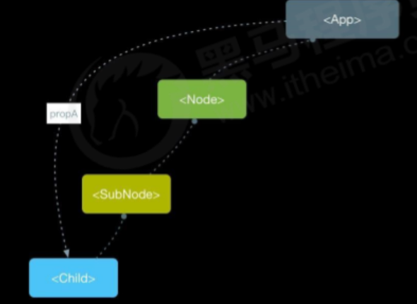

> Context 提供了一个无需为每层组件手动添加 `props`，就能在组件树间进行数据传递的方法。 【跨组件通讯】
>
> 使用场景：如果两个组件嵌套多层可以使用`Context`实现组件通讯 。



## 使用步骤

1. 调用`React.createContext()`方法创建一个`Context`对象，该对象中包含`Provider`（提供数据） 和`Consumer`（消费数据） 两个组件。 

   ```jsx
   import React from 'react';
   const { Provider, Consumer } = React.createContext();
   ```

2. 使用`Provider`组件包裹根节点；

   ```jsx
   // App.js
   
   import React from 'react';
   import Child from './views/context/Child';
   
   // 子组件需要使用 Consumer 来获取值。
   export const { Provider, Consumer } = React.createContext();
   
   function App() {
     const obj = {
       count: 100,
     };
   
     return (
       <div className="App">
         {/* 在`Provider`设置`value`属性，表示要传递的数据 */} 
         <Provider value={ obj }>
           <h1>根元素</h1>
           <Child/>
         </Provider>
       </div>
     );
   }
   
   export default App;
   
   ```

3. 在需要接收数据的地方放置`Consumer`来接收数据；

   ```jsx
   // Child.js
   
   import React, { Component }from 'react';
   import { Consumer } from '../../App'
   
   const Child2 = () => {
     return (
       <div>
         <h5>子组件 2</h5>
         <Consumer>
           {
             (context) => (<h5>拿到了父组件的数据:{context.count}</h5>)
           }
         </Consumer>
       </div>
     )
   }
   
   class Child extends Component{
   
     getCount = (context) => {
       return (
         <div>
           <h5>子组件 1</h5>
           <h5>拿到了父组件的数据:{context.count}</h5>
         </div>
       )
     }
   
     render() {
       return (
         <div>
           <Consumer>
             { this.getCount }
           </Consumer>
           <Child2/>
         </div>
       )
     }
   }
   
   export default Child;
   ```

::: warning

- `Provider, Consumer`需要**成对**使用，否则拿不到值。
- `Consumer`组件中包裹的必须是一个函数，参数即为context传过来的值。

:::

## 优化后

```javascript
// contextCom.js
import React, { createContext } from 'react';

export const Context = createContext();
export const Provider = Context.Provider;
export const Consumer = Context.Consumer;
```

```javascript
// app.js

import React from 'react';
import './App.css';
import Child from './views/context/Child';
import { Provider } from './views/context/ContextCom';

function App() {
  const obj = {
    count: 100,
  };

  return (
    <div className="App">
      <Provider value={ obj }>
        <h1>根元素</h1>
        <Child/>
      </Provider>
    </div>
  );
}

export default App;
```

```javascript
import React, { Component }from 'react';
import { Consumer, Context } from './ContextCom';

const Child = () => {
  return (
    <div>
      <h5>子组件 2</h5>
      <Consumer>
        {
          (context) => (<h5>拿到了父组件的数据:{context.count}</h5>)
        }
      </Consumer>
    </div>
  )
}

class Child extends Component{

  // 把context上下文。挂载到类组件的静态属性上，这样就可以使用 this.context拿到传过来的值
  static contextType = Context;

  child = (context) => {
    return (
      <div>
        <h5>子组件 1</h5>
        <h5>拿到了父组件的数据:{context.count}</h5>
      </div>
    )
  }

  render() {
    return (
      <div>
         { this.child(this.context) }
        <Child/>
      </div>
    )
  }
}

export default Child;
```

> 通过把context上下文挂载到类组件的静态属性上，就可以使用 `this.context`拿到传过来的值。

::: info

- `static contextType = Context`中一定要叫`contextType`否则拿不到值的。
- 挂载到`contextType`后可以不用`Consumer`包裹就可以拿到context传递的值。
- `this.context`在任何生命周期中都可以访问到。

:::

## 总结

1. `Provider, Consumer`需要**成对**使用，否则拿不到值。
2. `Consumer`组件中包裹的必须是一个函数，参数即为context传过来的值。
3. 类组件可以不使用`consumer`来获取值，可以通过挂载到静态属性来访问。
4. 挂载的静态属性必须是`contextType`。
5. `createContext(defaultValue)`可以设置默认值。