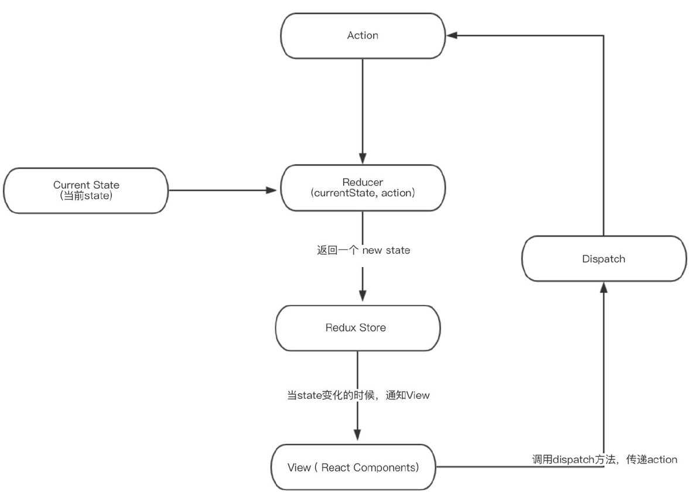

>  Redux 是 JavaScript 状态容器，提供可预测化的状态统一管理。 它不是react独有的，任何地方都可以用：原生`js`、`jQery`、`vue`等。

**三大原则：**

   1. 单一数据源。
   2. State 是只读的。
   3. 使用纯函数来执行修改。

::: info

Redux 是负责组织 state 的⼯具，但你也要考虑它是否适合你的情况。不要因为有⼈告诉你要⽤ Redux 就去⽤，花点时间好好想想使⽤了 Redux 会带来的好处或坏处。 在下⾯的场景中，引⼊ Redux 是⽐较明智的： 

- 你有着相当⼤量的、随时间变化的数据； 
- 你的 state 需要有⼀个单⼀可靠数据来源； 
- 你觉得把所有 state 放在最顶层组件中已经⽆法满⾜需要了。 
- 某个组件的状态需要共享。

:::



## 安装

- 通过标签引入；

  ```js
  <script src="../node_modules/redux/dist/redux.js"></script>
  
  const { Redux } = window  // 要结构出来使用；
  ```

- 通过`npm`包管理。

  ```bash
  # 安装；
  npm install --save redux
  
  # 引入；
  import { createStore } from 'redux';
  ```

## 基础

> 在使用redux的过程中，你需要了解下以下几个概念：

- Action
- reducer
- store

### Action

> **Action**是把数据从应用传到 store 的有效载荷，它是 store 数据的**唯一**来源。一般来说你会通过 [`store.dispatch()`](https://www.redux.org.cn/docs/api/Store.html#dispatch) 将 action 传到 store。 本质上是`javaScript`的普通对象。我们约定，action 内必须使用一个字符串类型的 `type` 字段来表示将要执行的动作 。 多数情况下，`type` 会被定义成字符串常量。**建议使用单独的模块或文件来存放 action。** 

```javascript
// 添加新 todo 任务的 action ：
const ADD_TODO = 'ADD_TODO'

const action1 = {
  type: ADD_TODO,
  text: 'Build my first Redux app'
}
```

```javascript
// 单独的模块统一管理存放 action；
import { ADD_TODO } from '../actionTypes'
```

#### `Action `创建函数

> 概述： **Action 创建函数** 就是生成 `action `的方法 。

```js
// action 创建函数只是简单的返回一个 action:
function addTodo(text) {
  return {
    type: ADD_TODO,
    text
  }
}
```

```javascript
// actions.js
/*
 * action 类型
 */

export const ADD_TODO = 'ADD_TODO';
export const TOGGLE_TODO = 'TOGGLE_TODO'
export const SET_VISIBILITY_FILTER = 'SET_VISIBILITY_FILTER'

/*
 * 其它的常量
 */

export const VisibilityFilters = {
  SHOW_ALL: 'SHOW_ALL',
  SHOW_COMPLETED: 'SHOW_COMPLETED',
  SHOW_ACTIVE: 'SHOW_ACTIVE'
}

/*
 * action 创建函数
 */

export function addTodo(text) {
  return { type: ADD_TODO, text }
}

export function toggleTodo(index) {
  return { type: TOGGLE_TODO, index }
}

export function setVisibilityFilter(filter) {
  return { type: SET_VISIBILITY_FILTER, filter }
}
```

### Reducer

> **Reducers** 指定了应用状态的变化如何响应 [actions](https://www.redux.org.cn/docs/basics/Actions.html) 并发送到 store 的，注意 actions 只是说明了*有事情发生了*这一事实，并没有说明应用如何更新 state。 

- 设计`state`结构；
  所有的 state 都被保存在一个单一对象中 。

- `Action`处理;
  确定了 state 对象的结构，就可以开发 reducer。reducer 就是一个**纯函数**，接收旧的 state 和 action，返回新的 state。 

```js
// reducers.js

import { combineReducers } from 'redux'
import {
  ADD_TODO,
  TOGGLE_TODO,
  SET_VISIBILITY_FILTER,
  VisibilityFilters
} from './actions'

const { SHOW_ALL } = VisibilityFilters

function visibilityFilter(state = SHOW_ALL, action) {
  switch (action.type) {
    case SET_VISIBILITY_FILTER:
      return action.filter
    default:
      return state
  }
}

function todos(state = [], action) {
  switch (action.type) {
    case ADD_TODO:
      return [
        ...state,
        {
          text: action.text,
          completed: false
        }
      ]
    case TOGGLE_TODO:
      return state.map((todo, index) => {
        if (index === action.index) {
          return Object.assign({}, todo, {
            completed: !todo.completed
          })
        }
        return todo
      })
    default:
      return state
  }
}

// 和下面等价
const todoApp = combineReducers({
  visibilityFilter,
  todos
})

//export default function todoApp(state = {}, action) {
//  return {
//    visibilityFilter: visibilityFilter(state.visibilityFilter, action),
//    todos: todos(state.todos, action)
//  }
//}

export default todoApp
```

> 开发一个函数来做为主 reducer，它调用多个子 reducer 分别处理 state 中的一部分数据，然后再把这些数据合成一个大的单一对象。主 reducer 并不需要设置初始化时完整的 state。初始时，如果传入 `undefined`, 子 reducer 将负责返回它们的默认值。

::: warning

- **不要**在`reduce `里修改传入的参数。
- **不要**执行有副作用的操作，如 API 请求和路由跳转；
- **不要** 调用非纯函数，如 `Date.now()` 或 `Math.random()`。
- 每个 reducer 只负责管理全局 state 中它负责的一部分。每个 reducer 的 `state` 参数都不同，分别对应它管理的那部分 state 数据。

:::

### Store

> **Store** 就是把它们联系到一起的对象。Store 有以下职责：
>
> - 维持应用的 state；
> - 提供 [`getState()`](https://www.redux.org.cn/docs/api/Store.html#getState) 方法获取 state；
> - 提供 [`dispatch(action)`](https://www.redux.org.cn/docs/api/Store.html#dispatch) 方法更新 state；
> - 通过 [`subscribe(listener)`](https://www.redux.org.cn/docs/api/Store.html#subscribe) 注册监听器;
> - 通过 [`subscribe(listener)`](https://www.redux.org.cn/docs/api/Store.html#subscribe) 返回的函数注销监听器。

创建 store
```Js
// src导入方式: const { Redux: {createStore} } = window

// 包引入方式；
import { createStore } from 'redux'
import todoApp from './reducers'
import {
  addTodo,
  toggleTodo,
  setVisibilityFilter,
  VisibilityFilters
} from './actions'

// 创建仓库；
let store = createStore(todoApp)

// 打印初始状态
console.log(store.getState())

// 每次 state 更新时，打印日志。注意 subscribe() 返回一个函数用来注销监听器
const unsubscribe = store.subscribe(() =>
  console.log(store.getState())
)

// 发起一系列 action
store.dispatch(addTodo('Learn about actions'))
store.dispatch(addTodo('Learn about reducers'))
store.dispatch(addTodo('Learn about store'))
store.dispatch(setVisibilityFilter(VisibilityFilters.SHOW_COMPLETED))

// 停止监听 state 更新
unsubscribe();
```

::: info

redux 的值更新之后你需要使用`subscribe`监听，然后做其他的事情，例如重新renderDOM

:::

::: warning

再次强调一下 **Redux 应用只有一个单一的 store**。当需要拆分数据处理逻辑时，你应该使用 [reducer 组合](https://www.redux.org.cn/docs/basics/Reducers.html#splitting-reducers) 而不是创建多个 store。

:::

## 注意事项

使用`store.dispatch(action)`时`action`必须是对象且拥有type属性，否则会报错。

## 示例

[todoList点击前往](https://www.redux.org.cn/docs/basics/ExampleTodoList.html)
