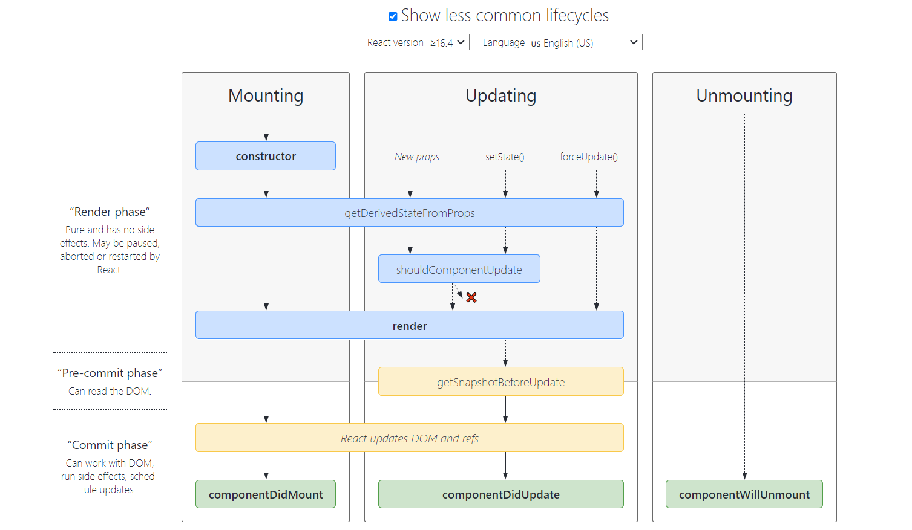
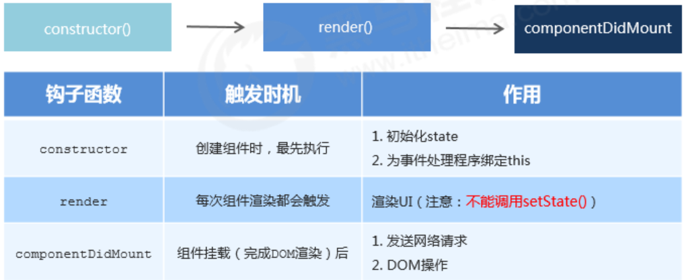
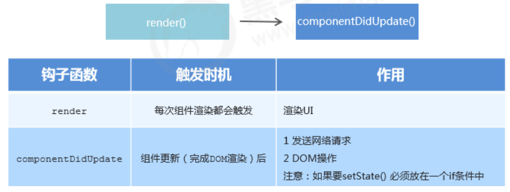
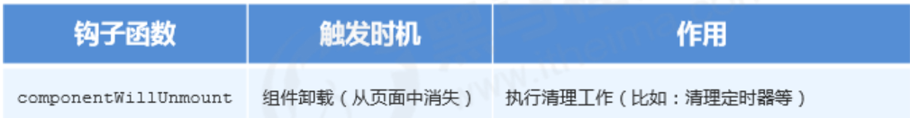

> React的生命周期是指组件从被创建到挂载到页面中运行，再到组件不用时卸载的过程。生命周期的每个阶段总是伴随着一些方法调用，这些方法就是生命周期的钩子函数，为开发人员在不同阶段操作组件提供了时机。 **只有 类组件才有生命周期**。[生命周期图谱](https://projects.wojtekmaj.pl/react-lifecycle-methods-diagram/)



## 挂载阶段

> 当组件实例被创建并插入 DOM 中时，其生命周期调用顺序如下：
>
> - constructor()
> - static getDerivedStateFromProps()
> - render()
> - componentDidMount()



## 更新阶段

> 当组件的 props 或 state 发生变化时会触发更新。组件更新的生命周期调用顺序如下：
>
> - static getDerivedStateFromProps()
> - shouldComponentUpdate()
> - render()
> - getSnapshotBeforeUpdate()
> - componentDidUpdate()
>
> ::: warning
>
> 下述方法即将过时，在新代码中应该避免使用它们：
>
> - UNSAFE_componentWillUpdate()
> - UNSAFE_componentWillReceiveProps()
>
> :::

- 执行时机：**1. setState()  2. forceUpdate()  3. 组件接收到新的props**  
- 说明：以上三者任意一种变化，组件就会重新渲染 
- 执行顺序： 



## 卸载时

> 组件从页面中消失 ，(组件切换)  可以清除定时器，解绑事件。当组件从 DOM 中移除时会调用如下方法：
>
> - componentWillUnmount()




## 错误处理

> 当渲染过程，生命周期，或子组件的构造函数中抛出错误时，会调用如下方法：

- static getDerivedStateFromError()
- componentDidCatch()

## 可能弃用的钩子

> V17可能会废弃的三个⽣命周期函数⽤`getDerivedStateFromProps`替代，⽬前使⽤的话加上 UNSAFE_：

**可能会废弃的三个⽣命周期函数：**

- componentWillMount 
- componentWillReceiveProps 
- componentWillUpdate 

**引⼊两个新的⽣命周期函数：**

-  static getDerivedStateFromProps 
- getSnapshotBeforeUpdate

::: info

如果不想⼿动给将要废弃的⽣命周期添加 UNSAFE_ 前缀，可以⽤下⾯的命令:

```bash
npx react-codemod rename-unsafe-lifecycles <path>
```

:::

## 钩子函数

> 了解并熟悉React的钩子函数，对于使用React开发来说非常重要，因为你需要清除在什么时候调用什么方法然后执行什么操作等。

### constructor

> 在 React 组件挂载之前，会调用它的构造函数。

```javascript
class Input extends Component {
  // 如果不初始化 state 或不进行方法绑定，则不需要为 React 组件实现构造函数。
  constructor(props){
      super(props)
      // 不要在这里调用 this.setState()
      this.state = { counter: 0 };
      this.handleClick = this.handleClick.bind(this);
  }
  // ...
}
```

::: warning
- 在 constructor() 函数中不要调用 setState() 方法。如果你的组件需要使用内部 state，请直接在构造函数中为 this.state 赋值初始。
- 避免将 props 的值复制给 state！这是一个常见的错误

  ```javascript
  constructor(props) {
     super(props);
     // 不要这样做
     this.state = { color: props.color };
  }
  ```
:::

### getDerivedStateFromProps

> getDerivedStateFromProps会在调用render方法之前调用，并且在初始挂载及后续更新时都会被调用。它应返回一个对象来更新state，如果返回null则不更新任何内容。

```javascript
class EmailInput extends Component {
  state = {
    email: this.props.email
  };

  static getDerivedStateFromProps(nextProps, prevState) {
    // 只要 props.email 改变，就改变 state
    if (nextProps.email !== prevState.email) {
      this.setState({
        email: nextProps.email
      });
    }
  }
  // ...
}
```

::: warning

不管原因是什么，都会在每次渲染前触发此⽅法。这与 `UNSAFE_componentWillReceiveProps` 形成对⽐，后者仅在⽗组件重新渲染时触发，⽽不是在内部 调⽤ setState 时。

:::

### shoudComponentUpdate

> 此方法仅作为性能优化的方式而存在。不要企图依靠此方法来“阻止”渲染，因为这可能会产生 bug。你应该考虑使用内置的 PureComponent 组件，而不是手动编写 shouldComponentUpdate()。PureComponent会对props和state进行浅层比较，并减少了跳过必要更新的可能性。

- 根据 shouldComponentUpdate() 的返回值，判断 React 组件的输出是否受当前 state 或 props 更改的影响。默认行为是 state每次发生变化组件都会重新渲染。
- 当 props 或 state 发生变化时，shouldComponentUpdate()会在渲染执行之前被调用。返回值默认为 true。首次渲染或使用 forceUpdate() 时不会调用该方法。

::: info
目前，如果 shouldComponentUpdate()返回false，则不会调用UNSAFE_componentWillUpdate()，render() 和 componentDidUpdate()。后续版本，React 可能会将 shouldComponentUpdate 视为提示而不是严格的指令，并且，当返回 false 时，仍可能导致组件重新渲染。
:::

### render

### getSnapshotBeforeUpdate

> getSnapshotBeforeUpdate()在最近一次渲染输出（提交到DOM节点）之前调用。它使得组件能在发生更改之前从DOM中捕获一些信息（例如，滚动位置）。此生命周期方法的任何返回值将作为参数传递给 componentDidUpdate()。

```javascript
class ScrollingList extends React.Component {
  constructor(props) {
    super(props);
    this.listRef = React.createRef();
  }

  getSnapshotBeforeUpdate(prevProps, prevState) {
    // 我们是否在 list 中添加新的 items ？
    // 捕获滚动位置以便我们稍后调整滚动位置。
    if (prevProps.list.length < this.props.list.length) {
      const list = this.listRef.current;
      return list.scrollHeight - list.scrollTop;
    }
    return null;
  }

  componentDidUpdate(prevProps, prevState, snapshot) {
    // 如果我们 snapshot 有值，说明我们刚刚添加了新的 items，
    // 调整滚动位置使得这些新 items 不会将旧的 items 推出视图。
    //（这里的 snapshot 是 getSnapshotBeforeUpdate 的返回值）
    if (snapshot !== null) {
      const list = this.listRef.current;
      list.scrollTop = list.scrollHeight - snapshot;
    }
  }

  render() {
    return (
      <div ref={this.listRef}>{/* ...contents... */}</div>
    );
  }
}
```

### componentDitMount

> 会在组件挂载后（插入 DOM 树中）立即调用。如需通过网络请求获取数据，此处是实例化请求的好地方。

```javascript
class Input extends Component {
  constructor(props) {
    super(props);
    this.state = {
        color: '#fff'
    }
  }

  componentDitMount() {
    setTimeout(() => {
        this.setState({
            color: '#000'
        })
    }, 2000)
  }
  // ...
}
```

::: info
你可以在 componentDidMount() 里直接调用 setState()。它将触发额外渲染，但此渲染会发生在浏览器更新屏幕之前。如此保证了即使在 render() 两次调用的情况下，用户也不会看到中间状态。
:::

::: warning
这个方法是比较适合添加订阅的地方。如果添加了订阅，请不要忘记在 componentWillUnmount() 里取消订阅
:::

### componentDitUpdate

> 此方法会在更新后会被立即调用。

```javascript
class Input extends Component {
  constructor(props) {
    super(props);
    this.state = {
        color: '#fff'
    }
  }

  // 
  componentDitUpdate(prevProps, prevState, snapshot) {
    // 典型用法（不要忘记比较 props）：
    if (this.props.userID !== prevProps.userID) {
      this.fetchData(this.props.userID);
    }
  }
  // ...
}
```

::: info

- 首次渲染不会执行此方法。
- 当组件更新后，可以在此处对 DOM 进行操作。
- 如果你对更新前后的 props 进行了比较，也可以选择在此处进行网络请求。
- 你也可以直接调用 setState()，但它必须被包裹在一个条件语句里，否则会导致死循环。
- 如果组件实现了 getSnapshotBeforeUpdate() 生命周期（不常用），则它的返回值将作为 componentDidUpdate() 的第三个参数 “snapshot” 参数传递。否则此参数将为 undefined。

:::

::: warning

如果 shouldComponentUpdate() 返回值为 false，则不会调用 componentDidUpdate()。

:::

### componentWillUnmount

> 会在组件卸载及销毁之前直接调用。

```javascript
class Input extends Component {
  componentWillUnmount() {
    // 在这里清除定时器、取消网络请求或清除在 componentDidMount() 中创建的订阅
  }
  // ...
}
```

::: warning

componentWillUnmount() 中不应调用 setState()，因为该组件将永远不会重新渲染。组件实例卸载后，将永远不会再挂载它。

:::
