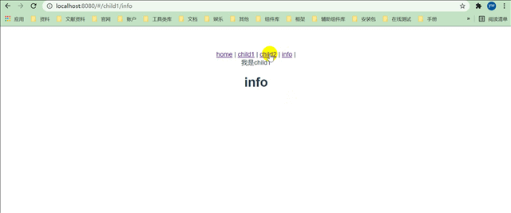

> 本篇承接上篇，在上一节中我们简单实现了一个vue路由，但是，还有一些细节需要处理，不过我这里只想整理下上节中的代码和实现嵌套路由；

## 提取`link`和`view`

```javascript
// router-link
export default {
    props: {
        to: {}
    },
    render(createElement) {
        return createElement('a', {
            attrs: {
                href: `#${this.to}`,
            },
        }, this.$slots.default)
    }
}
```

```javascript
// router-view
export default {
    render(createElement) {
        let component = null;
        this.$router.$options.routers.forEach((router) => {
            if (router.path === this.$router.currentRouter) {
                component = router.component
            }
        })
        return createElement(component)
    }
}
```

```javascript
import View from './components/View';
import Link from './components/Link';

// 使用
Vue.component('router-link', Link)
Vue.component('router-view', View)
```

## 路由记录

> 我们的目的是实现嵌套路由，那么需要知道路由的层级记录，也就是说需要记录匹配到的每一层的路由，所以我们需要把它们保存起来；

index.js修改如下：

```javascript
import View from './components/View';
import Link from './components/Link';

let Vue;

class Router {
    constructor(options) {
        this.$options = options;
+        this.currentRouter = window.location.hash.slice(1) || '/';
         // 保存路由记录 
+        this.matched = [];
        // 响应式 currentRouter
+        Vue.util.defineReactive(this, 'matched', []);

        // 监听路由的变化
        window.addEventListener('hashchange', this.onhashchange.bind(this))

        // 解决刷新时，不渲染render的问题；
        window.addEventListener('load', this.onhashchange.bind(this))
    }
    
    ...省略以下部分
}

export default Router
```

## 遍历路由

> 我们需要根据当前的浏览器url来匹配routes中的全部路由，并保存到 matched中；

index.js修改如下：

```javascript

import View from './components/View';
import Link from './components/Link';

let Vue;

class Router {
    constructor(options) {
        this.$options = options;
        this.currentRouter = window.location.hash.slice(1) || '/';
        this.matched = [];
        this.match();
        // 响应式 currentRouter
        Vue.util.defineReactive(this, 'matched', []);

        // 监听路由的变化
        window.addEventListener('hashchange', this.onhashchange.bind(this))

        // 解决刷新时，不渲染render的问题；
        window.addEventListener('load', this.onhashchange.bind(this))
    }

    onhashchange() {
        this.currentRouter = window.location.hash.slice(1)
        // 当前路由改变时清空，然后重新匹配；
        this.matched = [];
        this.match();
    }

    // 添加路由记录
    addRouteRecord(pathList, pathMap, route, parent) {
        const { path } = route;
        const normalizedPath = this.normalizePath(path, parent)
        const record = {
            path: normalizedPath,
            component: route.component,
            parent,
        }
        if (
            !pathMap[record.path]
            && this.currentRouter.includes(path)
            && this.currentRouter !== '/'
            && path !== '/'
        ) {
            pathList.push(record)
            pathMap[record.path] = record
        }
        // 递归子路由
        if (route.children) {
            route.children.forEach(child => {
                this.addRouteRecord(pathList, pathMap, child, record)
            })
        }
    }

    normalizePath(path, parent) {
        if (path[0] === '/') return path
        if (parent == null) return path
        return `${parent.path}/${path}`.replace(/\/\//g, '/')
    }

    match(routes, oldPathList, oldPathMap, parentRoute) {
        routes = this.$options.routes || [];
        const pathList = oldPathList || [];
        const pathMap = oldPathMap || Object.create(null)

        routes.forEach(route => {
            this.addRouteRecord(pathList, pathMap, route, parentRoute)
        })
        // 保存匹配的路由记录
        this.matched = pathList
    }
}

export default Router
```

## 标记view

> 上节中的代码不支持路由嵌套的，如果你尝试的话，它会报出栈溢出错误；因为子路由会始终匹配父路由，最终导致栈溢出。解决办法就是，我们标记view组件，然后匹配对应的子路由；

View.js修改如下：

```javascript
export default {
    render(createElement) {
        // 标记view组件,用于判断是否为 view 组件；
        this.$vnode.data.routerView = true;

        // 标记深度；嵌套几层
        let depth = 0;
        let parent = this.$parent;
        while (parent) {
            if (parent.$vnode && parent.$vnode.data && parent.$vnode.data.routerView) {
                depth++;
            }
            parent = parent.$parent;
        }

        let component = null;
        const route = this.$router.matched[depth];
        if (route) {
            component = route.component;
        }
        return createElement(component)
    }
}
```

## 解决 `/`无法匹配；

index.js修改如下：

```javascript

import View from './components/View';
import Link from './components/Link';

let Vue;

class Router {
	...省略
    addRouteRecord(pathList, pathMap, route, parent) {
        const { path } = route;
        const normalizedPath = this.normalizePath(path, parent)
        const record = {
            path: normalizedPath,
            component: route.component,
            parent,
        }
+        if (path === '/' && this.currentRouter === '/') {
+            pathList.push(record);
+            return;
        }
        if (
            !pathMap[record.path]
            && this.currentRouter.includes(path)
            && this.currentRouter !== '/'
            && path !== '/'
        ) {
            pathList.push(record)
            pathMap[record.path] = record
        }
        if (route.children) {
            route.children.forEach(child => {
                this.addRouteRecord(pathList, pathMap, child, record)
            })
        }
    }
	...省略
}

export default Router

```

::: tip

到现在为止，你已经完成了一个简易版的vue-router了。

:::

## 测试

我的router.js如下：

```javascript

import Vue from 'vue';
import Router from '../plugin/vue-router';

Vue.use(Router);

export default new Router({
    routes: [
        {
            path: '/',
            component: () => import('../components/home')
        },
        {
            path: '/child1',
            component: () => import('../components/child1'),
            children: [
                {
                    path: 'info',
                    component: () => import('../components/info')
                }
            ]
        },
        {
            path: 'child2',
            component: () => import('../components/child2')
        },
    ]
})

```

app.vue如下：

```vue
<div id="app">
      <router-link to="/">home</router-link> |
      <router-link to="/child1">child1</router-link> |
      <router-link to="/child2">child2</router-link> |
      <router-link to="/child1/info">info</router-link> |
      <router-view></router-view>
</div>
```

各页面内容如下：

```vue
// home.vue
<template>
<h1>HOME</h1>
</template>

// child1.vue
<template>
    <div>
        我是child1
        <router-view></router-view>
    </div>
</template>

// child2.vue
<template>
    <div>
        <h1>我是child2</h1>
    </div>
</template>

// info.vue
<template>
<div>
    <h1>info</h1>
</div>
</template>
```

效果如下：



