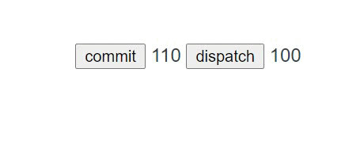

> Vuex 是一个专为 Vue.js 应用程序开发的**状态管理模式**。它采用集中式存储管理应用的所有组件的状态，并以相应的规则保证状态以一种可预测的方式发生变化。组件树构成了一个巨大的“视图”，不管在树的哪个位置，任何组件都能获取状态或者触发行为！


## 基本使用

- 安装：

  ```bash
  yarn add vuex
  ```

- 引入vuex插件 `store/index.js`

  ```javascript
  import Vue from 'vue'
  import Vuex from 'vuex'
  
  Vue.use(Vuex)
  
  export default new Vuex.Store({...})
  ```

- 在根示例上添加该实例：`main.js`:

  ```javascript
  import store from './store'
  new Vue({
    store,
    render: h => h(App),
  }).$mount('#app')
  ```

- 使用：

  ```javascript
  export default new Vuex.Store({
      state: {
          count: ''
      },
      mutations: {
          increment (state) {
              state.count++;
          }
      }
  })
  ```

  ```vue
  <template>
    <div id="app">
        <button @click="click">点击</button>
        {{ $store.state.count }}
    </div>
  </template>
  
  <script>
  
  export default {
    	name: 'App',
      methods: {
          click() {
              this.$store.commit('increment')
          }
      }
  }
  </script>
  ```

## 自己的vuex

> 仿着vuex的基本功能实现一个自己的vuex；vuex基本使用的方式不变，我们简单实现下vuex内部的代码；

新建`vuex/index.js`，添加Store类和install方法并导出；

```javascript

let Vue = null;

class Store {
    constructor(options) {
        // 因为vue中的data是响应式的，所以我们可以直接new Vue();
        this.state = new Vue({
            data: options.state,
        })
    }
}

function install (_Vue) {
    Vue = _Vue;
    Vue.mixin({
        beforeCreate() {
            // 访问到根组件时，将其挂载到vue的原型链上；
            if (this.$options.store) {
                Vue.prototype.$store = this.$options.store;
            }
        }
    })
}

export default {
    Store,
    install
}
```

> 以上的实现代码，可以满足**基本使用**中count的访问，但是commit还不能使用。

## 实现commit

```javascript
class Store {
    constructor(options) {
+       this._mutations = options.mutations,
        this.state = new Vue({
            data: options.state,
        })
    }

+    commit(type, palyload) {
+        const enter = this._mutations[type];
+        if (enter) {
+            enter(this.state, palyload);
+        }
+    }
+}
```

> 以上的实现代码，可以满足**基本使用**中count的设置了，`this.$store.commit('increment')`。

## 实现dispatch

```javascript
let Vue = null;

class Store {
    constructor(options) {
        this._mutations = options.mutations;
+        this._actions = options.actions;

        this.state = new Vue({
            data: options.state,
        })

        // 解决this指向问题
+        this.commit = this.commit.bind(this);
+        this.dispatch = this.commit.bind(this);
    }

	...省略中间代码

+    dispatch(type, payload) {
+        const enter = this._actions[type];
+        if (enter) {
+            enter(this, payload)
+        }
+    }
+}
```

> 以上的实现代码，你可以`this.$store.dispatch('increment')`，来使用了。

## 实现getter

> vuex的getter其实就是计算属性，所以实现getter就是实现vue的计算属性；

```javascript
let Vue = null;

class Store {
    constructor(options) {
        this._mutations = options.mutations;
        this._actions = options.actions;
+        this._wapperdGetters = options.getters;
+        this.getters = {};

        // 初始化 state
+        this.initVm(options);

        this.commit = this.commit.bind(this);
        this.dispatch = this.dispatch.bind(this);
    }

    initVm(options) {
        const computed = {};
        Object.keys(this._wapperdGetters).forEach(key => {
    
            // 获取用户定义的getter；
            const fn = this._wapperdGetters[key];
            computed[key] = () => {
                return fn(this.state)
            }

            // 定义只读
            Object.defineProperty(this.getters, key, {
                get: () => {
                    return this._vm[key] 
                }
            })
        })
        this._vm = new Vue({
            data: options.state,
            computed,
        })
    }
}
```

> 以上的实现代码，你可以`this.$store.getter.xxx`，来使用了。

## 禁止直接修改state

> 以上的代码实现简单实现了vuex的基本功能，但是用户还可以直接`this.$store.state = xxx`来修改，这样是不应该的，所以我们需要限制用户直接修改state中的值；

```javascript
class Store {
+   get state () {
    	// 需要this._vm._data访问
+       return this._vm._data.$$state;
+   }

+   set state (v) {
+       console.error('禁止直接修改state')
+   }

    initVm(options) {
        this._vm = new Vue({
            data: {
+                $$state: options.state,
            },
            computed,
        })
    }
+}
```

## 完整代码

```javascript
let Vue = null;

class Store {
    constructor(options) {
        this._mutations = options.mutations;
        this._actions = options.actions;
        this._wapperdGetters = options.getters;
        this.getters = {};

        // 初始化 state
        this.initVm(options);

        this.commit = this.commit.bind(this);
        this.dispatch = this.dispatch.bind(this);
    }

    get state () {
        return this._vm._data.$$state;
    }

    set state (v) {
        console.error('禁止直接修改state')
    }

    initVm(options) {
        const computed = {};
        Object.keys(this._wapperdGetters).forEach(key => {
    
            // 获取用户定义的getter；
            const fn = this._wapperdGetters[key];
            computed[key] = () => {
                return fn(this.state)
            }

            // 定义只读
            Object.defineProperty(this.getters, key, {
                get: () => {
                    return this._vm[key] 
                }
            })
            
        })
        this._vm = new Vue({
            data: {
                $$state: options.state,
            },
            computed,
        })
    }

    commit(type, palyload) {
        const enter = this._mutations[type];
        if (enter) {
            enter(this.state, palyload);
        }
    }

    dispatch(type, payload) {
        const enter = this._actions[type];
        if (enter) {
            enter(this, payload)
        }
    }
}

function install (_Vue) {
    Vue = _Vue;
    Vue.mixin({
        beforeCreate() {
            if (this.$options.store) {
                Vue.prototype.$store = this.$options.store;
            }
        }
    })
}

export default {
    Store,
    install
}
```

> 以上就是vuex的核心内容了，但是只是一个简单的vuex，主要用于学习目的；

## 测试

```javascript
import Vue from 'vue';
// 引入自己写的vuex
import Vuex from '../plugin/vuex';

Vue.use(Vuex)

export default new Vuex.Store({
    state: {
        count: 100
    },
    mutations: {
        increment(state) {
            state.count++;
        }
    },
    actions: {
        increment({ commit }) {
            setTimeout(() => {
                commit('increment')
            }, 1000)
        }
    },
    getters: {
        num(state){
            return state.count + 10;
        }
    }
})

```

```vue
<template>
  <div id="app">
      <button @click="click">commit</button>
      {{ $store.getters.num }}
      <button @click="onclick">dispatch</button>
      {{ $store.state.count }}<br>
  </div>
</template>

<script>
export default {
    methods: {
        click() {
            this.$store.commit('increment')
        },
        onclick() {
            this.$store.dispatch('increment')
        }
    }
}
</script>
```


