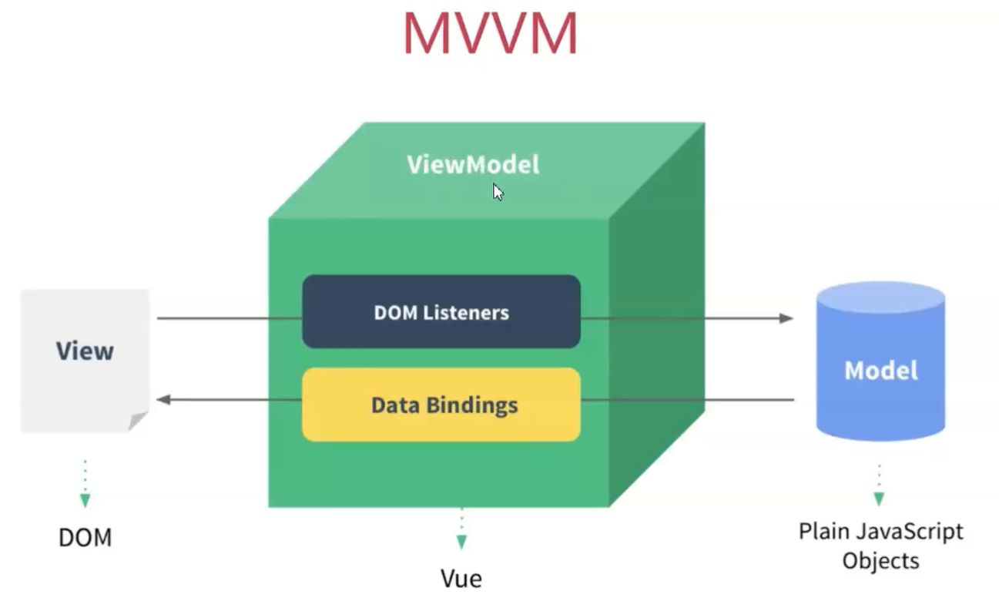

> 在实现mvvm之前我们需要先来认识下什么是mvvm？



## 什么是MVVM ？

> MVVM（Model–view–viewmodel）是一种软件[架构模式](https://zh.wikipedia.org/wiki/架构模式)；MVVM有助于将[图形用户界面](https://zh.wikipedia.org/wiki/图形用户界面)的开发与[业务逻辑](https://zh.wikipedia.org/wiki/业务逻辑)或[后端](https://zh.wikipedia.org/wiki/前端和后端)逻辑（*数据模型*）的开发[分离](https://zh.wikipedia.org/wiki/关注点分离)开来，这是通过[置标语言](https://zh.wikipedia.org/wiki/置标语言)或GUI代码实现的。

- **MVC**：
  - `Model` 数据 → `View` 视图 → `Controller` 控制器；
- MVP：
  - `Model`模型→ `View` 视图 → `Presenter`表现层；
  - 由MVC模式进化而来；
- MVVM：
  - `Model` 模型 → `View` 视图 → `ViewModel` 视图模型；
  - 三者的关系：`view` 可以通过事件绑定的方式影响 `model`，`model` 可以通过数据绑定的形式影响到`view`，`viewModel`是把 `model` 和 `view` 连起来的连接器；

## `MVVM`模式的组成部分

**模型**：是指代表真实状态内容的[领域模型](https://zh.wikipedia.org/wiki/领域模型)（面向对象），或指代表内容的[数据访问层](https://zh.wikipedia.org/wiki/数据访问层)（以数据为中心）。

**视图**：就像在[MVC](https://zh.wikipedia.org/wiki/MVC)和[MVP](https://zh.wikipedia.org/wiki/Model-view-presenter)模式中一样，视图是用户在屏幕上看到的结构、布局和外观（UI）。

**视图模型**：视图模型是暴露公共属性和命令的视图的抽象。

::: tip

MVVM没有MVC模式的控制器，也没有MVP模式的presenter，有的是一个绑定器。在视图模型中，绑定器在视图和[数据绑定器](https://zh.wikipedia.org/w/index.php?title=数据绑定器&action=edit&redlink=1)之间进行通信。

:::

## `MVVM` 框架的三大要素

- 数据响应式：监听数据变化并在视图中更新。
  - Object.defineProperty()
  - Proxy
- 模板引擎：提供描述视图的模版语法  
  - 插值：{{}} 
  - 指令：v-bind，v-on，v-model，v-for，v-if  
- 渲染：如何将模板转换为html  
  - 模板 => vdom => dom

## 编写MVVM框架

### 数据响应式

```javascript
const obj = {}

// 封装响应式函数
function defineReactive(obj, key, val) {
    Object.defineProperty(obj, key, {
        get() {
            console.log(`get ${key}:${val}`); // get name:小明
            return val
        },
        set(newVal) {
            if (newVal !== val) {
                console.log(`set ${key}:${newVal}`); // set name:小红
                val = newVal
            }
        },
    })
}

// 把 obj 转化为 响应式；
defineReactive(obj, 'name', '小明');

obj.name

obj.name = '小红'
```

### 结合视图

```html
<!DOCTYPE html>
<html lang="en">
<body>
	<h1 id="#app"></h1>
</body>

<script>
    const obj = {}
    const appEl = document.getElementById('#app')
    function render(val) {
        appEl.innerText = val;
    }
    // 封装响应式函数
    function defineReactive(obj, key, val) {
        Object.defineProperty(obj, key, {
            get() {
                return val
            },
            set(newVal) {
                if (newVal !== val) {
                    // 数据变化，更新视图
                    render(newVal)
                    val = newVal
                }
            },
        })
    }

    // 把 obj 转化为 响应式；
    defineReactive(obj, 'date', '');

    // 每秒更新数据
    setInterval(() => {
        obj.date = new Date().toLocaleTimeString();
    }, 1000)

</script>
</html>
```

> 以上代码可以在浏览器中直接运行，可以看到实现响应式的大致原理；

### 为所有属性添加响应式

```javascript
const obj = {
    eat: {
        panda: '熊猫'
    },
    drink: '喝'
}

// 封装响应式函数
function defineReactive(obj, key, val) {
+    observe(val);
    Object.defineProperty(obj, key, {
        get() {
            console.log(`get ${key}:${val}`);
            return val
        },
        set(newVal) {
            if (newVal !== val) {
                console.log(`set ${key}:${newVal}`);
                val = newVal
            }
        },
    })
}

// 遍历观察者为所有对象添加响应式；
function observe (obj) {
    if (!(obj instanceof Object) || obj === null || obj === undefined) return;
    for (const key in obj) {
        defineReactive(obj, key, obj[key]);
    }
}

observe(obj);

obj.eat.panda

obj.drink
```

> 新增加方法 observe 遍历对象中的所有属性并转化为响应式；

### 解决新添加属性

```javascript
function set(obj, key, val) {
    defineReactive(obj, key, val);
}

// 设置新属性
set(obj, 'beverages', '饮料');
```

> defineProperty无法观察到添加或删除属性的变化，所以我们需要自己触发响应式；

::: tip

defineProperty() 不支持数组，所以数组的监听需要其他处理方式；

:::

