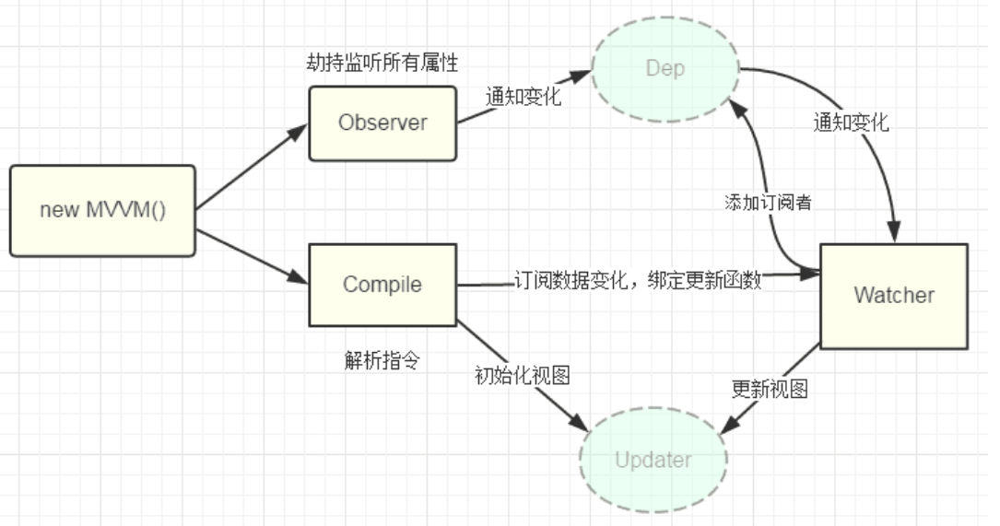
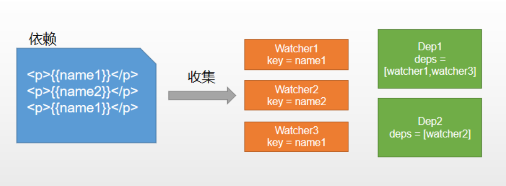

> 根据前面介绍的mvvm框架，手写一个简单的vue，以进一步的了解vue。目标代码如下：

```html
<!DOCTYPE html>
<html lang="en">
<body>
<div id="app">
    <h1>{{ count }}</h1>
</div>
</body>
<script src="./vue.js"></script>

<script>
    const app = new Vue({
        el: '#app',
        data: {
            count: 1
        }
    })

    setInterval(() => {
        app.count++
    }, 1000);

</script>
</html>
```

## 原理分析

- new Vue() 首先执行初始化，对data执行响应化处理，这个过程发生在Observer中。
-  同时对模板执行编译，找到其中动态绑定的数据，从data中获取并初始化视图，这个过程发生在Compile中。
- 同时定义一个更新函数和Watcher，将来对应数据变化时Watcher会调用更新函数。
- 由于data的某个key在一个视图中可能出现多次，所以每个key都需要一个管家Dep来管理多个Watcher。
-  将来data中数据一旦发生变化，会首先找到对应的Dep，通知所有Watcher执行更新函数  。



## 名词介绍  

- KVue：框架构造函数。
- Observer：执行数据响应化（分辨数据是对象还是数组）。
- Compile：编译模板，初始化视图，收集依赖（更新函数、watcher创建）。
- Watcher：执行更新函数（更新dom）。
- Dep：管理多个Watcher，批量更新  。

## vuejs

> vue框架的构造函数，对vue进行初始化同时把data进行响应式处理；

```javascript
class Vue {
    constructor(options) {
        this.$options = options;
        this.$data = options.data;

        // 初始化所有属性
        observe(this.$data)
    }
}

// 封装响应式函数
function defineReactive(obj, key, val) {
    Object.defineProperty(obj, key, {
        get() {
            console.log(`get ${key}:${val}`);
            return val
        },
        set(newVal) {
            if (newVal !== val) {
                console.log(`set ${key}:${newVal}`);
                val = newVal
            }
        },
    })
}

// 劫持监听所有属性；
function observe (obj) {
    if (!(obj instanceof Object) || obj === null || obj === undefined) return;
    new Observer(obj);
}

class Observer {
    constructor(value) {
        this.value = value;
        this.walk(value);
    }

    // 遍历属性转化为响应式
    walk(value) {
        Object.keys(value).forEach((key) => {
            defineReactive(value, key, value[key])
        })
    }
}

window.Vue = Vue;
```

> 把上面的代码引入到你的目标代码后，你就可以正常访问了，不过现在还没有编译html，需要`$data.count`才能访问；

**为$data做代理**

这样就可以在外面使用`app.count`来访问属性了，而不需要`app.$data.count`;

```javascript
class Vue {
    constructor(options) {
        this.$options = options;
        this.$data = options.data;

        observe(this.$data)
+        proxy(this);
    }
}

// 为vue做代理访问，这样就可以简化访问了；
function proxy (vm) {
    Object.keys(vm.$data).forEach((key) => {
        Object.defineProperty(vm, key, {
            get() {
                return vm.$data[key];
            },
            set(newVal) {
                vm.$data[key] = newVal;
            }
        })
    })
}
```

## 编译模板

> 编译模板中vue模板特殊语法，初始化视图、更新视图;


### 初始化视图

```javascript
class Compile {
    constructor(el, vm) {
        this.$vm = vm;
        this.$el = document.querySelector(el);

        if (this.$el) {
            this.compile(this.$el);
        }
    }

    compile(el){
        const childNodes = el.childNodes;
        // 根据节点类型编译
        Array.form(childNodes).forEach((node) => {
            if (this.isElement(node)) {
                console.log('编译元素' + node.nodeName)
            } else if (this.isInterPolation(node)) {
                console.log('编译插值文本' + node.textContent);
            }
            if (node.chilNodes && node.chilNodes.lenght) {
                this.compile(node);
            }
        })
    }

    isElement(node) {
        return node.nodeType === 1;
    }

    isInterPolation(node) {
        return node.nodeType === 3 && /\{\{(.*)\}\}/.test(node.textContent);
    }
}
```

### 编译插值

```javascript
class Compile {
    ...省略
    compile(el){
        const childNodes = el.childNodes;
        Array.from(childNodes).forEach((node) => {
            if (this.isElement(node)) {
                console.log('编译元素：', node.nodeName)
            } else if (this.isInterPolation(node)) {
                console.log('编译插值文本：', node.textContent);
+                this.compileText(node);
            }
            if (node.childNodes && node.childNodes.length) {
                this.compile(node);
            }
        })
    }
    isElement(node) {
        return node.nodeType === 1;
    }
    isInterPolation(node) {
        return node.nodeType === 3 && /\{\{(.*)\}\}/.test(node.textContent);
    }
+    compileText(node) {
+        node.textContent = this.$vm[RegExp.$1]
+    }
}
```

> 这个时候你的页面中可以使用{{count}}插值表达式了，

### 编译元素  

```javascript
class Compile {
    ...省略
    compile(el){
        const childNodes = el.childNodes;
        Array.from(childNodes).forEach((node) => {
            if (this.isElement(node)) {
                console.log('编译元素：', node.nodeName)
+                 this.compileElement(node);
            } else if (this.isInterPolation(node)) {
                console.log('编译插值文本：', node.textContent);
               this.compileText(node);
            }
            if (node.childNodes && node.childNodes.length) {
                this.compile(node);
            }
        })
    }
    isElement(node) {
        return node.nodeType === 1;
    }
    isInterPolation(node) {
        return node.nodeType === 3 && /\{\{(.*)\}\}/.test(node.textContent);
    }
+	compileElement(node) {
        let nodeAttrs = node.attributes;
    	// 遍历node的属性并查找是否有v-html的属性；
        Array.from(nodeAttrs).forEach(attr => {
            let attrName = attr.name;
            let exp = attr.value;
            if (this.isDirective(attrName)) {
                let dir = attrName.substring(2);
                this[dir] && this[dir](node, exp);
            }
        })
    }
+	isDirective(attr) {
        return attr.indexOf("v-") === 0;
    }
+	html(node, exp) {
    	// 替换节点文本
        node.innerHTML = this.$vm[exp]
    }
}
```

> 上面的代码可以让我们使用v-html指令，例：`<h1 v-html="html"></h1>`

::: tip 说明

以上代码的实现可以简单的显示插值表达式和v-html指令了，但是现在还缺少视图的更新；

:::

## 依赖收集

> 视图中会用到data中某key，这称为依赖。同一个key可能出现多次，每次都需要收集出来用一个Watcher来维护它们，此过程称为依赖收集。

**多个Watcher需要一个Dep来管理，需要更新时由Dep统一通知。**

例：

```html
new Vue({
        template:
            `
                <div>
                <p>{{ name1 }}</p>
                <p>{{ name2 }}</p>
                <p>{{ name1 }}</p>
                </div>`,
        data: {
            name1: 'name1',
            name2: 'name2',
        },
    });
```



**实现思路**

- defineReactive时为每一个key创建一个Dep实例。
- 初始化视图时读取某个key，例如name1，创建一个watcher1。
- 由于触发name1的getter方法，便将watcher1添加到name1对应的Dep中。
- 当name1更新，setter触发时，便可通过对应Dep通知其管理所有Watcher更新。


### 创建Watcher

```javascript
//临时用于保存watcher测试用
const watchers = [];

// 监听器：负责更新视图
class Watcher {
    constructor(vm, key, updateFn) {
        // kvue实例
        this.vm = vm;
        // 依赖key
        this.key = key;
        // 更新函数
        this.updateFn = updateFn;
        // 临时放入watchers数组
        watchers.push(this)
    }
    // 更新
    update() {
        // 调用保存的更新函数
        this.updateFn.call(this.vm, this.vm[this.key]);
    }
}
```

> 保存着某一个Key的使用者传入的更新函数；

### 编写更新函数

```javascript
class compile {
    ...省略
    update(node, exp, dir) {
        const fn = this[dir+'Updater']
        fn && fn(node, this.$vm[exp])
        // 首次初始化的时候，创建一个观察者，并传入一个更新函数，更新函数的调用则会更新视图；
        new Watcher(this.$vm, exp, function(val){
            fn && fn(node, val)
        })
    }
    textUpdater(node, val) {
        node.textContent = val;
    }
    htmlUpdater(node, val) {
        node.innerHTML = val
    }
}
```

### 调用更新函数

```javascript
class compile {
    // v-text
    text(node, exp) {
        // node.textContent = this.$vm[exp];
        this.update(node, exp, 'text')
    }

    // v-html
    html(node, exp) {
        // node.innerHTML = this.$vm[exp]
        this.update(node, exp, 'html')
    }

    // {{xxxx}}
    compileText(node) {
        // node.textContent = this.$vm[RegExp.$1]
        this.update(node, RegExp.$1, 'text')
    }
}
```

> 数据发生变更调用不同的更新函数更新视图；

### 更新通知

```javascript
function defineReactive(obj, key, val) {
    Object.defineProperty(obj, key, {
        get() {
            console.log(`get ${key}:${val}`);
            return val
        },
        set(newVal) {
            if (newVal !== val) {
                console.log(`set ${key}:${newVal}`);
+                watchers.forEach((fn) => fn.update())
                val = newVal
            }
        },
    })
}
```

> 数据发生变更后，我们遍历所有的观察者，将观察者所有收集到的更新函数全局执行一遍，就可以更新视图了；

### 收集watcher

> 在上面的代码中我们把观察者统一放在了watchers中；然后统一处理调用，但是这样带来的缺点就是，那些没有变更的数据也重复更新了，所以我们要基于key创建一个收集者，专门用于保存某个属性key的观察者。这里我们把依赖收集到dep中。

**创建Dep：**

```javascript
class Dep {
    constructor () {
        this.deps = []
    }
    addDep (dep) {
        this.deps.push(dep)
    }
    notify() {
        this.deps.forEach(dep => dep.update());
    }
}
```

**在dep中保存当前watcher**

```javascript
class Watcher {
    constructor(vm, key, updateFn) {
        // kvue实例
        this.vm = vm;
        // 依赖key
        this.key = key;
        // 更新函数
        this.updateFn = updateFn;
        // 将当前的watcher保存到dep中
+        Dep.target = this;
        // 读取属性会执行getter函数
+        this.vm[this.key];
+        Dep.target = null;
    }
    // 更新
    update() {
        this.updateFn.call(this.vm, this.vm[this.key]);
    }
}
```

**依赖收集，创建Dep实例：**

```javascript
// 封装响应式函数
function defineReactive(obj, key, val) {
    observe(val);
    // 在对key的值进行响应化的时候，创建一个dep，专门用于收集key的watcher
    const dep = new Dep()
    Object.defineProperty(obj, key, {
        get() {
            console.log(`get ${key}:${val}`);
            // 我们可以从上一步中读取到收集的watcher,然后将其保存到dep中；
            Dep.target && dep.addDep(Dep.target);
            return val
        },
        set(newVal) {
            if (newVal !== val) {
                console.log(`set ${key}:${newVal}`);
                val = newVal
            }
        },
    })
}
```

### **指定派发更新**：

```javascript
// 封装响应式函数
function defineReactive(obj, key, val) {
    observe(val);
    const dep = new Dep()
    Object.defineProperty(obj, key, {
        get() {
            console.log(`get ${key}:${val}`);
            Dep.target && dep.addDep(Dep.target);
            return val
        },
        set(newVal) {
            if (newVal !== val) {
                console.log(`set ${key}:${newVal}`);
                // 通知使用到这个key的所有地方
+                dep.notify();
                val = newVal
            }
        },
    })
}
```

> 通过`dep.notify()`我们就可以通知更新所有使用到这个key的所有观察者，这样dep key watcher就关联到一起了；

## 数组响应式

> 在前面的代码中我们只实现了对象的响应式，并不能对数组进行响应式，数组的响应式代码如下：

数据的响应式的详细介绍：[响应式原理(数组)]((./vue-note-02-02.md))；

**添加如下代码：**

```javascript
// 数组的响应式
const originPrototype  = Array.prototype;
const arrayPrototype = Object.create(originPrototype);
// 修改方法 这里我只写了2个 做演示
['push', 'pop'].forEach((method) => {
    arrayPrototype[method] = function () {
        // 原始操作
        originPrototype[method].apply(this, arguments);
        // 通知更新
        const ob = this.__ob__;
        ob.dep.notify();
    }
})

// 往数组对象中添加一个不可遍历属性 __ob__
function def (obj, key, val, enumerable) {
    Object.defineProperty(obj, key, {
        value: val,
        enumerable: !!enumerable,
        writable: true,
        configurable: true,
    })
}
```

**修改:  `Observer`**

```javascript
class Observer {
    constructor(value) {
        this.value = value;
        // 用于收集数组的依赖
+        this.dep = new Dep();
        // 用于在数组中获取 observer 执行更新；
+        def(value, '__ob__', this)

        if (Array.isArray(value)) {
            // 往数组上挂载我们修改过的数组方法；
+            value.__proto__ = arrayPrototype;
            // 数组的子项也执行响应式
+            value.forEach((item) => {
                observe(item);
            })
        } else {
            this.walk(value);
        }

    }
...省略
}
```

**修改：`defineReactive`**

```javascript
// 劫持监听所有属性；
function observe(obj) {
    if (!(obj instanceof Object) || obj === null || obj === undefined) return;
+    return new Observer(obj);
}

// 封装响应式函数
function defineReactive(obj, key, val) {
    // 解决对象嵌套问题
+    const childOb = observe(val);
    // 每读取一个属性就创建一个dep；
    const dep = new Dep()
    Object.defineProperty(obj, key, {
        get() {
            console.log(`get ${key}:${val}`);
            // 收集watcjer
+            if (childOb) {
+                Dep.target && childOb.dep.addDep(Dep.target);
            }
            Dep.target && dep.addDep(Dep.target);
            return val
        },
        set(newVal) {
            if (newVal !== val) {
                console.log(`set ${key}:${newVal}`);
                // 值变化时通知所有watcher
                dep.notify();
                val = newVal
            }
        },
    })
}
```

> 以上代码的就实现了数组的更新，这个时候你就可以使用push方法，往数组添加元素了；

## 事件绑定

> 在vue中我们会使用@来绑定事件，是我们用起来很简单，这里就简单实现下；

```javascript
class Compile {
    ...省略
    compileElement(node) {
        let nodeAttrs = node.attributes;
        Array.from(nodeAttrs).forEach(attr => {
            let attrName = attr.name;
            let exp = attr.value;
            if (this.isDirective(attrName)) {
                let dir = attrName.substring(2);
                this[dir] && this[dir](node, exp);
            }
+            if (this.isEvent(attrName)) {
                // 截取事件名
                const dir = attrName.substring(1);
                // 事件监听
                this.eventHandler(node, dir, exp)
            }
        })
    }

+	isEvent(dir) {
        return dir.indexOf('@') === 0
    }

    // 绑定事件
+    eventHandler(node, dir, exp){
        node.addEventListener(dir, this.$vm.$options.methods[exp].bind(this.$vm))
    }
}
```

> 添加以上代码后就可以使用`@click`来绑定事件了；

## 实现`v-model`

> v-model实际上只是个语法糖而已，它的实质就是绑定了一个事件，然后完成赋值操作了；

```javascript
class Compile {
	// v-model
    model(node, exp) {
        this.update(node, exp, 'model')

        node.addEventListener('input', e => {
            this.$vm[exp] = e.target.value;
        })
    }

    // 表单元素赋值
    modelUpdater(node, value) {
        node.value = value;
    }
}
```

## 完整代码

```javascript
// vue类
class Vue {
    constructor(options) {
        this.$options = options;
        this.$data = options.data;

        // 初始化data转化为get/set
        observe(this.$data)
        // 代理所有的data
        proxy(this);
        // 编译模板
        new Compile(options.el, this);
    }
}

// 封装响应式函数
function defineReactive(obj, key, val) {
    // 解决对象嵌套问题
    const childOb = observe(val);
    // 每读取一个属性就创建一个dep；
    const dep = new Dep()
    Object.defineProperty(obj, key, {
        get() {
            console.log(`get ${key}:${val}`);
            // 收集watcjer 这一步是处理数组的情况
            if (childOb) {
                Dep.target && childOb.dep.addDep(Dep.target);
            }
            Dep.target && dep.addDep(Dep.target);
            return val
        },
        set(newVal) {
            if (newVal !== val) {
                console.log(`set ${key}:${newVal}`);
                // 值变化时通知所有watcher
                val = newVal
                dep.notify();
            }
        },
    })
}

// 劫持监听所有属性；
function observe(obj) {
    if (!(obj instanceof Object) || obj === null || obj === undefined) return;
    return new Observer(obj);
}

class Observer {
    constructor(value) {
        this.value = value;
        this.dep = new Dep();
        // 添加一个不可遍历属性，并保存Oberver实例
        def(value, '__ob__', this)

        if (Array.isArray(value)) {
            value.__proto__ = arrayPrototype;
            value.forEach((item) => {
                observe(item);
            })
        } else {
            this.walk(value);
        }
    }

    // 遍历属性转化为响应式
    walk(value) {
        Object.keys(value).forEach((key) => {
            defineReactive(value, key, value[key])
        })
    }
}

// 模板编译
class Compile {
    constructor(el, vm) {
        this.$vm = vm;
        // 读取根节点
        this.$el = document.querySelector(el);

        // 初始化根节点
        if (this.$el) {
            this.compile(this.$el);
        }
    }

    compile(el) {
        const childNodes = el.childNodes;
        Array.from(childNodes).forEach((node) => {
            if (this.isElement(node)) {
                console.log('编译元素：', node.nodeName)
                this.compileElement(node);
            } else if (this.isInterPolation(node)) {
                console.log('编译插值文本：', node.textContent);
                this.compileText(node);
            }
            if (node.childNodes && node.childNodes.length) {
                this.compile(node);
            }
        })
    }

    isElement(node) {
        return node.nodeType === 1;
    }

    isInterPolation(node) {
        return node.nodeType === 3 && /\{\{(.*)\}\}/.test(node.textContent);
    }

    compileElement(node) {
        let nodeAttrs = node.attributes;
        Array.from(nodeAttrs).forEach(attr => {
            let attrName = attr.name;
            let exp = attr.value;
            if (this.isDirective(attrName)) {
                let dir = attrName.substring(2);
                this[dir] && this[dir](node, exp);
            }
            if (this.isEvent(attrName)) {
                // 截取事件名
                const dir = attrName.substring(1);
                // 事件监听
                this.eventHandler(node, dir, exp)
            }
        })
    }

    // 判断是否是指令
    isDirective(attr) {
        return attr.indexOf('v-') == 0;
    }

    // v-text
    text(node, exp) {
        this.update(node, exp, 'text')
    }

    // v-html
    html(node, exp) {
        this.update(node, exp, 'html')
    }

    // {{xxxx}}
    compileText(node) {
        this.update(node, RegExp.$1, 'text')
    }

    // 更新并创建watchet
    update(node, exp, dir) {
        const fn = this[dir+'Updater']
        fn && fn(node, this.$vm[exp])
        new Watcher(this.$vm, exp, function(val){
            fn && fn(node, val)
        })
    }
    textUpdater(node, val) {
        node.textContent = val;
    }
    htmlUpdater(node, val) {
        node.innerHTML = val
    }

    isEvent(dir) {
        return dir.indexOf('@') === 0
    }

    // 绑定事件
    eventHandler(node, dir, exp){
        node.addEventListener(dir, this.$vm.$options.methods[exp].bind(this.$vm))
    }

    // v-model
    model(node, exp) {
        this.update(node, exp, 'model')

        node.addEventListener('input', e => {
            this.$vm[exp] = e.target.value;
        })
    }

    // 表单元素赋值
    modelUpdater(node, value) {
        node.value = value;
    }
}

// 监听器：负责更新视图
class Watcher {
    constructor(vm, key, updateFn) {
        // kvue实例
        this.vm = vm;
        // 依赖key
        this.key = key;
        // 更新函数
        this.updateFn = updateFn;
        // 将当前的watcher保存到dep中
        Dep.target = this;
        // 读取属性会执行getter函数
        this.vm[this.key];
        Dep.target = null;
    }
    // 更新
    update() {
        this.updateFn.call(this.vm, this.vm[this.key]);
    }
}

// 依赖收集者
class Dep {
    constructor () {
        // 保存所有的watcher
        this.deps = []
    }
    addDep (dep) {
        this.deps.push(dep)
    }
    // 派发通知
    notify() {
        this.deps.forEach(dep => dep.update());
    }
}


// 数组的响应式
const originPrototype  = Array.prototype;
const arrayPrototype = Object.create(originPrototype);
// 修改方法
['push', 'pop'].forEach((method) => {
    arrayPrototype[method] = function () {
        // 原始操作
        originPrototype[method].apply(this, arguments);
        // 通知更新
        const ob = this.__ob__;
        ob.dep.notify();
    }
})

function def (obj, key, val, enumerable) {
    Object.defineProperty(obj, key, {
        value: val,
        enumerable: !!enumerable,
        writable: true,
        configurable: true,
    })
}

// 为vue做代理访问，这样就可以简化访问了；
function proxy(vm) {
    Object.keys(vm.$data).forEach((key) => {
        Object.defineProperty(vm, key, {
            get() {
                return vm.$data[key];
            },
            set(newVal) {
                vm.$data[key] = newVal;
            },
        })
    })
}

window.Vue = Vue;

```

```html
<!DOCTYPE html>
<html lang="en">
<head></head>
<body>
<div id="app">
    {{count}}
    <h1 v-html="html"></h1>
    {{name}}
    <h1>{{arr}}</h1>
    <button @click="onClick">加</button>
    <h5>{{text}}</h5>
    <input type="text" v-model="text">
</div>
</body>
<script src="./vue.js"></script>
<script>
    const app = new Vue({
        el: '#app',
        data: {
            count: 1,
            name: '小明',
            html: `<p>345</p>`,
            arr: [1,2,3],
            text: '22222222'
        },
        methods: {
            onClick() {
                this.count++;
                console.log(this.count)
            }
        }
    })
    
    // setInterval(() => {
        // app.count++
        // app.html = `<p>${new Date().toLocaleTimeString()}</p>`
        // app.arr.push(app.count)
    // }, 1000);
</script>
</html>
```

> 至此我们的vue框架就结束了，这只是为了学习而实现的一个简单vue框架demo，更复杂的功能就不尝试了，主要就是为了了解veu的工作方式；

