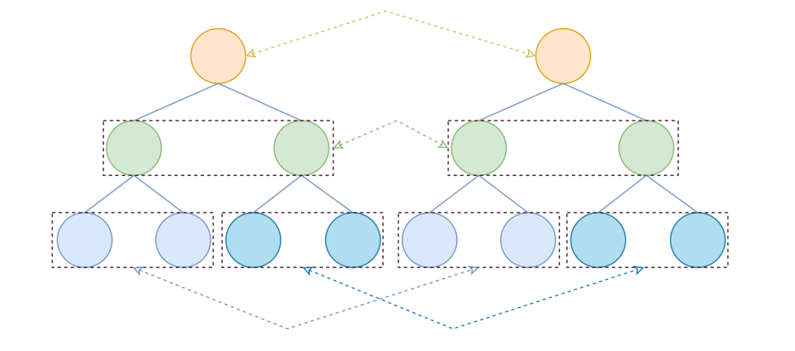
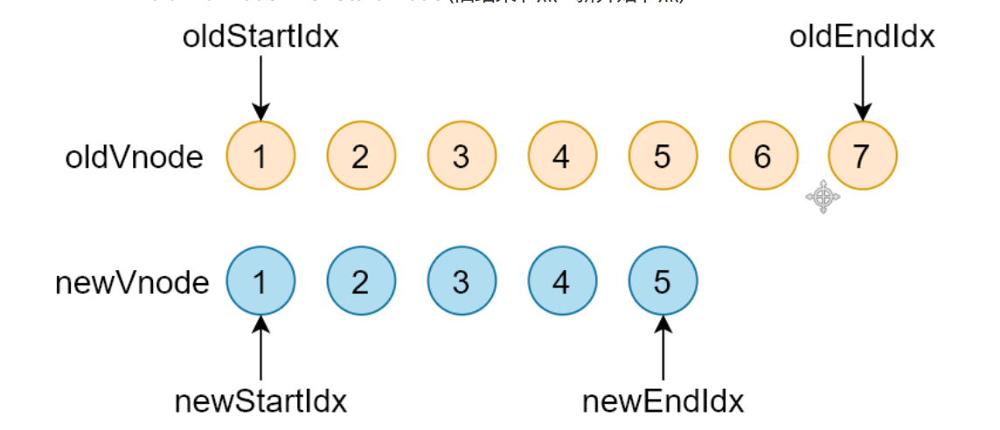
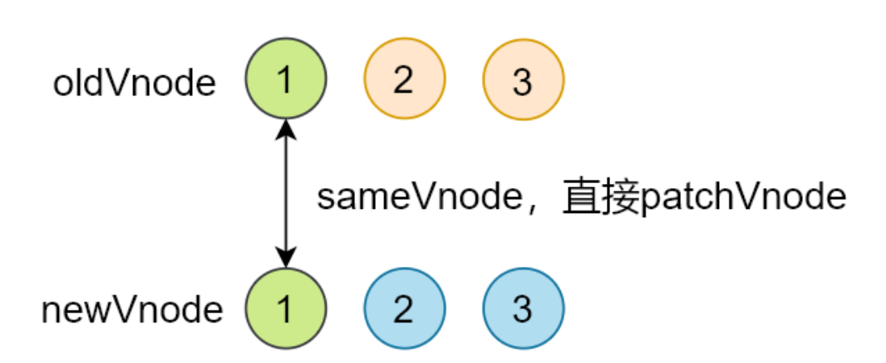
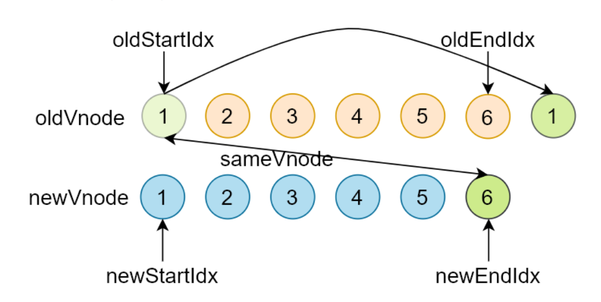
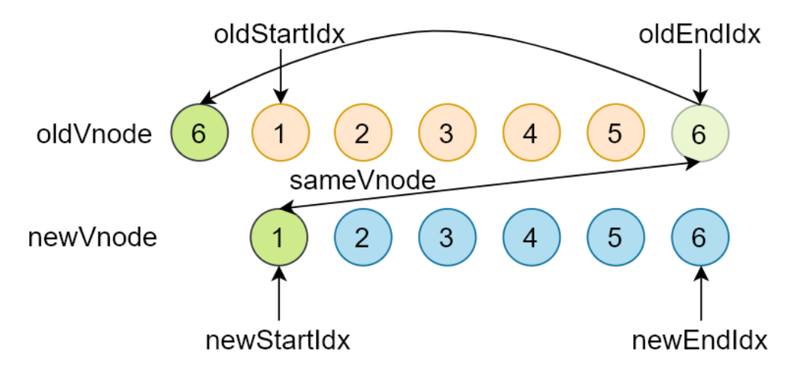
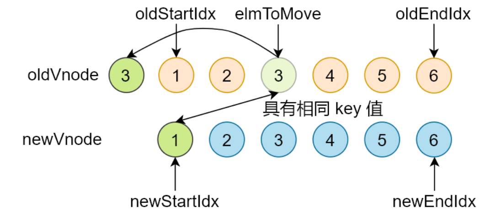
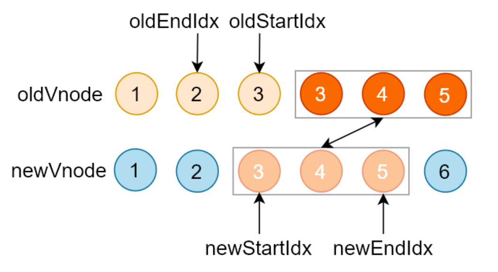
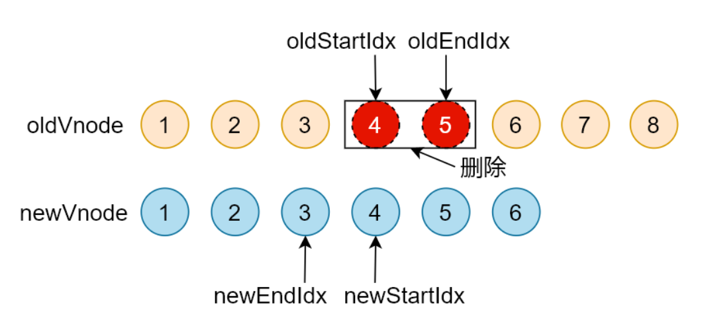

> Virtual DOM(虚拟 DOM)，是由普通的 JS 对象来描述 DOM 对象，因为不是真实的 DOM 对象， 所以叫 Virtual DOM。

一个真实的DOM有许多的属性，所以操作真实的DOM代价是昂贵的，我们可以使用 Virtual DOM 来描述真实 DOM。
```javascript
// 描述了一个DIV的虚拟DOM节点。
var div = {
    sel: 'div',
    data: {},
    children: undefined,
    text: 'Hello Virtual DOM',
    elm: undefined,
    key: undefined,
}
```

## 为什么使用 Virtual DOM
1. 手动操作 DOM 比较麻烦，还需要考虑浏览器兼容性问题，虽然有 jQuery 等库简化 DOM 操作，
但是随着项目的复杂 DOM 操作复杂提升。
2. 为了简化 DOM 的复杂操作于是出现了各种 MVVM 框架，MVVM 框架解决了视图和状态的同步问
题。
3. 为了简化视图的操作我们可以使用模板引擎，但是模板引擎没有解决跟踪状态变化的问题，于是
Virtual DOM 出现了。
4. Virtual DOM 的好处是当状态改变时不需要立即更新 DOM，只需要创建一个虚拟树来描述
DOM， Virtual DOM 内部将弄清楚如何有效(diff)的更新 DOM。
5. 虚拟 DOM 可以维护程序的状态，跟踪上一次的状态。
6. 通过比较前后两次状态的差异更新真实 DOM。

## 虚拟 DOM 的作用
1. 维护视图和状态的关系。
2. 复杂视图情况下提升渲染性能。
3. 除了渲染 DOM 以外，还可以实现 SSR(Nuxt.js/Next.js)、原生应用(Weex/React Native)、小程序
   (mpvue/uni-app)等。

> 没有使用虚拟DOM的案例，会出现闪烁 [案例1](https://codesandbox.io/s/jq-demo-5i7qp)，使用虚拟Dom的案例，平滑过渡 [案例2](https://codesandbox.io/s/snabbdom-demo-4hbyb)
## Virtual DOM 库
- Snabbdom
  - Vue 2.x 内部使用的 Virtual DOM 就是改造的 Snabbdom
  - 大约 200 SLOC（single line of code）
  - 通过模块可扩展
  - 源码使用 TypeScript 开发
  - 最快的 Virtual DOM 之一
- virtual-dom

## Snabbdom 基本使用
- 创建项目，并安装 parcel
  ```bash
  # 创建项目目录
  md snabbdom-demo
  # 进入项目目录
  cd snabbdom-demo
  # 创建 package.json
  yarn init -y
  # 本地安装 parcel
  yarn add parcel-bundler
  ```
  
- 配置 package.json 的 scripts
  ```json 
  "scripts": {
      "dev": "parcel index.html --open",
      "build": "parcel build index.html"
  }
  ```
  
- 创建目录结构
  ```bash
  sadom
  ├── index.html
  ├── package.json
  ├── src
  │   └── case1.js
  └── yarn.lock
  ```
  
  ```html
  <!--index.html-->
  <!DOCTYPE html>
  <html lang="en">
  <head>
      <meta charset="UTF-8">
      <title>Title</title>
  </head>
  <body>
  <div id="app"></div>
  <script src="./src/case1.js" ></script>
  </body>
  </html>
  ```
  
- 下载并导入`snabbdom`

  ```bash
  # 安装
  yarn add snabbdom
  ```

  ```javascript
  import { thunk, h, init } from 'snabbdom'
  ```

  > Snabbdom 的核心仅提供最基本的功能，只导出了三个函数 init()、h()、thunk()  
  >
  > - init() 是一个高阶函数，返回 patch()  。
  >
  > - thunk() 是一种优化策略，可以在处理不可变数据时使用  。
  >
  > - h() 返回虚拟节点 VNode，这个函数我们在使用 Vue.js 的时候见过  。
  >
  >   ```javascript
  >   new Vue({
  >       router,
  >       store,
  >       render: h => h(App)
  >   }).$mount('#app')
  >   ```

### 代码演示

```javascript
/**
 * case1
 */
import { h, init } from 'snabbdom'

// 参数为数组模块，返回值是一个patch函数(作用对比两个vnode的差异更新到真实的DOM中)。
let patch = init([]);

// 第一个参数：标签+选择器
// 第二个参数：如果是字符串的话就是标签中的值
let vnode = h('div#container', "Hello World")

// Vnode最终挂载的地方
let app = document.querySelector('#app');

// 第一个参数：可以是DOM元素，内部会把DOM元素转化为VNode
// 第二个参数：VNode
// 返回值：VNode
let oldVnode = patch(app, vnode)
```

```javascript
/**
 * case2
 */
import { h, init } from 'snabbdom'

// 参数为数组模块，返回值是一个patch函数(作用对比两个vnode的差异更新到真实的DOM中)。
let patch = init([]);

// 给DIV添加子元素
let vnode = h('div#container', [
    h('h1', 'Hello Snabbdom'),
    h('p', '这是一个p标签')
])

let app = document.querySelector('#app');

let oldVnode = patch(app, vnode);

// 2s后更新p标签的内容
setTimeout(() => {
    vnode = h('div#container', [
        h('h1', 'Hello World'),
        h('p', 'Hello P')
    ])
    // 对比新旧虚拟DOM，更新差异部分
    patch(oldVnode, vnode)
}, 2000)

// 清空页面元素 第二个参数不能为Null
setTimeout(() => {
    patch(oldVnode, h('!'))
}, 3000)
```

> 执行脚本`npm run dev`

### 模块

> Snabbdom 的核心库并不能处理元素的属性/样式/事件等，如果需要处理的话，可以使用模块  

官方提供了 6 个模块  

- attributes
  - 设置 DOM 元素的属性，使用 setAttribute ()  。
  - 处理布尔类型的属性。
- props
  - 和 attributes 模块相似，设置 DOM 元素的属性 element[attr] = value 。
  - 不处理布尔类型的属性。
- class
  - 切换类样式。
  - 注意：给元素设置类样式是通过 sel 选择器。
- dataset
  - 设置 data-* 的自定义属性。
- eventlisteners
  - 注册和移除事件。
- style
  - 设置行内样式，支持动画。
  - delayed/remove/destroy。

#### 模块使用

- 导入需要的模块。
- init() 中注册模块。
- 使用 h() 函数创建 VNode 的时候，可以把第二个参数设置为对象，其他参数往后移。

```javascript
// 导入模块
import { h, init, styleModule, eventListenersModule } from 'snabbdom';

// 注册模块
let patch = init([
    styleModule,
    eventListenersModule,
]);

// 使用模块
let vnode = h('div', {
    style: {
        backgroudColor: 'red',
    },
    on: {
        click: eventHandler,
    },
}, [
    h('h1', 'Hello Sanbbdom'),
    h('p', '这是P标签'),
]);

function eventHandler() {
    console.log('点击我了');
}

let app = document.querySelector('#app');

let oldVnode = patch(app, vnode);
```


## Snabbdom 源码解析

Snabbdom 的核心：

- 使用 h() 函数创建 JavaScript 对象(VNode)描述真实 DOM。
- init() 设置模块，创建 patch()。
- patch() 比较新旧两个 VNode。
- 把变化的内容更新到真实 DOM 树上。

源码地址：https://github.com/snabbdom/snabbdom  

src目录结构:

```bash
src
├── h.ts # h() 函数，用来创建 VNode
├── helpers 
│   └── attachto.ts # 定义了 vnode.ts 中 AttachData 的数据结构
├── hooks.ts # 所有钩子函数的定义
├── htmldomapi.ts # 对 DOM API 的包装
├── index.ts # 初始化，返回 init/h/thunk
├── init.ts # 初始化
├── is.ts # 判断数组和原始值的函数
├── jsx.ts # 处理 jsx
├── modules # 所有模块定义
│   ├── attributes.ts
│   ├── class.ts
│   ├── dataset.ts
│   ├── eventlisteners.ts
│   ├── module.ts # 定义了模块中用到的钩子函数
│   ├── props.ts
│   └── style.ts
├── thunk.ts # 优化处理，对复杂视图不可变值得优化
├── tovnode.ts # DOM 转换成 VNode
└── vnode.ts # 虚拟节点定义
```

### h函数

- h() 函数介绍

  - 在使用 Vue 的时候见过 h() 函数

    ```javascript
    new Vue({
        router,
        store,
        render: h => h(App)
    }).$mount('#app')
    ```

  - h() 函数最早见于 hyperscript，使用 JavaScript 创建超文本

  - Snabbdom 中的 h() 函数不是用来创建超文本，而是创建 VNode

- 函数重载

  - 概念

    - 参数个数或类型不同的函数。
    - JavaScript 中没有重载的概念。
    - TypeScript 中有重载，不过重载的实现还是通过代码调整参数。

  - 实例

    ```javascript
    function add (a, b) {
    	console.log(a + b)
    } 
    function add (a, b, c) {
    	console.log(a + b + c)
    } 
    add(1, 2)
    add(1, 2, 3)
    ```

- 源码位置：src/h.ts 

  ```typescript
  // h 函数的重载
  export function h(sel: string): VNode;
  export function h(sel: string, data: VNodeData | null): VNode;
  export function h(sel: string, children: VNodeChildren): VNode;
  export function h(sel: string, data: VNodeData | null, children: VNodeChildren): VNode;
  export function h(sel: any, b?: any, c?: any): VNode {
      var data: VNodeData = {}, children: any, text: any, i: number;
      // 处理参数，实现重载的机制
      if (c !== undefined) {
          // 处理三个参数的情况
          // sel、data、children/text
          if (b !== null) {
              data = b;
          }
          if (is.array(c)) {
              children = c;
          }
          // 如果 c 是字符串或者数字
          else if (is.primitive(c)) {
              text = c;
          }
          // 如果 c 是 VNode
          else if (c && c.sel) {
              children = [c];
          }
      } else if (b !== undefined && b !== null) {
          // 处理两个参数的情况
          // 如果 b 是数组
          if (is.array(b)) {
              children = b;
          }
          // 如果 b 是字符串或者数字
          else if (is.primitive(b)) {
              text = b;
          }
          // 如果 b 是 VNode
          else if (b && b.sel) {
              children = [b];
          } else {
              data = b;
          }
      }
      if (children !== undefined) {
          // 处理 children 中的原始值(string/number)
          for (i = 0; i < children.length; ++i) {
              // 如果 child 是 string/number，创建文本节点
              if (is.primitive(children[i])) children[i] = vnode(undefined,
                  undefined, undefined, children[i], undefined);
          }
      }
      if (
          sel[0] === 's' && sel[1] === 'v' && sel[2] === 'g' &&
          (sel.length === 3 || sel[3] === '.' || sel[3] === '#')
      ) {
          // 如果是 svg，添加命名空间
          addNS(data, children, sel);
      }
      // 返回 VNode
      return vnode(sel, data, children, text, undefined);
  };
  // 导出模块
  export default h;
  ```

### VNode

> 一个 VNode 就是一个虚拟节点用来描述一个 DOM 元素，如果这个 VNode 有 children 就是Virtual DOM  

源码位置：src/vnode.ts  

```javascript
export interface VNode {
    // 选择器
    sel: string | undefined;
    // 节点数据：属性/样式/事件等
    data: VNodeData | undefined;
    // 子节点，和 text 只能互斥
    children: Array<VNode | string> | undefined;
    // 记录 vnode 对应的真实 DOM
    elm: Node | undefined;
    // 节点中的内容，和 children 只能互斥
    text: string | undefined;
    // 优化用
    key: Key | undefined;
}

export function vnode(
    sel: string | undefined,
    data: any | undefined,
    children: Array<VNode | string> | undefined,
    text: string | undefined,
    elm: Element | Text | undefined): VNode {
    let key = data === undefined ? undefined : data.key;
    return {sel, data, children, text, elm, key};
}

export default vnode;
```

### snabbdom

- patch(oldVnode, newVnode)。
- 打补丁，把新节点中变化的内容渲染到真实 DOM，最后返回新节点作为下一次处理的旧节点。
- 对比新旧 VNode 是否相同节点(节点的 key 和 sel 相同)。
- 如果不是相同节点，删除之前的内容，重新渲染。
- 如果是相同节点，再判断新的 VNode 是否有 text，如果有并且和 oldVnode 的 text 不同，直接更
  新文本内容。
- 如果新的 VNode 有 children，判断子节点是否有变化，判断子节点的过程使用的就是 diff 算法。
- diff 过程只进行同层级比较。



#### init

- 功能：init(modules, domApi)，返回 patch() 函数（高阶函数）。

- 为什么要使用高阶函数？

  - 因为 patch() 函数再外部会调用多次，每次调用依赖一些参数，比如：
    modules/domApi/cbs。
  - 通过高阶函数让 init() 内部形成闭包，返回的 patch() 可以访问到 modules/domApi/cbs，而
    不需要重新创建。

- init() 在返回 patch() 之前，首先收集了所有模块中的钩子函数存储到 cbs 对象中。

- 源码位置：src/init.ts  

  ```javascript
  const hooks: (keyof Module)[] = ['create', 'update', 'remove', 'destroy', 'pre', 'post'];
  
  export function init(modules: Array<Partial<Module>>, domApi?: DOMAPI) {
      let i: number, j: number, cbs = ({} as ModuleHooks);
      // 初始化 api
      const api: DOMAPI = domApi !== undefined ? domApi : htmlDomApi;
      // 把传入的所有模块的钩子方法，统一存储到 cbs 对象中
      // 最终构建的 cbs 对象的形式 cbs = [ create: [fn1, fn2], update: [], ... ]
     
      for (i = 0; i < hooks.length; ++i) {
          // cbs['create'] = []
          cbs[hooks[i]] = [];
          for (j = 0; j < modules.length; ++j) {
              // const hook = modules[0]['create']
              const hook = modules[j][hooks[i]];
              if (hook !== undefined) {
                  (cbs[hooks[i]] as Array<any>).push(hook);
              }
          }
      }
  
      return function patch(oldVnode: VNode | Element, vnode: VNode): VNode {}
  }
  ```

#### patch

- 功能：
  - 传入新旧 VNode，对比差异，把差异渲染到 DOM。
  - 返回新的 VNode，作为下一次 patch() 的 oldVnode。
  
- 执行过程：
  - 首先执行模块中的钩子函数 pre。
  - 如果 oldVnode 和 vnode 相同（key 和 sel 相同）
    - 调用 patchVnode()，找节点的差异并更新 DOM
  - 如果 oldVnode 是 DOM 元素
    - 把 DOM 元素转换成 oldVnode
  - 调用 createElm() 把 vnode 转换为真实 DOM，记录到 vnode.elm。
  - 把刚创建的 DOM 元素插入到 parent 中。
  - 移除老节点。
  - 触发用户设置的 create 钩子函数。
  
- 源码位置：src/init.ts  

  ```javascript
  return function patch(oldVnode: VNode | Element, vnode: VNode): VNode {
      let i: number, elm: Node, parent: Node;
      // 保存新插入节点的队列，为了触发钩子函数
      const insertedVnodeQueue: VNodeQueue = [];
      // 执行模块的 pre 钩子函数
      for (i = 0; i < cbs.pre.length; ++i) cbs.pre[i]();
  	// 如果 oldVnode 不是 VNode，创建 VNode 并设置 elm
      if (!isVnode(oldVnode)) {
          // 把 DOM 元素转换成空的 VNode
          oldVnode = emptyNodeAt(oldVnode);
      }
  	
   	// 如果新旧节点是相同节点(key 和 sel 相同)
      if (sameVnode(oldVnode, vnode)) {
          // 找节点的差异并更新 DOM
          patchVnode(oldVnode, vnode, insertedVnodeQueue);
      } else {
          // 如果新旧节点不同，vnode 创建对应的 DOM
  		// 获取当前的 DOM 元素
          elm = oldVnode.elm!;
          parent = api.parentNode(elm) as Node;
  
          createElm(vnode, insertedVnodeQueue);
  
          if (parent !== null) {
              // 如果父节点不为空，把 vnode 对应的 DOM 插入到文档中
              api.insertBefore(parent, vnode.elm!, api.nextSibling(elm));
              // 移除老节点
              removeVnodes(parent, [oldVnode], 0, 0);
          }
      }
  
  	// 执行用户设置的 insert 钩子函数
      for (i = 0; i < insertedVnodeQueue.length; ++i) {
          insertedVnodeQueue[i].data!.hook!.insert!(insertedVnodeQueue[i]);
      }
      
  	// 执行模块的 post 钩子函数
      for (i = 0; i < cbs.post.length; ++i) cbs.post[i]();
      // 返回 vnode
      return vnode;
  };
  ```

#### createElm

- 功能：
  - createElm(vnode, insertedVnodeQueue)，返回创建的 DOM 元素。
  - 创建 vnode 对应的 DOM 元素。
  
- 执行过程：
  - 首先触发用户设置的 init 钩子函数
  - 如果选择器是!，创建评论节点
  - 如果选择器为空，创建文本节点
  - 如果选择器不为空
    - 解析选择器，设置标签的 id 和 class 属性
    - 执行模块的 create 钩子函数
    - 如果 vnode 有 children，创建子 vnode 对应的 DOM，追加到 DOM 树
    - 如果 vnode 的 text 值是 string/number，创建文本节点并追击到 DOM 树
    - 执行用户设置的 create 钩子函数
    - 如果有用户设置的 insert 钩子函数，把 vnode 添加到队列中  
  
- 源码位置：`src/init.ts`

  ```javascript
  function createElm(vnode: VNode, insertedVnodeQueue: VNodeQueue): Node {
    let i: any;
    let data = vnode.data;
    if (data !== undefined) {
      // 执行用户设置的 init 钩子函数
      const init = data.hook?.init;
      if (isDef(init)) {
        init(vnode);
        data = vnode.data;
      }
    }
    const children = vnode.children;
    const sel = vnode.sel;
    // 如果选择器是!，创建评论节点
    if (sel === "!") {
      if (isUndef(vnode.text)) {
        vnode.text = "";
      }
      vnode.elm = api.createComment(vnode.text!);
    } else if (sel !== undefined) {
      // 解析选择器
      const hashIdx = sel.indexOf("#");
      const dotIdx = sel.indexOf(".", hashIdx);
      const hash = hashIdx > 0 ? hashIdx : sel.length;
      const dot = dotIdx > 0 ? dotIdx : sel.length;
      const tag =
        hashIdx !== -1 || dotIdx !== -1
          ? sel.slice(0, Math.min(hash, dot))
          : sel;
      const elm = (vnode.elm =
        isDef(data) && isDef((i = data.ns))
          ? api.createElementNS(i, tag, data)
          : api.createElement(tag, data));
      if (hash < dot) elm.setAttribute("id", sel.slice(hash + 1, dot));
      if (dotIdx > 0)
        elm.setAttribute("class", sel.slice(dot + 1).replace(/\./g, " "));
      // 执行模块的 create 钩子函数
      for (i = 0; i < cbs.create.length; ++i) cbs.create[i](emptyNode, vnode);
      // 如果 vnode 中有子节点，创建子 vnode 对应的 DOM 元素并追加到 DOM 树上
      if (is.array(children)) {
        for (i = 0; i < children.length; ++i) {
          const ch = children[i];
          if (ch != null) {
            api.appendChild(elm, createElm(ch as VNode, insertedVnodeQueue));
          }
        }
      } else if (is.primitive(vnode.text)) {
        // 如果 vnode 的 text 值是 string/number，创建文本节点并追加到 DOM 树
        api.appendChild(elm, api.createTextNode(vnode.text));
      }
      const hook = vnode.data!.hook;
      if (isDef(hook)) {
        // 执行用户传入的钩子 create
        hook.create?.(emptyNode, vnode);
        if (hook.insert) {
          // 把 vnode 添加到队列中，为后续执行 insert 钩子做准备
          insertedVnodeQueue.push(vnode);
        }
      }
    } else {
      // 如果选择器为空，创建文本节点
      vnode.elm = api.createTextNode(vnode.text!);
    }
    // 返回新创建的 DOM
    return vnode.elm;
  }
  ```


#### patchVnode

- 功能：
  - patchVnode(oldVnode, vnode, insertedVnodeQueue)
  - 对比 oldVnode 和 vnode 的差异，把差异渲染到 DOM
  
- 执行过程：
  - 首先执行用户设置的 prepatch 钩子函数
  - 执行 create 钩子函数
    - 首先执行模块的 create 钩子函数
    - 然后执行用户设置的 create 钩子函数
  - 如果 vnode.text 未定义
    - 如果 oldVnode.children 和 vnode.children 都有值
      - 调用 updateChildren()
      - 使用 diff 算法对比子节点，更新子节点
    - 如果 vnode.children 有值， oldVnode.children 无值
      - 清空 DOM 元素
      - 调用 addVnodes() ，批量添加子节点
    - 如果 oldVnode.children 有值， vnode.children 无值
      - 调用 removeVnodes() ，批量移除子节点
    - 如果 oldVnode.text 有值
      - 清空 DOM 元素的内容
  - 如果设置了 vnode.text 并且和和 oldVnode.text 不等
    - 如果老节点有子节点，全部移除
    - 设置 DOM 元素的 textContent 为 vnode.text
  - 最后执行用户设置的 postpatch 钩子函数
  
- 源码位置：`src/init.ts  `

  ```javascript
  function patchVnode(
    oldVnode: VNode,
    vnode: VNode,
    insertedVnodeQueue: VNodeQueue
  ) {
    const hook = vnode.data?.hook;
    // 首先执行用户设置的 prepatch 钩子函数
    hook?.prepatch?.(oldVnode, vnode);
    const elm = (vnode.elm = oldVnode.elm)!;
    const oldCh = oldVnode.children as VNode[];
    const ch = vnode.children as VNode[];
    // 如果新老 vnode 相同返回
    if (oldVnode === vnode) return;
    if (vnode.data !== undefined) {
      // 执行模块的 update 钩子函数
      for (let i = 0; i < cbs.update.length; ++i)
        cbs.update[i](oldVnode, vnode);
      // 执行用户设置的 update 钩子函数
      vnode.data.hook?.update?.(oldVnode, vnode);
    }
    // 如果 vnode.text 未定义
    if (isUndef(vnode.text)) {
      // 如果新老节点都有 children
      if (isDef(oldCh) && isDef(ch)) {
        // 使用 diff 算法对比子节点，更新子节点
        if (oldCh !== ch) updateChildren(elm, oldCh, ch, insertedVnodeQueue);
      } else if (isDef(ch)) {
        // 如果新节点有 children，老节点没有 children
        // 如果老节点有text，清空dom 元素的内容
        if (isDef(oldVnode.text)) api.setTextContent(elm, "");
        // 批量添加子节点
        addVnodes(elm, null, ch, 0, ch.length - 1, insertedVnodeQueue);
      } else if (isDef(oldCh)) {
        // 如果老节点有children，新节点没有children
        // 批量移除子节点
        removeVnodes(elm, oldCh, 0, oldCh.length - 1);
      } else if (isDef(oldVnode.text)) {
        // 如果老节点有 text，清空 DOM 元素
        api.setTextContent(elm, "");
      }
    } else if (oldVnode.text !== vnode.text) {
      // 如果没有设置 vnode.text
      if (isDef(oldCh)) {
        // 如果老节点有 children，移除
        removeVnodes(elm, oldCh, 0, oldCh.length - 1);
      }
      // 设置 DOM 元素的 textContent 为 vnode.text
      api.setTextContent(elm, vnode.text!);
    }
    // 最后执行用户设置的 postpatch 钩子函数
    hook?.postpatch?.(oldVnode, vnode);
  }
  ```

#### updateChildren

1. 功能：

   - diff 算法的核心，对比新旧节点的 children，更新 DOM。

2. 执行过程：

   - 要对比两棵树的差异，我们可以取第一棵树的每一个节点依次和第二课树的每一个节点比较，但是这样的时间复杂度为 O(n^3)。

   - 在DOM 操作的时候我们很少很少会把一个父节点移动/更新到某一个子节点。

   - 因此只需要找同级别的子节点依次比较，然后再找下一级别的节点比较，这样算法的时间复杂度为 O(n)。

     

   - 在进行同级别节点比较的时候，首先会对新老节点数组的开始和结尾节点设置标记索引，遍历的过程中移动索引。

   - 在对开始和结束节点比较的时候，总共有四种情况:

     - oldStartVnode / newStartVnode (旧开始节点 / 新开始节点)。
     - oldEndVnode / newEndVnode (旧结束节点 / 新结束节点)。
     - oldStartVnode / oldEndVnode (旧开始节点 / 新结束节点)。
     - oldEndVnode / newStartVnode (旧结束节点 / 新开始节点)。

     

   - 开始节点和结束节点比较，这两种情况类似。

     - oldStartVnode / newStartVnode (旧开始节点 / 新开始节点)。
     - oldEndVnode / newEndVnode (旧结束节点 / 新结束节点) 。

   - 如果 oldStartVnode 和 newStartVnode 是 sameVnode (key 和 sel 相同)。

     - 调用 patchVnode() 对比和更新节点。
     - 把旧开始和新开始索引往后移动 oldStartIdx++ / oldEndIdx++。

     

   - oldStartVnode / newEndVnode (旧开始节点 / 新结束节点) 相同。

     - 调用 patchVnode() 对比和更新节点。
     - 把 oldStartVnode 对应的 DOM 元素，移动到右边。
       - 更新索引。

     

   - oldEndVnode / newStartVnode (旧结束节点 / 新开始节点) 相同。

     - 调用 patchVnode() 对比和更新节点。
     - 把 oldEndVnode 对应的 DOM 元素，移动到左边。
     - 更新索引。

     

   - 如果不是以上四种情况。

     - 遍历新节点，使用 newStartNode 的 key 在老节点数组中找相同节点。

     - 如果没有找到，说明 newStartNode 是新节点。

       - 创建新节点对应的 DOM 元素，插入到 DOM 树中。

     - 如果找到了。

       - 判断新节点和找到的老节点的 sel 选择器是否相同。
       - 如果不相同，说明节点被修改了。
         - 重新创建对应的 DOM 元素，插入到 DOM 树中。
       - 如果相同，把 elmToMove 对应的 DOM 元素，移动到左边。

       

   - 循环结束。

     - 当老节点的所有子节点先遍历完 (oldStartIdx > oldEndIdx)，循环结束。
     - 新节点的所有子节点先遍历完 (newStartIdx > newEndIdx)，循环结束。

   - 如果老节点的数组先遍历完(oldStartIdx > oldEndIdx)，说明新节点有剩余，把剩余节点批量插入到右边。

     

   - 如果新节点的数组先遍历完(newStartIdx > newEndIdx)，说明老节点有剩余，把剩余节点批量删除。

     

