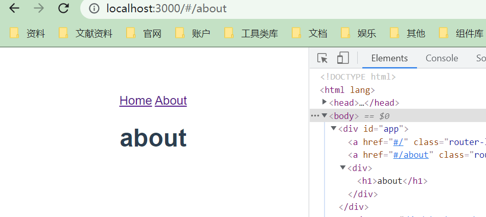
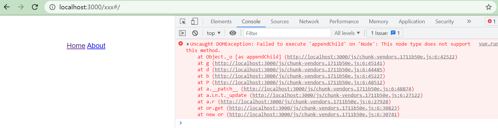

> 前面的打包文件中我们输出了，`vue-ssr-server-bundle.json`和`vue-ssr-client-manifest.json`文件，这里我们需要在服务启动时配置这两个文件；

## 配置修改

修改`/bin/server.js`文件：

```javascript
// 导入express作为渲染服务器
const express = require("express");
const favicon = require('serve-favicon');
const path = require('path');
const fs = require('fs');

// 获取绝对路径
const resolve = dir => {
    return path.resolve(__dirname, dir)
}

// 创建express实例
const app = express();

// 导入createRenderer用于获取渲染器
const { createBundleRenderer } = require("vue-server-renderer");
// 导入打包文件
const bundle = require(resolve("../dist/server/vue-ssr-server-bundle.json"));
const clientManifest = require(resolve("../dist/client/vue-ssr-client-manifest.json"));
// 导入宿主文件
const template = fs.readFileSync(resolve("../public/index.html"), "utf-8");

const renderer = createBundleRenderer(bundle, {
    runInNewContext: false, // https://ssr.vuejs.org/zh/api/#runinnewcontext
    template, // 宿主文件
    clientManifest // 客户端清单
});

// 处理favicon图标
app.use(favicon(path.join(__dirname, '../public', 'favicon.ico')))
app.use(express.static('../dist/client', {index: false}))
// 路由是通配符，表示所有url都接受
app.get("*", function (req, res) {
    // 设置url参数
    const context = {url: req.url}
    // 若未传递回调函数，则返回Promise
    // renderToString可以将vue实例转换为html字符串
    renderer.renderToString(context).then((html) => {
        res.send(html);
    }).catch((err) =>{
        res.status(err.code).send(err.msg);
    });
});

// 启动node服务
app.listen(3000, () => {
    console.log("启动成功");
});
```

> 以上代码设置完毕之后，一个ssr就基本完毕了，现在你可以执行`npm run build`完成打包后执行`node server.js`;然后浏览器访问`http://localhost:3000`就可以了；



## 注意事项

1. 如果你访问的url不是正确的路由地址：`http://localhost:3000/qwe#/`类似的地址，那么你会收到控制台的报错：

   

   > 出现这种情况的原因是，你输入的url地址没有匹配的路由，找不到相关页面；但是这种只是针对刷新页面的时候，而且不影响路由导航。

2. 如果正常访问后控制台不报错，但是路由对应的页面不显示，那么这是因为你的路由对象参数写的不对：

   ```javascript
   {
       path: 'home',
       // 此处如果不小心写错了 component 那么不会出现任何的报错提示，只是路由无法显示；
       component: Home,
   }
   ```

   
