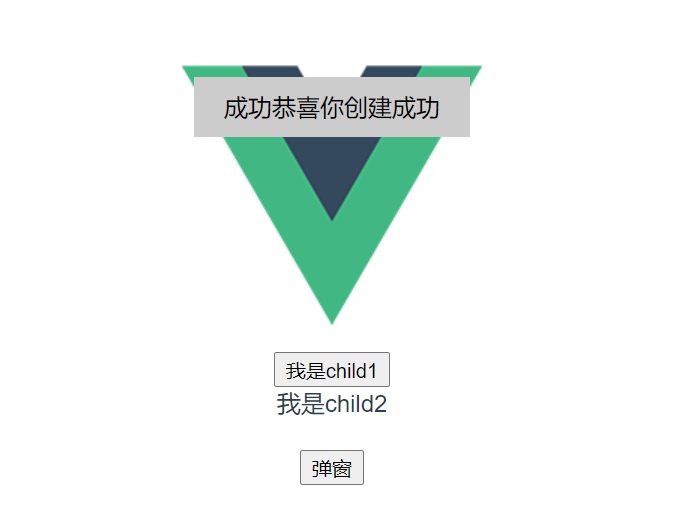

> 吐司组件在前端中算是最常用的组件了，这里简单实现一下；

## 封装toast组件

> ui部分，主要是显示内容；

```vue
<template>
    <div class="w-toast" v-show="visible">
        <span class="w-toast-title">{{ title }}</span>
        <slot>
            <p class="w-toast-content">{{ content }}</p>
        </slot>
    </div>
</template>
<script>
export default {
    name: 'WToast',
    props: {
        title: String,
        content: String,
        duration: {
            default: 3000
        }
    },
    data() {
        return {
            visible: false,
        }
    },
    methods: {
        open() {
            this.visible = true;
            setTimeout(this.close, this.duration);
        },
        close() {
            this.visible = false;
            this.remove();
        }
    }
}
</script>
<style scoped>
.w-toast {
    position: fixed;
    left: 50%;
    top: 20%;
    max-width: 300px;
    height: 40px;
    line-height: 40px;
    padding: 0 20px;
    transform: translateX(-50%);
    background: #ccc;
}
.w-toast-content {
    margin: 0;
    display: inline-block;
}
</style>
```

## 创建create函数

> 方法用于随时创建使用 toast 提示；

```javascript
import Vue from 'vue';

// 方式一
function create(component, props) {
    // 完成vue的初始化但是没有要挂载的节点；
    const _vm = new Vue({
        render(h) {
            return h(component, { props })
        }
    }).$mount();

    // 挂载到 body 节点上
    document.body.appendChild(_vm.$el);

    // 给组件示例添加销毁方法；
    const comp = _vm.$children[0];
    comp.remove = () => {
        document.body.removeChild(_vm.$el);
        _vm.$destroy();
    }
    return comp;
}

// 方式二；
function create(component, props) {
    const Ctor = Vue.extend(component)
    const comp = new Ctor({ propsData: props });
    comp.$mount();
    document.body.appendChild(comp.$el);

    // 给组件示例添加销毁方法；
    comp.remove = () => {
        document.body.removeChild(comp.$el);
        comp.$destroy();
    }
    return comp;
}

export default create;
```

## 使用

```vue
<template>
  <div>
    <button @click="open">弹窗</button>
  </div>
</template>

<script>
import toast from './toast.vue';
import create from '../utils/toast';
export default {
  methods: {
    open() {
      create(toast, {
        title: '成功',
        content: '恭喜你创建成功',
        duration: 1000,
      }).open();
    }
  }
}
</script>
```

