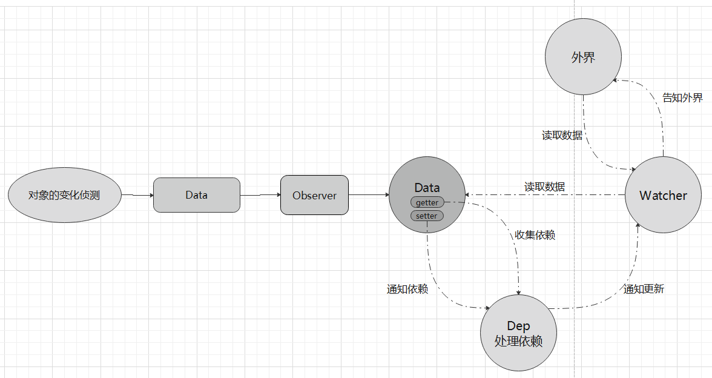

> 说起`vue`的响应式原理，大家也许只知道它的底层是对`js`的原生方法`defineProperty`的封装，而具体的实现却是一头雾水。下面我们就一探究竟。

## 1、封装`defineProperty`。

> 主要目的：就是存取拦截；在`get`中收集依赖，在`set`中触发依赖；
>
> 依赖是什么？依赖就是用到数据的地方，那个地方用到了这个属性，那么我们就通知谁，也就是触发依赖；

```js
const Dep = require('./Dep.js')
const Observer = require('./Observer.js')
/**
 * 存取描述符
 */
function defineReactive(data, key, val) {
  // 新增 递归子属性；
  if (typeof val === 'object') {
    new Observer(val)
  }
  // 每一个属性都会有一个依赖表，用来收集自己的依赖；
  let dep = new Dep()
  Object.defineProperty(data, key, {
    enumerable: true,
    configurable: true,
    get: function () {
      // 收集依赖
      dep.depend()
      return val
    },
    set: function (newval) {
      if (val === newval) {
        return
      }
      val = newval
      // 通知触发收集的依赖项
      dep.notify()
    }
  })
}
exports.defineReactive =  defineReactive
```

## 2、封装 `Dep`的类；

> 主要目的：用于处理依赖。

```js
/**
 * 收集依赖
 */
let uid = 0

/**
 * 此id 会在每一次new Dep的时候执行，也就是只会在 首次转换为 get 和set 的时候执行；
 */
 class Dep {
  constructor () {
    // 收集依赖的集合
    this.id = uid++
    this.subs = []
  }

  // 添加依赖；
  addSub (sub) {
    this.subs.push(sub)
  }

  // 删除依赖；
  removeSub (sub) {
    remove(this.subs, sub)
  }

  // 收集依赖
  depend () {
    if (global.target) {
      global.target.addDep(this)
    }
  }

  // 通知
  notify () {
    const subs = this.subs.slice()
    for (let i = 0; i < subs.length; i++) {
      subs[i].update()
    }
  }
}

function remove (arr, item) {
  if (arr.length) {
    const index = arr.indexOf(item)
    if (index > -1) {
      return arr.splice(index, 1)
    }
  }
}

exports.Dep = Dep

```

## 3、`Observer;`

> 作用：将一个数据内的所有的属性都转换成getter/setter的形式。然后去追踪他们的变化;

```js
const defineReactive = require('./defineReactive.js')

class Observer {
  constructor (value) {
    this.value = value
    if (!Array.isArray(value)) {
      this.walk(value)
    }
  }

  walk (obj) {
    const keys = Object.keys(obj)
    for (let i = 0; i < keys.length; i++) {
     defineReactive.defineReactive(obj, keys[i], obj[keys[i]])
    }
  }
}
exports.Observer = Observer

```

## 4、`Watcher`;

> 一个 Watcher 中介的角色，收集的依赖就是它。
>
> 因为它知道你要访问的属性；

```js
class Watcher {
  constructor(vm, expOrFn, cb) {
    this.vm = vm
    this.deps = []
    this.depIds = new Set()
    // 执行this.getter(),就可以读取data.a.b.c的内容
    this.getter = parsePath(expOrFn)
    this.cb = cb
    this.value = this.get()
  }

  get() {
    // 把依赖存在 global.target 上，
    global.target = this
    // 这一步会触发 getter 函数从而把自己添加到依赖表中；value 是读取到的值。
    let value = this.getter.call(this.vm, this.vm)
    // 避免重复添加依赖，但是在通知更新的时候依然添加了重复的依赖；
    global.target = undefined
    return value
  }

  update() {
    const oldValue = this.value
    this.value = this.get()
    this.cb.call(this.vm, this.value, oldValue)
  }

  addDep(dep) {
    const id = dep.id
    /**
     * 主要目的：避免通知更新的时候重复收集依赖；
     */
    if (!this.depIds.has(id)) {
      this.depIds.add(id)
      this.deps.push(dep)
      dep.addSub(this)
    }
  }

  // 取消观察；
  teardown() {
    let i = this.deps.length
    while (i--) {
      this.deps[i].removeSub(this)
    }
  }
}

// 用于根据路径来读取属性的值；
const bailRE = /[^\w.$]/

function parsePath(path) {
  if (bailRE.test(path)) {
    return
  }
  const segments = path.split('.')
  return function (obj) {
    for (let i = 0; i < segments.length; i++) {
      if (!obj) return
      // obj[segments[i]] 在读取值时会触发 get 拦截函数；
      obj = obj[segments[i]]
    }
    return obj
  }
}

exports.Watcher = Watcher

```

## 5、使用；

> 实现：`vm.$watch()`

```js
const Observer = require('./Observer.js')
const Watcher = require('./Watcher.js')

var data = {
  name: '小红',
  age: 18,
  skill: {
    dance: '芭蕾舞',
    exercise: '跑步'
  }
}
// 观测所有的属性的变化
new Observer.Observer(data)

function Vm() {}

Vm.prototype.$watch = function (obj, path, cb) {
  const watcher = new Watcher.Watcher(obj, path, cb)

  // 取消观察
  return function unwatchFn() {
    watcher.teardown()
  }
}
var vm = new Vm()

vm.$watch(data, 'skill.dance', (newVal, oldVal) => {
  console.log('我执行了', newVal, oldVal)
})
data.skill.dance = '哈哈=='
```

````bash
object
    ├── defineReactive.js
    ├── Dep.js
    ├── index.js
    ├── Observer.js
    ├── Watcher.js
````

## 总结；

> `vue`通过对`js`的原生方法的封装；来达到对数据的访问和赋值的拦截，然后做执行自己的逻辑代码；
>
> 要想达到对数据的响应，就要对数据进行处理，就是把用到这个数据的地方收集起来，然后当这个值发生变化时，通过便会通过触发`get`函数，来通知用到这个数据的地方，则其修改；


