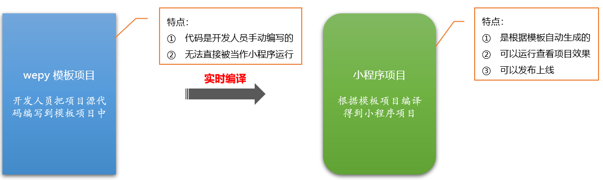
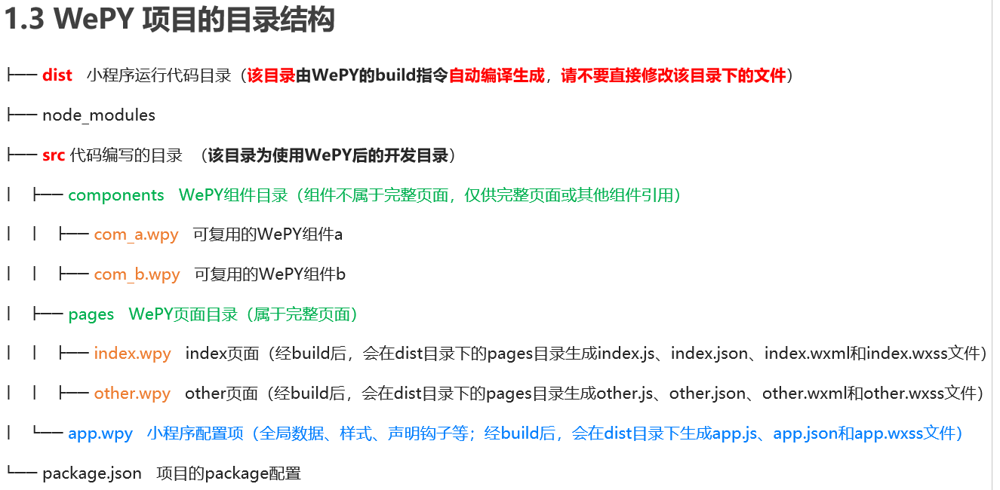
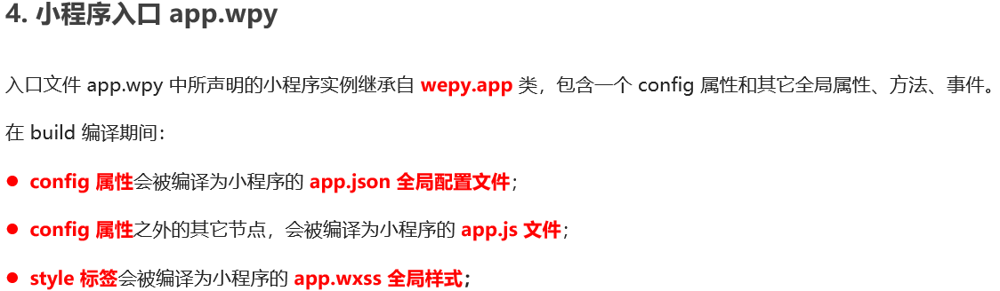

##  WePY框架概述

> **WePY** 是腾讯官方出品的一个小程序快速开发框架，对原生小程序的开发模式进行了再次封装，更贴近于 MVVM 架构模式，并支持ES6/7的一些新特性，同时语法风格更接近于 Vue.js，使用 WePY 框架能够提高小程序的开发效率。

**注意：**WePY 只是小程序的快速开发框架之一，市面上还有诸如 mpvue、taro、uniapp 之类的小程序开发框架也比较流行。

## 为什么要使用WePY

1. **WePY** 相比于原生小程序开发，拥有众多的**开发特性**和**优化方案**，例如：

   - 开发风格接近于 Vue.js，支持很多vue中的语法特性；

   - 通过 polyfill 让小程序完美支持 Promise；

   - 可以使用ES6等诸多高级语法特性，简化代码，提高开发效率；

   - 对小程序本身的性能做出了进一步的优化；

   - 支持第三方的 npm 资源；

   - 支持多种插件处理和编译器；

   - letc…

## **安装** **WePY** **框架**  

> WePY 的安装或更新都通过 npm 进行，全局安装或更新 WePY 命令行工具，可以在终端运行以下命令：

```bash
npm install wepy-cli -g
```

## 初始化 **WePY** **项目**  

```bash
wepy init standard myproject
```

> 其中，”wepy init” 是固定写法，代表要初始化 wepy 项目；
>
> ”standard” 代表模板类型为标准模板，可以运行 ”wepy list” 命令查看所有可用的项目模板；
>
>  ”myproject” 为自定义的项目名称。
>
> **注意：**创建项目的时候，要勾选 ESLint 选项！

## WePY项目与小程序项目的关系

> 通过 wepy init 命令初始化的 wepy 项目，准确来说只是一个模板项目，不能直接当作小程序运行。需要运行相关的命令，**把模板项目编译为小程序项目**，才可以运行。



## 实时编译WePY项目

> 使用 wepy init 命令初始化项目后，只是得到了一个模板项目，如果想开启实时编译，得到小程序项目，步骤如下：
>
> ①运行 cd myproject 切换至 WePY 项目根目录
>
> ②运行 npm install 安装 WePY 项目依赖项
>
> ③运行 wepy build --watch 开启实时编译
>
> **注意：**wepy build --watch 命令，会循环监听 WePY 项目中源代码的变化，自动编译生成小程序项目，生成的小程序项目默认被存放于 dist 目录中**。**



## 加载**WePY** **项目到微信开发者工具**  

> 1.7.0 版本之后的 wepy-cli 工具生成的项目根目录下，包含 **project.config.json** 文件，记录了项目的基本配置信息，例如：项目的名称、appId、生成的小程序项目根路径等。
>
> 如果项目中存在 **project.config.json** 文件，使用 微信开发者工具 --> 导入项目，”项目目录”请选择 wepy 项目根目录，即可根据 project.config.json 文件中的配置，把 wepy 编译生成的小程序项目加载到微信开发者工具中。

### `.wpy`文件的组成部分

> 一个 .wpy 文件可分为三大部分，各自对应于一个标签：
>
> 1.  **脚本部分**，即 <script></script> 标签中的内容，又可分为两个部分：
>    - **逻辑部分**，除了 config 对象之外的部分，对应于原生的 .js 文件
>    - **配置部分**，即 config 对象，对应于原生的 .json 文件
>
> 1. **结构部分**，即 <template></template> 模板部分，对应于原生的 .wxml 文件。
>
> 1. **样式部分**，即<style></style>样式部分，对应于原生的 .wxss 文件。
>
> 其中，**小程序入口文件** **app.wpy** **不需要** **template**，所以编译时会被忽略。

