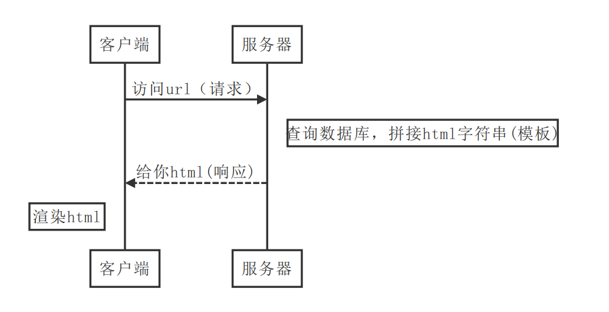
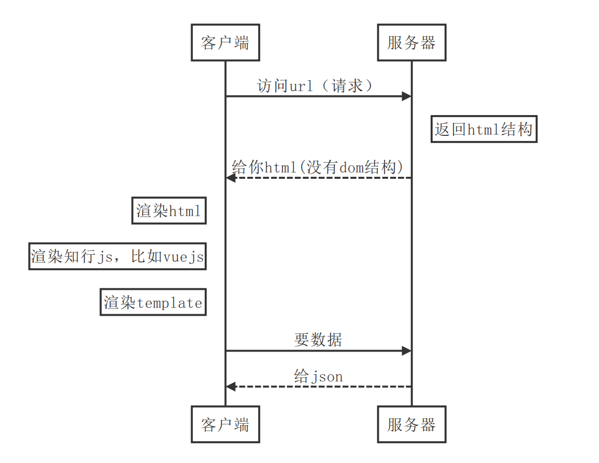

> Vue.js 是构建客户端应用程序的框架。默认情况下，可以在浏览器中输出 Vue 组件，进行生成 DOM 和操作 DOM。然而，也可以将同一个组件渲染为服务器端的 HTML 字符串，将它们直接发送到浏览器，最后将这些静态标记"激活"为客户端上完全可交互的应用程序。

::: tip

服务器渲染的 Vue.js 应用程序也可以被认为是"同构"或"通用"，因为应用程序的大部分代码都可以在**服务器**和**客户端**上运行。

:::

## 理解SSR

- 传统服务端渲染SSR 
- 单页面应用SPA
- 服务端渲染SSR

## 传统WEB开发

> 传统web开发，网页内容在服务端渲染完成，一次性传输到浏览器  

## 单页应用SPA

> 单页应用优秀的用户体验，使其逐渐成为主流，页面内容由JS渲染出来，这种方式称为客户端渲染  

**vue的项目中，浏览器拿到的仅有宿主元素#app，并没有内容。**  

## 服务端渲染

> SSR解决方案，后端渲染出完整的首屏的dom结构返回，前端拿到的内容包括首屏及完整spa结构，应用激活后依然按照spa方式运行，这种页面渲染方式被称为服务端渲染 (server side render)

## 为什么使用服务器端渲染 (SSR)？

与传统 SPA (单页应用程序 (Single-Page Application)) 相比，服务器端渲染 (SSR) 的优势主要在于：

- 更好的 SEO。搜索引擎爬虫抓取工具可以直接查看完全渲染的页面。

- 更快的内容到达时间 (time-to-content)，特别是对于缓慢的网络情况或运行缓慢的设备。

  > 相对于客户端渲染，服务端渲染在浏览器请求`URL`之后已经得到了一个带有数据的`HTML`文本，浏览器只需要解析`HTML`，直接构建`DOM`树就可以。而客户端渲染，需要先得到一个空的`HTML`页面，这个时候页面已经进入白屏，之后还需要经过加载并执行`JavaScript`、请求后端服务器获取数据、`JavaScript` 渲染页面几个过程才可以看到最后的页面。特别是在复杂应用中，由于需要加载 `JavaScript` 脚本，越是复杂的应用，需要加载的 `JavaScript` 脚本就越多、越大，这会导致应用的首屏加载时间非常长，进而降低了体验感。
  > 链接：https://www.jianshu.com/p/3df5fde98995

使用服务器端渲染 (SSR) 时还需要有一些权衡之处：

- 开发条件所限。浏览器特定的代码，只能在某些生命周期钩子函数 (lifecycle hook) 中使用；一些外部扩展库 (external library) 可能需要特殊处理，才能在服务器渲染应用程序中运行。
- 涉及构建设置和部署的更多要求。与可以部署在任何静态文件服务器上的完全静态单页面应用程序 (SPA) 不同，服务器渲染应用程序，需要处于 Node.js server 运行环境。
- 更多的服务器端负载。在 Node.js 中渲染完整的应用程序，显然会比仅仅提供静态文件的 server 更加大量占用 CPU 资源 (CPU-intensive - CPU 密集)，因此如果你预料在高流量环境 (high traffic) 下使用，请准备相应的服务器负载，并明智地采用缓存策略。

::: tip

在对你的应用程序使用服务器端渲染 (SSR) 之前，你应该问的第一个问题是，是否真的需要它。这主要取决于内容到达时间 (time-to-content) 对应用程序的重要程度。例如，如果你正在构建一个内部仪表盘，初始加载时的额外几百毫秒并不重要，这种情况下去使用服务器端渲染 (SSR) 将是一个小题大作之举。然而，内容到达时间 (time-to-content) 要求是绝对关键的指标，在这种情况下，服务器端渲染 (SSR) 可以帮助你实现最佳的初始加载性能。

:::