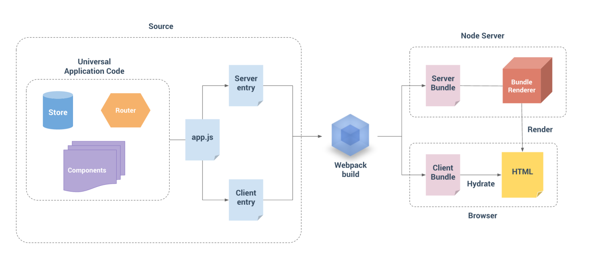

> 对于客户端应用程序和服务器应用程序，我们都要使用 webpack 打包 - 服务器需要「服务器 bundle」然后用于服务器端渲染(SSR)，而「客户端 bundle」会发送给浏览器，用于混合静态标记。  



所以我们需要两份webpack的入口文件，分别用于客户端和服务端的打包；

```bash
src
├── main.js # 用于创建vue实例
├── entry-client.js # 客户端入口，用于静态内容“激活”
└── entry-server.js # 服务端入口，用于首屏内容渲染
```

