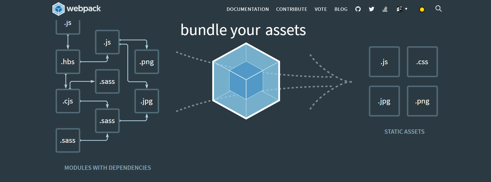

## `webpack、webpack-cli、webpack-dev-server`的关系

> webpack的核心是用于现代JavaScript应用程序的静态模块打包器。当webpack处理您的应用程序时，它会在内部构建一个[依赖关系图](https://webpack.js.org/concepts/dependency-graph/)，该图映射您项目所需的每个模块并生成一个或多个包。[官方文档](https://webpack.js.org/)



- `webpackv1`和`webpackv2`可以查看的说明可以查看 [CSDN博主的介绍](https://blog.csdn.net/weixin_42614080/article/details/106297384)；

## `webpack@3.xx`

> 根据官方文档介绍我们知道`webpack`主要提供打包服务。
>
> 比如vue项目中，webpack会根据配置的入口文件，递归的去构建你的文件依赖关系树并根据你提供的loader去编译解析你的代码，然后输出一个编译后的文件。

1. 示例：

   - 初始化一个项目；新建一个文件夹，并再文件中打开cmd然后输入以下命令：

     ```
     npm init 
     ```

   - 安装`webpack@3.8.1`;

     ```
     npm i webpack@3.8.1
     ```

   - 新建`webpack.config.js`文件；并写入以下代码；

     ```js
     // 导入path 模块
     const path = require('path')
     
     module.exports = {
       entry: './main.js',
       output: {
         // 将所有依赖的模块合并输出到一个[name].js文件
         // 若不指定静态的文件名则的默认的name为：main；
         // filename: '[name]_[id]_[hash:8].js',
         filename: '[name].js',
         // 将输出文件都放在dist目录下；
         path: path.resolve(__dirname, './dist')
       },
     }
     
     ```

   - 添加脚本；

     ```json
     "build": "webpack --config webpack.config.js"
     ```

     

   - 新建`main.js`文件,并写入以下代码；

     ```js
     window.document.getElementById('app').innerText = 'hello' + 'webpack'
     ```

   - 新建`index.html`文件，并写入以下代码；

     ```html
     <!DOCTYPE html>
     <html lang="en">
       <head>
         <meta charset="UTF-8" />
         <title>Title</title>
       </head>
       <body>
         <div id="app"></div>
       </body>
       <!--导入webpack输出时的js文件 直接打开index.html文件时使用 -->
       <script src="./dist/main.js"></script>
     </html>
     
     ```

   - 运行脚本后，我们可以看到在当前目录下会多出一个dist文件夹，里面会有一个`main.js`文件。

   - 在index.html中引入打包的main.js文件，然后再浏览器中打开index.html文件。我们可以看到`hellowebpack`文字。

2. 启动一个服务：

   > webpack只是提供了打包文件的能力，但是实际开发中我们不可能每次都手动在文件中引入打包出来的文件，因为这会是一个想当繁琐的一项工作。

   - 安装`webpack-dev-server`；

     > webpack-dev-server是webpack官方提供的一个小型Express服务器。使用它可以为webpack打包生成的资源文件提供web服务。 
     >
     >  webpack-dev-server 主要提供两个功能： 
     >
     > - 为静态文件提供web服务
     > - 自动刷新和热替换(HMR)

     ```
     npm i webpack-dev-server@2.6.1
     ```

   - 配置并启动脚本：

     ```
     "serve": "webpack-dev-server --hot", // --hot 表示 热更新
     ```

   - 启动成功：

     ```bash
     
     > webpack_@1.0.0 serve
     > webpack-dev-server --hot
     
     Project is running at http://localhost:8081/
     webpack output is served from /
     Hash: 9c59c5f60ee3be57c42d
     Version: webpack 3.8.1
     Time: 576ms
       Asset    Size  Chunks                    Chunk Names
     main.js  362 kB       0  [emitted]  [big]  main
       [19] (webpack)/hot/log.js 1 kB {0} [built]
       [35] (webpack)/hot/emitter.js 75 bytes {0} [built]
       [36] multi (webpack)-dev-server/client?http://localhost:8081 webpack/hot/dev-server ./main.js 52 bytes {0} [built]
       [37] (webpack)-dev-server/client?http://localhost:8081 5.83 kB {0} [built]
       [38] ./node_modules/url/url.js 23.3 kB {0} [built]
       [39] ./node_modules/punycode/punycode.js 14.7 kB {0} [built]
       [40] ./node_modules/url/util.js 314 bytes {0} [built]
       [44] ./node_modules/strip-ansi/index.js 161 bytes {0} [built]
       [46] ./node_modules/loglevel/lib/loglevel.js 8.61 kB {0} [built]
       [47] (webpack)-dev-server/client/socket.js 856 bytes {0} [built]
       [79] (webpack)-dev-server/client/overlay.js 3.6 kB {0} [built]
       [85] (webpack)/hot nonrecursive ^\.\/log$ 170 bytes {0} [built]
       [87] (webpack)/hot/dev-server.js 1.56 kB {0} [built]
       [88] (webpack)/hot/log-apply-result.js 1.27 kB {0} [built]
       [89] ./src/main.js 265 bytes {0} [built]
         + 75 hidden modules
     webpack: Compiled successfully.
     
     ```

     > 服务启动成功默认会占用8080端口，并托管你的整个项目文件。

## `webpack@4.xx`

> webpack@4.xx的示例就不做演示了，这里只说下区别；
>
> - 在webpack4以前，也就是我上面的那个例子，你会发现我没有使用`webpack-cli`工具。webpak提供打包，dev-server提供服务。但是在webpack4以后，你会发现，如果你只安装一个webpack4.xx，就直接开始打包，日志会提示你安装webpack-cli工具。这是因为，在webpack4.xx以前`webpack和webpack-cli`是在一起的，而在webpack4.xx之后，官方把二者分开了既命令行工具由`webpack-cli`提供。

## `webpack-dev-server`版本差异；

在webpack-dev-server@2.xx中，我们只需要安装一个`webpack-dev-server`就可以配合`webpack`进行项目的开发。但是在webapck-dev-server@3.xx中，你会发现在启动webapck-dev-server是，会报一个`Cannot find module 'webpack-cli/bin/config-yargs`错误；这是因为在这个版本中它依赖于webpack-cli；

## 版本对比

| webpack | webpack-dev-server | webpack-cli |
| ------- | ------------------ | ----------- |
| 3.xx    | 2.xx               |             |
| 4.xx    | 3.xx               | 3.xx        |
| 5.xx    | 暂未使用           | 4.xx        |

