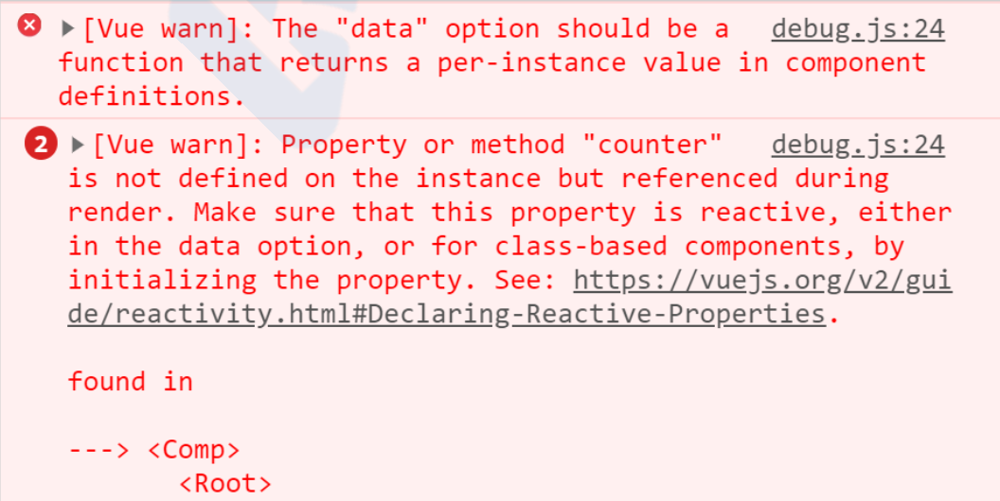

> 不知道看到题目的你有没有想过这个事情，下面就解释为什么？

同样的最好的答案就是查看源码，以下是一段vue的源码：

```javascript
// src\core\instance\state.js - initData()
function initData (vm: Component) {
  let data = vm.$options.data
  data = vm._data = typeof data === 'function'
    ? getData(data, vm)
    : data || {}
 ...省略
}
```

> 可能突然看到上面的一小段代码也不知道要说明什么，那么我们可以简单的从组件化说起，在vue的项目中我们常常会封装很多业务组件然后在很多其他的页面中使用，但是你需要解决的问题是数据的独立性，各个页面中的组件数据应该是独立的，那么这一点vue给我们解决了，解决的方法就是返回一个全新的对象来保证数据的独立性。上面的这段代码我们可以看到当data是函数时返回的是函数的调用结果，而当data是对象的时候则直接返回。

::: tip

当你强行返回一个对象时，vue会给出如下警告：



:::

**解答：**

Vue组件可能存在多个实例，如果使用对象形式定义data，则会导致它们共用一个data对象，那么状态变更将会影响所有组件实例，这是不合理的；采用函数形式定义，在initData时会将其作为工厂函数返回全新data对象，有效规避多实例之间状态污染问题。而在Vue根实例创建过程中则不存在该限制，也是因为根实例只能有一个，不需要担心这种情况。

