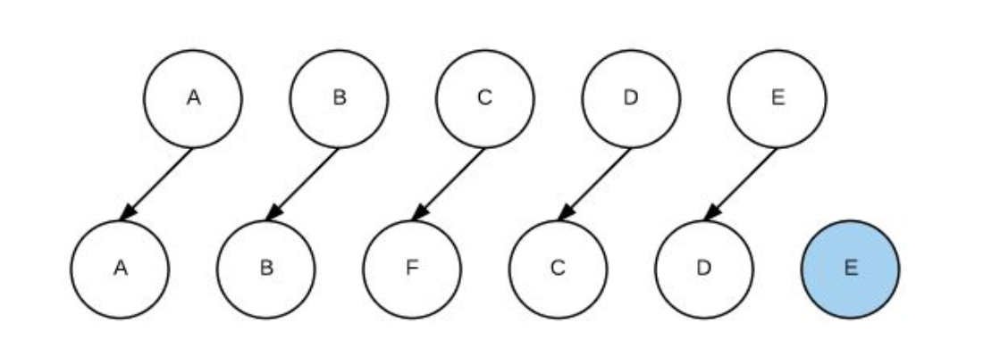
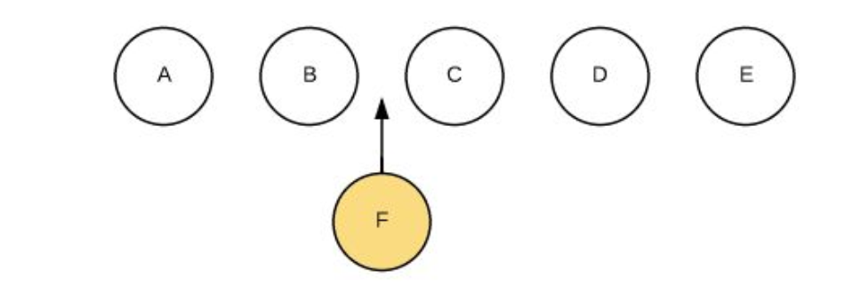

最有力的说明就是源码，咱直接上源码：

```javascript
// src\core\vdom\patch.js - updateChildren()
function updateChildren (parentElm, oldCh, newCh, insertedVnodeQueue, removeOnly) {
	...省略
    while (oldStartIdx <= oldEndIdx && newStartIdx <= newEndIdx) {
      if (isUndef(oldStartVnode)) {
        oldStartVnode = oldCh[++oldStartIdx] // Vnode has been moved left
      } else if (isUndef(oldEndVnode)) {
        oldEndVnode = oldCh[--oldEndIdx]
      } else if (sameVnode(oldStartVnode, newStartVnode)) {
        patchVnode(oldStartVnode, newStartVnode, insertedVnodeQueue, newCh, newStartIdx)
        oldStartVnode = oldCh[++oldStartIdx]
        newStartVnode = newCh[++newStartIdx]
      } else if (sameVnode(oldEndVnode, newEndVnode)) {
        patchVnode(oldEndVnode, newEndVnode, insertedVnodeQueue, newCh, newEndIdx)
        oldEndVnode = oldCh[--oldEndIdx]
        newEndVnode = newCh[--newEndIdx]
      } else if (sameVnode(oldStartVnode, newEndVnode)) { // Vnode moved right
        patchVnode(oldStartVnode, newEndVnode, insertedVnodeQueue, newCh, newEndIdx)
        canMove && nodeOps.insertBefore(parentElm, oldStartVnode.elm, nodeOps.nextSibling(oldEndVnode.elm))
        oldStartVnode = oldCh[++oldStartIdx]
        newEndVnode = newCh[--newEndIdx]
      } else if (sameVnode(oldEndVnode, newStartVnode)) { // Vnode moved left
        patchVnode(oldEndVnode, newStartVnode, insertedVnodeQueue, newCh, newStartIdx)
        canMove && nodeOps.insertBefore(parentElm, oldEndVnode.elm, oldStartVnode.elm)
        oldEndVnode = oldCh[--oldEndIdx]
        newStartVnode = newCh[++newStartIdx]
      } else {
        ...省略
      }
    }
    if (oldStartIdx > oldEndIdx) {
      refElm = isUndef(newCh[newEndIdx + 1]) ? null : newCh[newEndIdx + 1].elm
      addVnodes(parentElm, refElm, newCh, newStartIdx, newEndIdx, insertedVnodeQueue)
    } else if (newStartIdx > newEndIdx) {
      removeVnodes(oldCh, oldStartIdx, oldEndIdx)
    }
  }
```

> 上面的代码你或许看不懂，所以咱举个例子

```vue
<!DOCTYPE html>
<html>
<body>
<div id="demo">
  <p v-for="item in items" :key="item">{{item}}</p>
</div>
<script src="../../dist/vue.js"></script>
<script>
  // 创建实例
  const app = new Vue({
    el: '#demo',
    data: { items: ['a', 'b', 'c', 'd', 'e'] },
    mounted () {
      setTimeout(() => {
        this.items.splice(2, 0, 'f')
      }, 2000);
    },
  });
</script>
</body>
</html>
```

> 上面案例我们渲染一个数组中的数据，并在2s后插入一条数据到该数组中，那么在使用key和不使用key的情况如下所示。

**不适用key：**



**使用key:**



```javascript
// 首次循环patch A
A B C D E
A B F C D E
// 第2次循环patch B
B C D E
B F C D E
// 第3次循环patch E
C D E
F C D E
// 第4次循环patch D
C D
F C D
// 第5次循环patch C
C F
C
// oldCh全部处理结束，newCh中剩下的F，创建F并插入到C前面
```

通过上面的过程我们可以看出使用key和不使用key在dom的更新策略上其实是有很大区别的，那么下面就间述下dom的更新过程。

说到更新这里要提到一个diff算法，上面的更新过程就是diff算法的一部分。vue在更新视图之前会进行虚拟dom比较也就是diff算法。

1. 不使用key:

   如果不使用key值，那么vue就依次更新abcde，也就是说，从c开始就会一直覆盖式更新，最后创建一个e。

2. 使用key：

   如果使用key值，那么vue在进行c f对比的时候就会使用优化策略，按照【新前与旧前，新后与旧后，新后与旧前，新前与旧后】的方式依次进行对比。最后只会执行dom e的插入操作。这样以来就大大提升了我们的web性能。减少了不必要的性能消耗。

3. 另外，若不设置key还可能在列表更新时引发一些隐蔽的bug ,[案例](https://codesandbox.io/s/vue-template-forked-kivn6?file=/src/App.vue)

> key的作用主要是为了高效的更新虚拟DOM，其原理是vue在patch过程中通过key可以精准判断两个节点是否是同一个，从而避免频繁更新不同元素，使得整个patch过程更加高效，减少DOM操作量，提高性能。  

参考博文：https://www.zhihu.com/question/61064119

