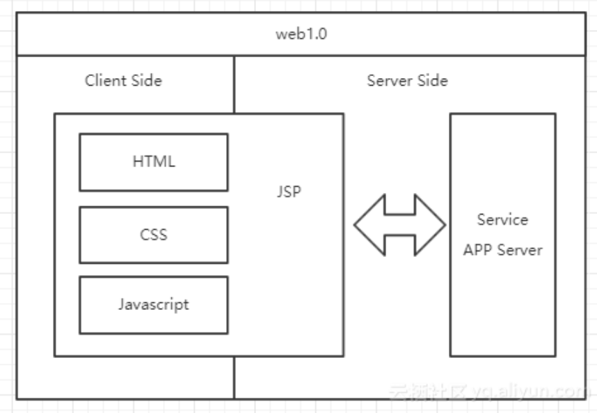
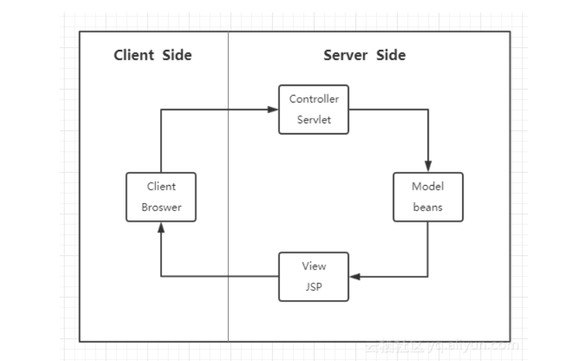
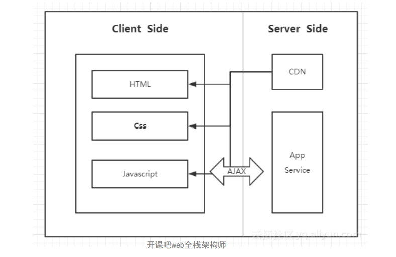
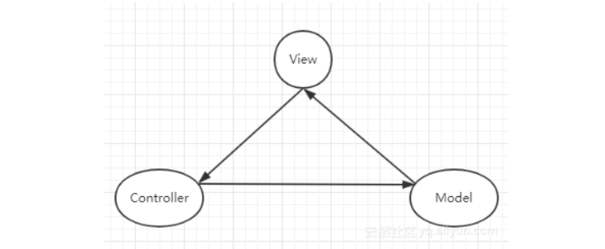
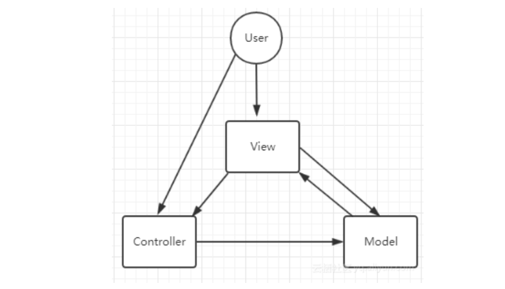
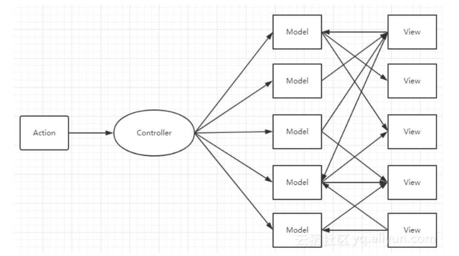
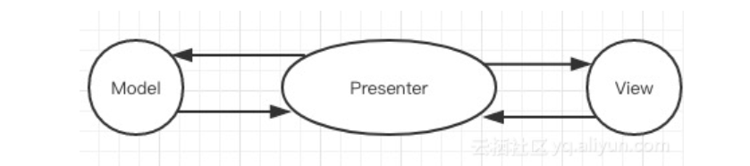
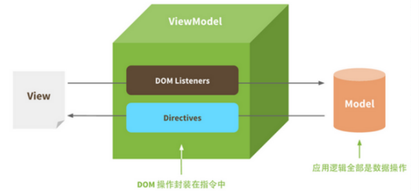

> 答题思路：此题涉及知识点很多，很难说清、说透，因为mvc、mvp这些我们前端程序员自己甚至都没用过。但是恰恰反映了前端这些年从无到有，从有到优的变迁过程，因此沿此思路回答将十分清楚。  

## Web1.0时代

> 在web1.0时代，并没有前端的概念。开发一个web应用多数采用ASP.NET/Java/PHP编写，项目通常由多个aspx/jsp/php文件构成，每个文件中同时包含了HTML、CSS、JavaScript、C#/Java/PHP代码，系统整体架构可能是这样子的：  

> 这种架构的好处是简单快捷，但是，缺点也非常明显：JSP代码难以维护  

为了让开发更加便捷，代码更易维护，前后端职责更清晰。便衍生出MVC开发模式和框架，前端展示以
模板的形式出现。典型的框架就是Spring、Structs、Hibernate。整体框架如图所示：  

> 使用这种分层架构，职责清晰，代码易维护。但这里的MVC仅限于后端，前后端形成了一定的分离，前端只完成了后端开发中的view层。  

但是，同样的这种模式存在着一些：  

- 前端页面开发效率不高;
- 前后端职责不清

## web 2.0时代

> 自从Gmail的出现，ajax技术开始风靡全球。有了ajax之后，前后端的职责就更加清晰了。因为前端可以通过Ajax与后端进行数据交互，因此，整体的架构图也变化成了下面这幅图：  

通过ajax与后台服务器进行数据交换，前端开发人员，只需要开发页面这部分内容，数据可由后台进行提供。而且ajax可以使得页面实现部分刷新，减少了服务端负载和流量消耗，用户体验也更佳。这时，才开始有专职的前端工程师。同时前端的类库也慢慢的开始发展，最著名的就是jQuery了。当然，此架构也存在问题：缺乏可行的开发模式承载更复杂的业务需求，页面内容都杂糅在一起，一旦应用规模增大，就会导致难以维护了。因此，前端的MVC也随之而来。  

## 前后端分离后的架构演变

### MVC

前端的MVC与后端类似，具备着View、Controller和Model。  

- Model：负责保存应用数据，与后端数据进行同步。
- Controller：负责业务逻辑，根据用户行为对Model数据进行修改。
- View：负责视图展示，将model中的数据可视化出来。

三者形成了一个如图所示的模型：  

> 这样的模型，在理论上是可行的。但往往在实际开发中，并不会这样操作。因为开发过程并不灵活。例如，一个小小的事件操作，都必须经过这样的一个流程，那么开发就不再便捷了。  

在实际场景中，我们往往会看到另一种模式，如图：  

这种模式在开发中更加的灵活，backbone.js框架就是这种的模式。  

但是，这种灵活可能导致严重的问题：  

- 数据流混乱。如下图：  

  

- View比较庞大，而Controller比较单薄：由于很多的开发者都会在view中写一些逻辑代码，逐渐的就导致view中的内容越来越庞大，而controller变得越来越单薄。  

> 既然有缺陷，就会有变革。前端的变化中，似乎少了MVP的这种模式，是因为AngularJS早早地将MVVM框架模式带入了前端。MVP模式虽然前端开发并不常见，但是在安卓等原生开发中，开发者还是会考虑到它。  

### MVP

MVP与MVC很接近，P指的是Presenter，presenter可以理解为一个中间人，它负责着View和Model之间的数据流动，防止View和Model之间直接交流。我们可以看一下图示：  

我们可以通过看到，presenter负责和Model进行双向交互，还和View进行双向交互。这种交互方式，相对于MVC来说少了一些灵活，VIew变成了被动视图，并且本身变得很小。虽然它分离了View和Model。但是应用逐渐变大之后，导致presenter的体积增大，难以维护。要解决这个问题，或许可以从MVVM的思想中找到答案。  

### MVVM

首先，何为MVVM呢？MVVM可以分解成(Model-View-VIewModel)。ViewModel可以理解为在presenter基础上的进阶版。如图所示：  

ViewModel通过实现一套数据响应式机制自动响应Model中数据变化；同时Viewmodel会实现一套更新策略自动将数据变化转换为视图更新；通过事件监听响应View中用户交互修改Model中数据。这样在ViewModel中就减少了大量DOM操作代码。MVVM在保持View和Model松耦合的同时，还减少了维护它们关系的代码，使用户专注于业务逻辑，兼顾开发效率和可维护性。  

## 总结

- 这三者都是框架模式，它们设计的目标都是为了解决Model和View的耦合问题。
- MVC模式出现较早主要应用在后端，如Spring MVC、ASP.NET MVC等，在前端领域的早期也有应
  用，如Backbone.js。它的优点是分层清晰，缺点是数据流混乱，灵活性带来的维护性问题。
- MVP模式在是MVC的进化形式，Presenter作为中间层负责MV通信，解决了两者耦合问题，但P层
  过于臃肿会导致维护问题。
- MVVM模式在前端领域有广泛应用，它不仅解决MV耦合问题，还同时解决了维护两者映射关系的
  大量繁杂代码和DOM操作代码，在提高开发效率、可读性同时还保持了优越的性能表现。  

