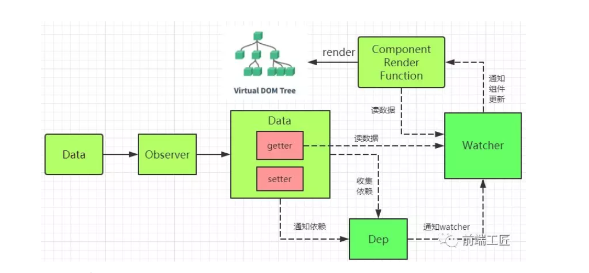

> vue是使用object.defineProperty来实现响应式的。



**observer类**  

```javascript
/* observer 类会附加到每一个被侦测的object上
* 一旦被附加上，observer会被object的所有属性转换为getter/setter的形式
* 当属性发生变化时候及时通知依赖
*/
// Observer 实例
export class Observer {
  constructor(value) {
    this.value = value
    if (!Array.isArray(value)) { // 判断是否是数组
      this.walk(value) // 劫持对象
    }
  }

  walk(obj) { // 将会每一个属性转换为getter/setter 形式来侦测数据变化
    const keys = Object.keys(obj)
    for (let i = 0; i < keys.length; i++) {
      defineReactive(obj, keys[i], obj[keys[i]]) // 数据劫持方法
    }
  }
}
function defineReactive(data,key,val){
  // 递归属性
  if(typeof val ==='object'){
    new Obeserve(val)
  }
  let dep = new Dep()
  Object.defineProperty(data,key,{
    enumerable:true,
    configurable:true,
    get:function(){
      dep.depend()
      return val
    },
    set:function(newVal){
      if(val===newVal){
        return
      } 
      val = newVal
      dep.notify()
    }
  })
}
```

> 定义了 observer类，用来将一个正常的object转换成被侦测的object 然后判断数据类型，只有object类型才会调用walk将每一个属性转换成getter/setter的形式来侦测变化，最后在 defineReactive 中新增new Observer（val）来递归子属性，当data中的属性变化时，与这个属性对应的依赖就会接收通知。

**dep依赖收集**  

getter中收集依赖，那么这些依赖收集到那？  

```javascript

export default class Dep {
  constructor () {
    this.subs = [] // 观察者集合
  }
// 添加观察者
  addSub (sub) {
    this.subs.push(sub)
  }
// 移除观察者
  removeSub (sub) {
    remove(this.subs, sub)
  } 
  depend () { // 核心，如果存在 ，则进行依赖收集操作
    if (window.target) {
      this.addDep(window.target)
    }
  } 
  notify () {
    const subs = this.subs.slice() // 避免污染原来的集合
// 如果不是异步执行，先进行排序，保证观察者执行顺序
    if (process.env.NODE_ENV !== 'production' && !config.async) {
      subs.sort((a, b) => a.id - b.id)
    } 
    for (let i = 0, l = subs.length; i < l; i++) {
      subs[i].update() // 发布执行
    }
  }
} 
function remove(arr,item){
  if(arr.length){
    const index = arr.indexOf(item)
    if(index > -1){
      return arr.splice(index,1)
    }
  }
}
```

> 收集的依赖时 window.target ,他到以是什么？当属性变化时候我们通知谁？  

**watcher**  

是一个中介的角色，数据发生变化时通知它，然后它再去通知其他地方  

```javascript
export default class Watcher {
  constructor (vm,expOrFn,cb) {
    // 组件实例对象
    // 要观察的表达式，函数，或者字符串，只要能触发取值操作
    // 被观察者发生变化后的回调
    this.vm = vm // Watcher有一个 vm 属性，表明它是属于哪个组件的
    // 执行this.getter()及时读取数据
    this.getter = parsePath(expOrFn)
    this.cb = cb
    this.value = this.get()
  }
  get(){
    window.target = this
    let value = this.getter.call(this.vm,this.vm)
    window.target = undefined
    return value
  } u
  pdate(){
    const oldValue = this.value
    this.value = this.get()
    this.cb.call(this.vm,this.value,oldValue)
  }
}
```

## 总结

data通过Observer转换成了getter/setter的形式来追踪变化当外界通过Watcher读取数据的，会触发getter从而将watcher添加到依赖中
当数据变化时，会触发setter从而向Dep中的依赖（watcher）发送通知watcher接收通知后，会向外界发送通知，变化通知到外界后可能会触发视图更新，也有可能触发用户的某个回调函数等  

