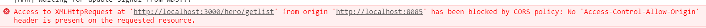
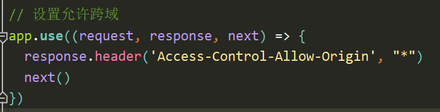

## 1、问题概述；

> 在项目中我们时常会遇到跨域，比如下面的这种情况；



> 注：项目的后台我是用`nodejs`写的；

## 2、解决；

### 2-1、方法一；

- 就是直接在后台的代码里，添加 `Access-Control-Allow-Origin`响应头；**前端无需任何配置**；

  ```js
  // response.header('Access-Control-Allow-Origin', "*")
  ```

  

### 2-2、方法二、

- 利用`vue `的`proxy`代理，来解决跨域；

  ```js
  module.exports = {
    devServer: {
      host: 'localhost', // 指定本地运行的ip
      port: 8085, // 自定义本地运行的端口
      open: true, // 自动打开浏览器
      proxy: {
        // '/':为所有的请求都会被代理 若为 '/api'：则只有被匹配到的接口会被代理；
        '/api': {
          target: 'http://47.114.139.71:3000', // 要代理的第三方接口地址
          /**
           * 路径重定向：可以不设置此值，下面的意思是：
           * 如果你的请求的路径是：http://localhost:8085/api/add
           * 那么被重定向后：http://47.114.139.71:3000/add
           */
          pathRewrite: {
             '^/api': ''
          }
        }
      }
    }
  }
  // 设置`proxy`完毕后便可解决跨域；
  ```

  > 注：使用`proxy`代理解决跨域，则`axios`的默认基地址不能设置，否则不生效；
