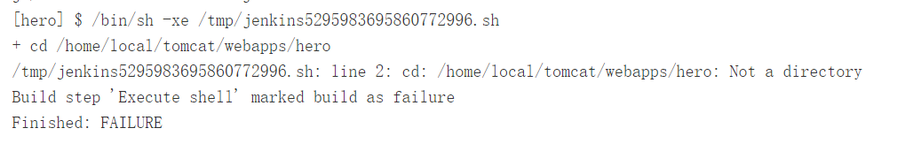
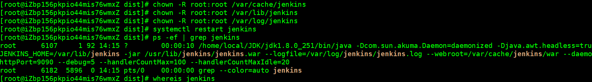
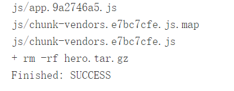

> 目的很简单，就是想自己实现一个`web`项目的全自动化部署；
>
> 但是现实总是残酷的，在搭建到用`jenkins`的过程中遇到了很多的坑；
>
> 本人的系统： aliyun liunx jenkins@1.7

从网上看了很多的教程顺利完成了安装，登录和创建项目，但是在构建时，总是不成功；



每次打包都是上面的这个错误，在网上找了很多的资料，都没有单独对这个问题的说明解答；

所以在这里就单独对这个问题做解答；

- 我是打包完成了，只是想要切换路径进入tomcat目录，但是死活进不去，提示没有这样的目录。

- 最后的解决方案是用户权限的问题；

-  打开`jenkins`配置文件: 

  ```
  vim /etc/sysconfig/jenkins
  ```

-  将原来的`jenkins`用户修改为 `root`用户。 

  ```
  $JENKINS_USER="root"
  ```

- 修改`Jenkins`相关文件夹用户权限

  ```
  chown -R root:root /var/lib/jenkins
  chown -R root:root /var/cache/jenkins
  chown -R root:root /var/log/jenkins
  ```

- 重启Jenkins

  ```
  systemctl restart jenkins
  ```

- 查看Jenkins进程所属用户

  ```
  ps -ef | grep jenkins
  ```

  

- 重新执行构建；



转载： https://blog.csdn.net/jeikerxiao/article/details/80768949 

