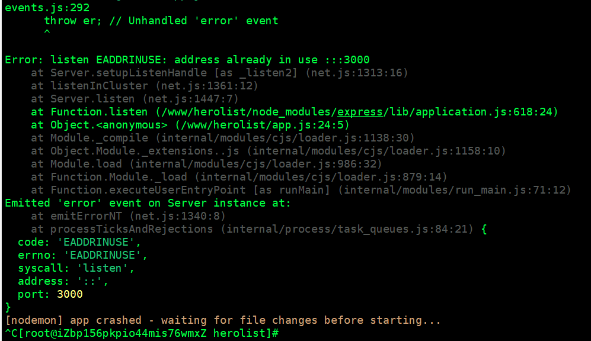
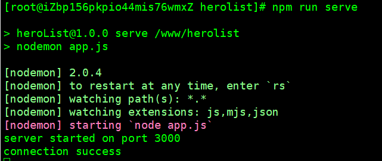

> 在测试上执行`npm run serve`时报错；



```
主要原因就是：3000端口被占用了
```

## 解决；

- 查看端口;

  ```
  执行命令：`netstat -tunlp|grep 3000`查看端口被哪一个进程所占用；
  ```

  

- 中止被占用的进程；

  ```
  执行命令：`kill -s 9 17235`
  ```

  

## 重新启动；



  

  