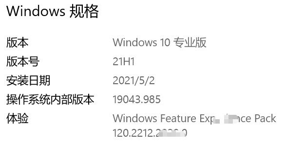
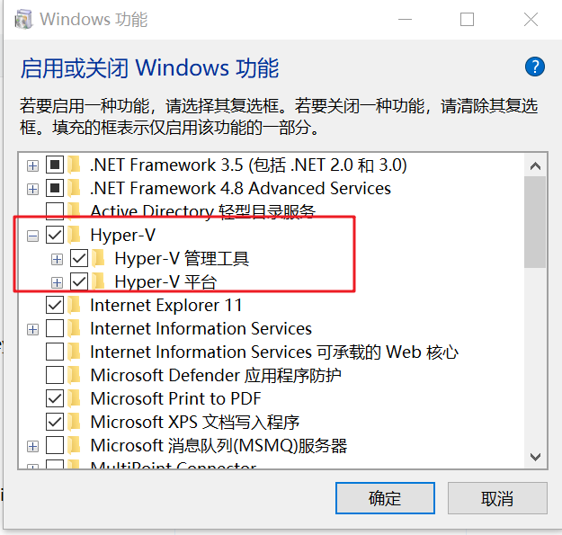
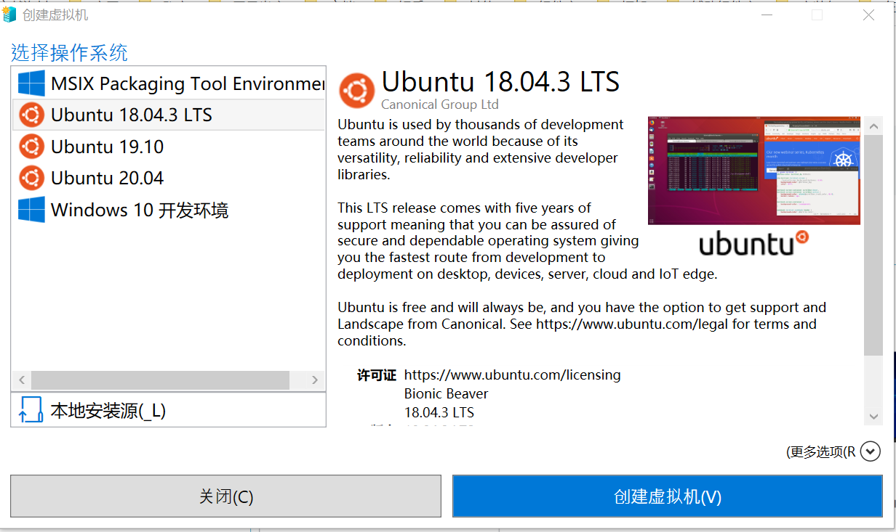
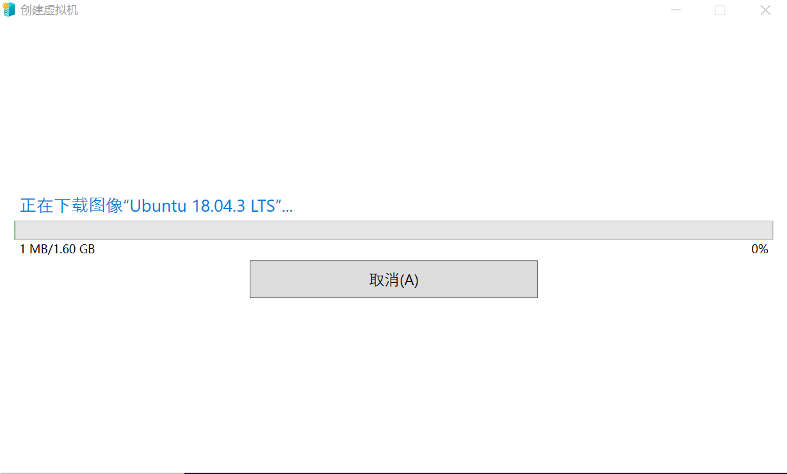
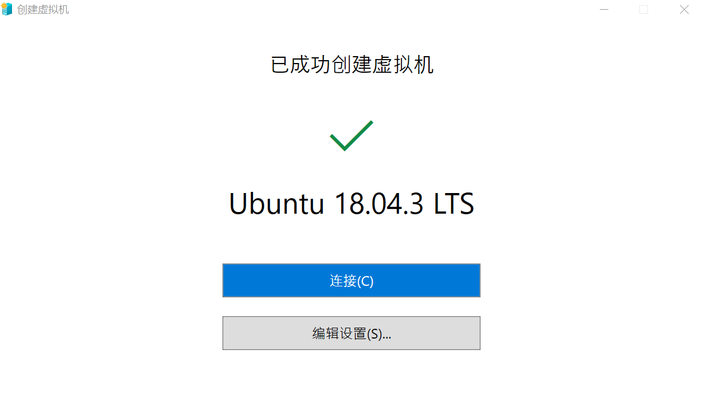
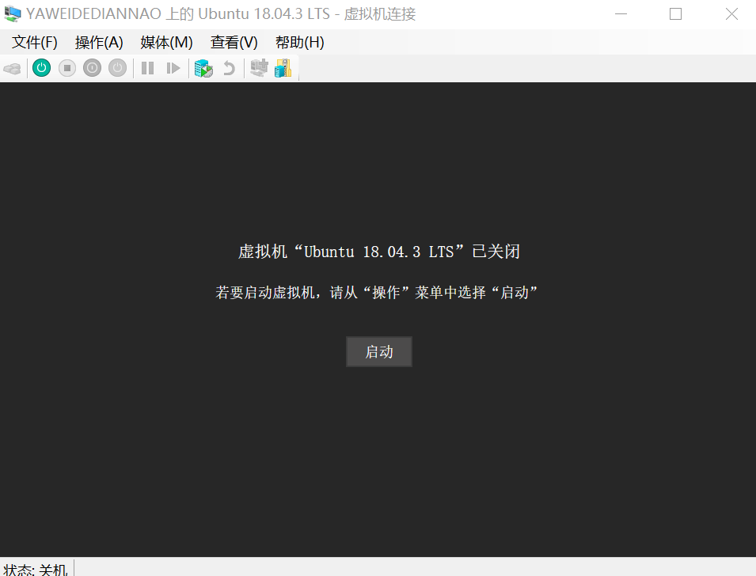
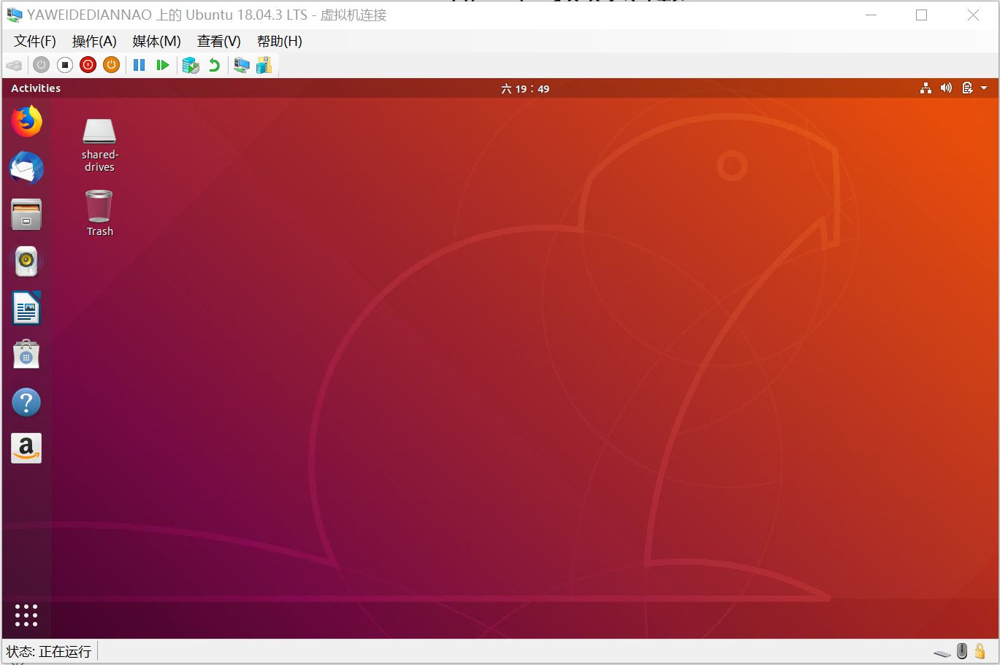

> Hyper-V 提供硬件虚拟化，Hyper-V 可以让你在 Windows 上以虚拟机形式**运行多个完全独立的操作系统**，其中包括各种版本的 Linux、FreeBSD 和 Windows。这意味着每个虚拟机都在虚拟硬件上运行。 Hyper-V 允许你创建虚拟硬盘驱动器、虚拟交换机以及许多其他虚拟设备，所有这些都可以添加到虚拟机中。Windows 上的 Hyper-V 支持虚拟机中的许多不同操作系统，

## 使用虚拟化的原因

虚拟化允许你：

- 运行需要早期版本的 Windows 操作系统或非 Windows 操作系统的软件。
- 实验其他操作系统。 通过 Hyper-V，可轻松创建和删除不同的操作系统。
- 使用多个虚拟机在多个操作系统上测试软件。 通过 Hyper-V，可以在一部台式机或便携式计算机上运行所有内容。 可以将这些虚拟机导出并随后导入到任何其他 Hyper-V 系统中，包括 Azure。

> Hyper-V 可用于 64 位 Windows 10 专业版、企业版和教育版。 **它无法用于家庭版。**

本人电脑信息；

## 安装 Hyper-V

> 启用 Hyper-V 以在 Windows 10 上创建虚拟机。可以通过多种方式启用 Hyper-V，包括使用 Windows 10 控制面板、PowerShell 或使用部署映像服务和管理工具 (DISM)。**要求：Windows 10 企业版、专业版或教育版**

::: tip

Hyper-V 作为可选功能内置于 Windows -- 无需下载 Hyper-V。

**请勿**在 Windows 10 家庭版上安装 Hyper-V 角色。

:::

### 通过“设置”启用 Hyper-V 角色

1. 右键单击 Windows 按钮并选择“应用和功能”。
2. 选择相关设置下右侧的“程序和功能”。
3. 选择“**打开或关闭 Windows 功能**”。
4. 选择“**Hyper-V**”，然后单击“**确定**”。

安装完成后，系统会提示你重启计算机。

## 创建虚拟机

> Windows 10 版本 1709 及更高版本；

1. 

2. 
   

3. 选择一个操作系统或者或使用本地安装源选择你自己的操作系统。
   

4. 点击创建虚拟机；
   
   
   

   点击启动然后，跟着提示，一直往下走，
   

   恭喜你，ubantu系统虚拟机创建成功；

[官方文档](https://docs.microsoft.com/zh-cn/virtualization/hyper-v-on-windows/quick-start/quick-create-virtual-machine)

