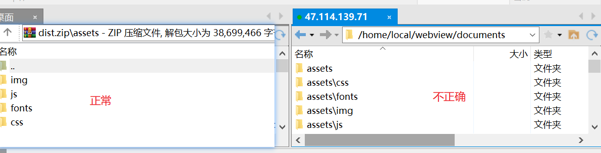
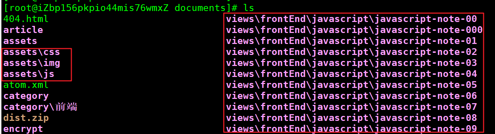

> 遇到这个问题还是由于前端使用nodejs压缩打包文件，然后上传到linux服务器上，本想着解压完成就完事了，结果没那么简单。

## 历史由来：

> Windows 用反斜杠（“\”）的历史来自 DOS，而 DOS 的另一个传统是用斜杠（“/”）表示命令行参数，比如：
> cd %SystemDrive% dir /s /b shell32.dll。而在 UNIX 环境中，我们用减号（“-”）和双减号（“--”）表示命令行参数。 用斜杠表示命令行参数是兼容性原因。这个问题最初起源自 IBM。IBM 在最初加入 DOS 开发时贡献了大批工具，它们都是用斜杠处理命令行参数的。而这个传统源自于 DEC/IBM，比如当年的 VMS 就是用斜杠处理命令行参数，它的目录分隔符是美元符（“$”）。顺便说一句，这个传统也被部分地继承进了 DOS 和 Windows 体系，日文版的 Windows 就把反斜杠在屏幕上显示为“¥”，虽然实际上还是反斜杠。
> **如今的 Windows 内核在处理路径时确实可以同时支持斜杠和反斜杠**。很多时候我们看到用斜杠时出错，是因为应用程序层面的原因。比如 cmd.exe 就不支持用斜杠表示路径，而PowerShell.exe 支持，也正因为这个原因，PowerShell 开始转而使用减号作为命令行参数的起始符。

## **问题由来:**

我使用的Nodejs的`jszip`第三方包，来压缩我的静态资源，文件确实可以压缩，也可以正常打开，一点问题没有。但是上传到服务器上的解压缩的时候就有问题了，见下图：





很显然路径出错了，瞬间懵逼了，不过当我尝试直接修改文件名的时候，也就是把`\`修改为`/`，结果是正常的，文件夹会自动分层。这样问题就更加清楚了。

## **解决方案：**

> 在我们进行压缩的时候直接把需要用到的文件路径中的`\`替换为`/`就好了。

**nodeejs官方说明；**

> The default operation of the `path` module varies based on the operating system on which a Node.js application is running. Specifically, when running on a Windows operating system, the `path` module will assume that Windows-style paths are being used.

可以看到在Node下默认的路径是与操作系统保持一致的，因此出现了 `\`。为了要获取到符合 `/` 格式的路径，我们可以使用 `PATH` 模块提供的 `path.sep` [接口](https://link.zhihu.com/?target=https%3A//nodejs.org/dist/latest-v12.x/docs/api/path.html%23path_path_sep)进行字符串匹配截取，接口会根据系统环境的不同进行匹配截取。

例：

```shell
# window
PS E:\documents> node
Welcome to Node.js v12.20.0.
Type ".help" for more information.
> 'foo\\bar\\baz'.split(path.sep);
[ 'foo', 'bar', 'baz' ]
>

# linux
[root@iZbp156pkpio44mis76wmxZ documents]# node
Welcome to Node.js v12.18.2.
Type ".help" for more information.
> 'foo/bar/baz'.split(path.sep);
[ 'foo', 'bar', 'baz' ]
> 
```

### 参考链接；

https://zhuanlan.zhihu.com/p/115746564

