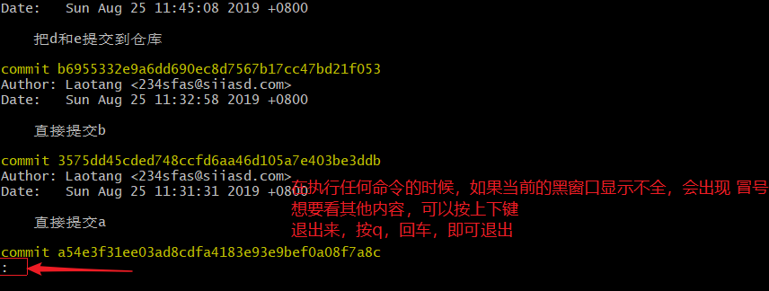
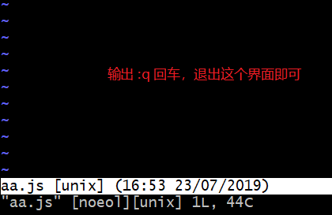
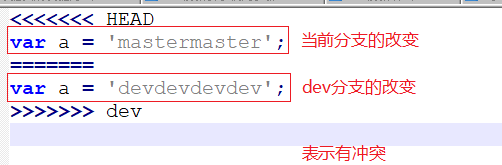
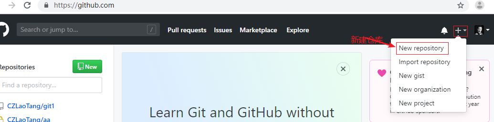

#### 集中式

- 集中式版本控制系统，版本库是集中存放在中央服务器的，而干活的时候，用的都是自己的电脑，所以要先从中央服务器取得最新的版本，然后开始干活，干完活了，再把自己的活推送给中央服务器。
- 集中式版本控制系统最大的毛病就是必须联网才能工作。
- 集中式版本管理的代表：

  - SVN（Subversion）

#### 分布式；

- 分布式版本控制系统根本没有“中央服务器”，每个人的电脑上都是一个完整的版本库。
  - 比方说你在自己电脑上改了文件A，你的同事也在他的电脑上改了文件A，这时，你们俩之间只需把各自的修改推送给对方，就可以互相看到对方的修改了。
- 和集中式版本控制系统相比，分布式版本控制系统的安全性要高很多。
- 分布式版本控制系统通常也有一台充当“中央服务器”的电脑，其作用仅仅是用来方便“交换”大家的修改。


## 资源连接

- [Git 官网](https://git-scm.com/)
- [官方文档](<https://git-scm.com/docs>)
- [GitHub Cheat Sheet](https://github.github.com/training-kit/downloads/github-git-cheat-sheet.pdf)
- [Visual Git Cheat Sheet](http://ndpsoftware.com/git-cheatsheet.html)
- [一个国人写的Git 教程](https://www.liaoxuefeng.com/wiki/896043488029600)
- **[Pro Git](https://git-scm.com/book/zh/v2)**
- [猴子都能懂得 GIT 入门](<https://backlog.com/git-tutorial/cn/>)
- [git 简明指南](<https://rogerdudler.github.io/git-guide/index.zh.html>)
- ...

## 安装 Git

- 下载地址：https://git-scm.com/downloads
- 安装
  - 一路next安装即可。

在命令行中输入以下命令查看 Git 是否安装成功。

```bash
$ git --version

# 如果看到类似 git version 2.21.0.windows.1 ，表示安装成功了
```

## Git三种区域及工作流程

- 工作目录
  - 工作目录是对项目的某个版本独立提取出来的内容。 这些从 Git 仓库的压缩数据库中提取出来的文件，放在磁盘上供你使用或修改。
- 暂存区域
  - 暂存区域是一个文件，保存了下次将提交的文件列表信息，一般在 Git 仓库目录中。 有时候也被称作`‘索引’'，不过一般说法还是叫暂存区域。
- Git 仓库
    - Git 仓库目录是 Git 用来保存项目的原数据和对象数据库的地方。 这是 Git 中最重要的部分，从其它计算机克隆仓库时，拷贝的就是这里的数据。

> 注：工作区新建的文件和Git没有任何关系；文件被添加到暂存区，才叫做被Git管理过代码不能越过暂存区而直		接从工作区提交到仓库区；
>

## 使用Git管理自己的代码

- 在你写代码的文件夹，右键，选择 `Git Bash Here` ，这个写代码文件夹就是工作区
- 在弹出的黑色窗口中，执行 `git init` ，进行初始化
    - 初始化之后，会在当前目录生成一个隐藏文件 `.git`
- 然后就可以新建文件写代码了，此时文件在工作区
- 在黑色窗口中，执行 `git add 文件名称` ，表示将工作区的文件添加到暂存区
- 在黑色窗口中，执行 `git commit -m "提交日志"` ，表示将暂存区的文件提交到仓库

> 注：初次使用Git，会让我们配置用户的信息，配置方式如下：

```bash
# --global 会将配置项保存到用户配置
$ git config --global user.name "xxx"
$ git config --global user.email "xxx"
```

如果没有这个提示，是因为你之前已经使用过并配置过Git了。如果想恢复到初始的状态，我们可以打开Git的配置文件（C:\Users\你的用户名\\.gitconfig），将[user]信息删除掉。

使用的命令如下：

```bash
# 初始化 git 仓库
$ git init

# 将工作区的文件添加到暂存区
$ git add 文件名

# 提交暂存区到仓库区形成历史记录
$ git commit -m "提交日志"
```


### 文件的状态

执行 `git status` 命令，可以查看到文件的状态

- 未跟踪
- 已暂存
- 已修改
- 已提交（没有提示）

**未跟踪（Untracked files）**，表示还没有被 Git 管理过，既没有进入过暂存区，更没有进入过仓库区。


**已暂存（staged）**，表示对一个已修改文件的当前版本做了标记，使之包含在下次提交的快照中


已修改（modified），文件被添加到暂存区，但是没有提交到仓库，然后在工作区对文件进行了修改。


已提交（committed），表示数据已经安全的保存在本地数据库中。


### 添加文件到暂存区

```bash
# 添加指定文件到暂存区
$ git add 文件名

# 以空格隔开可以一次 add 多个文件
$ git add [file1] [file2] ...

# 添加指定目录到暂存区，包括子目录
$ git add [dir] [file] [dir] [file] [file] ...

# 添加当前目录的所有文件到暂存区，包括子目录
$ git add .

```


### 提交文件到仓库

```bash
# 提交暂存区到仓库区
$ git commit -m [message]

# 提交暂存区的指定文件到仓库区
$ git commit [file1] [file2] ... -m [message]

# 提交工作区和暂存区自上次commit之后的变化，直接到仓库区
# 注意：不包括未跟踪文件，即不包含没有被GIt管理过的文件
$ git commit -a -m "提交日志"

```


### 查看状态

```bash
# 最好用的是 gitk
$ gitk

# 显示有变更的文件
$ git status

# 显示当前分支的版本历史
$ git log

# 简略查看历史版本
$ git log --oneline

```



### 撤销操作

```bash
# 恢复暂存区的指定文件到工作区
$ git checkout [file]

# 恢复暂存区的所有文件到工作区
$ git checkout .

# 恢复某个commit的指定文件到暂存区和工作区
$ git checkout [commit版本号] [file]

# 重置暂存区的指定文件，与上一次 commit 保持一致，但工作区不变
$ git reset [file]

# 重置暂存区与工作区，与上一次commit保持一致
$ git reset --hard

```


## 分支

### 分支的新建与合并

你已经知道，每次提交，Git都把它们串成一条时间线，这条时间线就是一个分支。截止到目前，只有一条时间线，在Git里，这个分支叫主分支，即 `master` 分支。

`HEAD` 可以理解为一个指针，指针指向哪里，就表示当前正在这里开发。所以，`HEAD` 指向的就是当前分支。

一开始的时候，`master`分支是一条线，Git 用 `master` 指向最新的提交，再用 `HEAD` 指向 `master`，就能确定当前分支，以及当前分支的提交点：


每次提交，`master` 分支都会向前移动一步，这样，随着你不断提交，`master` 分支的线也越来越长。

当我们创建新的分支，例如 `dev` 时，Git 新建了一个指针叫 `dev`，指向 `master` 相同的提交，再把 `HEAD` 指向 `dev`，就表示当前分支在 `dev` 上：


你看，Git创建一个分支很快，因为除了增加一个`dev`指针，改改`HEAD`的指向，工作区的文件都没有任何变化！

不过，从现在开始，对工作区的修改和提交就是针对`dev`分支了，比如新提交一次后，`dev`指针往前移动一步，而`master`指针不变：


假如我们在`dev`上的工作完成了，就可以把`dev`合并到`master`上。Git怎么合并呢？最简单的方法，就是直接把`master`指向`dev`的当前提交，就完成了合并：


所以Git合并分支也很快！就改改指针，工作区内容也不变！

合并完分支后，甚至可以删除`dev`分支。删除`dev`分支就是把`dev`指针给删掉，删掉后，我们就剩下了一条`master`分支：


真是太神奇了，你看得出来有些提交是通过分支完成的吗？

下面开始实战。

首先，我们创建`dev`分支，然后切换到`dev`分支：

```bash
# 创建一个分支，名字叫做dev
$ git branch dev

# 切换分支命令；切换到dev分支上
$ git checkout dev

# 也可以使用下面的命令，代替上面两个命令；下面的命令表示创建并切换分支到dev上
$ git checkout -b dev

```

可以用 `git branch` 命令查看当前分支，命令如下：

```bash
$ git branch
# 会看到类似下面的结果，前面标注*的，表示当前分支
# * dev
#   master
```

`git branch` 命令会列出所有分支，当前分支前面会标一个`*`号。

然后，我们就可以在 `dev` 分支上进行开发了，比如增加或改动几个文件

然后提交

现在，`dev` 分支的工作完成，我们就可以切换回 `master` 分支：

```bash
$ git checkout master
```

我们把`dev`分支的工作成果合并到`master`分支上：

```bash
$ git merge dev
```

`git merge`命令用于合并指定分支到当前分支。

合并完成后，就可以放心地删除`dev`分支了：

```bash
$ git branch -d dev
```

删除后，查看`branch`，就只剩下`master`分支了：

```bash
$ git branch
* master
```

因为创建、合并和删除分支非常快，所以Git鼓励你使用分支完成某个任务，合并后再删掉分支，这和直接在`master`分支上工作效果是一样的，但过程更安全。

**小结：**

Git鼓励大量使用分支：

```bash
# 查看分支
git branch

# 创建分支
$ git branch <name>

# 切换分支
$ git checkout <name>

# 创建+切换分支
$ git checkout -b <name>

# 合并某分支到当前分支
$ git merge <name>

# 删除分支
$ git branch -d <name>
```


### 合并分支

#### 快进模式合并

如果 dev 分支包含 master 分支最新提交，那么当你合并 dev 到 master 的时候，会执行快进模式合并

快速模块就是直接指向最新提交


#### 合并模式提交

如果两个分支都进行了新的提交，那么在合并的时候就执行合并模式，Git 会自动将两个分支的不同提交的改动尝试自动合并，如果合并的过程没有冲突，则直接进入 bi 编辑模式让你输入提交日志完成合并提交。

合并模式会生成一次新的提交记录。

合并的时候，如果出现下面的画面：



### 解决冲突

如果在合并分支的时候，产生了冲突，则需要解决冲突

如果产生冲突，会在合并代码的时候，给出提示：


当前显示aa.js有冲突，在代码中，会看到：



把写master分支和dev分支的两个程序员叫到一起，一起研究并解决冲突。比如经过两个程序员的讨论，决定两个改动都保留，则删除提示：


最后回到命令行窗口，执行add和commit提交即可。


## 远程仓库

除了GitHib，还有很多第三方远程仓库托管服务：

- GitHub
- 码云（gitee）
- coding
- Gitlab
  - 一个开源的类似于 GitHub 的 Git 仓库托管服务
  - 支持自行搭建

### 创建GitHub账号

### 基本使用

#### 将本地仓库放到线上

开发都是在本地开发，当做好一个功能后，我们就需要将本地代码推送到远程仓库

1. 在GitHub远程创建一个新的仓库

    

    

    填写信息并创建仓库。
    
    

2. 在本地仓库下执行命令进行推送，将本地仓库的代码推送到远程

    - 创建远程仓库的时候，先不要勾选README

    - 第1次推送：

        ```bash
        # 别名我们通常喜欢使用 origin 作为默认仓库的别名
        $ git remote add 别名 远程仓库地址
        
        # 当本地分支和远程分支名字一样的时候，可以简写只写一个
        # -u 的作用是记住本次的 push 地址和分支信息
        # 如果不加 -u，则下一次 push 的时候，还需要使用完整的命令
        $ git push -u 远程仓库地址别名 本地分支:远程分支
        
        如果要推送的本地分支和远端分支已有，可以简写为
        git push origin 分支
        ```

    - 之后有了新的历史记录的时候，直接 ：

        ```bash
        git push
        ```

#### 从线上克隆仓库

如果你到公司去，公司的项目已经在GitHub上了，我们就需要将项目文件从远程仓库克隆到本地，然后进行开发。

1. 找到远程仓库地址
2. 执行 `git clone 远程仓库地址` 命令，即可将远程仓库的代码拉取到本地


```bash
# clone 下来的仓库会自动创建一个名字叫 origin 的 remote 远端地址
# 并且自动和 origin master 建立关系
# 所以你这里可以直接 git push
git push
```

但是，如果你要推送别的分支代码，你还得：

```bash
git push -u 仓库地址别名 本地分支:远程分支
```


#### 拉取和更新

多人协作的情况下，我们会经常将其他人的写的代码拉取到自己的本地，完成代码或功能的合并工作，拉取远端的内容，执行下面的命令即可。

```bash
# 拉取远程代码到当前分支，并和本地分支合并
$ git pull
# 取回远程仓库的变化，并与本地指定分支合并
$ git pull [remote] [branch]
```

## 其它环境中的 Git

### 图形界面

Git 官网收录推荐的第三方图形客户端软件：https://git-scm.com/downloads/guis

- SourceTree
- GitHub Desktop
- Tortoise Git
- Git Extensions
- SmartGit


# 总结

> 首次推送代码到远程仓库的时候，会有一个弹出框，让你输入你的GitHub的账号和密码。

添加、提交、推送：


回退：


分支创建及合并：


